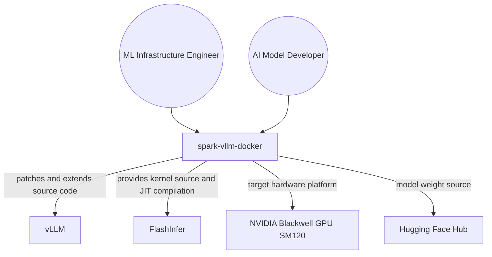

# System Context

External systems and users around the project.

```mermaid
flowchart TD
    spark_vllm_docker["spark-vllm-docker"]
    ml_infrastructure_engineer(("ML Infrastructure Engineer"))
    ai_model_developer(("AI Model Developer"))
    vllm["vLLM"]
    flashinfer["FlashInfer"]
    nvidia_blackwell_gpu_sm120["NVIDIA Blackwell GPU SM120"]
    hugging_face_hub["Hugging Face Hub"]
    ml_infrastructure_engineer --> spark_vllm_docker
    ai_model_developer --> spark_vllm_docker
    spark_vllm_docker -- "patches and extends source code" --> vllm
    spark_vllm_docker -- "provides kernel source and JIT compilation" --> flashinfer
    spark_vllm_docker -- "target hardware platform" --> nvidia_blackwell_gpu_sm120
    spark_vllm_docker -- "model weight source" --> hugging_face_hub
```

[← Back to index](../index.md)
