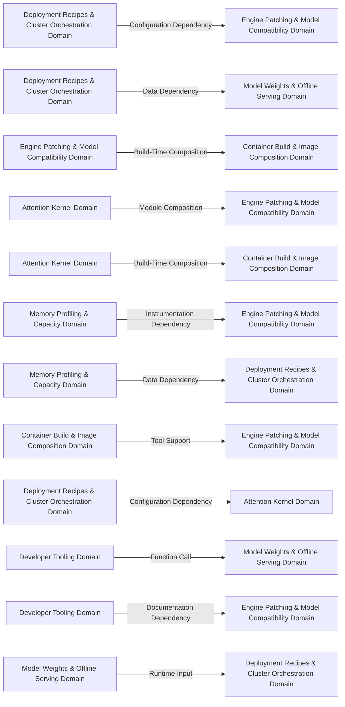

# Domain Dependencies

How functional domains depend on one another.

```mermaid
flowchart LR
    deployment_recipes_cluster_orchestration_domain["Deployment Recipes & Cluster Orchestration Domain"]
    engine_patching_model_compatibility_domain["Engine Patching & Model Compatibility Domain"]
    deployment_recipes_cluster_orchestration_domain_2["Deployment Recipes & Cluster Orchestration Domain"]
    model_weights_offline_serving_domain["Model Weights & Offline Serving Domain"]
    engine_patching_model_compatibility_domain_2["Engine Patching & Model Compatibility Domain"]
    container_build_image_composition_domain["Container Build & Image Composition Domain"]
    attention_kernel_domain["Attention Kernel Domain"]
    engine_patching_model_compatibility_domain_3["Engine Patching & Model Compatibility Domain"]
    attention_kernel_domain_2["Attention Kernel Domain"]
    container_build_image_composition_domain_2["Container Build & Image Composition Domain"]
    memory_profiling_capacity_domain["Memory Profiling & Capacity Domain"]
    engine_patching_model_compatibility_domain_4["Engine Patching & Model Compatibility Domain"]
    memory_profiling_capacity_domain_2["Memory Profiling & Capacity Domain"]
    deployment_recipes_cluster_orchestration_domain_3["Deployment Recipes & Cluster Orchestration Domain"]
    container_build_image_composition_domain_3["Container Build & Image Composition Domain"]
    engine_patching_model_compatibility_domain_5["Engine Patching & Model Compatibility Domain"]
    deployment_recipes_cluster_orchestration_domain_4["Deployment Recipes & Cluster Orchestration Domain"]
    attention_kernel_domain_3["Attention Kernel Domain"]
    developer_tooling_domain["Developer Tooling Domain"]
    model_weights_offline_serving_domain_2["Model Weights & Offline Serving Domain"]
    developer_tooling_domain_2["Developer Tooling Domain"]
    engine_patching_model_compatibility_domain_6["Engine Patching & Model Compatibility Domain"]
    model_weights_offline_serving_domain_3["Model Weights & Offline Serving Domain"]
    deployment_recipes_cluster_orchestration_domain_5["Deployment Recipes & Cluster Orchestration Domain"]
    deployment_recipes_cluster_orchestration_domain -->|Configuration Dependency| engine_patching_model_compatibility_domain
    deployment_recipes_cluster_orchestration_domain_2 -->|Data Dependency| model_weights_offline_serving_domain
    engine_patching_model_compatibility_domain_2 -->|Build-Time Composition| container_build_image_composition_domain
    attention_kernel_domain -->|Module Composition| engine_patching_model_compatibility_domain_3
    attention_kernel_domain_2 -->|Build-Time Composition| container_build_image_composition_domain_2
    memory_profiling_capacity_domain -->|Instrumentation Dependency| engine_patching_model_compatibility_domain_4
    memory_profiling_capacity_domain_2 -->|Data Dependency| deployment_recipes_cluster_orchestration_domain_3
    container_build_image_composition_domain_3 -->|Tool Support| engine_patching_model_compatibility_domain_5
    deployment_recipes_cluster_orchestration_domain_4 -->|Configuration Dependency| attention_kernel_domain_3
    developer_tooling_domain -->|Function Call| model_weights_offline_serving_domain_2
    developer_tooling_domain_2 -->|Documentation Dependency| engine_patching_model_compatibility_domain_6
    model_weights_offline_serving_domain_3 -->|Runtime Input| deployment_recipes_cluster_orchestration_domain_5
```

[← Back to index](../index.md)
