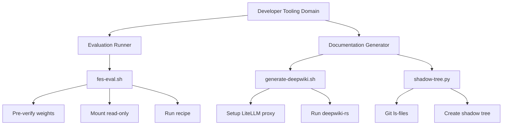

# Developer Tooling Domain — Flow

Module flowchart.

```mermaid
flowchart TD
    A[Developer Tooling Domain]
    A --> B[Evaluation Runner]
    A --> C[Documentation Generator]
    B --> D[fes-eval.sh]
    D --> E[Pre-verify weights]
    D --> F[Mount read-only]
    D --> G[Run recipe]
    C --> H[generate-deepwiki.sh]
    C --> I[shadow-tree.py]
    H --> J[Setup LiteLLM proxy]
    H --> K[Run deepwiki-rs]
    I --> L[Git ls-files]
    I --> M[Create shadow tree]
```

[← Back to Developer Tooling Domain](index.md)
