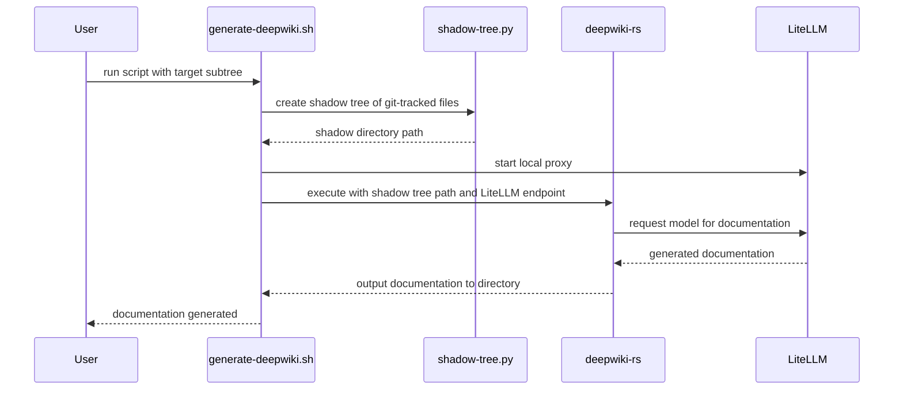

# Developer Tooling Domain — Sequence

Module interaction sequence.

```mermaid
sequenceDiagram
    participant User
    participant generate-deepwiki.sh
    participant shadow-tree.py
    participant deepwiki-rs
    participant LiteLLM
    User->>generate-deepwiki.sh: run script with target subtree
    generate-deepwiki.sh->>shadow-tree.py: create shadow tree of git-tracked files
    shadow-tree.py-->>generate-deepwiki.sh: shadow directory path
    generate-deepwiki.sh->>LiteLLM: start local proxy
    generate-deepwiki.sh->>deepwiki-rs: execute with shadow tree path and LiteLLM endpoint
    deepwiki-rs->>LiteLLM: request model for documentation
    LiteLLM-->>deepwiki-rs: generated documentation
    deepwiki-rs-->>generate-deepwiki.sh: output documentation to directory
    generate-deepwiki.sh-->>User: documentation generated
```

[← Back to Developer Tooling Domain](index.md)
