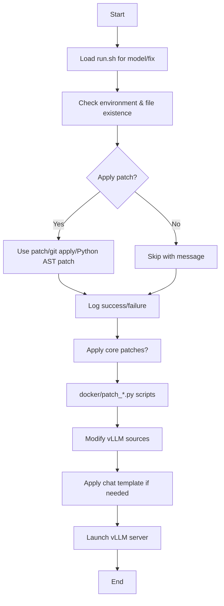

# Engine Patching & Model Compatibility Domain — Flow

Module flowchart.

```mermaid
graph TD
    A[Start] --> B[Load run.sh for model/fix]
    B --> C[Check environment & file existence]
    C --> D{Apply patch?}
    D -->|Yes| E[Use patch/git apply/Python AST patch]
    D -->|No| F[Skip with message]
    E --> G[Log success/failure]
    F --> G
    G --> H[Apply core patches?]
    H --> I[docker/patch_*.py scripts]
    I --> J[Modify vLLM sources]
    J --> K[Apply chat template if needed]
    K --> L[Launch vLLM server]
    L --> M[End]
```

[← Back to Engine Patching & Model Compatibility Domain Core Module](index.md)
