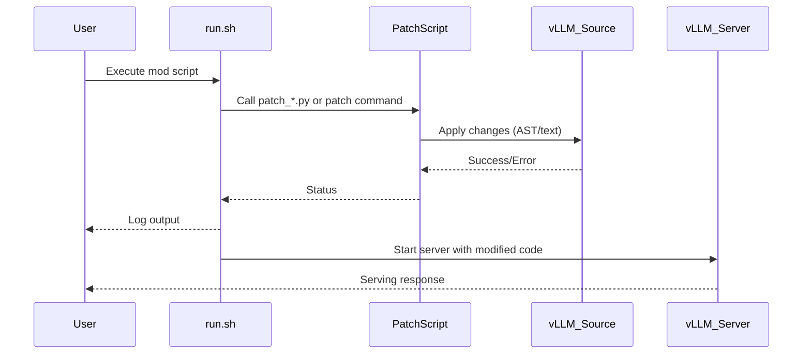

# Engine Patching & Model Compatibility Domain — Sequence

Module interaction sequence.

```mermaid
sequenceDiagram
    participant User
    participant run.sh
    participant PatchScript
    participant vLLM_Source
    participant vLLM_Server
    User->>run.sh: Execute mod script
    run.sh->>PatchScript: Call patch_*.py or patch command
    PatchScript->>vLLM_Source: Apply changes (AST/text)
    vLLM_Source-->>PatchScript: Success/Error
    PatchScript-->>run.sh: Status
    run.sh-->>User: Log output
    run.sh->>vLLM_Server: Start server with modified code
    vLLM_Server-->>User: Serving response
```

[← Back to Engine Patching & Model Compatibility Domain Core Module](index.md)
