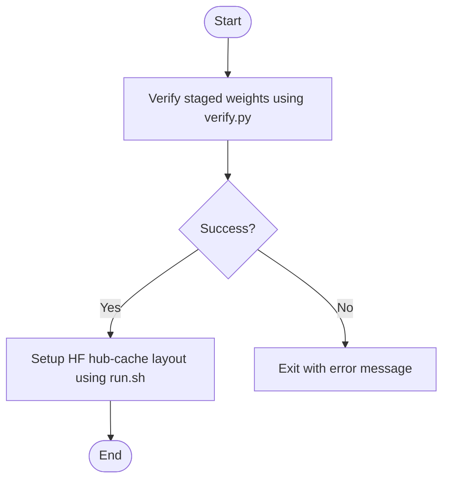

# Model Weights & Offline Serving Domain — Flow

Module flowchart.

```mermaid
flowchart TD
    Start([Start]) --> VerifyWeights[Verify staged weights using verify.py]
    VerifyWeights --> Success{Success?}
    Success -->|Yes| SetupCache[Setup HF hub-cache layout using run.sh]
    SetupCache --> End([End])
    Success -->|No| ExitError[Exit with error message]
```

[← Back to fes-weights](index.md)
