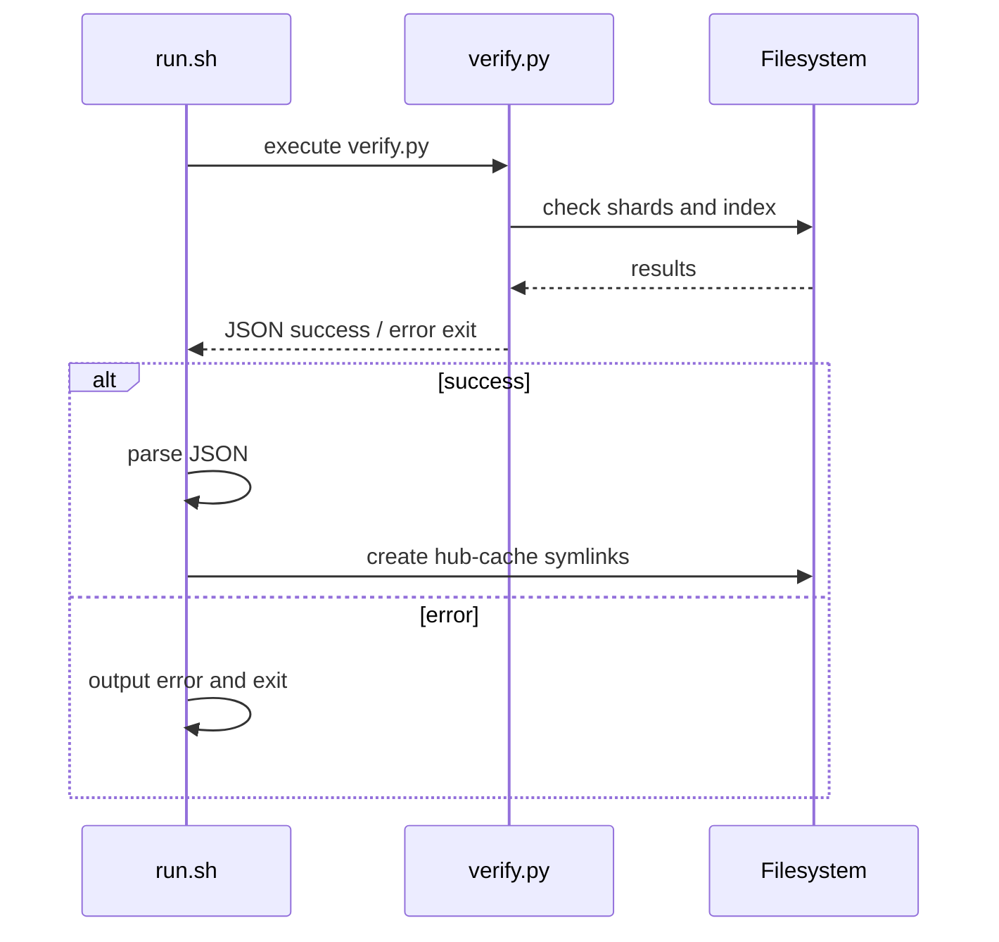

# Model Weights & Offline Serving Domain — Sequence

Module interaction sequence.

```mermaid
sequenceDiagram
    participant RunSH as run.sh
    participant VerifyPY as verify.py
    participant Filesystem as Filesystem
    RunSH->>VerifyPY: execute verify.py
    VerifyPY->>Filesystem: check shards and index
    Filesystem-->>VerifyPY: results
    VerifyPY-->>RunSH: JSON success / error exit
    alt success
        RunSH->>RunSH: parse JSON
        RunSH->>Filesystem: create hub-cache symlinks
    else error
        RunSH->>RunSH: output error and exit
    end
```

[← Back to fes-weights](index.md)
