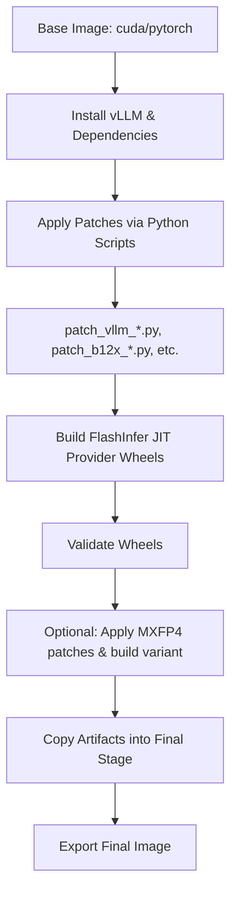

# Container Build & Image Composition Domain — Flow

Module flowchart.

```mermaid
graph TD
    A[Base Image: cuda/pytorch] --> B[Install vLLM & Dependencies]
    B --> C[Apply Patches via Python Scripts]
    C --> C1[patch_vllm_*.py, patch_b12x_*.py, etc.]
    C1 --> D[Build FlashInfer JIT Provider Wheels]
    D --> E[Validate Wheels]
    E --> F[Optional: Apply MXFP4 patches & build variant]
    F --> G[Copy Artifacts into Final Stage]
    G --> H[Export Final Image]
```

[← Back to Image Composition & Build-Time Toolchain](index.md)
