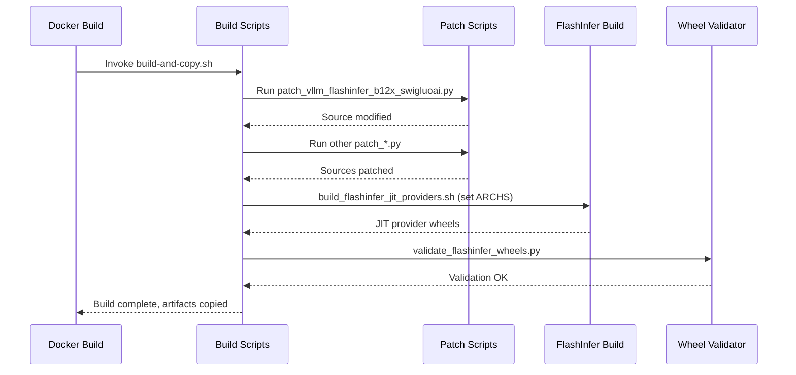

# Container Build & Image Composition Domain — Sequence

Module interaction sequence.

```mermaid
sequenceDiagram
    participant Docker as Docker Build
    participant Shell as Build Scripts
    participant Python as Patch Scripts
    participant FlashInfer as FlashInfer Build
    participant Validate as Wheel Validator
    Docker->>Shell: Invoke build-and-copy.sh
    Shell->>Python: Run patch_vllm_flashinfer_b12x_swigluoai.py
    Python-->>Shell: Source modified
    Shell->>Python: Run other patch_*.py
    Python-->>Shell: Sources patched
    Shell->>FlashInfer: build_flashinfer_jit_providers.sh (set ARCHS)
    FlashInfer-->>Shell: JIT provider wheels
    Shell->>Validate: validate_flashinfer_wheels.py
    Validate-->>Shell: Validation OK
    Shell-->>Docker: Build complete, artifacts copied
```

[← Back to Image Composition & Build-Time Toolchain](index.md)
