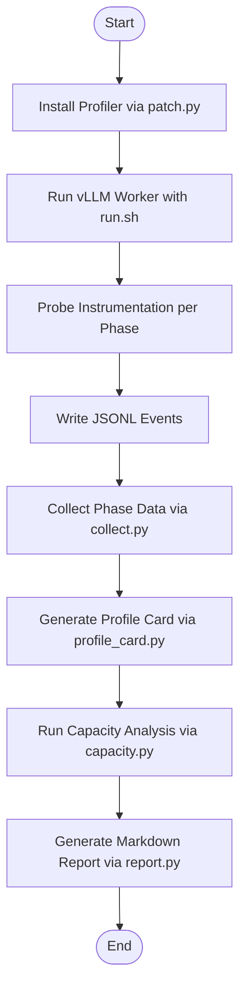

# Memory Profiling & Capacity Domain — Flow

Module flowchart.

```mermaid
graph TD
    Start([Start]) --> Patch[Install Profiler via patch.py]
    Patch --> Run[Run vLLM Worker with run.sh]
    Run --> Probe[Probe Instrumentation per Phase]
    Probe --> JSONL[Write JSONL Events]
    JSONL --> Collect[Collect Phase Data via collect.py]
    Collect --> Profile[Generate Profile Card via profile_card.py]
    Profile --> Capacity[Run Capacity Analysis via capacity.py]
    Capacity --> Report[Generate Markdown Report via report.py]
    Report --> End([End])
```

[← Back to Memory Profiling & Capacity Domain](index.md)
