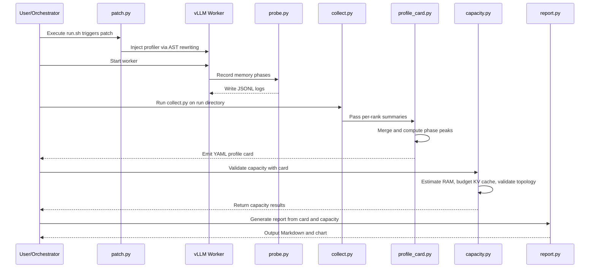

# Memory Profiling & Capacity Domain — Sequence

Module interaction sequence.

```mermaid
sequenceDiagram
    participant U as User/Orchestrator
    participant Patch as patch.py
    participant vLLM as vLLM Worker
    participant Probe as probe.py
    participant Col as collect.py
    participant Card as profile_card.py
    participant Cap as capacity.py
    participant Rep as report.py

    U->>Patch: Execute run.sh triggers patch
    Patch->>vLLM: Inject profiler via AST rewriting
    U->>vLLM: Start worker
    vLLM->>Probe: Record memory phases
    Probe-->>vLLM: Write JSONL logs
    U->>Col: Run collect.py on run directory
    Col->>Card: Pass per-rank summaries
    Card->>Card: Merge and compute phase peaks
    Card-->>U: Emit YAML profile card
    U->>Cap: Validate capacity with card
    Cap->>Cap: Estimate RAM, budget KV cache, validate topology
    Cap-->>U: Return capacity results
    U->>Rep: Generate report from card and capacity
    Rep-->>U: Output Markdown and chart
```

[← Back to Memory Profiling & Capacity Domain](index.md)
