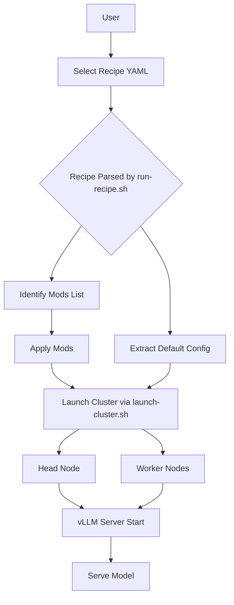

# Deployment Recipes & Cluster Orchestration Domain — Flow

Module flowchart.

```mermaid
flowchart TD
    A[User] --> B[Select Recipe YAML]
    B --> C{Recipe Parsed by run-recipe.sh}
    C --> D[Identify Mods List]
    C --> E[Extract Default Config]
    D --> F[Apply Mods]
    F --> G[Launch Cluster via launch-cluster.sh]
    E --> G
    G --> H[Head Node]
    G --> I[Worker Nodes]
    H --> J[vLLM Server Start]
    I --> J
    J --> K[Serve Model]
```

[← Back to Recipe Catalog](index.md)
