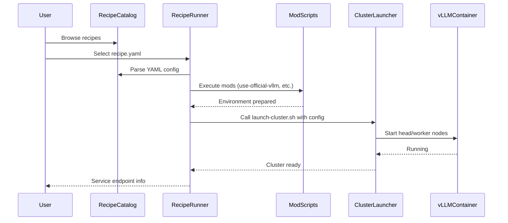

# Deployment Recipes & Cluster Orchestration Domain — Sequence

Module interaction sequence.

```mermaid
sequenceDiagram
    participant User
    participant RecipeCatalog
    participant RecipeRunner
    participant ModScripts
    participant ClusterLauncher
    participant vLLMContainer

    User->>RecipeCatalog: Browse recipes
    User->>RecipeRunner: Select recipe.yaml
    RecipeRunner->>RecipeCatalog: Parse YAML config
    RecipeRunner->>ModScripts: Execute mods (use-official-vllm, etc.)
    ModScripts-->>RecipeRunner: Environment prepared
    RecipeRunner->>ClusterLauncher: Call launch-cluster.sh with config
    ClusterLauncher->>vLLMContainer: Start head/worker nodes
    vLLMContainer-->>ClusterLauncher: Running
    ClusterLauncher-->>RecipeRunner: Cluster ready
    RecipeRunner-->>User: Service endpoint info
```

[← Back to Recipe Catalog](index.md)
