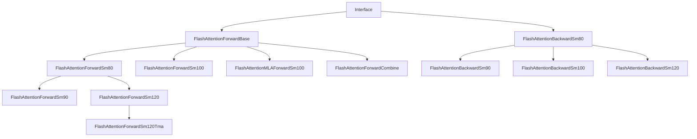

# Attention Kernel Domain — Flow

Module flowchart.

```mermaid
graph TD
    FlashAttentionForwardBase --> FlashAttentionForwardSm80
    FlashAttentionForwardSm80 --> FlashAttentionForwardSm90
    FlashAttentionForwardSm80 --> FlashAttentionForwardSm120
    FlashAttentionForwardSm120 --> FlashAttentionForwardSm120Tma
    FlashAttentionForwardBase --> FlashAttentionForwardSm100
    FlashAttentionForwardBase --> FlashAttentionMLAForwardSm100
    FlashAttentionForwardBase --> FlashAttentionForwardCombine
    FlashAttentionBackwardSm80 --> FlashAttentionBackwardSm90
    FlashAttentionBackwardSm80 --> FlashAttentionBackwardSm100
    FlashAttentionBackwardSm80 --> FlashAttentionBackwardSm120
    Interface --> FlashAttentionForwardBase
    Interface --> FlashAttentionBackwardSm80
```

[← Back to Vendored FlashAttention Kernel Library](index.md)
