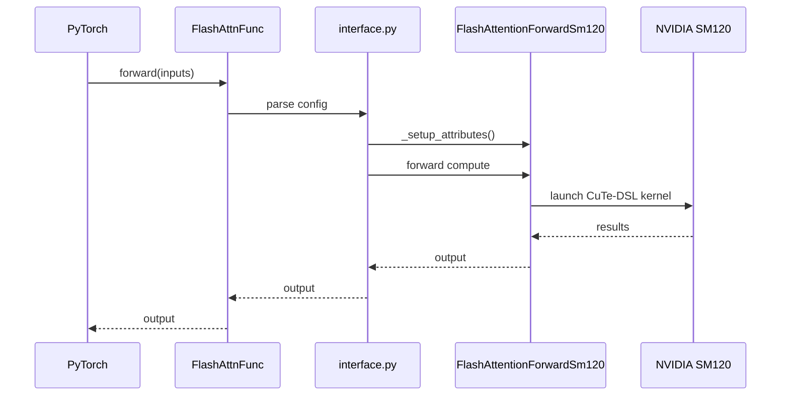

# Attention Kernel Domain — Sequence

Module interaction sequence.

```mermaid
sequenceDiagram
    participant PyTorch
    participant AutogradFunc as FlashAttnFunc
    participant Interface as interface.py
    participant Kernel as FlashAttentionForwardSm120
    participant GPU as NVIDIA SM120
    PyTorch->>AutogradFunc: forward(inputs)
    AutogradFunc->>Interface: parse config
    Interface->>Kernel: _setup_attributes()
    Interface->>Kernel: forward compute
    Kernel->>GPU: launch CuTe-DSL kernel
    GPU-->>Kernel: results
    Kernel-->>Interface: output
    Interface-->>AutogradFunc: output
    AutogradFunc-->>PyTorch: output
```

[← Back to Vendored FlashAttention Kernel Library](index.md)
