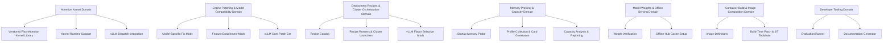

# Domain Modules

Functional domains and their sub-modules.

```mermaid
flowchart TD
    attention_kernel_domain["Attention Kernel Domain"]
    vendored_flashattention_kernel_library["Vendored FlashAttention Kernel Library"]
    kernel_runtime_support["Kernel Runtime Support"]
    vllm_dispatch_integration["vLLM Dispatch Integration"]
    engine_patching_model_compatibility_domain["Engine Patching & Model Compatibility Domain"]
    model_specific_fix_mods["Model-Specific Fix Mods"]
    feature_enablement_mods["Feature Enablement Mods"]
    vllm_core_patch_set["vLLM Core Patch Set"]
    deployment_recipes_cluster_orchestration_domain["Deployment Recipes & Cluster Orchestration Domain"]
    recipe_catalog["Recipe Catalog"]
    recipe_runners_cluster_launchers["Recipe Runners & Cluster Launchers"]
    vllm_flavor_selection_mods["vLLM Flavor Selection Mods"]
    memory_profiling_capacity_domain["Memory Profiling & Capacity Domain"]
    startup_memory_probe["Startup Memory Probe"]
    profile_collection_card_generation["Profile Collection & Card Generation"]
    capacity_analysis_reporting["Capacity Analysis & Reporting"]
    model_weights_offline_serving_domain["Model Weights & Offline Serving Domain"]
    weight_verification["Weight Verification"]
    offline_hub_cache_setup["Offline Hub Cache Setup"]
    container_build_image_composition_domain["Container Build & Image Composition Domain"]
    image_definitions["Image Definitions"]
    build_time_patch_jit_toolchain["Build-Time Patch & JIT Toolchain"]
    developer_tooling_domain["Developer Tooling Domain"]
    evaluation_runner["Evaluation Runner"]
    documentation_generator["Documentation Generator"]
    attention_kernel_domain --> vendored_flashattention_kernel_library
    attention_kernel_domain --> kernel_runtime_support
    attention_kernel_domain --> vllm_dispatch_integration
    engine_patching_model_compatibility_domain --> model_specific_fix_mods
    engine_patching_model_compatibility_domain --> feature_enablement_mods
    engine_patching_model_compatibility_domain --> vllm_core_patch_set
    deployment_recipes_cluster_orchestration_domain --> recipe_catalog
    deployment_recipes_cluster_orchestration_domain --> recipe_runners_cluster_launchers
    deployment_recipes_cluster_orchestration_domain --> vllm_flavor_selection_mods
    memory_profiling_capacity_domain --> startup_memory_probe
    memory_profiling_capacity_domain --> profile_collection_card_generation
    memory_profiling_capacity_domain --> capacity_analysis_reporting
    model_weights_offline_serving_domain --> weight_verification
    model_weights_offline_serving_domain --> offline_hub_cache_setup
    container_build_image_composition_domain --> image_definitions
    container_build_image_composition_domain --> build_time_patch_jit_toolchain
    developer_tooling_domain --> evaluation_runner
    developer_tooling_domain --> documentation_generator
```

[← Back to Architecture](../architecture.md)
