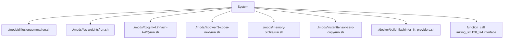

# Boundary Surfaces

CLI commands, API endpoints, and routes exposed by the system.

```mermaid
flowchart TD
    system["System"]
    cli_mods_diffusiongemma_run_sh["./mods/diffusiongemma/run.sh"]
    cli_mods_fes_weights_run_sh["./mods/fes-weights/run.sh"]
    cli_mods_fix_glm_4_7_flash_awq_run_sh["./mods/fix-glm-4.7-flash-AWQ/run.sh"]
    cli_mods_fix_qwen3_coder_next_run_sh["./mods/fix-qwen3-coder-next/run.sh"]
    cli_mods_memory_profile_run_sh["./mods/memory-profile/run.sh"]
    cli_mods_instanttensor_zero_copy_run_sh["./mods/instanttensor-zero-copy/run.sh"]
    cli_docker_build_flashinfer_jit_providers_sh["./docker/build_flashinfer_jit_providers.sh"]
    api_function_call_inkling_sm120_fa4_interface["function_call inkling_sm120_fa4.interface"]
    system --> cli_mods_diffusiongemma_run_sh
    system --> cli_mods_fes_weights_run_sh
    system --> cli_mods_fix_glm_4_7_flash_awq_run_sh
    system --> cli_mods_fix_qwen3_coder_next_run_sh
    system --> cli_mods_memory_profile_run_sh
    system --> cli_mods_instanttensor_zero_copy_run_sh
    system --> cli_docker_build_flashinfer_jit_providers_sh
    system --> api_function_call_inkling_sm120_fa4_interface
```

[← Back to Boundary](../boundary.md)
