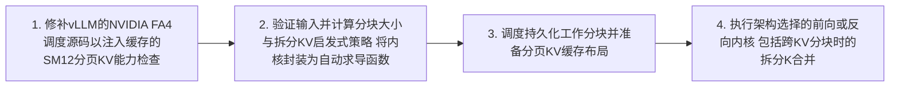

# Workflow — Attention Kernel Dispatch on Blackwell Flow

At inference startup, vLLM's FlashAttention 4 dispatch is patched so that compute-capability 12.x devices route attention work to the vendored paged-KV kernel, which selects architecture-specific forward/MLA/split-K kernels and exposes them through the PyTorch autograd interface.

[← Back to Workflow](../../../workflow.md)
