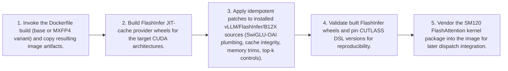

# Workflow — Custom Container Image Build Flow

Builds the custom vLLM Docker image by installing vLLM and FlashInfer, applying the shared engine patch library, building FlashInfer JIT-cache provider wheels, and validating wheels before producing the final (base or MXFP4) image.

[← Back to Workflow](../../../workflow.md)
