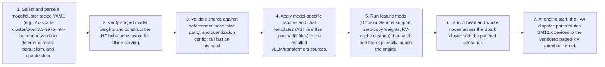

# Workflow — Recipe-Driven Cluster Model Deployment Flow

End-to-end path from selecting a model recipe to serving on a Spark cluster: parse recipe, verify offline weights, apply required fix/feature mods to the installed vLLM package, then launch head/worker nodes with the correct chat template and quantization configuration.

[← Back to Workflow](../../../workflow.md)
