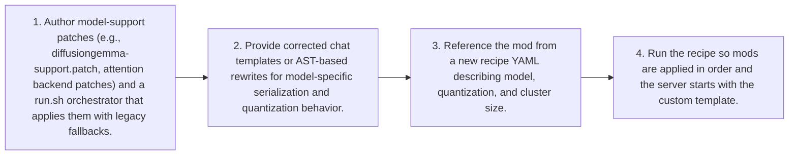

# Workflow — Model Support Enablement Flow

Onboarding a new or emerging model architecture: author a fix or feature mod (patch, diff, or chat template), register it in a recipe, and have the recipe runner apply it before the vLLM server starts with the corrected template/configuration.

[← Back to Workflow](../../../workflow.md)
