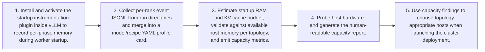

# Workflow — Memory Profiling & Capacity Validation Flow

Profiles a model's startup memory on the target cluster, consolidates per-rank events into a profile card, and validates that the deployment fits available host memory to guide topology-aware host selection.

[← Back to Workflow](../../../workflow.md)
