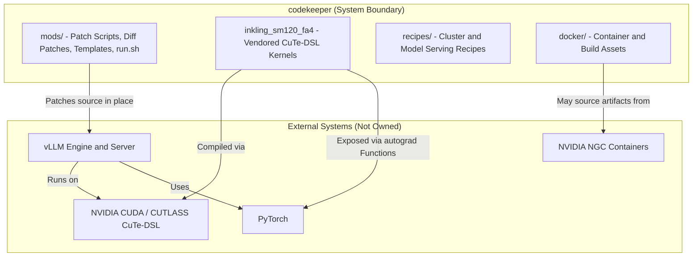
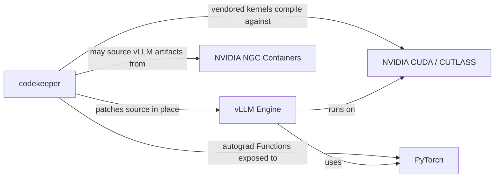
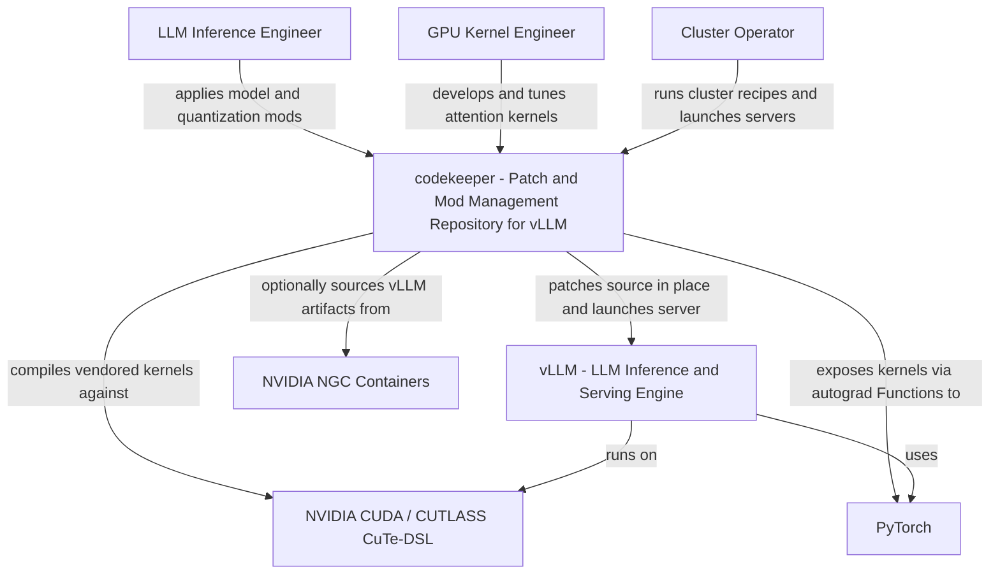
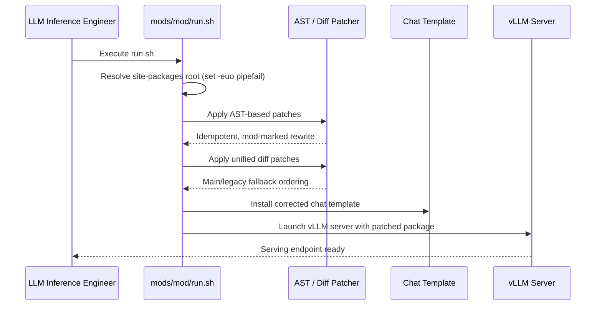
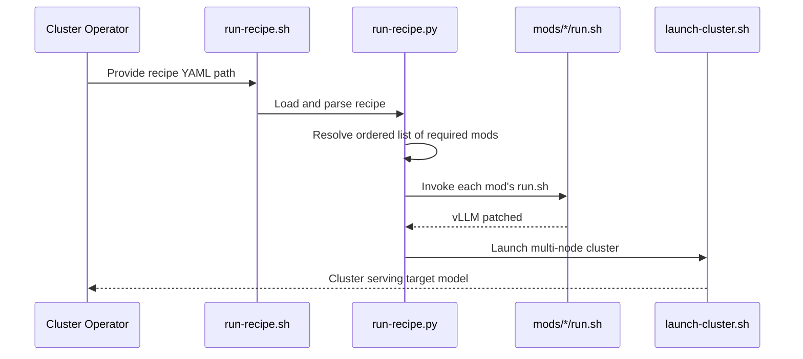
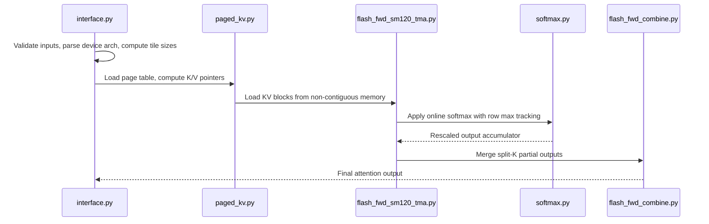
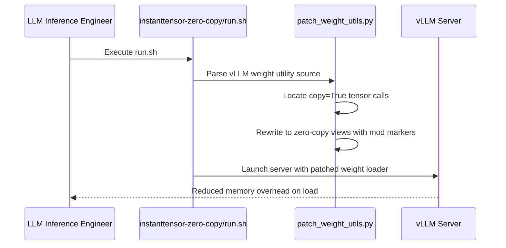
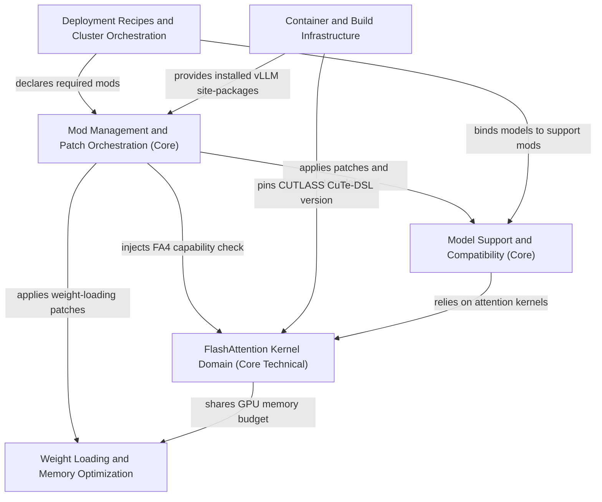

# System Context Overview

## 1. Project Introduction

### 1.1 Project Identity

| Attribute | Value |
| --- | --- |
| **Project Name** | `codekeeper` |
| **Project Type** | CLI Tool / Patch & Mod Management Repository |
| **Primary Domain** | Large Language Model (LLM) inference deployment and GPU kernel optimization |
| **Core Purpose** | Reproducible, fork-free customization of the vLLM inference stack |
| **Primary Runtime Target** | NVIDIA SM90 / SM100 / SM120 GPUs, including DGX Spark clusters |
| **Confidence Level** | High (System Context: 7.5/10, Domain Modules: 8.0/10) |

### 1.2 What the System Does

`codekeeper` is a **patch-and-mod management repository** that enables teams to customize an externally installed **vLLM** inference and serving engine without maintaining a fork of the upstream project. Rather than diverging from the open-source codebase, `codekeeper` treats customization as a set of **self-contained, traceable, and idempotent modifications** ("mods") that are applied to an installed vLLM package at deployment time.

Each mod encapsulates a single logical change and may contain:

- **AST-based source patchers** — Python tools that parse and rewrite vLLM source using the `ast` module, guarded by mod markers for idempotency and traceability.
- **Unified diff patches** — declarative text patches applied with main/legacy fallback ordering.
- **Jinja2 chat templates** — prompt-format corrections for specific models.
- **Fail-fast shell entry scripts (`run.sh`)** — launchers that resolve the installed vLLM site-packages, apply the mod's patches, and start the server.

In addition to the mod framework, `codekeeper` ships a **vendored FlashAttention kernel package** (`inkling_sm120_fa4`) written in **CUTLASS CuTe-DSL**, providing paged-KV attention kernels for modern NVIDIA GPU architectures, and a set of **deployment recipes** for multi-node **DGX Spark clusters**.

### 1.3 Business Value

`codekeeper` delivers measurable business value by:

1. **Reducing time-to-production** for cutting-edge models (e.g., DiffusionGemma, Nemotron, Step, GLM, Qwen3.x) on new GPU hardware.
2. **Eliminating fork maintenance overhead** — teams apply isolated, traceable patches instead of diverging from upstream vLLM.
3. **Enabling hardware-specific optimizations** — notably the Blackwell SM120 paged-KV FlashAttention path for consumer GPUs and DGX Spark clusters.
4. **Providing deterministic, reproducible deployments** — recipes bind models, quantization settings, hardware topology, and required mods into a single declarative artifact.
5. **Supporting multi-node scale-out** — ready-made 3x/4x/8x DGX Spark cluster recipes.

### 1.4 Technical Characteristics Overview

- **Non-invasive mutation model**: vLLM is patched *in place* at deployment time; `codekeeper` never owns the engine itself.
- **Idempotency and traceability**: AST patchers insert mod markers and enforce single-occurrence replacement, making repeated application safe.
- **Fail-fast execution**: Bash entry scripts use `set -euo pipefail` to guarantee deterministic failure behavior.
- **Declarative configuration**: YAML recipes and Jinja2 templates drive model-specific deployment.
- **Low-level GPU programming**: The vendored kernel domain uses tcgen05 MMA, TMA, mbarrier pipelines, and PTX descriptors.

---

## 2. Target Users

`codekeeper` serves three primary user roles, each with distinct needs and usage scenarios.

### 2.1 User Role Definitions

#### 2.1.1 LLM Inference Engineers

| Attribute | Detail |
| --- | --- |
| **Description** | Engineers deploying and tuning vLLM serving stacks on NVIDIA GPUs, including new Blackwell hardware. |
| **Primary Goals** | Apply targeted fixes to installed vLLM without maintaining a fork; enable new or unreleased model architectures; fix quantization and chat template issues. |
| **Typical Models Targeted** | DiffusionGemma, Qwen3.x, GLM, Nemotron, Step. |
| **Key Mods Used** | `diffusiongemma`, `fix-qwen3.5-chat-template`, `nemotron-super`, `fix-glm-4.7-flash-AWQ`. |

#### 2.1.2 GPU Kernel Engineers

| Attribute | Detail |
| --- | --- |
| **Description** | Performance engineers working on attention kernels for Hopper and Blackwell architectures. |
| **Primary Goals** | Work with vendored, modifiable FlashAttention forward/backward kernels in CuTe-DSL; support paged-KV attention on SM120 consumer GPUs; use benchmarking and tile-scheduling primitives. |
| **Key Components Used** | `inkling_sm120_fa4` forward/backward kernels, `paged_kv.py`, `tile_scheduler.py`, `blackwell_helpers.py`. |
| **Hardware Focus** | SM90 (Hopper), SM100 (Blackwell datacenter), SM120 (Blackwell consumer / DGX Spark). |

#### 2.1.3 Cluster Operators

| Attribute | Detail |
| --- | --- |
| **Description** | Operators provisioning multi-node DGX Spark inference clusters. |
| **Primary Goals** | Use ready-made recipes for 3x/4x/8x Spark cluster setups; rely on deterministic, fail-fast patch application and server launch. |
| **Key Assets Used** | `recipes/` directory, `launch-cluster.sh`, `run-recipe.sh`, `hf-download.sh`. |

### 2.2 Usage Scenarios

The following table maps user roles to their most common end-to-end workflows.

| Scenario | User Role | Entry Point | Outcome |
| --- | --- | --- | --- |
| Apply a single model-support mod | LLM Inference Engineer | `mods/diffusiongemma/run.sh` | Patched vLLM server serving DiffusionGemma with corrected chat template |
| Deploy a multi-node cluster | Cluster Operator | `run-recipe.sh <recipe.yaml>` | Cluster launched with all required mods applied |
| Optimize weight loading memory | LLM Inference Engineer | `mods/instanttensor-zero-copy/run.sh` | Zero-copy weight loading reduces memory overhead |
| Develop/modify attention kernels | GPU Kernel Engineer | `vendor/inkling_sm120_fa4/interface.py` | Custom forward/backward kernels compiled via CUTLASS CuTe-DSL |
| Provision an 8x Spark cluster | Cluster Operator | `recipes/8x-spark-cluster/glm-5.2-nvfp4.yaml` | GLM-5.2 NVFP4 served across eight DGX Spark nodes |

### 2.3 User Requirement Analysis

The three user roles share a common underlying need: **controlled, reproducible customization of an external inference engine**. The requirements can be summarized as:

- **Autonomy**: Modify vLLM behavior without waiting for upstream merges or maintaining a fork.
- **Safety**: Guarantee that patches are applied exactly once, with clear failure semantics.
- **Traceability**: Identify which mods are active in any running deployment.
- **Performance**: Access hardware-specific kernels that upstream may not yet support.
- **Scalability**: Deploy consistently across single-node and multi-node topologies.

---

## 3. System Boundaries

### 3.1 System Scope Definition

> `codekeeper` **owns** the mod definitions (patch scripts, diff patches, templates, entry scripts), the vendored `inkling_sm120_fa4` FlashAttention kernel package, and cluster deployment recipes. It **does not own** vLLM itself; it modifies an externally installed vLLM at deployment time.

This boundary is the single most important architectural decision in the system: **`codekeeper` is a mutator and orchestrator, not an inference engine**. All inference computation is ultimately performed by vLLM and its underlying GPU stack.

### 3.2 Included Components

| Component | Description |
| --- | --- |
| **`mods/` directory** | Per-change patch scripts, diff patches, Jinja chat templates, and `run.sh` launchers. |
| **`mods/inkling-sm12-paged-kv/vendor/inkling_sm120_fa4`** | Vendored CuTe-DSL FlashAttention kernels: forward, backward, MLA, split-K combine, paged KV manager, softmax, tile scheduler, Blackwell helpers. |
| **AST-based patcher tools** | `patch_inkling.py`, `patch_weight_utils.py` — with idempotency and mod-marker traceability. |
| **`recipes/` directory** | 3x / 4x / 8x DGX Spark cluster setup recipes, plus single-node and model-specific recipes. |
| **`docker/` directory** | Containerization assets, build-time vLLM patches, and dependency pinning (`pin_cutlass_dsl.py`). |

### 3.3 Excluded Components

The following are explicitly **out of scope** for `codekeeper`:

| Excluded Component | Rationale |
| --- | --- |
| **vLLM engine and server implementation** | External; patched in place but not owned. |
| **Upstream flash-attention and CUTLASS projects** | Source of vendored/reimplemented kernels; owned upstream. |
| **Model weights and model repositories** | Qwen, Gemma, GLM, Nemotron, Step, etc. — downloaded separately. |
| **GPU drivers and CUDA toolkit distribution** | Provided by NVIDIA and the host system. |
| **Cluster hardware provisioning** | Beyond the recipes; handled by infrastructure teams. |

### 3.4 Boundary Diagram

---

## 4. External System Interactions

`codekeeper` depends on four external systems, each with a distinct interaction model.

### 4.1 External System Inventory

| External System | Interaction Type | Direction | Criticality |
| --- | --- | --- | --- |
| **vLLM** | Source patching (AST/text rewriting) and process launch | Outbound (mutates) | Critical |
| **NVIDIA CUDA / CUTLASS CuTe-DSL** | Compile-time and runtime dependency | Inbound (provides) | Critical |
| **PyTorch** | API integration | Bidirectional | High |
| **NVIDIA NGC containers** | Package/artifact source | Inbound (provides) | Optional |

### 4.2 Interaction Detail

#### 4.2.1 vLLM

vLLM is the open-source LLM inference and serving engine that `codekeeper` targets. The interaction is **asymmetric and invasive**:

- **Source patching**: `codekeeper` modifies vLLM's installed `site-packages` source. Patched surfaces include FA4 dispatch logic, weight iterators, the model registry, and chat templates.
- **Process launch**: vLLM's server process is launched by mod entry scripts (`run.sh`), not by `codekeeper` as a long-running service.
- **Ownership boundary**: `codekeeper` never ships vLLM; it assumes a pre-installed or image-provided vLLM exists at deployment time.

#### 4.2.2 NVIDIA CUDA / CUTLASS CuTe-DSL

The vendored `inkling_sm120_fa4` kernels depend on the NVIDIA GPU programming stack:

- **Compile-time**: Uses tcgen05 MMA, TMA, mbarrier pipelines, and PTX descriptors.
- **Runtime**: Executes on SM90 / SM100 / SM120 hardware.
- **Version pinning**: The `docker/pin_cutlass_dsl.py` script pins the CUTLASS CuTe-DSL version to ensure reproducible kernel compilation.

#### 4.2.3 PyTorch

PyTorch serves as the autograd integration layer:

- Attention kernels are exposed through `torch.autograd.Function` classes (`FlashAttnFunc`, `FlashAttnVarlenFunc`).
- The public API in `interface.py` validates inputs and dispatches to the appropriate kernel.

#### 4.2.4 NVIDIA NGC Containers

The `use-ngc-vllm` mod suggests sourcing vLLM from NGC-published images as an alternative to official releases, giving operators a choice of artifact provenance.

### 4.3 Dependency Relationship Analysis

**Dependency characteristics:**

- **Hard dependencies**: vLLM, CUDA/CUTLASS, and PyTorch are required for the system to function at all.
- **Soft dependency**: NGC containers are an alternative artifact source, not a hard requirement.
- **Version sensitivity**: The kernel domain is highly sensitive to CUTLASS DSL versions, which is why pinning exists.
- **Coupling risk**: Because `codekeeper` patches vLLM source textually, upstream vLLM refactors can break mods — this is mitigated by AST validation and fallback ordering.

---

## 5. System Context Diagram

### 5.1 C4 SystemContext Diagram

The following diagram presents the C4 SystemContext view: `codekeeper` at the center, its three user roles as actors, and its four external systems.

### 5.2 Key Interaction Flows

The domain analysis identified five primary business flows. The most important are summarized below.

#### 5.2.1 Apply Mod and Launch Patched vLLM Server (Importance: 9.5)

This is the **primary end-to-end flow** of the system.

#### 5.2.2 Recipe-Driven Cluster Deployment (Importance: 8.5)

#### 5.2.3 FlashAttention Forward Pass with Paged KV (Importance: 9.0)

This runtime flow executes inside the inference path whenever a model performs a forward call.

#### 5.2.4 Zero-Copy Weight Loading Optimization (Importance: 7.0)

### 5.3 Architecture Decision Descriptions

| Decision | Rationale | Consequence |
| --- | --- | --- |
| **Patch in place rather than fork** | Avoids fork divergence and upstream merge burden | Mods must tolerate upstream refactors; AST validation mitigates |
| **Mod-per-change granularity** | Isolated, traceable, composable changes | Recipes can select and sequence arbitrary mod combinations |
| **AST-based patching with mod markers** | Idempotency and traceability | Repeated application is safe; active mods are identifiable |
| **Fail-fast shell scripts** | Deterministic behavior in production | Any patch failure aborts the launch immediately |
| **Vendored kernel package** | Control over performance-critical attention code | Full flexibility to target SM120 and Blackwell primitives |
| **Declarative YAML recipes** | Reproducible deployment artifacts | Model + quantization + topology + mods bound in one file |

---

## 6. Technical Architecture Overview

### 6.1 Main Technology Stack

| Layer | Technology | Purpose |
| --- | --- | --- |
| **Patch orchestration** | Python `ast`, Bash (`set -euo pipefail`) | Idempotent source rewriting and fail-fast launching |
| **Prompt formatting** | Jinja2 | Chat template rendering and multimodal handling |
| **Deployment config** | YAML | Recipe-driven cluster and model serving definitions |
| **Kernel programming** | CUTLASS CuTe-DSL, tcgen05 MMA, TMA, mbarrier | High-performance attention kernels |
| **Autograd integration** | PyTorch `torch.autograd.Function` | Kernel exposure to the training/inference graph |
| **Containerization** | Docker (`Dockerfile`, `Dockerfile.mxfp4`) | Runtime image assembly and build-time patching |
| **Target hardware** | NVIDIA SM90 / SM100 / SM120 | Hopper, Blackwell datacenter, Blackwell consumer |

### 6.2 Internal Domain Architecture

The repository is organized into **six functional domains**, which form the internal architecture beneath the SystemContext view.

### 6.3 Domain Overview

| Domain | Type | Importance | Complexity | Key Responsibility |
| --- | --- | --- | --- | --- |
| **Mod Management & Patch Orchestration** | Core Business | 9.5 | 7.5 | Defines, applies, and orchestrates mods; drives recipes |
| **FlashAttention Kernel Domain** | Core Technical | 9.5 | 9.5 | Vendored CuTe-DSL attention kernels for SM90/100/120 |
| **Model Support & Compatibility** | Core Business | 8.5 | 7.0 | Per-model architecture, quantization, and template fixes |
| **Deployment Recipes & Cluster Orchestration** | Infrastructure | 8.0 | 6.0 | YAML recipes and launch scripts for Spark clusters |
| **Container & Build Infrastructure** | Infrastructure | 7.0 | 6.5 | Dockerfiles, build-time patches, dependency pinning |
| **Weight Loading & Memory Optimization** | Supporting | 7.5 | 6.5 | Zero-copy loading, hybrid draft loader, KV-cache tuning |

### 6.4 Key Design Decisions and Architectural Insights

**1. The mutation boundary is the defining architecture.**
`codekeeper` is best understood not as an application but as a **controlled mutation layer** over an external engine. Every domain ultimately either *defines a mutation* (Mod Management, Model Support, Weight Loading), *provides a target for mutation* (Container/Build), *selects mutations* (Recipes), or *ships code that the mutated engine invokes* (Kernel Domain).

**2. Two customization mechanisms coexist.**
The system employs both **runtime/deployment-time patching** (mods applied to installed site-packages) and **build-time patching** (Docker build-time vLLM patches). This dual approach allows the container image to pre-condition the source tree while still permitting per-deployment mod application.

**3. Idempotency is a first-class design constraint.**
The emphasis on mod markers, single-occurrence AST replacement, and guards against double-patching indicates that deployment environments may re-run mods, and the system must remain safe under repetition.

**4. The kernel domain is the deepest technical investment.**
With a complexity score of 9.5 — the highest in the system — the FlashAttention kernel domain represents significant specialized effort, targeting the SM120 paged-KV attention path that is central to the system's differentiation on consumer Blackwell GPUs and DGX Spark clusters.

**5. Recipes are the user-facing composition surface.**
For most users, the recipes directory is the primary interface: it abstracts away mod selection, ordering, and topology into a single declarative artifact that the recipe runner consumes.

---

## 7. Summary

`codekeeper` occupies a precise and valuable position in the LLM deployment toolchain: it is a **fork-free customization and orchestration layer** for vLLM that lets LLM inference engineers, GPU kernel engineers, and cluster operators rapidly and reproducibly adapt a production inference stack to new models and new hardware — without owning or forking the engine itself. Its architecture is defined by the interaction between its **six internal domains** and its **four external dependencies**, unified by the principles of idempotent patching, fail-fast execution, declarative recipes, and a deeply specialized vendored attention-kernel package targeting the latest NVIDIA GPU architectures.

| Context Element | Count | Key Examples |
| --- | --- | --- |
| **User Roles** | 3 | LLM Inference Engineers, GPU Kernel Engineers, Cluster Operators |
| **External Systems** | 4 | vLLM, CUDA/CUTLASS, PyTorch, NGC Containers |
| **Internal Domains** | 6 | Mod Management, Kernel Domain, Model Support, Recipes, Container/Build, Memory Optimization |
| **Primary Business Flows** | 5 | Apply & Launch Mod, Recipe Deployment, FA Forward, FA Backward, Zero-Copy Loading |
| **Target GPU Architectures** | 3 | SM90 (Hopper), SM100 (Blackwell DC), SM120 (Blackwell Consumer / Spark) |