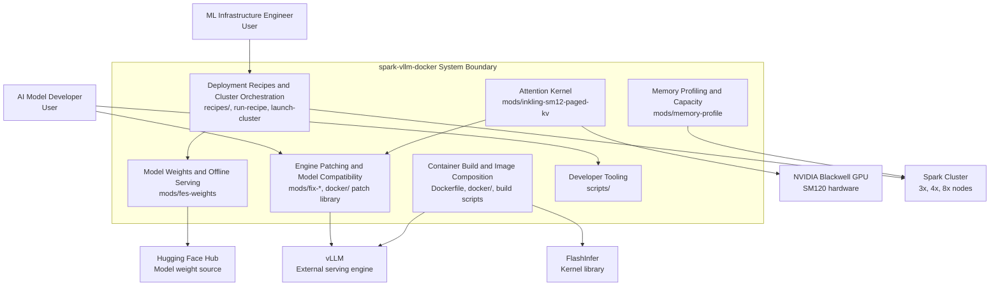
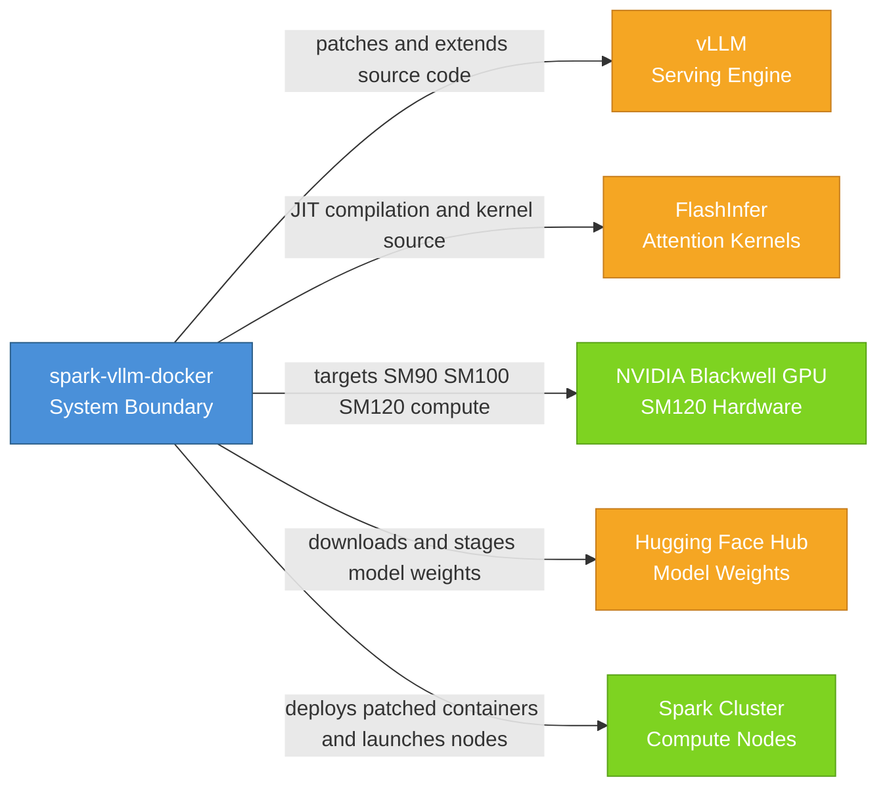
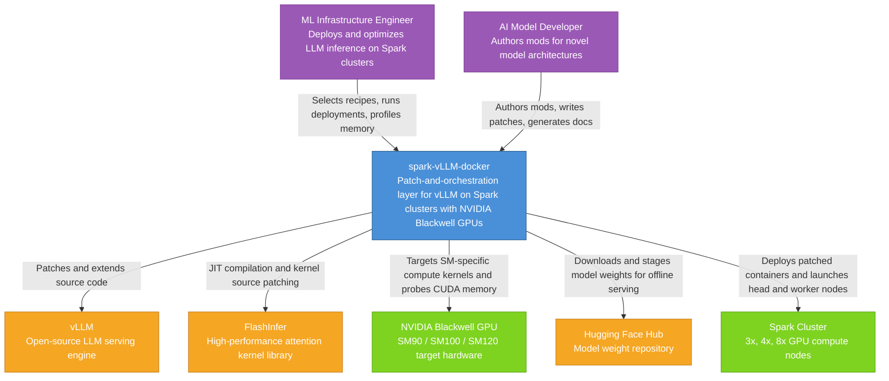
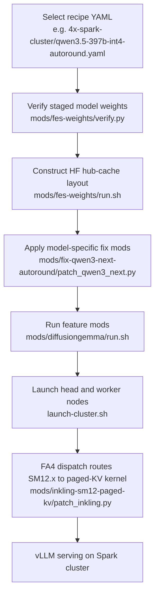
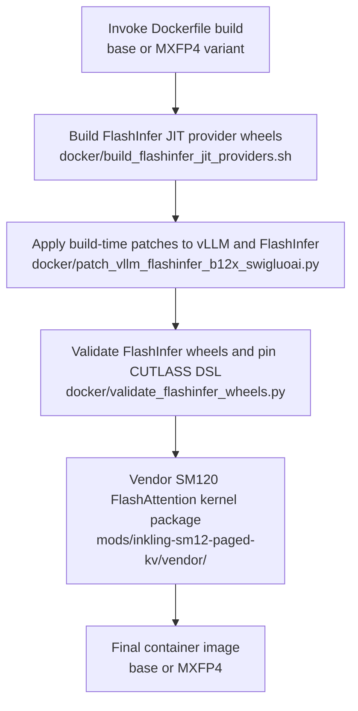
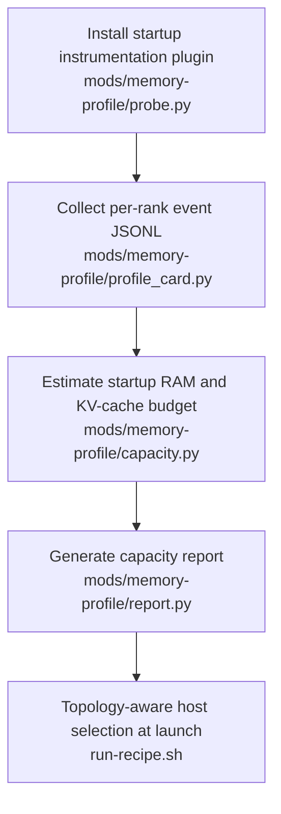
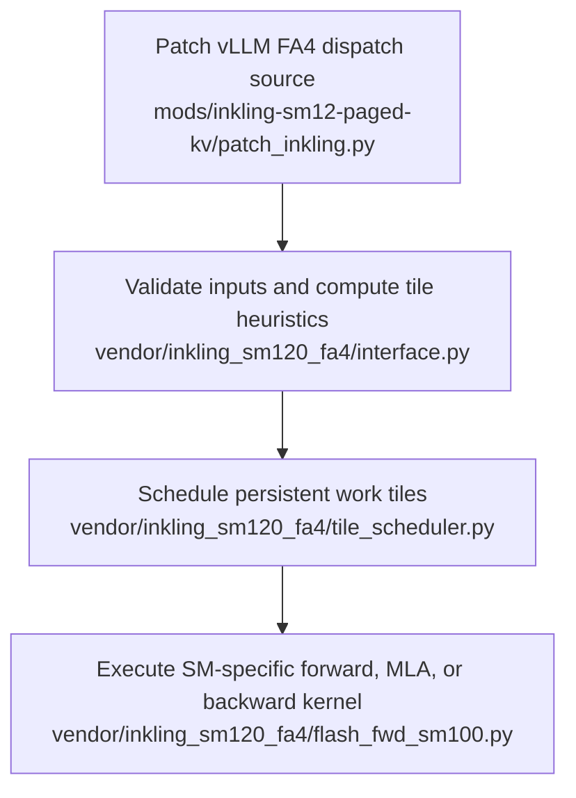
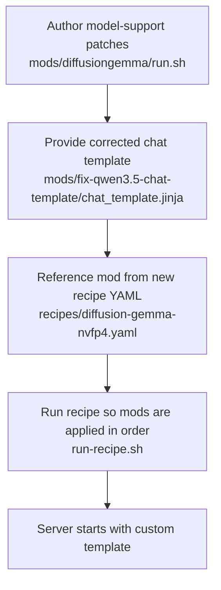
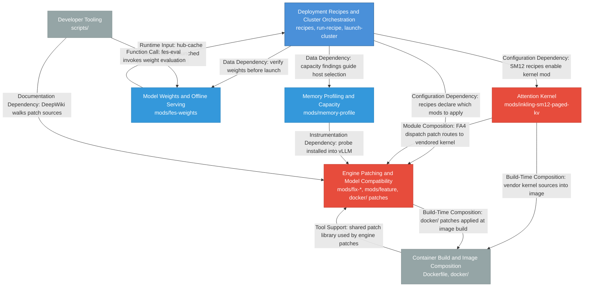

# System Context Overview

---

## 1. Project Introduction

### 1.1 Project Name and Description

**Project Name:** `spark-vllm-docker`

**Description:** `spark-vllm-docker` is a patch-and-orchestration layer built around the open-source vLLM large language model (LLM) serving engine, purpose-built for Spark clusters equipped with NVIDIA Blackwell GPUs. The project does not reimplement a serving engine; instead, it supplies a curated set of source-level patches, custom attention kernels, memory profiling tooling, offline model weight preparation scripts, and declarative deployment recipes that together enable vLLM to run efficiently and correctly on SM90/SM100/SM120-class NVIDIA hardware in clustered, often network-constrained, environments.

The system is composed of seven primary domains:

| Domain | Role | Importance |
|---|---|---|
| Attention Kernel Domain | Custom FlashAttention kernels vendored for Blackwell GPUs | Core |
| Engine Patching & Model Compatibility Domain | Source patches, AST rewriters, and chat templates for vLLM/transformers | Core |
| Deployment Recipes & Cluster Orchestration Domain | YAML recipes and runners that bind mods and launch clusters | Core |
| Memory Profiling & Capacity Domain | Startup instrumentation and host capacity validation | Supporting |
| Model Weights & Offline Serving Domain | Weight verification and HF hub-cache layout | Supporting |
| Container Build & Image Composition Domain | Dockerfiles and build-time patch toolchain | Infrastructure |
| Developer Tooling Domain | Evaluation runners and documentation generators | Tool Support |

### 1.2 Core Functionality and Business Value

The core business value of `spark-vllm-docker` is to **enable efficient, correct, and reproducible deployment of large language models on Spark clusters with NVIDIA Blackwell GPUs** by providing:

1. **Hardware-specific optimizations** — vendored CuTe-DSL FlashAttention kernels (forward, backward, MLA, split-K, paged-KV) for SM90/SM100/SM120 architectures, integrated into vLLM through an AST-based dispatch patch.
2. **Model compatibility remediation** — targeted patches and corrected chat templates that restore quantization, serialization, and architecture support for Qwen3/Qwen3.5/Qwen3.6, Gemma4, DiffusionGemma, GLM-4.7, Nemotron, MiniMax, Step-3.7, Mimo, RadixArk, and others.
3. **Topology-aware capacity planning** — memory profiling instrumentation that records per-phase startup memory, consolidates results into profile cards, and validates that a deployment fits available host memory before cluster launch.
4. **Offline-first serving** — weight verification and Hugging Face hub-cache construction that allow fully air-gapped inference.
5. **Declarative, repeatable deployment** — YAML recipes for 3×, 4×, and 8× Spark cluster topologies that sequence modifications and launch head/worker nodes deterministically.

The system eliminates the need for ad-hoc, manual patching of vLLM at deployment time, reducing mean-time-to-deploy, preventing configuration drift between cluster nodes, and enabling support for emerging model architectures without waiting for upstream vLLM releases.

### 1.3 Technical Characteristics Overview

| Characteristic | Detail |
|---|---|
| **Primary language** | Python, Shell (Bash), YAML |
| **Target runtime** | NVIDIA CUDA on SM90 (Hopper), SM100, SM120 (Blackwell) GPUs |
| **Serving engine** | Open-source vLLM (patched, not forked) |
| **Packaging** | Docker (base image and MXFP4 variant) |
| **Kernel framework** | CuTe-DSL (CUTLASS DSL), PyTorch autograd |
| **Attention library** | Vendored FlashAttention package + FlashInfer JIT providers |
| **Patch strategy** | Non-invasive, idempotent AST/text rewrites with mod markers |
| **Deployment model** | Declarative YAML recipes → mod sequencing → cluster launch |
| **Composition root** | `run-recipe.sh` / `run-recipe.py` |
| **Target environments** | Spark clusters (3×, 4×, 8× nodes); solo deployments; air-gapped networks |

---

## 2. Target Users

### 2.1 User Role Definitions

The system serves two primary user personas:

#### 2.1.1 ML Infrastructure Engineer

**Description:** Engineers responsible for deploying and optimizing LLM inference on Spark clusters with NVIDIA Blackwell hardware. They are the primary operators of the system and the owners of recipe definitions and cluster launch procedures.

**Key needs:**
- Apply hardware-specific optimizations to vLLM for Blackwell GPUs.
- Resolve model compatibility issues with vLLM for Qwen3, Gemma, and other architectures.
- Profile and estimate memory capacity for cluster nodes prior to deployment.
- Verify weight integrity for offline model serving in network-constrained environments.
- Deploy vLLM across Spark cluster environments with custom chat templates and quantization configurations.

#### 2.1.2 AI Model Developer

**Description:** Researchers or engineers working on novel model architectures that require patching vLLM for support. They author new mods and recipes rather than simply consuming existing ones.

**Key needs:**
- Integrate custom quantization support (e.g., NVFP4) for MoE routers.
- Apply patches to support emerging model variants (e.g., DiffusionGemma, Qwen3.5).
- Leverage advanced attention kernels (MLA) for Blackwell hardware.

### 2.2 Usage Scenarios

The following scenarios capture how each persona interacts with the system:

| ID | Persona | Scenario | Entry Point |
|---|---|---|---|
| S1 | ML Infrastructure Engineer | Deploy a quantized model on a 4-node Spark cluster by selecting a recipe YAML and running the recipe runner. | `run-recipe.sh` |
| S2 | ML Infrastructure Engineer | Profile a model's startup memory on target hardware, generate a profile card, and validate that the deployment fits host memory. | `mods/memory-profile/run.sh` |
| S3 | ML Infrastructure Engineer | Verify staged model weights and build the offline HF hub-cache layout before launching serving. | `mods/fes-weights/run.sh` |
| S4 | ML Infrastructure Engineer | Build the custom vLLM container image (base or MXFP4 variant) with all build-time patches and FlashInfer JIT providers applied. | `build-and-copy.sh` |
| S5 | AI Model Developer | Onboard a new or emerging model architecture by authoring a fix/feature mod, registering it in a recipe, and running the recipe. | `mods/<model-fix>/run.sh` |
| S6 | AI Model Developer | Enable an experimental feature (e.g., zero-copy weights, W4A16, KV-cache cleanup) via a feature mod referenced from a recipe. | `mods/<feature>/run.sh` |
| S7 | AI Model Developer | Generate repository documentation via the DeepWiki tooling for onboarding and reference. | `scripts/deepwiki/generate-deepwiki.sh` |

### 2.3 User Requirement Analysis

User requirements are organized against the system's seven domains:

```
Requirement Traceability
─────────────────────────────────────────────────────────────────
ML Infrastructure Engineer
  ├── HW-specific optimization ──────► Attention Kernel Domain
  ├── Model compat fixes ────────────► Engine Patching Domain
  ├── Memory capacity profiling ─────► Memory Profiling Domain
  ├── Weight integrity verification ─► Model Weights Domain
  └── Cluster deployment ────────────► Deployment Recipes Domain

AI Model Developer
  ├── Custom quantization (NVFP4) ───► Engine Patching Domain
  ├── New model variant support ─────► Engine Patching Domain
  ├── Advanced attention (MLA) ───────► Attention Kernel Domain
  └── Documentation generation ──────► Developer Tooling Domain
```

---

## 3. System Boundaries

### 3.1 Scope Definition

**Scope:** Optimizing the vLLM serving engine for Spark clusters with Blackwell GPUs through source-level patches, custom attention kernels, and deployment tooling.

The system boundary encompasses everything required to take a stock vLLM installation and transform it into a production-ready, hardware-optimized inference service on a Spark cluster — from image build, through modification sequencing, to cluster launch and post-launch capacity validation.

### 3.2 Included Core Components

The following components are **inside** the system boundary:

| # | Included Component | Description |
|---|---|---|
| 1 | Docker configuration for building custom vLLM images | `Dockerfile`, `Dockerfile.mxfp4`, `build-and-copy.sh`, and build-time patch scripts under `docker/`. |
| 2 | Kernel patches for FlashAttention on SM120/SM100 GPUs | Vendored CuTe-DSL kernel package (`mods/inkling-sm12-paged-kv/vendor/inkling_sm120_fa4/`) covering forward/backward/MLA/split-K/paged-KV kernels for SM90/SM100/SM120. |
| 3 | Patching scripts for specific model architectures | Per-model fix mods under `mods/fix-*` (Qwen3, Gemma4, DiffusionGemma, GLM-4.7, Nemotron, etc.) and shared build-time patch scripts under `docker/`. |
| 4 | Memory profiling and capacity analysis modules | `mods/memory-profile/` — startup probe, profile card generation, capacity analysis, and reporting. |
| 5 | Weight verification and offline model setup scripts | `mods/fes-weights/` — shard/index validation, size parity checks, HF hub-cache layout construction. |
| 6 | Chat template fixes for Qwen3.5 and DiffusionGemma | Jinja templates and AST-based rewrites under `mods/fix-qwen3.5-chat-template/`, `mods/diffusiongemma/`, etc. |
| 7 | Example scripts and cluster deployment recipes | `recipes/3x-spark-cluster/`, `recipes/4x-spark-cluster/`, `recipes/8x-spark-cluster/`, `run-recipe.sh`, `run-recipe.py`, `launch-cluster.sh`, `examples/`. |
| 8 | Developer tooling | `scripts/fes-eval.sh` and DeepWiki documentation generators. |

### 3.3 Excluded External Dependencies

The following components are **outside** the system boundary:

| # | Excluded Component | Rationale |
|---|---|---|
| 1 | Core vLLM development | The project consumes vLLM as an external dependency and patches it non-invasively; it does not maintain a fork or contribute to core engine development. |
| 2 | Model training pipelines | The system operates exclusively at the inference/serving layer; training is a separate concern. |
| 3 | Hardware design and drivers | NVIDIA GPU hardware, CUDA drivers, and firmware are assumed to be pre-installed and managed outside this system. |
| 4 | Spark cluster orchestration and management | Cluster provisioning, node scheduling, and lifecycle management (e.g., YARN, Kubernetes, Slurm) are external; the system assumes cluster nodes are available and reachable. |

### 3.4 System Boundary Diagram


```mermaid
graph TD
    subgraph SystemBoundary["spark-vllm-docker System Boundary"]
        ContainerBuild["Container Build and Image Composition<br/>Dockerfile, docker/, build scripts"]
        EnginePatch["Engine Patching and Model Compatibility<br/>mods/fix-*, docker/ patch library"]
        AttentionKernel["Attention Kernel<br/>mods/inkling-sm12-paged-kv"]
        DeployRecipe["Deployment Recipes and Cluster Orchestration<br/>recipes/, run-recipe, launch-cluster"]
        MemProfile["Memory Profiling and Capacity<br/>mods/memory-profile"]
        ModelWeights["Model Weights and Offline Serving<br/>mods/fes-weights"]
        DevTooling["Developer Tooling<br/>scripts/"]
    end

    vLLM["vLLM<br/>External serving engine"]
    FlashInfer["FlashInfer<br/>Kernel library"]
    Blackwell["NVIDIA Blackwell GPU<br/>SM120 hardware"]
    HFHub["Hugging Face Hub<br/>Model weight source"]
    SparkCluster["Spark Cluster<br/>3x, 4x, 8x nodes"]
    MLE["ML Infrastructure Engineer<br/>User"]
    AID["AI Model Developer<br/>User"]

    MLE --> DeployRecipe
    AID --> EnginePatch
    AID --> DevTooling

    EnginePatch --> vLLM
    ContainerBuild --> vLLM
    ContainerBuild --> FlashInfer
    AttentionKernel --> Blackwell
    AttentionKernel --> EnginePatch
    DeployRecipe --> SparkCluster
    DeployRecipe --> ModelWeights
    ModelWeights --> HFHub
    MemProfile --> SparkCluster
```

---

## 4. External System Interactions

### 4.1 External System List

| # | External System | Type | Interaction Description |
|---|---|---|---|
| 1 | **vLLM** | Software dependency | Open-source LLM serving engine that is patched and extended by this project. Consumed as a dependency, never forked. |
| 2 | **FlashInfer** | Software dependency | Library for high-performance attention kernels; used as a dependency in patching and JIT compilation. |
| 3 | **NVIDIA Blackwell GPU (SM120)** | Hardware platform | Target hardware platform for kernel customization and performance optimization. |
| 4 | **Hugging Face Hub** | External data source | Model repository used for offline weight access in cluster deployments. |

### 4.2 Interaction Method Descriptions

#### 4.2.1 vLLM — Source Patching and Extension

- **Interaction type:** Patches and extends source code.
- **Direction:** `spark-vllm-docker` → `vLLM` (outbound).
- **Mechanism:** Non-invasive, idempotent AST/text rewrites with mod markers applied to the installed vLLM Python package. Patches are applied at two points:
  - **Build time:** Shared patch library under `docker/` (e.g., `patch_vllm_flashinfer_b12x_swigluoai.py`, `patch_vllm_spark_kv_cache_cleanup.py`, `patch_vllm_startup_heap_trim.py`) executed during Docker image build.
  - **Runtime:** Per-model fix and feature mods under `mods/fix-*` and `mods/<feature>/` executed by `run-recipe` before server start.
- **Purpose:** Restore quantization behavior, fix chat templates, enable unsupported model architectures, inject attention kernel dispatch logic, and instrument startup memory profiling.
- **Contract:** The system targets specific vLLM versions; patches are validated for idempotency to allow safe re-application.

#### 4.2.2 FlashInfer — Kernel Source and JIT Compilation

- **Interaction type:** Provides kernel source and JIT compilation.
- **Direction:** `spark-vllm-docker` → `FlashInfer` (outbound) during image build.
- **Mechanism:**
  - FlashInfer is installed as a dependency in the Docker image.
  - `docker/build_flashinfer_jit_providers.sh` builds FlashInfer JIT-cache provider wheels for target CUDA architectures.
  - `docker/validate_flashinfer_wheels.py` validates built wheels and pins CUTLASS DSL versions for reproducibility.
  - FlashInfer sources are patched by `docker/patch_vllm_flashinfer_b12x_swigluoai.py` for SwiGLU-OAI parameter plumbing.
- **Purpose:** Provide high-performance attention kernels and JIT-compiled providers that complement the vendored FlashAttention package.

#### 4.2.3 NVIDIA Blackwell GPU (SM120) — Target Hardware Platform

- **Interaction type:** Target hardware platform.
- **Direction:** `spark-vllm-docker` → Hardware (outbound, via CUDA runtime).
- **Mechanism:**
  - Vendored CuTe-DSL FlashAttention kernels are compiled/loaded for SM90/SM100/SM120 compute capabilities.
  - The FA4 dispatch patch injects a `_use_sm12_paged_kv` capability check so that compute-capability 12.x devices route attention work to the vendored paged-KV kernel.
  - Memory profiling probes sample CUDA memory and native heap during worker startup to validate hardware capacity.
- **Purpose:** Deliver architecture-specific kernel selection (forward/MLA/split-K/TMA variants) and accurate capacity planning for Blackwell-class GPUs.

#### 4.2.4 Hugging Face Hub — Model Weight Source

- **Interaction type:** Model weight source.
- **Direction:** `spark-vllm-docker` → `Hugging Face Hub` (outbound, typically pre-deployment).
- **Mechanism:**
  - `hf-download.sh` provides a weight download helper for staging weights to local storage.
  - `mods/fes-weights/run.sh` constructs the HF hub-cache layout from staged weights for offline serving.
  - `mods/fes-weights/verify.py` validates staged shards against safetensors index, checks total size parity, and enforces quantization config presence for NVFP4 checkpoints.
- **Purpose:** Enable fully offline, air-gapped inference by resolving model weights from local storage rather than querying the Hugging Face hub at runtime.

### 4.3 Dependency Relationship Analysis


```mermaid
graph LR
    System["spark-vllm-docker<br/>System Boundary"]
    vLLM["vLLM<br/>Serving Engine"]
    FlashInfer["FlashInfer<br/>Attention Kernels"]
    Blackwell["NVIDIA Blackwell GPU<br/>SM120 Hardware"]
    HFHub["Hugging Face Hub<br/>Model Weights"]
    Spark["Spark Cluster<br/>Compute Nodes"]

    System -- "patches and extends source code" --> vLLM
    System -- "JIT compilation and kernel source" --> FlashInfer
    System -- "targets SM90 SM100 SM120 compute" --> Blackwell
    System -- "downloads and stages model weights" --> HFHub
    System -- "deploys patched containers and launches nodes" --> Spark

    style System fill:#4A90D9,stroke:#2C5F8A,color:#FFFFFF
    style vLLM fill:#F5A623,stroke:#C77E1D,color:#FFFFFF
    style FlashInfer fill:#F5A623,stroke:#C77E1D,color:#FFFFFF
    style Blackwell fill:#7ED321,stroke:#5AA319,color:#FFFFFF
    style HFHub fill:#F5A623,stroke:#C77E1D,color:#FFFFFF
    style Spark fill:#7ED321,stroke:#5AA319,color:#FFFFFF
```

**Dependency criticality assessment:**

| External System | Criticality | Coupling | Substitution Feasibility |
|---|---|---|---|
| vLLM | **Critical** — entire system exists to patch and extend vLLM | High (AST patches depend on source structure) | Low — switching to another engine would require full rework of patches |
| FlashInfer | **High** — required for JIT attention provider wheels | Medium (version-pinned via `pin_cutlass_dsl.py`) | Medium — alternative attention libraries exist but require new integration |
| NVIDIA Blackwell GPU | **High** — kernel selection and profiling are hardware-specific | High (SM-specific kernel code paths) | Low — hardware is fixed by project purpose |
| Hugging Face Hub | **Medium** — offline serving reduces runtime coupling | Low (one-time weight staging) | High — weights can be staged by any means; hub is convenience |
| Spark Cluster | **High** — deployment target for recipes | Medium (assumes cluster reachability) | Medium — recipes are declarative; other cluster managers could be adapted |

---

## 5. System Context Diagram

### 5.1 C4 SystemContext Diagram

The following diagram shows `spark-vllm-docker` as a single system, its interacting users, and its external dependencies at the C4 SystemContext level.


```mermaid
graph TD
    MLE["ML Infrastructure Engineer<br/>Deploys and optimizes LLM inference on Spark clusters"]
    AID["AI Model Developer<br/>Authors mods for novel model architectures"]

    System["spark-vLLM-docker<br/>Patch-and-orchestration layer for vLLM on Spark clusters with NVIDIA Blackwell GPUs"]

    vLLM["vLLM<br/>Open-source LLM serving engine"]
    FlashInfer["FlashInfer<br/>High-performance attention kernel library"]
    Blackwell["NVIDIA Blackwell GPU<br/>SM90 / SM100 / SM120 target hardware"]
    HFHub["Hugging Face Hub<br/>Model weight repository"]
    Spark["Spark Cluster<br/>3x, 4x, 8x GPU compute nodes"]

    MLE -->|"Selects recipes, runs deployments, profiles memory"| System
    AID -->|"Authors mods, writes patches, generates docs"| System

    System -->|"Patches and extends source code"| vLLM
    System -->|"JIT compilation and kernel source patching"| FlashInfer
    System -->|"Targets SM-specific compute kernels and probes CUDA memory"| Blackwell
    System -->|"Downloads and stages model weights for offline serving"| HFHub
    System -->|"Deploys patched containers and launches head and worker nodes"| Spark

    style System fill:#4A90D9,stroke:#2C5F8A,color:#FFFFFF
    style MLE fill:#9B59B6,stroke:#7D3C98,color:#FFFFFF
    style AID fill:#9B59B6,stroke:#7D3C98,color:#FFFFFF
    style vLLM fill:#F5A623,stroke:#C77E1D,color:#FFFFFF
    style FlashInfer fill:#F5A623,stroke:#C77E1D,color:#FFFFFF
    style Blackwell fill:#7ED321,stroke:#5AA319,color:#FFFFFF
    style HFHub fill:#F5A623,stroke:#C77E1D,color:#FFFFFF
    style Spark fill:#7ED321,stroke:#5AA319,color:#FFFFFF
```

**Legend:**
- **Blue** — the system under design (`spark-vllm-docker`)
- **Purple** — human actors / users
- **Orange** — external software systems / dependencies
- **Green** — external hardware and infrastructure platforms

### 5.2 Key Interaction Flows

#### 5.2.1 Recipe-Driven Cluster Model Deployment Flow (Primary Flow)

This is the primary end-to-end path from model selection to serving on a Spark cluster.


```mermaid
graph TD
    Start["Select recipe YAML<br/>e.g. 4x-spark-cluster/qwen3.5-397b-int4-autoround.yaml"] --> Verify["Verify staged model weights<br/>mods/fes-weights/verify.py"]
    Verify --> HubCache["Construct HF hub-cache layout<br/>mods/fes-weights/run.sh"]
    HubCache --> FixMod["Apply model-specific fix mods<br/>mods/fix-qwen3-next-autoround/patch_qwen3_next.py"]
    FixMod --> FeatureMod["Run feature mods<br/>mods/diffusiongemma/run.sh"]
    FeatureMod --> Launch["Launch head and worker nodes<br/>launch-cluster.sh"]
    Launch --> Dispatch["FA4 dispatch routes SM12.x to paged-KV kernel<br/>mods/inkling-sm12-paged-kv/patch_inkling.py"]
    Dispatch --> Serve["vLLM serving on Spark cluster"]
```

**Step detail:**

| Step | Domain | Operation | Entry Point |
|---|---|---|---|
| 1 | Deployment Recipes | Select and parse a model/cluster recipe YAML to determine mods, parallelism, and quantization. | `run-recipe.py` |
| 2 | Model Weights | Verify staged model weights and construct the HF hub-cache layout for offline serving. | `mods/fes-weights/run.sh` |
| 3 | Model Weights | Validate shards against safetensors index, size parity, and quantization config; fail fast on mismatch. | `mods/fes-weights/verify.py` |
| 4 | Engine Patching | Apply model-specific patches and chat templates (AST rewrites, `.patch`/`.diff` files) to installed vLLM/transformers sources. | `mods/fix-qwen3-next-autoround/patch_qwen3_next.py` |
| 5 | Engine Patching | Run feature mods (DiffusionGemma support, zero-copy weights, KV-cache cleanup). | `mods/diffusiongemma/run.sh` |
| 6 | Deployment Recipes | Launch head and worker nodes across the Spark cluster with the patched container. | `launch-cluster.sh` |
| 7 | Attention Kernel | At engine start, the FA4 dispatch patch routes SM12.x devices to the vendored paged-KV attention kernel. | `mods/inkling-sm12-paged-kv/patch_inkling.py` |

#### 5.2.2 Custom Container Image Build Flow


```mermaid
graph TD
    Build["Invoke Dockerfile build<br/>base or MXFP4 variant"] --> JIT["Build FlashInfer JIT provider wheels<br/>docker/build_flashinfer_jit_providers.sh"]
    JIT --> Patch["Apply build-time patches to vLLM and FlashInfer<br/>docker/patch_vllm_flashinfer_b12x_swigluoai.py"]
    Patch --> Validate["Validate FlashInfer wheels and pin CUTLASS DSL<br/>docker/validate_flashinfer_wheels.py"]
    Validate --> Vendor["Vendor SM120 FlashAttention kernel package<br/>mods/inkling-sm12-paged-kv/vendor/"]
    Vendor --> Image["Final container image<br/>base or MXFP4"]
```

#### 5.2.3 Memory Profiling and Capacity Validation Flow


```mermaid
graph TD
    Probe["Install startup instrumentation plugin<br/>mods/memory-profile/probe.py"] --> Collect["Collect per-rank event JSONL<br/>mods/memory-profile/profile_card.py"]
    Collect --> Capacity["Estimate startup RAM and KV-cache budget<br/>mods/memory-profile/capacity.py"]
    Capacity --> Report["Generate capacity report<br/>mods/memory-profile/report.py"]
    Report --> Launch["Topology-aware host selection at launch<br/>run-recipe.sh"]
```

#### 5.2.4 Attention Kernel Dispatch on Blackwell Flow


```mermaid
graph TD
    Patch["Patch vLLM FA4 dispatch source<br/>mods/inkling-sm12-paged-kv/patch_inkling.py"] --> Interface["Validate inputs and compute tile heuristics<br/>vendor/inkling_sm120_fa4/interface.py"]
    Interface --> Schedule["Schedule persistent work tiles<br/>vendor/inkling_sm120_fa4/tile_scheduler.py"]
    Schedule --> Execute["Execute SM-specific forward, MLA, or backward kernel<br/>vendor/inkling_sm120_fa4/flash_fwd_sm100.py"]
```

#### 5.2.5 Model Support Enablement Flow


```mermaid
graph TD
    Author["Author model-support patches<br/>mods/diffusiongemma/run.sh"] --> Template["Provide corrected chat template<br/>mods/fix-qwen3.5-chat-template/chat_template.jinja"]
    Template --> Register["Reference mod from new recipe YAML<br/>recipes/diffusion-gemma-nvfp4.yaml"]
    Register --> Run["Run recipe so mods are applied in order<br/>run-recipe.sh"]
    Run --> Start["Server starts with custom template"]
```

### 5.3 Architecture Decision Descriptions

| # | Decision | Rationale | Trade-off |
|---|---|---|---|
| AD-1 | **Patch vLLM rather than fork it** | Avoids maintaining a divergent fork; enables easy upstream version upgrades. | Patches are coupled to vLLM source structure and may break across upstream releases. |
| AD-2 | **Idempotent AST/text rewrites with mod markers** | Allows safe re-application of patches and clear traceability of which mod applied which change. | AST patches are more complex to author and debug than simple file replacements. |
| AD-3 | **Split patching into build-time (`docker/`) and runtime (`mods/`)** | Build-time patches stabilize the image; runtime mods allow per-recipe flexibility without rebuilding. | Conceptually a single "Engine Compatibility" concern is physically split by execution timing, increasing cognitive load. |
| AD-4 | **Declarative YAML recipes as the composition root** | Recipes bind mods, weights, kernels, and cluster launch into a single reproducible artifact; users select a recipe rather than orchestrating steps manually. | Recipe catalog must be curated and kept in sync with available mods. |
| AD-5 | **Vendored FlashAttention package inside `mods/`** | Kernels are tightly coupled to this project's dispatch patch and target hardware; vendoring guarantees version stability. | Divergence from upstream FlashAttention; requires manual updates. |
| AD-6 | **Offline-first weight resolution via HF hub-cache construction** | Supports air-gapped Spark clusters; removes runtime dependency on Hugging Face hub availability. | Requires pre-staging of weights; weight verification becomes a hard prerequisite. |
| AD-7 | **Memory profiling as a supporting mod rather than a core engine feature** | Keeps instrumentation optional and out of the production hot path when not needed. | Profile cards must be regenerated when models or recipes change. |

---

## 6. Technical Architecture Overview

### 6.1 Main Technology Stack

| Layer | Technology | Usage |
|---|---|---|
| **Serving Engine** | vLLM (open-source) | Core LLM inference engine, patched and extended |
| **Attention Kernels** | CuTe-DSL (CUTLASS DSL), FlashAttention | Vendored SM90/SM100/SM120 forward/backward/MLA/split-K/paged-KV kernels |
| **Kernel Library** | FlashInfer | JIT-compiled attention provider wheels |
| **Deep Learning Framework** | PyTorch | Autograd interface for custom kernels; tensor operations |
| **GPU Compute** | NVIDIA CUDA (SM90, SM100, SM120) | Target hardware compute capability |
| **Model Format** | Safetensors, `hf_quant_config.json` | Offline weight storage and quantization metadata |
| **Templating** | Jinja2 (`.jinja` chat templates) | Model-specific chat serialization |
| **Packaging** | Docker (`Dockerfile`, `Dockerfile.mxfp4`) | Reproducible container images (base and MXFP4 variants) |
| **Configuration** | YAML (recipe files) | Declarative deployment specifications |
| **Orchestration** | Bash (shell runners), Python | Recipe parsing, mod sequencing, cluster launch |
| **Instrumentation** | Python JSONL event logging | Per-phase memory profiling during vLLM startup |
| **Quantization** | NVFP4, MXFP4, AWQ, FP8, INT4 (AutoRound), W4A16 | Model compression schemes supported across recipes |

### 6.2 Architecture Patterns

| Pattern | Application in `spark-vllm-docker` |
|---|---|
| **Patch/Extension (non-invasive)** | vLLM is extended via idempotent AST/text patches rather than forked or subclassed. Mod markers provide traceability. |
| **Composition Root** | `run-recipe` serves as the composition root, binding mods, weights, kernels, and cluster launch into a single orchestrated flow. |
| **Declarative Configuration** | YAML recipes describe desired end state (model, quantization, parallelism, cluster size, mods); the runner derives imperative steps. |
| **Strategy/Modularity** | Each mod under `mods/` is an independent, composable unit with a `run.sh` entry point; recipes select which strategies to activate. |
| **Vendoring** | The FlashAttention kernel package is vendored to decouple from upstream release cadence. |
| **Build-Time vs. Runtime Layering** | Image-stable patches applied at build time (`docker/`); recipe-specific patches applied at runtime (`mods/`). |
| **Instrumentation/Observer** | The memory profiling probe observes vLLM worker startup without altering serving behavior. |
| **Fail-Fast Validation** | Weight verification and capacity checks fail before deployment if preconditions are not met. |
| **Offline-First** | All runtime dependencies (weights, kernels, JIT wheels) are staged into the image and local storage to eliminate network dependence. |

### 6.3 Key Design Decisions and Characteristics

**Domain Interaction Summary:**


```mermaid
graph TD
    Deploy["Deployment Recipes and Cluster Orchestration<br/>recipes, run-recipe, launch-cluster"]
    Patching["Engine Patching and Model Compatibility<br/>mods/fix-*, mods/feature, docker/ patches"]
    Kernel["Attention Kernel<br/>mods/inkling-sm12-paged-kv"]
    Weights["Model Weights and Offline Serving<br/>mods/fes-weights"]
    MemProf["Memory Profiling and Capacity<br/>mods/memory-profile"]
    Build["Container Build and Image Composition<br/>Dockerfile, docker/"]
    Tools["Developer Tooling<br/>scripts/"]

    Deploy -- "Configuration Dependency: recipes declare which mods to apply" --> Patching
    Deploy -- "Data Dependency: verify weights before launch" --> Weights
    Deploy -- "Configuration Dependency: SM12 recipes enable kernel mod" --> Kernel
    Deploy -- "Data Dependency: capacity findings guide host selection" --> MemProf
    Kernel -- "Module Composition: FA4 dispatch patch routes to vendored kernel" --> Patching
    Kernel -- "Build-Time Composition: vendor kernel sources into image" --> Build
    MemProf -- "Instrumentation Dependency: probe installed into vLLM" --> Patching
    Patching -- "Build-Time Composition: docker/ patches applied at image build" --> Build
    Build -- "Tool Support: shared patch library used by engine patches" --> Patching
    Weights -- "Runtime Input: hub-cache consumed by launched server" --> Deploy
    Tools -- "Function Call: fes-eval invokes weight evaluation" --> Weights
    Tools -- "Documentation Dependency: DeepWiki walks patch sources" --> Patching

    style Deploy fill:#4A90D9,stroke:#2C5F8A,color:#FFFFFF
    style Patching fill:#E74C3C,stroke:#C0392B,color:#FFFFFF
    style Kernel fill:#E74C3C,stroke:#C0392B,color:#FFFFFF
    style Weights fill:#3498DB,stroke:#2980B9,color:#FFFFFF
    style MemProf fill:#3498DB,stroke:#2980B9,color:#FFFFFF
    style Build fill:#95A5A6,stroke:#7F8C8D,color:#FFFFFF
    style Tools fill:#95A5A6,stroke:#7F8C8D,color:#FFFFFF
```

**Color legend:** Red = Core Business Domain, Blue = Supporting Domain, Grey = Infrastructure / Tool Support Domain.

**Key architectural observations:**

1. **Recipes are the primary user-facing artifact.** Users interact with the system by selecting a recipe YAML; the recipe runner then orchestrates all other domains. This reduces the operational surface area to a single command.

2. **Engine compatibility is split across two physical locations** — build-time patches under `docker/` and runtime mods under `mods/fix-*`. These are conceptually one "Engine Compatibility" concern but are physically separated by execution timing. This is the primary observed misalignment between code structure and documented system boundary.

3. **The Attention Kernel Domain is the computational core.** It extends vLLM's attention capability on Blackwell hardware through a vendored CuTe-DSL package integrated via AST-based dispatch patching.

4. **Two image variants** (base and MXFP4) support different quantization targets, both produced from the same Dockerfile family with variant-specific patches.

5. **Confidence note:** The system context research report carries a confidence score of 7.0/10, and the domain module analysis carries 7.5/10. The highest-confidence areas are the domain structure and external system list; areas with moderate confidence include precise interaction protocols with external systems (e.g., exact FlashInfer API surface) and the completeness of the external system inventory.

---

*Document generated as a C4 Model SystemContext-level architecture description for `spark-vllm-docker`.*