# System Architecture Documentation

# codekeeper — Architecture Overview

---

## 1. Architecture Overview

### 1.1 Architecture Design Philosophy

`codekeeper` is **not** an inference engine. It is a **deployment-time mutation and orchestration layer** that customizes an *externally installed* vLLM package without forking it. The repository's architecture is grounded in a single, consistently applied design philosophy:

> **"Patch the dependency, don't fork it."**

Every customization — a new model architecture, a hardware-specific attention kernel, a quantization fix, or a chat-template correction — is expressed as a **reversible, marker-guarded transformation** applied at container launch time. This philosophy yields four defining architectural properties:

| Property | Consequence |
|---|---|
| **Non-invasive customization** | No vLLM fork is maintained; upstream remains upgradeable and mods remain isolated. |
| **Idempotency by construction** | Every patch detects prior application (via mod markers or `git apply --reverse --check`) and skips, making repeated runs safe. |
| **Traceability** | Mods inject explicit marker comments (e.g. `# spark-vllm mod: inkling-sm12-paged-kv v1`) so the source tree can be audited after mutation. |
| **Fail-fast orchestration** | All entry scripts run under `set -euo pipefail`, ensuring that an all-or-nothing deployment aborts rather than producing a silently half-patched server. |

The repository is deliberately split into two fundamentally different functional worlds: an **orchestration layer** (declarative YAML recipes, fail-fast Bash entry scripts, AST/diff patchers) and a **compute layer** (a vendored CUTLASS CuTe-DSL FlashAttention kernel package that executes the attention math on SM90/SM100/SM120 GPUs).

### 1.2 Core Architecture Patterns

The architecture is composed of several interlocking patterns:

1. **Patch-First, Launch-Second Orchestration** — Every mod follows the identical shape: resolve the environment → mutate installed vLLM source → launch the server. This consistency is what makes mods composable and their behavior predictable.

2. **Layered Orchestration (Declarative → Imperative)** — A deployment is modeled as a **YAML recipe over mods**. The recipe runner parses the declaration, generates an imperative Bash launch script, and delegates execution to the cluster launcher.

3. **Inversion of Control (Launcher-Owned Topology)** — `launch-cluster.sh` deliberately strips distributed-executor flags (`--nnodes`, `--node-rank`, `--master-addr`, etc.) from user commands and re-injects them itself. The launcher owns cluster topology, not the recipe.

4. **Capability-Gated Dispatch** — `patch_inkling.py` injects a runtime capability check (`_use_sm12_paged_kv()`) into vLLM's FA4 dispatch so that SM12-class devices route to the vendored paged-KV kernel, while other hardware continues to use upstream paths.

5. **Architecture Specialization Cascade** — The vendored kernel package uses aggressive subclassing: SM120 forward/backward kernels reuse SM80-era `mma.sync` code and override only the SMEM capacity check (99 KB vs 163 KB), whereas SM100 kernels introduce `tcgen05` MMA.

6. **Build-Time Pre-Conditioning** — Docker build-time patches (`docker/patch_vllm_*.py`) mutate the *same* vLLM source tree that runtime mods later patch, splitting customization between image construction and deployment.

### 1.3 Technology Stack Overview

| Layer | Technologies |
|---|---|
| **Orchestration & Glue** | Bash (`set -euo pipefail`), Python 3.12, PyYAML, `ast` module, `git apply` |
| **Patching** | AST-based single-occurrence rewriting, unified diffs, inline `sed`/regex |
| **Templating** | Jinja2 chat templates |
| **Kernel Programming** | CUTLASS CuTe-DSL (pinned 4.7.0), `tcgen05` MMA, TMA, mbarrier pipelines, PTX descriptors |
| **GPU Targets** | NVIDIA SM80/SM90 (Hopper)/SM100 (Blackwell DC)/SM120 (Blackwell consumer / DGX Spark) |
| **Runtime Integration** | PyTorch (`torch.autograd.Function`), CUDA 13.0.2, Torch 2.13.0 |
| **Packaging & Delivery** | Docker (multi-stage), NVIDIA NGC containers, SSH-based multi-node distribution |
| **Target Under Modification** | vLLM (installed at `/usr/local/lib/python3.12/dist-packages/vllm`) |

---

## 2. System Context

### 2.1 System Positioning and Value

`codekeeper` delivers business value by **enabling rapid, reproducible customization of vLLM without forking upstream**. Its raison d'être is the tension between two forces:

- **Upstream velocity** — vLLM evolves rapidly, and fork maintenance is expensive.
- **Production urgency** — teams need to serve cutting-edge models (DiffusionGemma, Qwen3.5/3.6, GLM-5.x, Nemotron, Step, MiniMax) on brand-new GPU hardware (Blackwell SM120 / DGX Spark) *immediately*, before their fixes land upstream.

`codekeeper` resolves this by introducing a **mod abstraction**: an isolated, traceable, reversible unit of change. This reduces time-to-production for cutting-edge models on new GPU hardware and multi-node Spark clusters, without incurring the long-term liability of a vLLM fork.

### 2.2 User Roles and Scenarios

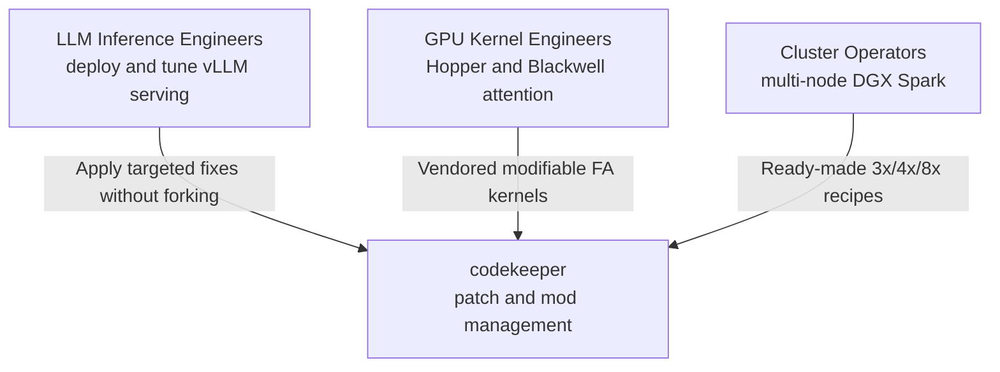

- **LLM Inference Engineers** need to apply targeted fixes to an installed vLLM without maintaining a fork, enable new or unreleased model architectures, and fix quantization or chat-template issues for specific models.
- **GPU Kernel Engineers** need vendored, modifiable FlashAttention forward/backward kernels in CuTe-DSL, paged-KV attention support for SM120 consumer GPUs, and benchmarking/tile-scheduling primitives.
- **Cluster Operators** need ready-made recipes for 3x/4x/8x Spark cluster setups together with deterministic, fail-fast patch application and server-launch scripts.

### 2.3 External System Interactions

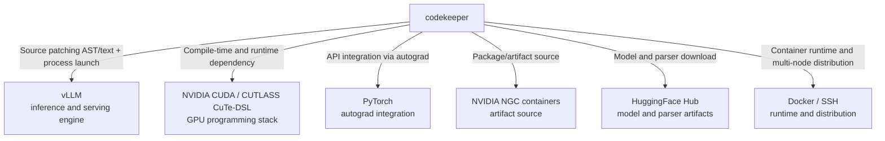

| External System | Interaction Type | Concrete Evidence |
|---|---|---|
| **vLLM** | Source patching (AST/text/diff) + process launch | `mods/*/run.sh` rewrite `$PYTHON_ROOT/vllm/**`; `vllm serve` launched via generated scripts |
| **NVIDIA CUDA / CUTLASS CuTe-DSL** | Compile-time + runtime dependency | `import cutlass`, `cutlass.cute`, `tcgen05`, `cpasync` throughout `inkling_sm120_fa4`; pinned to `4.7.0` |
| **PyTorch** | Autograd / API integration | `torch.autograd.Function` classes in `interface.py`; `torch.cuda.get_device_capability()` gating |
| **NVIDIA NGC containers** | Alternative artifact source | `mods/use-ngc-vllm/run.sh` (now a no-op; init moved to `launch-cluster.sh`) |
| **HuggingFace Hub** | Model + parser artifact download | `hf-download.sh`; `mods/nemotron-*/run.sh` `wget` reasoning parsers |
| **Docker / SSH** | Container runtime + multi-node distribution | `launch-cluster.sh`, `build-and-copy.sh` |

### 2.4 System Boundary Definition

**Owned by the repository:**

- `mods/` — patch scripts, diff patches, Jinja templates, `run.sh` launchers
- `mods/inkling-sm12-paged-kv/vendor/inkling_sm120_fa4/` — vendored CuTe-DSL kernels
- `recipes/` — YAML deployment recipes
- `docker/` — Dockerfiles, build scripts, build-time vLLM patches
- Top-level orchestration: `run-recipe.py/.sh`, `launch-cluster.sh`, `build-and-copy.sh`, `autodiscover.sh`, `hf-download.sh`

**Excluded (external dependencies):**

- The vLLM engine and server implementation (patched in place, not owned)
- Upstream flash-attention and CUTLASS projects (source of vendored kernels)
- Model weights and model repositories
- GPU drivers and CUDA toolkit distribution
- Cluster hardware provisioning beyond the provided recipes

The central boundary insight is: **`codekeeper` mutates the environment at deployment time, but owns none of the runtime engine it mutates.**

---

## 3. Container View

### 3.1 Domain Module Division

The system decomposes into **six functional domains**, classified by their role in the architecture:

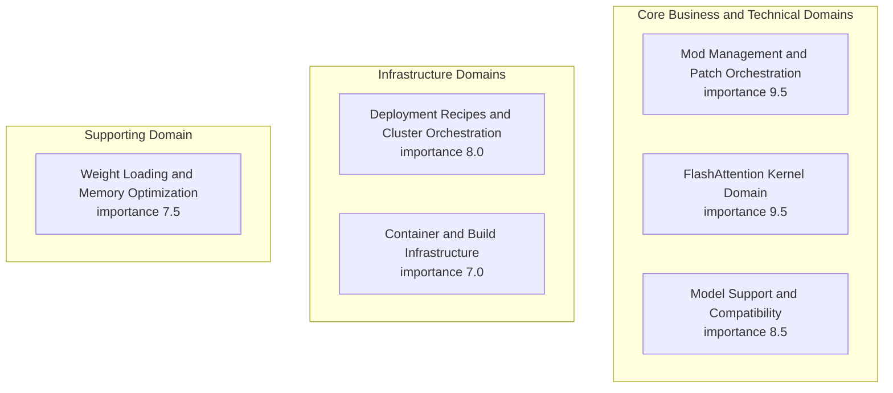

| # | Domain | Type | Responsibility |
|---|---|---|---|
| 1 | **Mod Management & Patch Orchestration** | Core Business | Defines, applies, and orchestrates self-contained mods; provides AST/diff patchers and the recipe runner. |
| 2 | **FlashAttention Kernel Domain** | Core Technical | Vendored CuTe-DSL FlashAttention package (`inkling_sm120_fa4`) for SM90/SM100/SM120. |
| 3 | **Model Support & Compatibility** | Core Business | Per-model architecture, quantization, and chat-template correctness. |
| 4 | **Deployment Recipes & Cluster Orchestration** | Infrastructure | YAML recipes + launch scripts for 3x/4x/8x DGX Spark clusters. |
| 5 | **Container & Build Infrastructure** | Infrastructure | Dockerfiles, build-time patches, dependency pinning. |
| 6 | **Weight Loading & Memory Optimization** | Supporting | Zero-copy views, hybrid draft loading, KV-cache/memory tuning. |

### 3.2 Domain Module Architecture

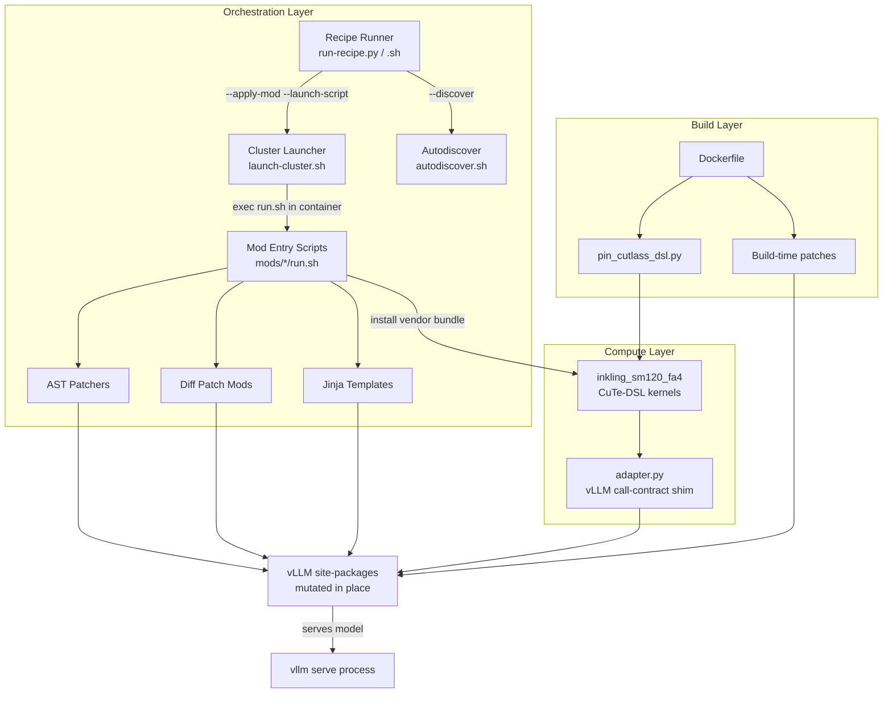

### 3.3 Storage Design

The system is **largely stateless** at the orchestration level — its "storage" is a set of declarative and mutable on-disk artifacts rather than database tables. There is no persistent application data store.

| Storage Kind | Location | Role |
|---|---|---|
| **Declarative configuration** | `recipes/*.yaml`, `.env` | Binds model, quantization, and topology |
| **Patch artifacts** | `mods/*/*.patch`, `*.py`, `*.jinja` | The units of change |
| **Vendored kernel source** | `mods/inkling-sm12-paged-kv/vendor/inkling_sm120_fa4/` | CuTe-DSL kernel package |
| **Runtime KV-cache** | GPU HBM (paged, non-contiguous) | Consumed by paged-KV attention kernels |
| **Build provenance** | `build-metadata.yaml` | Records image construction provenance |
| **HF model cache** | Host filesystem, rsynced to workers | Model weights and parser artifacts |

**Design insight:** The absence of a persistent datastore is not accidental — it reflects the fact that this repository is a *transformation pipeline*, not a *stateful service*. Its state is the mutated source tree itself.

### 3.4 Inter-Domain Communication

Domain relations, ordered by strength:

| From | To | Relation | Strength |
|---|---|---|---|
| Mod Management & Patch Orchestration | Model Support & Compatibility | Tool Support | 9.0 |
| Mod Management & Patch Orchestration | FlashAttention Kernel Domain | Tool Support | 8.5 |
| Recipes & Cluster Orchestration | Mod Management & Patch Orchestration | Configuration Dependency | 8.5 |
| Mod Management & Patch Orchestration | Weight Loading & Memory Optimization | Tool Support | 8.0 |
| Recipes & Cluster Orchestration | Model Support & Compatibility | Configuration Dependency | 7.5 |
| Container & Build Infrastructure | Mod Management & Patch Orchestration | Data Dependency | 7.0 |
| Container & Build Infrastructure | FlashAttention Kernel Domain | Configuration Dependency | 7.0 |
| Model Support & Compatibility | FlashAttention Kernel Domain | Service Call | 6.5 |
| FlashAttention Kernel Domain | Weight Loading & Memory Optimization | Data Dependency | 5.0 |

**Key insight — the orchestration domain is a hub.** Four of the strongest relations emanate from Mod Management & Patch Orchestration, because it is the mechanism by which every other domain's artifacts reach the installed vLLM. The infrastructure domains are strictly upstream (build-time), while the model and kernel domains are downstream consumers.

---

## 4. Component View

### 4.1 Core Functional Components

#### 4.1.1 Mod Management & Patch Orchestration (Core Business Domain)

**Mod Entry Scripts** (`mods/*/run.sh`) are fail-fast Bash launchers. They resolve the Python root via `PYTHON_ROOT` / `VLLM_SITE_PACKAGES` (default `/usr/local/lib/python3.12/dist-packages`), apply patches with idempotency guards, and start the server. Two notable subtypes exist beyond the documented taxonomy:

- `mods/drop-caches/run.sh` spawns a background `drop_caches` loop — a **side-effect daemon**, not a source patch.
- `mods/fix-glm-4.7-flash-AWQ/run.sh` and `mods/fix-gemma4-tool-parser/run.sh` fetch **live PR diffs from GitHub at runtime** (`curl ... | patch`), introducing network dependency and non-determinism.

**AST-Based Source Patchers** (`patch_inkling.py`, `patch_weight_utils.py`, `patch_model_loader.py`) use the Python `ast` module to locate a *single* target node, then perform a **single-occurrence text replacement** guarded by a **mod marker** (e.g. `# spark-vllm mod: inkling-sm12-paged-kv v1`). They validate postconditions and re-`compile()` the result to guarantee syntactic integrity.

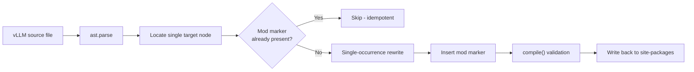

**Diff Patch Mods** use a strict three-phase protocol:
`git apply --reverse --check` (already-applied detection) → `git apply --check` → `git apply`, with `--exclude` filters for `tests/`, `docs/`, `examples/`.

**Legacy/main fallback ordering** is real and consequential: `mods/diffusiongemma/run.sh` selects between `*-main.patch` and `*-legacy.patch` based on marker presence in the installed source, tolerating installed-vLLM version drift.

**Recipe Runner** (`run-recipe.py`) parses YAML recipes (validating `recipe_version` against `SUPPORTED_VERSIONS = ["1"]`), resolves the ordered list of required mods, and generates an imperative launch script.

**Critical correction (Drift D1).** The recipe runner does **not** execute `run.sh` directly. It passes mod paths to `launch-cluster.sh` via `--apply-mod`, and `launch-cluster.sh` copies each mod directory into the target container and executes `run.sh` **inside the container** (`apply_mod_to_container()`). **Mods are applied in-container, not on the host.**

#### 4.1.2 FlashAttention Kernel Domain (Core Technical Domain)

The vendored package `inkling_sm120_fa4` is a downstream distribution of `Dao-AILab/flash-attention` bundling **five upstream PRs**:

| PR | Feature |
|---|---|
| #2336 | SM120 split-KV (FlashDecoding) with FP32 partials |
| #2348 | SM120 kernel-level paged KV cache |
| #2349 | SM120 TMA forward with warp specialization |
| #2389 | SM80/SM120 block-sparse forward |
| #2439 | FA4 Philox dropout |

Confirmed sub-components include forward kernels (SM80/90/100/120 + TMA + MLA), backward kernels (SM80/90/100/120 + pre/postprocess), `paged_kv.py` (`PagedKVManager`), `flash_fwd_combine.py`, `softmax.py` (`Softmax`/`SoftmaxSm100`), `tile_scheduler.py` (`SchedulingMode`, `ClcState`), `blackwell_helpers.py` (tcgen05 MMA), `mask.py`, `seqlen_info.py`, `pack_gqa.py`, and `dropout.py`.

**Undocumented component discovered (Drift D2).** `mods/inkling-sm12-paged-kv/adapter.py` — a **vLLM call-contract shim** installed as `vllm/third_party/inkling_sm120_fa4_adapter.py`. It:
- Preserves vLLM Inkling's `out=` preallocated-output contract (the bundle's public `flash_attn_varlen_func` lacks it),
- Enforces **inference-only** (raises on autograd),
- **Clamps `num_splits = 1`** as a defensive measure.

This adapter is a first-class architectural component — the actual entry point vLLM calls — and is absent from the documented component list.

#### 4.1.3 Model Support & Compatibility (Core Business Domain)

This domain delivers per-model architecture, quantization, and prompt-format correctness. Confirmed mods cover DiffusionGemma, Qwen3.x/3.5/3.6, GLM, Nemotron, Step, MiniMax, and Gemma4.

**Correction (Drift D3).** `mods/nemotron-nano/run.sh` and `mods/nemotron-super/run.sh` do **not** serve the target model with model-specific patches. They are 4-line scripts that `wget` a reasoning-parser `.py` file from HuggingFace.

#### 4.1.4 Deployment Recipes & Cluster Orchestration (Infrastructure Domain)

Recipes are YAML with a documented schema: `name`, `recipe_version`, `container`, `command`, `model`, `mods`, `defaults`, `env`, `build_args`, `cluster_only`, `solo_only`.

**Inversion of control:** `launch-cluster.sh` **strips** `--distributed-executor-backend`, `--nnodes`, `--node-rank`, `--master-addr`, `--master-port`, `--headless` from user commands and re-injects them itself. The launcher owns cluster topology, not the recipe.

#### 4.1.5 Container & Build Infrastructure (Infrastructure Domain)

The `Dockerfile` is a multi-stage build (base → flashinfer-builder → runner) pinning CUDA 13.0.2, Torch 2.13.0, CUTLASS DSL 4.7.0, and `TORCH_CUDA_ARCH_LIST=12.1a`. Build-time patches (`docker/patch_vllm_*.py`) are applied via `RUN python3 ... --installed` after package installs. `pin_cutlass_dsl.py` enforces an exact requirement count (`--expected-count`) for reproducibility.

#### 4.1.6 Weight Loading & Memory Optimization (Supporting Domain)

`instanttensor-zero-copy` rewrites `copy=True` → `copy=False` with ownership comments; `instanttensor-hybrid-draft-loader` patches the model loader; `kv-cache-prealloc-cleanup` and `gpu-mem-util-gb` patch vLLM memory accounting.

**Correction (Drift D4).** `gpu-mem-util-gb` is classified under "Diff Patch Mods," but its `run.sh` uses **inline Python AST/regex rewriting** (`replace_once`, `replace_regex_once`, `replace_function`), not a unified diff. It belongs with the AST-based patchers.

### 4.2 Technical Support Components

The kernel domain exposes a rich set of shared technical components:

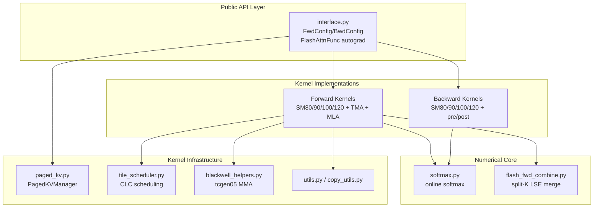

| Component | Responsibility |
|---|---|
| **Public API & Autograd Interface** | `FwdConfig`/`BwdConfig` dataclasses, tile-size heuristics, device-architecture parsing, masking, split-KV resolution, `FlashAttnFunc`/`FlashAttnVarlenFunc`. |
| **Forward Pass Kernels** | Tiled MMA forward across SM80/90/100/120 + TMA variant + MLA kernel. |
| **Backward Pass Kernels** | dQ/dK/dV gradient computation + preprocess/postprocess stages. |
| **Paged KV Cache Management** | Page-table loads, K/V pointer computation (`compute_X_ptr`), block-wise KV tile loading (`load_KV`), fast divmod page-size arithmetic. |
| **Split-K Combine** | `FlashAttentionForwardCombine` LSE-weighted merge of partial outputs. |
| **Softmax & Numerical Core** | `Softmax`/`SoftmaxSm100` online softmax, row-max tracking, output rescaling. |
| **Tile Scheduling & Pipelines** | `SchedulingMode`, `WorkTileInfo`, `ClcState`, `TileSchedulerProtocol`, `PipelineTmaAsync`, mbarrier primitives. |
| **Kernel Utilities & Blackwell Helpers** | tcgen05 MMA, PTX descriptors, TMA/bulk copies, device-side DSL ops, kernel-cache hashes. |

### 4.3 Component Interaction Relationships

The component-level interaction follows a **capability-gated, patched dispatch chain**:

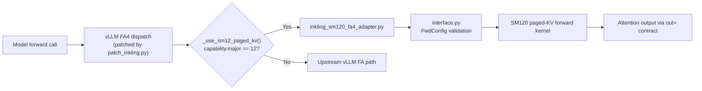

This chain is the linchpin that connects the orchestration layer to the compute layer: **`patch_inkling.py` (a mod) is what causes the vendored kernel (a compute artifact) to ever execute on the target hardware.**

---

## 5. Key Processes

### 5.1 Core Functional Process — Apply Mod and Launch Patched Server (Importance 9.5)

The dominant business flow of the repository.

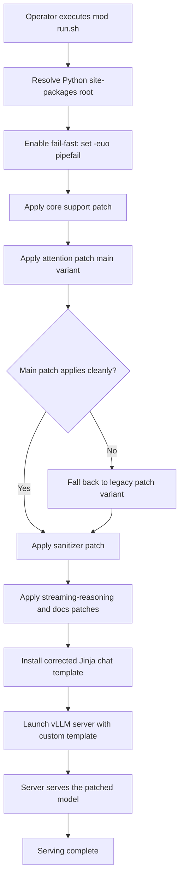

**Key steps:** resolve site-packages root → enable fail-fast → apply core support patch → apply attention patch with main/legacy fallback → apply sanitizer/streaming patches → install chat template → launch server.

### 5.2 Recipe-Driven Cluster Deployment (Importance 8.5)

A higher-level orchestration flow where a YAML recipe declares model, quantization, hardware topology, and required mods.

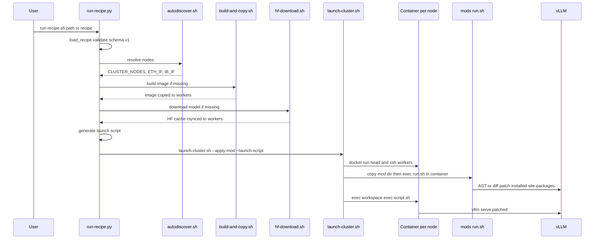

### 5.3 FlashAttention Forward Pass with Paged KV (Importance 9.0)

The runtime attention computation path executed during inference.

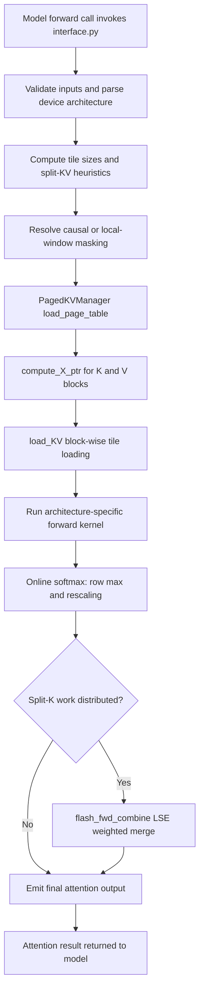

### 5.4 FlashAttention Backward Pass (Importance 8.0)

The gradient computation path used during training/fine-tuning.

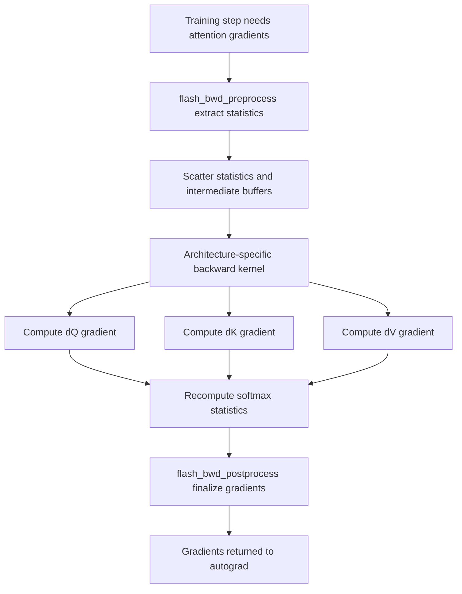

Note: SM120 reuses the SM80-era `mma.sync` path with an SMEM budget override.

### 5.5 Zero-Copy Weight Loading (Importance 7.0)

A memory-optimization flow in which an AST patcher rewrites vLLM's InstantTensor weights iterator.

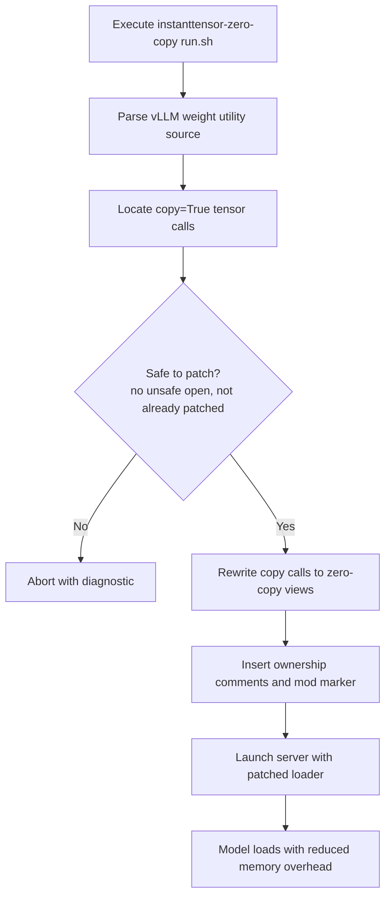

### 5.6 Data Flow Paths

The primary **data flow** across layers is:

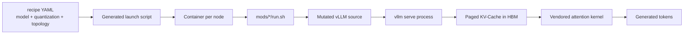

### 5.7 Exception Handling Mechanisms

The system employs four layers of defense-in-depth:

1. **Fail-fast shell (`set -euo pipefail`)** — any command failure aborts the deployment.
2. **Idempotency guards** — mod markers and `git apply --reverse --check` prevent double-application.
3. **Postcondition validation** — AST patchers re-`compile()` the rewritten source and validate the intended anchor replacement.
4. **Runtime preflight** — `inkling-sm12-paged-kv/run.sh` verifies SM12x capability, CUDA ≥ 12.8, and required CuTe APIs before installing.

**Known risk:** several mods (`fix-glm-4.7-flash-AWQ`, `fix-gemma4-tool-parser`, `exp-w4a16`) fetch live GitHub diffs at runtime, which breaks the deterministic failure model if the network is unavailable or upstream PR content changes.

---

## 6. Technical Implementation

### 6.1 Core Module Implementation

**The adapter as the critical integration seam.** The `inkling_sm120_fa4_adapter.py` shim resolves a fundamental interface mismatch: the vendored bundle's public `flash_attn_varlen_func` does not accept vLLM's `out=` preallocated-output parameter. The adapter:

- Wraps the bundle call to honor the `out=` contract,
- Raises on autograd use (inference-only enforcement),
- Clamps `num_splits = 1` to avoid an unstable split-KV path.

This component deserves first-class documentation because it is the *only* place where the two layers' contracts meet.

**AST patcher design.** The patchers combine static AST analysis with controlled textual rewriting:

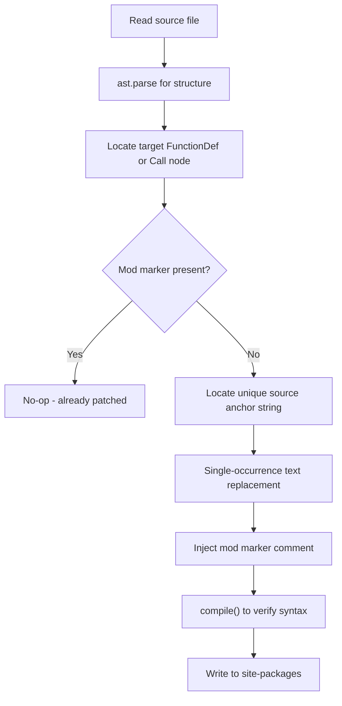

### 6.2 Key Algorithm Design

**Online softmax with split-K combine.** The numerical core prioritizes memory-bounded, numerically stable computation:

- **Online softmax** tracks the running row maximum and rescales the output accumulator as new KV blocks are processed, so the full attention matrix is never materialized.
- **Split-K combine** (`FlashAttentionForwardCombine`) merges partial outputs using a log-sum-exp weighted reduction, preserving FP32 partials so that splitting a sequence does not degrade precision.
- **Statistics-based backward recomputation** reconstructs softmax probabilities from per-row statistics rather than storing the full attention matrix, trading a small amount of compute for a large reduction in memory.

**Tile-size heuristics.** `FwdConfig`/`BwdConfig` dataclasses plus heuristic functions select tile sizes and split-KV parameters based on sequence length, head dimension, and device architecture.

### 6.3 Data Structure Design

| Data Structure | Purpose |
|---|---|
| `FwdConfig` / `BwdConfig` | Dataclasses holding forward/backward configuration (tile sizes, splits). |
| `SchedulingMode`, `WorkTileInfo`, `ClcState` | Persistent-kernel work distribution and cluster launch control state. |
| `PagedKVManager` | Page-table representation translating logical KV positions to physical block pointers. |
| Mod markers | String sentinels (`# spark-vllm mod: <name> v<n>`) embedded in mutated source for idempotency and audit. |
| Recipe schema | Structured YAML (v1) binding model, quantization, topology, and mods. |

### 6.4 Performance Optimization Strategies

1. **Zero-copy weight loading** reduces GPU memory overhead during model loading by replacing tensor copies with views.
2. **Paged-KV attention** enables memory-efficient inference with non-contiguous KV storage.
3. **Warp specialization + TMA double-buffering** on SM120 overlaps KV loads with computation.
4. **Architecture specialization cascade** reuses proven SM80 `mma.sync` code on SM120, minimizing new-hardware bring-up cost.
5. **Capability-gated dispatch** ensures only SM12 devices incur the vendored-kernel path, leaving other hardware on optimized upstream paths.

**Performance insight — the memory budget is shared.** Paged-KV attention kernels and zero-copy weight loading compete for the same GPU memory budget: KV-cache and weight residency must fit alongside kernel workspace. This shared constraint is captured as a Data Dependency relation (strength 5.0) between the kernel domain and the memory-optimization domain.

---

## 7. Deployment Architecture

### 7.1 Runtime Environment Requirements

| Requirement | Specification |
|---|---|
| **CUDA** | 13.0.2 |
| **PyTorch** | 2.13.0 |
| **CUTLASS CuTe-DSL** | Pinned 4.7.0 (exact-count enforced) |
| **TORCH_CUDA_ARCH_LIST** | `12.1a` |
| **Python** | 3.12 (site-packages at `/usr/local/lib/python3.12/dist-packages`) |
| **Target GPU** | SM90 (Hopper), SM100 (Blackwell DC), SM120 (Blackwell consumer / DGX Spark) |
| **Container runtime** | Docker + SSH for multi-node distribution |
| **Minimum for SM120 paged-KV** | SM12x capability, CUDA ≥ 12.8, required CuTe APIs |

### 7.2 Deployment Topology Structure

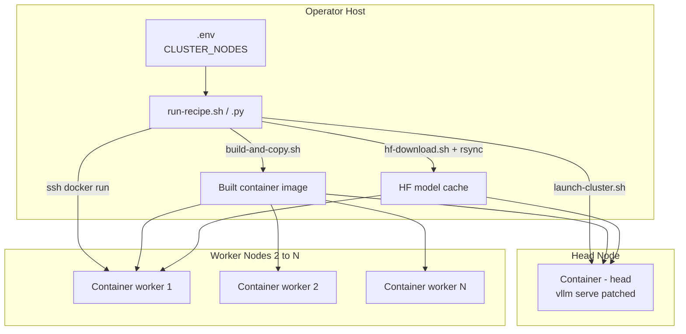

Supported topologies: **single-node**, **3x DGX Spark**, **4x DGX Spark**, and **8x DGX Spark** clusters.

### 7.3 Scalability Design

**Extension points and strategies:**

1. **Add a new model** → create a mod directory with a `run.sh`, AST patcher or diff patch, and Jinja template; reference it from a recipe. The mod abstraction is the primary extension surface.
2. **Add new hardware** → extend the kernel package via subclassing (as SM120 did over SM80), overriding only the divergent parameters (e.g. SMEM capacity).
3. **Scale the cluster** → author a new recipe binding model + quantization + topology; the launcher owns topology re-injection, so recipes remain declarative.
4. **Build-time customization** → add a `docker/patch_vllm_*.py` patch for issues that must be fixed before runtime.

**Scalability insight:** Because mods are self-contained and idempotent, the system scales horizontally across nodes and vertically across model families without coupling. The launcher's inversion of control keeps topology concerns out of per-model recipes.

### 7.4 Monitoring and Operations

**Provenance and reproducibility controls:**

- `pin_cutlass_dsl.py` enforces an exact CUTLASS DSL version count, ensuring kernel compilation reproducibility.
- `build-metadata.yaml` records image build provenance.
- Mod markers enable post-deployment auditing of exactly which mods touched the source tree.

**Operational guidance:**

- Help texts and usage are documented in `examples/README.md` and extensive docstrings in `run-recipe.py`.
- Preflight checks in `inkling-sm12-paged-kv/run.sh` verify hardware/software preconditions before installation.

**Operational risks to monitor:**

| Risk | Impact | Mitigation Direction |
|---|---|---|
| Runtime network fetches in several mods | Breaks reproducibility and offline deployment | Vendor PR diffs into the repo or a pinned artifact store |
| Three divergent patching techniques (AST, `git apply`, `sed`) | Increased maintenance surface and inconsistency | Unify on the AST patcher framework where feasible |
| Undocumented adapter seam | Hidden integration fragility | Document `adapter.py` as a first-class component |
| Mods mutating environment, not just source (`exp-b12x`) | Blurs the "patch" abstraction | Formalize a "Runtime/Environment Mods" category |
| No formal ADRs | Architectural intent lives only in code comments | Introduce ADRs for key decisions |

---

## Appendix A — Architectural Drift Register

The following drifts were identified between the documented domain model and the directly inspected implementation. They are recorded here because accurate architecture documentation must reflect the code, not the assumption.

| # | Documented Claim | Actual Implementation | Severity |
|---|---|---|---|
| **D1** | `run-recipe.py` invokes each mod's `run.sh` | Delegates to `launch-cluster.sh --apply-mod`; mods run **inside containers** | High |
| **D2** | Vendored bundle is the only kernel artifact | Undocumented `adapter.py` installed as `vllm/third_party/inkling_sm120_fa4_adapter.py` is the actual entry point | High |
| **D3** | `nemotron-nano/super` serve the model with patches | They only `wget` a reasoning-parser file | Medium |
| **D4** | `gpu-mem-util-gb` is a Diff Patch Mod | It is an inline AST/regex patcher | Medium |
| **D5** | `use-ngc-vllm` patches | It is a no-op (init moved to `launch-cluster.sh`) | Low |
| **D6** | `inkling-sm12-paged-kv` is a module import | It mutates `vllm/third_party/` and patches `fa4_rel_attention.py` | Low |

## Appendix B — Architectural Assessment

**Strengths**

1. **Non-invasive customization** — no vLLM fork; patches are reversible and marker-traceable.
2. **Defense in depth** — idempotency guards, postcondition validation, `compile()` checks, runtime preflight.
3. **Reproducibility controls** — CUTLASS DSL pinned with exact-count enforcement; build provenance recorded.
4. **Clear separation of concerns** — declarative recipes vs. imperative launchers vs. self-contained mods.

**Risks**

1. Runtime network fetches break reproducibility.
2. Three divergent patching techniques increase maintenance surface.
3. The undocumented adapter seam is a critical integration point.
4. Mods mutate both source and environment.
5. No formal ADRs.

**Recommendations**

1. Document `inkling_sm120_fa4_adapter.py` as a first-class kernel-domain component.
2. Correct the mod-application flow in all documentation (in-container, not host).
3. Vendor runtime PR diffs to eliminate live GitHub fetches.
4. Unify the patching taxonomy under the AST framework where feasible.
5. Add a "Runtime/Environment Mods" category and reclassify `gpu-mem-util-gb`.
6. Introduce ADRs for "patch-don't-fork," "launcher owns topology," "build-time vs. runtime split," and "vendored kernel + adapter."
7. Add a mod manifest/schema declaring each mod's technique, target files, network requirements, and idempotency marker.

---

*This document is grounded in direct source inspection cross-referenced against the provided domain, context, and workflow research. Overall confidence in the described architecture: high.*