# spark-vllm-docker — System Architecture Documentation

**Document type:** C4 Model Architecture Documentation (Context, Container, Component, and Code levels)
**Project:** `spark-vllm-docker`
**Repository root:** project root (`docker/`, `mods/`, `recipes/`, `examples/`, `scripts/`, plus root-level orchestration scripts and Dockerfiles)
**Sources:** System Context Research Report, Domain Modules Research Report, System Architecture Research Report, Workflow Research Report
**Overall confidence:** 8.0 / 10 — research claims cross-validated against the source tree; verified gaps are recorded in Section 8.

---

## 1. Architecture Overview

### 1.1 Architecture Design Philosophy

`spark-vllm-docker` is not an inference engine of its own. It is a **patch-and-orchestration layer** wrapped around the open-source **vLLM** serving engine, purpose-built for Spark clusters equipped with NVIDIA Blackwell GPUs (compute capability SM12.x, plus SM90/SM100 fallback coverage).

The architecture is governed by four design convictions:

1. **Patch, never fork.** All behavioural changes to vLLM are applied as *non-invasive, idempotent source rewrites* against the installed package. The upstream dependency is never vendored as a fork, never modified in version control, and never diverged in a way that blocks rebasing. Marker comments (`# spark-vllm mod: …`) make every edit traceable and double-application detectable.
2. **Fail fast, never guess.** Patching scripts resolve an exact anchor, require exactly one occurrence, validate the target source with `ast.parse`, compile the rewritten output, and *abort* on any unknown source shape. Corrupting a build or a serving container is treated as strictly worse than refusing to start.
3. **Declarative composition root.** The single user-facing artifact is a **YAML recipe**. Recipes bind a model, its quantization scheme, its required mods, environment variables, and a `vllm serve` command template into one reproducible unit. Everything else — image build, weight verification, kernel dispatch, cluster launch — is orchestrated *from* the recipe.
4. **Offline-first serving.** Spark clusters are frequently air-gapped or network-constrained. Weight staging, integrity verification, and Hugging Face hub-cache layout are first-class architectural concerns, not afterthoughts.

### 1.2 Core Architecture Patterns

| Pattern | Realization in this system |
|---|---|
| **Patch-and-extend an external dependency** | Idempotent AST/text rewrites of the installed `vllm`/`flashinfer`/`b12x` trees, applied at build time (`docker/patch_*.py`) and at run time (`mods/*/run.sh`). |
| **Composition root** | Recipe YAML + `run-recipe.py`, which sequences *Load Recipe → Resolve Nodes → Build → Download → Run*. |
| **Plugin / mod protocol** | Every directory under `mods/` implements an implicit contract: `run.sh` entry point, target discovery via `importlib.util.find_spec("vllm")`, marker-guarded idempotency, fail-fast policy, composition via `launch-cluster.sh --apply-mod`. |
| **Two-tier patch lifecycle** | Build-time patches are baked into the image layer; runtime mods are applied container-locally just before `vllm serve`. Both tiers target the *same* installed tree. |
| **Vendoring into third-party namespace** | The CuTe-DSL FlashAttention package is copied into `vllm/third_party/inkling_sm120_fa4` and wired in through an AST dispatch patch. |
| **Instrumentation-as-mod** | The memory profiler installs itself *into* vLLM as `vllm._spark_memory_profile`, observing engine startup from the inside. |
| **Declarative infrastructure** | Dockerfiles, recipe YAMLs, `build-metadata.yaml`, and profile cards express intent; scripts merely execute it. |
| **Fail-fast validation gates** | Weight verification (shard/index/size/quant-config) and build-time patch validation both abort on mismatch. |

### 1.3 Technology Stack Overview

| Layer | Technology |
|---|---|
| Serving engine | vLLM (upstream, unmodified in VCS; installed into dist-packages) |
| Attention/kernels | FlashInfer, B12X, vendored CuTe-DSL FlashAttention (`inkling_sm120_fa4`), CUTLASS DSL 4.7.0 |
| GPU platform | NVIDIA Blackwell SM120/SM121 (SM80/SM90/SM100 kernels retained as fallbacks), CUDA 12.8+ / CUDA 13.0.2 base image |
| Deep learning runtime | PyTorch 2.13, NCCL (sm_121 build) |
| Container | Docker multi-stage builds; `Dockerfile` (901 lines) and `Dockerfile.mxfp4` variant; `build-and-copy.sh` (1,505 lines) |
| Orchestration | Bash + Python: `run-recipe.sh` (42-line wrapper) → `run-recipe.py` (1,546 lines) → `launch-cluster.sh` (1,751 lines), `autodiscover.sh`, `hf-download.sh` |
| Configuration | YAML recipes (42 files across `recipes/`, `recipes/3x|4x|8x-spark-cluster/`), `.env`, shell environment |
| Chat templating | Jinja2 templates (e.g. `mods/fix-qwen3.5-chat-template/chat_template.jinja`) |
| Model weights | safetensors + `model.safetensors.index.json`, `hf_quant_config.json` (NVFP4), HF hub-cache layout |
| Observability | JSONL per-phase memory events, YAML profile cards, capacity reports, `build-metadata.yaml` |
| Serving interface | OpenAI-compatible HTTP endpoint on port 8000 (Ray or no-Ray distributed mode) |

---

## 2. System Context (C4 — Level 1)

### 2.1 System Positioning and Business Value

The system enables efficient deployment of large language models on Spark clusters with NVIDIA Blackwell GPUs by supplying hardware-specific kernel optimizations, memory capacity analysis, and targeted model-compatibility fixes for architectures such as Qwen3/Qwen3.5/Qwen3.6, Gemma4, DiffusionGemma, GLM-4.7, Nemotron, MiniMax, Step-3.7, Mimo, and RadixArk.

Its value proposition is the **compression of an otherwise manual, error-prone integration path**: without this layer, an operator would have to hand-patch vLLM for every emerging model, guess host memory sizing for multi-billion-parameter checkpoints, and reconstruct offline weight layouts per cluster.

### 2.2 User Roles and Scenarios

| Persona | Profile | Primary scenarios |
|---|---|---|
| **ML Infrastructure Engineer** | Owns LLM inference deployment and tuning on Spark/Blackwell | Apply hardware-specific optimizations; fix model compatibility issues; profile and estimate node memory capacity; verify weight integrity for offline serving; deploy vLLM with custom chat templates across 3x/4x/8x clusters. |
| **AI Model Developer** | Works on novel architectures and quantization schemes | Integrate custom quantization (e.g. NVFP4 for MoE routers); add patches for emerging variants (DiffusionGemma, Qwen3.5); leverage advanced attention kernels (MLA, split-K) on Blackwell. |

### 2.3 System Context Diagram

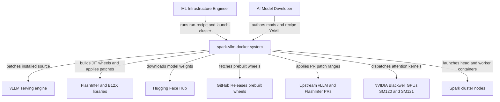
```mermaid
graph TD
    MLInfra["ML Infrastructure Engineer"]
    ModelDev["AI Model Developer"]
    SVD["spark-vllm-docker system"]
    VLLM["vLLM serving engine"]
    FI["FlashInfer and B12X libraries"]
    HF["Hugging Face Hub"]
    GH["GitHub Releases prebuilt wheels"]
    PRS["Upstream vLLM and FlashInfer PRs"]
    HW["NVIDIA Blackwell GPUs SM120 and SM121"]
    Spark["Spark cluster nodes"]

    MLInfra -->|"runs run-recipe and launch-cluster"| SVD
    ModelDev -->|"authors mods and recipe YAML"| SVD
    SVD -->|"patches installed source"| VLLM
    SVD -->|"builds JIT wheels and applies patches"| FI
    SVD -->|"downloads model weights"| HF
    SVD -->|"fetches prebuilt wheels"| GH
    SVD -->|"applies PR patch ranges"| PRS
    SVD -->|"dispatches attention kernels"| HW
    SVD -->|"launches head and worker containers"| Spark
```

**External system interaction summary**

| External system | Interaction type | Coupling |
|---|---|---|
| vLLM | Patches and extends installed source code (build-time + runtime) | **High** — anchor stability against upstream refactoring is the system's primary risk |
| FlashInfer / B12X | Provides kernel source and JIT compilation; receives source patches | High |
| NVIDIA Blackwell GPU (SM120) | Target hardware platform; dispatch decision (`capability.major == 12`) | Medium |
| Hugging Face Hub | Model weight source, mirrored to an offline hub-cache | Medium |
| GitHub Releases (`eugr/spark-vllm-docker`) | Prebuilt FlashInfer/vLLM wheels, tags `prebuilt-flashinfer-current` / `prebuilt-vllm-current`, arch `12.1a` | Medium (undocumented in the context report — see gap G7) |
| Upstream PRs | Patch ranges applied at build (`--vllm-prs`) or runtime (`--apply-vllm-pr`) | Medium (third patching channel — see gap G5) |

### 2.4 System Boundary Definition

**Included in scope**
- Docker image definitions and build-time patch library (`Dockerfile`, `Dockerfile.mxfp4`, `docker/`)
- 29 runtime mods under `mods/` (fix mods, feature mods, kernel mod, profiling mod, weight mod, flavor mods)
- 42 recipe YAMLs covering solo and 3x/4x/8x cluster deployments
- Vendored SM120 FlashAttention kernel package
- Memory profiling, profile-card generation, and capacity validation
- Weight verification and offline hub-cache construction
- Cluster launch scripts (container-level bootstrap and node distribution)
- Developer tooling (evaluation runner, DeepWiki documentation generator)

**Excluded from scope**
- Core vLLM development
- Model training pipelines
- Hardware design and device drivers
- Spark cluster fleet management and provisioning (only *container-level* orchestration is performed; `launch-cluster.sh` and `autodiscover.sh` are a thin node-bootstrap layer, consistent with this boundary)

---

## 3. Container View (C4 — Level 2)

### 3.1 Repository and Project Structure

The repository root is itself part of the architecture: it hosts the composition root that a directory-only view would omit.

```
spark-vllm-docker/
├── run-recipe.sh              # 42-line thin wrapper
├── run-recipe.py              # 1,546 lines — pipeline: Load → Nodes → Build → Download → Run
├── launch-cluster.sh          # 1,751 lines — --apply-mod / --apply-vllm-pr / --launch-script
├── build-and-copy.sh          # 1,505 lines — image build, wheel cache, host copy, build-metadata.yaml
├── autodiscover.sh            # network topology detection for head/worker resolution
├── hf-download.sh             # HF weight download helper
├── Dockerfile                 # 901 lines — multi-stage base image
├── Dockerfile.mxfp4           # MXFP4 image variant
├── fastsafetensors.patch       # located at root (documented under docker/ — drift G3)
├── fastsafetensors_mxfp4.patch
├── docker/                    # Container Build & Image Composition + build-time patch library
│   ├── patch_*.py             # 21 idempotent patch scripts
│   ├── build_flashinfer_jit_providers.sh
│   ├── validate_flashinfer_wheels.py
│   └── pin_cutlass_dsl.py
├── mods/                      # 29 runtime mods — the mod protocol surface
│   ├── fix-*/                 # 11 model-specific fix mods
│   ├── diffusiongemma/, instanttensor-*/, kv-cache-prealloc-cleanup/, ...
│   ├── inkling-sm12-paged-kv/ # kernel mod + vendor/inkling_sm120_fa4/
│   ├── memory-profile/        # probe, patch, collect, profile_card, capacity, report, host_probe
│   ├── fes-weights/           # run.sh + verify.py
│   ├── use-ngc-vllm/, use-official-vllm/
│   └── ...
├── recipes/                   # 42 YAML recipes
│   ├── 3x-spark-cluster/ (1)
│   ├── 4x-spark-cluster/ (4)
│   └── 8x-spark-cluster/ (1)
├── examples/                  # direct launch scripts feeding --launch-script
├── scripts/                   # fes-eval.sh, deepwiki/
├── docs/                      # empty
└── wheels/                    # empty — prebuilt wheels fetched remotely
```

### 3.2 Domain Module Division

| # | Container / Domain | Type | Responsibility | Code paths |
|---|---|---|---|---|
| A | **Recipe Runner & Cluster Orchestrator** | Core | Parse recipes, resolve nodes, sequence phases, apply mods, launch head/worker nodes | `run-recipe.sh/.py`, `launch-cluster.sh`, `build-and-copy.sh`, `autodiscover.sh`, `hf-download.sh`, `recipes/`, `examples/` |
| B | **Engine Patch & Model Compatibility Library** | Core | Restore/enable model families, quantizations, chat templates, runtime behaviours via idempotent rewrites | `mods/fix-*` (11), feature `mods/*`, `docker/patch_*.py` (21) |
| C | **Vendored Attention Kernel Package** | Core | CuTe-DSL forward/backward/MLA/split-K/paged-KV kernels for SM90/SM100/SM120 + dispatch integration | `mods/inkling-sm12-paged-kv/`, `vendor/inkling_sm120_fa4/` |
| D | **Memory Profiling & Capacity** | Supporting | Instrument worker startup, consolidate profile cards, validate host-memory fit | `mods/memory-profile/` |
| E | **Model Weights & Offline Serving** | Supporting | Verify shards/index/size/quant-config; build offline HF hub-cache | `mods/fes-weights/`, `hf-download.sh` |
| F | **Container Build & Image Composition** | Infrastructure | Multi-stage image build, JIT wheel toolchain, wheel validation, image variants | `Dockerfile`, `Dockerfile.mxfp4`, `build-and-copy.sh`, `docker/` |
| G | **Developer Tooling** | Tool support | Evaluation runner, automated repository documentation | `scripts/fes-eval.sh`, `scripts/deepwiki/` |

### 3.3 Container Diagram

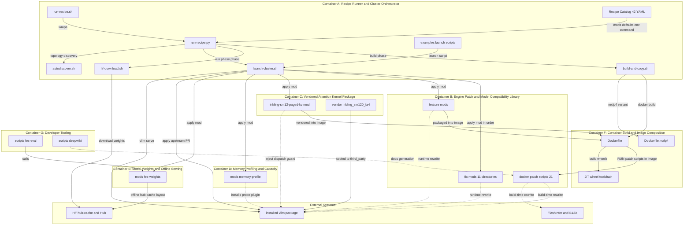
```mermaid
graph TD
    subgraph ORCH["Container A: Recipe Runner and Cluster Orchestrator"]
        RRSH["run-recipe.sh"]
        RRPY["run-recipe.py"]
        LC["launch-cluster.sh"]
        BC["build-and-copy.sh"]
        AD["autodiscover.sh"]
        HFD["hf-download.sh"]
        REC["Recipe Catalog 42 YAML"]
        EX["examples launch scripts"]
    end

    subgraph PATCH["Container B: Engine Patch and Model Compatibility Library"]
        FIX["fix mods 11 directories"]
        FEAT["feature mods"]
        DOCP["docker patch scripts 21"]
    end

    subgraph KERNEL["Container C: Vendored Attention Kernel Package"]
        INK["inkling-sm12-paged-kv mod"]
        VEND["vendor inkling_sm120_fa4"]
    end

    subgraph MEM["Container D: Memory Profiling and Capacity"]
        MP["mods memory-profile"]
    end

    subgraph WT["Container E: Model Weights and Offline Serving"]
        FW["mods fes-weights"]
    end

    subgraph CONT["Container F: Container Build and Image Composition"]
        DF["Dockerfile"]
        DFM["Dockerfile.mxfp4"]
        JIT["JIT wheel toolchain"]
    end

    subgraph TOOL["Container G: Developer Tooling"]
        FE["scripts fes-eval"]
        DW["scripts deepwiki"]
    end

    subgraph EXT["External Systems"]
        VLLM["installed vllm package"]
        FI["FlashInfer and B12X"]
        HF["HF hub-cache and Hub"]
    end

    RRSH -->|"wraps"| RRPY
    REC -->|"mods defaults env command"| RRPY
    RRPY -->|"build phase"| BC
    RRPY -->|"download phase"| HFD
    RRPY -->|"run phase"| LC
    RRPY -->|"topology discovery"| AD
    EX -->|"launch script"| LC

    LC -->|"apply mod in order"| FIX
    LC -->|"apply mod"| FEAT
    LC -->|"apply mod"| INK
    LC -->|"apply mod"| MP
    LC -->|"apply mod"| FW
    LC -->|"apply upstream PR"| VLLM
    LC -->|"vllm serve"| VLLM

    BC -->|"docker build"| DF
    BC -->|"mxfp4 variant"| DFM
    DF -->|"RUN patch scripts in image"| DOCP
    DF -->|"build wheels"| JIT
    INK -->|"vendored into image"| DF
    VEND -->|"copied to third_party"| VLLM
    FEAT -->|"packaged into image"| DF

    DOCP -.->|"build-time rewrite"| VLLM
    DOCP -.->|"build-time rewrite"| FI
    FIX -.->|"runtime rewrite"| VLLM
    FEAT -.->|"runtime rewrite"| VLLM
    INK -.->|"inject dispatch guard"| VLLM
    MP -.->|"installs probe plugin"| VLLM
    FW -->|"offline hub-cache layout"| HF
    HFD -->|"download weights"| HF
    FE -->|"calls"| FW
    DW -.->|"docs generation"| DOCP
```

### 3.4 Storage Design

There is no database. All state is **file-based, locally persisted, and reproducible from artifacts on disk**:

| Store | Location | Content | Producer → Consumer |
|---|---|---|---|
| Recipe catalog | `recipes/**/*.yaml` | Model, quantization, mods, defaults, env, command template, build args, cluster/solo flags | Author → `run-recipe.py` |
| Mod implementations | `mods/<name>/` | `run.sh`, `patch_*.py`, `.patch`/`.diff`, Jinja templates, vendored kernels | Author → `launch-cluster.sh --apply-mod` |
| Build-time patch library | `docker/patch_*.py` | 21 idempotent rewriters executed inside the image build | Dockerfile → installed package |
| Container images | Docker daemon / worker hosts | Base or MXFP4 variant with patches and vendored kernels baked in | `build-and-copy.sh` → `launch-cluster.sh` |
| Wheel cache / releases | `wheels/` (empty) + GitHub Releases | FlashInfer JIT provider wheels, prebuilt vLLM wheels, arch `12.1a` | `build_flashinfer_jit_providers.sh` → image build |
| Build metadata | `build-metadata.yaml` | Reproducibility record for a given image build | `build-and-copy.sh` → operators |
| Model weights | `FES_WEIGHTS_DIR` mount | safetensors shards, index, `hf_quant_config.json` | Staging → `mods/fes-weights` → vLLM |
| Offline hub-cache | HF cache layout under mount | Resolvable local model tree for air-gapped serving | `mods/fes-weights/run.sh` → vLLM runtime |
| Memory events | per-run directories, JSONL | Per-rank, per-phase heap/CUDA/model/KV samples | `probe.py` → `collect.py` |
| Profile cards | model/recipe-keyed YAML | Merged phase peaks, startup RAM estimate, KV budget | `profile_card.py` → `capacity.py` → `launch-cluster.sh` |
| Capacity report | generated report file | Human-readable topology validation metrics | `report.py` + `host_probe.py` → operator |

**Data relationships**

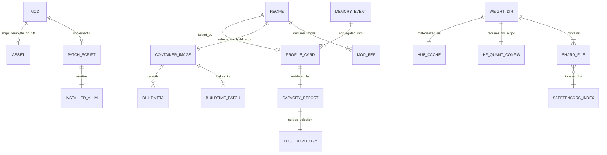
```mermaid
erDiagram
    RECIPE ||--|{ MOD_REF : declares_mods
    RECIPE ||--|| CONTAINER_IMAGE : selects_via_build_args
    RECIPE ||--o| PROFILE_CARD : keyed_by
    MOD ||--o| PATCH_SCRIPT : implements
    MOD ||--o| ASSET : ships_template_or_diff
    PATCH_SCRIPT ||--|| INSTALLED_VLLM : rewrites
    CONTAINER_IMAGE ||--|{ BUILDTIME_PATCH : bakes_in
    CONTAINER_IMAGE ||--o{ BUILDMETA : records
    WEIGHT_DIR ||--|{ SHARD_FILE : contains
    SHARD_FILE }o--|| SAFETENSORS_INDEX : indexed_by
    WEIGHT_DIR ||--|| HF_QUANT_CONFIG : requires_for_nvfp4
    WEIGHT_DIR ||--|| HUB_CACHE : materialized_as
    MEMORY_EVENT ||--|{ PROFILE_CARD : aggregated_into
    PROFILE_CARD ||--|| CAPACITY_REPORT : validated_by
    CAPACITY_REPORT ||--|| HOST_TOPOLOGY : guides_selection
```

### 3.5 Inter-Container Communication

Communication is almost entirely **process invocation and file exchange** — there are no networked internal services.

| Mechanism | From → To | Description |
|---|---|---|
| Phase delegation | Recipe runner → Build / Download / Launch | `run-recipe.py` shells out to `build-and-copy.sh`, `hf-download.sh`, `launch-cluster.sh`; supports phase-only flags (`--build-only`, etc.). |
| Ordered mod invocation | Launcher → any mod | `launch-cluster.sh --apply-mod <dir>` (repeatable, order-preserving); the `mods: []` list in the recipe is the source of ordering. |
| Target discovery contract | Mod → installed package | `importlib.util.find_spec("vllm")`, overridable via `VLLM_PACKAGE_ROOT` / `VLLM_SITE_PACKAGES`. |
| Configuration dependency | Recipe → Mod | Recipe declares mods, environment, and command template; mods are otherwise ignorant of the recipe. |
| Data dependency | Weights mod → vLLM | Verified hub-cache layout consumed at serve time. |
| Instrumentation dependency | Profiling mod → vLLM | Plugin installed as `vllm._spark_memory_profile` with manifest `vllm/_spark_memory_profile.json`. |
| Feedback loop | Capacity report → Launcher | Profile cards guide topology-appropriate host selection on the next launch. |
| Topology discovery | Launcher → `autodiscover.sh` / `.env` | Head/worker node resolution for cluster recipes. |

---

## 4. Component View (C4 — Level 3)

### 4.1 Core Functional Components

#### 4.1.1 Recipe Runner & Cluster Orchestrator

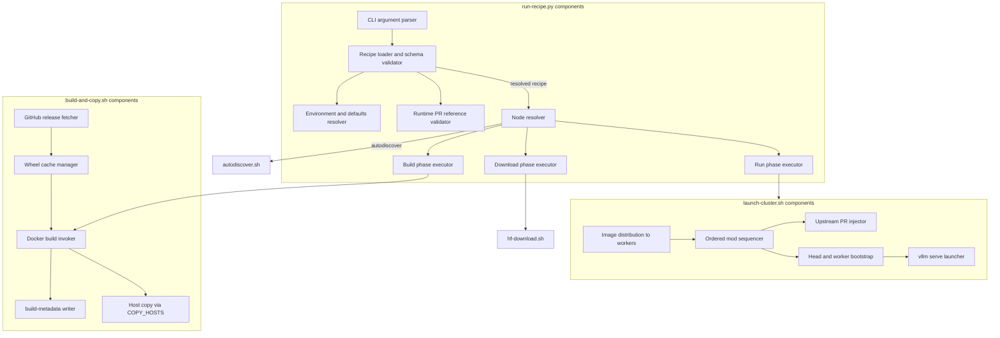
```mermaid
graph TD
    subgraph RR["run-recipe.py components"]
        CLI["CLI argument parser"]
        LOADER["Recipe loader and schema validator"]
        NODES["Node resolver"]
        BPH["Build phase executor"]
        DPH["Download phase executor"]
        RPH["Run phase executor"]
        ENV["Environment and defaults resolver"]
        PRREF["Runtime PR reference validator"]
    end

    subgraph LC["launch-cluster.sh components"]
        IMGD["Image distribution to workers"]
        MODSEQ["Ordered mod sequencer"]
        PRTX["Upstream PR injector"]
        NODEB["Head and worker bootstrap"]
        SERVE["vllm serve launcher"]
    end

    subgraph BC["build-and-copy.sh components"]
        WHEELC["Wheel cache manager"]
        REPOF["GitHub release fetcher"]
        DCKB["Docker build invoker"]
        META["build-metadata writer"]
        HOSTCP["Host copy via COPY_HOSTS"]
    end

    CLI --> LOADER
    LOADER --> ENV
    LOADER --> PRREF
    LOADER -->|"resolved recipe"| NODES
    NODES -->|"autodiscover"| AD2["autodiscover.sh"]
    NODES --> BPH
    NODES --> DPH
    NODES --> RPH
    BPH --> DCKB
    DPH --> HFD2["hf-download.sh"]
    RPH --> LC
    REPOF --> WHEELC
    WHEELC --> DCKB
    DCKB --> META
    DCKB --> HOSTCP
    MODSEQ --> PRTX
    IMGD --> MODSEQ
    MODSEQ --> NODEB
    NODEB --> SERVE
```

**Responsibility split**
- `run-recipe.py` — *decision and sequencing*: schema validation, defaults/environment resolution, node resolution, phase gating, PR reference validation (`runtime_vllm_pr_reference()`).
- `launch-cluster.sh` — *execution inside and across containers*: image distribution, ordered mod application, optional upstream-PR grafting, head/worker bootstrap, `vllm serve` invocation.
- `build-and-copy.sh` — *artifact production*: Docker build, wheel caching, prebuilt-wheel retrieval from `eugr/spark-vllm-docker` releases, metadata emission, host distribution.

#### 4.1.2 Engine Patch & Model Compatibility Library

Three complementary patch families:

| Family | Location | Timing | Examples |
|---|---|---|---|
| **vLLM Core Patch Set** | `docker/patch_*.py` (21 scripts) | Build time (inside `Dockerfile`) | SwiGLU-OAI plumbing, B12X cache integrity, Spark KV-cache cleanup, startup heap trim, SM120 cooperative top-k, SWA block size, routed-experts weight shape, MoE tuning memory, Gemma4 MTP embedding share, MRv2 speculator cudagraph pool, WSL CUDA UMA, AutoGPTQ symmetric MoE qzeros, CUTLASS DSL pinning |
| **Model-Specific Fix Mods** | `mods/fix-*` (11) | Runtime (pre-serve) | Qwen3-next AutoRound AST rewrite, Qwen3.5/Qwen3.6 chat templates, GLM-4.7-flash AWQ, Qwen3-coder-next, Qwen3.5 TP4 Marlin, Salyut1 GLM-4.7 NVFP4, Eagle fine-prefix, Gemma4 tool parser |
| **Feature Enablement Mods** | `mods/<feature>` | Runtime (pre-serve) | DiffusionGemma/Gemma4 support, zero-copy weights, hybrid draft loader, KV-cache prealloc cleanup, GPU mem util GB, drop-caches, experimental W4A16/B12X, Mimo DiffKV FP8 |

#### 4.1.3 Vendored Attention Kernel Package

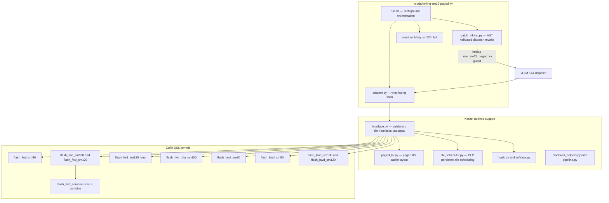
```mermaid
graph TD
    subgraph INKM["mods/inkling-sm12-paged-kv"]
        RUNS["run.sh — preflight and orchestration"]
        PATCHI["patch_inkling.py — AST validated dispatch rewrite"]
        ADAPTER["adapter.py — vllm-facing shim"]
        VPKG["vendor/inkling_sm120_fa4"]
    end

    subgraph RT["Kernel runtime support"]
        IFACE["interface.py — validation, tile heuristics, autograd"]
        PKV["paged_kv.py — paged KV cache layout"]
        TILE["tile_scheduler.py — CLC persistent tile scheduling"]
        MASK["mask.py and softmax.py"]
        HELP["blackwell_helpers.py and pipeline.py"]
    end

    subgraph KERN["CuTe-DSL kernels"]
        F90["flash_fwd_sm90"]
        F100["flash_fwd_sm100 and flash_fwd_sm120"]
        FTMA["flash_fwd_sm120_tma"]
        FMLA["flash_fwd_mla_sm100"]
        FCMB["flash_fwd_combine split-K combine"]
        B80["flash_bwd_sm80"]
        B90["flash_bwd_sm90"]
        B100["flash_bwd_sm100 and flash_bwd_sm120"]
    end

    RUNS --> PATCHI
    RUNS --> ADAPTER
    RUNS --> VPKG
    PATCHI -->|"injects _use_sm12_paged_kv guard"| DISP["vLLM FA4 dispatch"]
    DISP --> ADAPTER
    ADAPTER --> IFACE
    IFACE --> PKV
    IFACE --> TILE
    IFACE --> MASK
    IFACE --> F90
    IFACE --> F100
    IFACE --> FTMA
    IFACE --> FMLA
    F100 --> FCMB
    IFACE --> B80
    IFACE --> B90
    IFACE --> B100
```

### 4.2 Technical Support Components

#### 4.2.1 Memory Profiling & Capacity

| Component | File | Responsibility |
|---|---|---|
| Startup Memory Probe | `probe.py` | Runs as `vllm._spark_memory_profile`; records per-phase native heap, CUDA memory, and model/KV inventory during worker startup; also usable as a standalone sampler. |
| Probe Installer | `patch.py` + `run.sh` | Installs the plugin into the vLLM package and emits manifest `vllm/_spark_memory_profile.json`. |
| Profile Collection | `collect.py` | Per-rank JSONL summarization from run directories. |
| Card Generation | `profile_card.py` | Merges events into a consolidated model/recipe-keyed YAML profile card; computes phase peaks. |
| Capacity Analysis | `capacity.py` | Estimates startup RAM, budgets KV cache, validates against available host memory per topology. |
| Reporting | `report.py`, `host_probe.py` | Probes host hardware; emits human-readable capacity report and utilization metrics. |

#### 4.2.2 Model Weights & Offline Serving

- **Weight Verification** (`mods/fes-weights/verify.py`): shard/index consistency, size parity with 1.02 tolerance, mandatory `hf_quant_config.json` for NVFP4 checkpoints; fail-fast on mismatch.
- **Offline Hub Cache Setup** (`mods/fes-weights/run.sh`): `FES_WEIGHTS_DIR` defaulting and HF hub-cache layout construction so vLLM resolves models locally.
- **Download Helper** (`hf-download.sh`): online acquisition path for networked environments.

#### 4.2.3 Container Build & Image Composition

- **Image Definitions**: `Dockerfile` (multi-stage: `base` → `flashinfer-builder` → `vLLM build` → `runner`), `Dockerfile.mxfp4`.
- **Build-Time Patch & JIT Toolchain**: `build_flashinfer_jit_providers.sh` (arch `12.1a`), `validate_flashinfer_wheels.py`, `pin_cutlass_dsl.py`, root-level `fastsafetensors*.patch`.

#### 4.2.4 Developer Tooling

- `scripts/fes-eval.sh` — invokes the FES weight evaluation entrypoint (function call into the weights domain).
- `scripts/deepwiki/generate-deepwiki.sh` + `shadow-tree.py` — walks the source tree to generate a shadow documentation tree (documentation dependency on the patch/mod sources).

### 4.3 Component Interaction Relationships (Domain Relations)

| From | Relation | To | Strength |
|---|---|---|---|
| Recipe Orchestrator | Configuration dependency | Engine Patching | 9.0 |
| Recipe Orchestrator | Data dependency | Model Weights | 7.0 |
| Engine Patching | Build-time composition | Container Build | 8.0 |
| Attention Kernel | Module composition | Engine Patching | 8.5 |
| Attention Kernel | Build-time composition | Container Build | 7.0 |
| Memory Profiling | Instrumentation dependency | Engine Patching | 7.5 |
| Memory Profiling | Data dependency | Recipe Orchestrator | 7.0 |
| Container Build | Tool support | Engine Patching | 8.0 |
| Recipe Orchestrator | Configuration dependency | Attention Kernel | 6.0 |
| Model Weights | Runtime input | Recipe Orchestrator | 6.0 |
| Developer Tooling | Function call | Model Weights | 4.0 |
| Developer Tooling | Documentation dependency | Engine Patching | 3.0 |

---

## 5. Key Processes

### 5.1 Core Process — Recipe-Driven Cluster Model Deployment (importance 9.5)

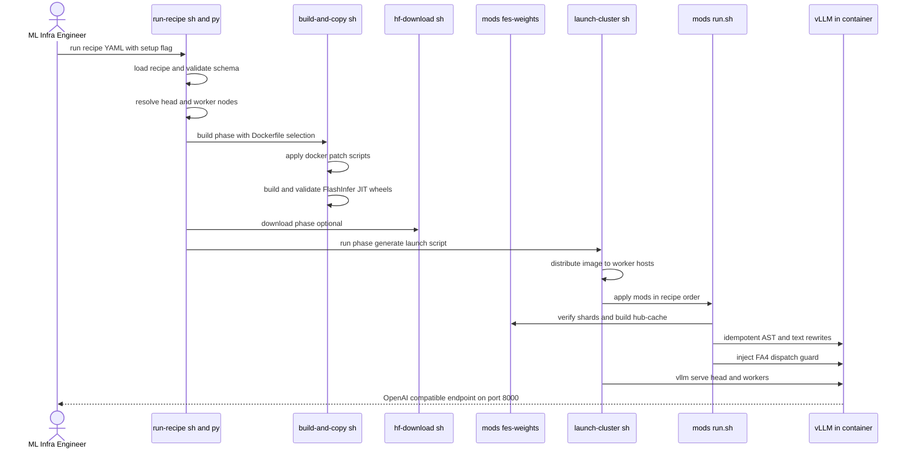
```mermaid
sequenceDiagram
    actor User as ML Infra Engineer
    participant RR as run-recipe sh and py
    participant BC as build-and-copy sh
    participant HD as hf-download sh
    participant FW as mods fes-weights
    participant LC as launch-cluster sh
    participant MODS as mods run.sh
    participant VL as vLLM in container

    User->>RR: run recipe YAML with setup flag
    RR->>RR: load recipe and validate schema
    RR->>RR: resolve head and worker nodes
    RR->>BC: build phase with Dockerfile selection
    BC->>BC: apply docker patch scripts
    BC->>BC: build and validate FlashInfer JIT wheels
    RR->>HD: download phase optional
    RR->>LC: run phase generate launch script
    LC->>LC: distribute image to worker hosts
    LC->>MODS: apply mods in recipe order
    MODS->>FW: verify shards and build hub-cache
    MODS->>VL: idempotent AST and text rewrites
    MODS->>VL: inject FA4 dispatch guard
    LC->>VL: vllm serve head and workers
    VL-->>User: OpenAI compatible endpoint on port 8000
```

**Sequence of validated steps**

1. **Recipe selection and parsing** (`run-recipe.sh` → `run-recipe.py`) — reads `recipes/3x|4x|8x-spark-cluster/<model>.yaml`; resolves `mods`, parallelism layout, quantization scheme, `defaults`, `env`, `build_args`, `cluster_only`/`solo_only`.
2. **Offline hub-cache setup** (`mods/fes-weights/run.sh`) — verifies mounted weight directories, constructs the HF hub-cache layout.
3. **Weight verification** (`mods/fes-weights/verify.py`) — safetensors index consistency, size parity (1.02 tolerance), `hf_quant_config.json` enforcement; **fails fast on mismatch**.
4. **Model-specific fix mods** (e.g. `mods/fix-qwen3-next-autoround/patch_qwen3_next.py`) — AST rewrites for MoE router quantization, corrected chat templates, architecture fixes.
5. **Feature enablement mods** (e.g. `mods/diffusiongemma/run.sh`) — feature patches with legacy/main fallbacks, zero-copy weights, KV-cache cleanup; optionally launches the server with a custom Jinja template.
6. **Cluster launch** (`launch-cluster.sh`) — starts head and worker nodes with the patched container image.
7. **Attention kernel dispatch** (`mods/inkling-sm12-paged-kv/patch_inkling.py`) — injects a cached `_use_sm12_paged_kv` capability check (`capability.major == 12`) into vLLM's NVIDIA FA4 dispatch.

### 5.2 Technical Process — Custom Container Image Build (importance 8.5)

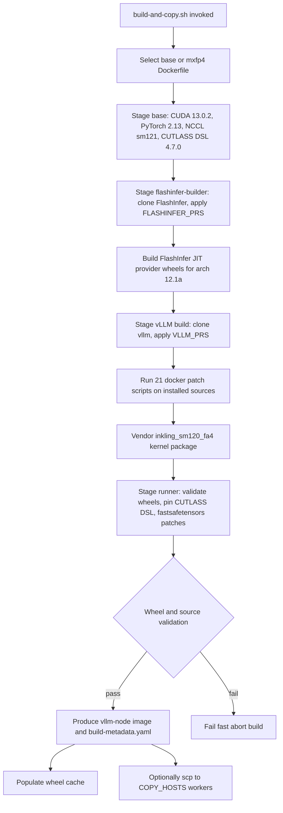
```mermaid
graph TD
    START["build-and-copy.sh invoked"] --> VAR["Select base or mxfp4 Dockerfile"]
    VAR --> S1["Stage base: CUDA 13.0.2, PyTorch 2.13, NCCL sm121, CUTLASS DSL 4.7.0"]
    S1 --> S2["Stage flashinfer-builder: clone FlashInfer, apply FLASHINFER_PRS"]
    S2 --> JIT["Build FlashInfer JIT provider wheels for arch 12.1a"]
    JIT --> S3["Stage vLLM build: clone vllm, apply VLLM_PRS"]
    S3 --> PT["Run 21 docker patch scripts on installed sources"]
    PT --> VND["Vendor inkling_sm120_fa4 kernel package"]
    VND --> S4["Stage runner: validate wheels, pin CUTLASS DSL, fastsafetensors patches"]
    S4 --> VAL{"Wheel and source validation"}
    VAL -->|"pass"| IMG["Produce vllm-node image and build-metadata.yaml"]
    VAL -->|"fail"| ABORT["Fail fast abort build"]
    IMG --> CACHE["Populate wheel cache"]
    IMG --> DIST["Optionally scp to COPY_HOSTS workers"]
```

Key guarantees: patch scripts fail on unknown source shapes (never best-effort rewrite), wheels are validated before the final layer is committed, and `build-metadata.yaml` records the build for reproducibility.

### 5.3 Technical Process — Attention Kernel Dispatch on Blackwell (importance 9.0)

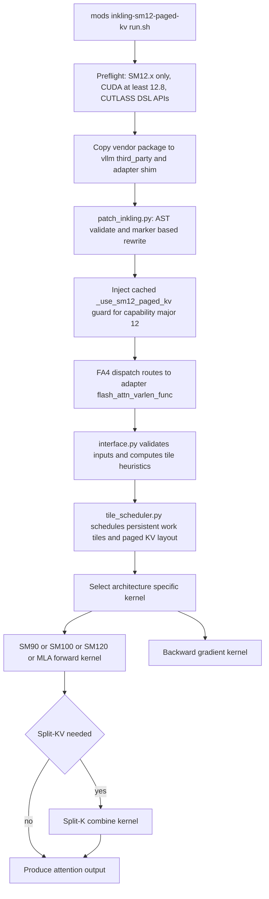
```mermaid
graph TD
    A["mods inkling-sm12-paged-kv run.sh"] --> B["Preflight: SM12.x only, CUDA at least 12.8, CUTLASS DSL APIs"]
    B --> C["Copy vendor package to vllm third_party and adapter shim"]
    C --> D["patch_inkling.py: AST validate and marker based rewrite"]
    D --> E["Inject cached _use_sm12_paged_kv guard for capability major 12"]
    E --> F["FA4 dispatch routes to adapter flash_attn_varlen_func"]
    F --> G["interface.py validates inputs and computes tile heuristics"]
    G --> H["tile_scheduler.py schedules persistent work tiles and paged KV layout"]
    H --> I["Select architecture specific kernel"]
    I --> J["SM90 or SM100 or SM120 or MLA forward kernel"]
    I --> K["Backward gradient kernel"]
    J --> L{"Split-KV needed"}
    L -->|"yes"| M["Split-K combine kernel"]
    L -->|"no"| N["Produce attention output"]
    M --> N
```

### 5.4 Technical Process — Memory Profiling & Capacity Validation (importance 8.5)

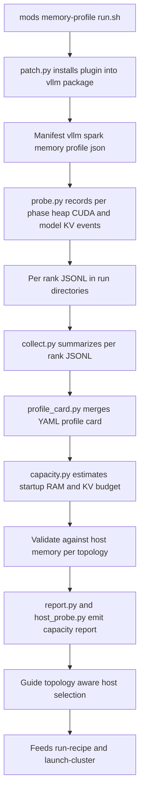
```mermaid
graph TD
    P["mods memory-profile run.sh"] --> PT["patch.py installs plugin into vllm package"]
    PT --> MAN["Manifest vllm spark memory profile json"]
    MAN --> PR["probe.py records per phase heap CUDA and model KV events"]
    PR --> JL["Per rank JSONL in run directories"]
    JL --> C["collect.py summarizes per rank JSONL"]
    C --> PC["profile_card.py merges YAML profile card"]
    PC --> CAP["capacity.py estimates startup RAM and KV budget"]
    CAP --> VAL["Validate against host memory per topology"]
    VAL --> RPT["report.py and host_probe.py emit capacity report"]
    RPT --> HS["Guide topology aware host selection"]
    HS --> RUN["Feeds run-recipe and launch-cluster"]
```

### 5.5 Business Process — Model Support Enablement (importance 8.0)

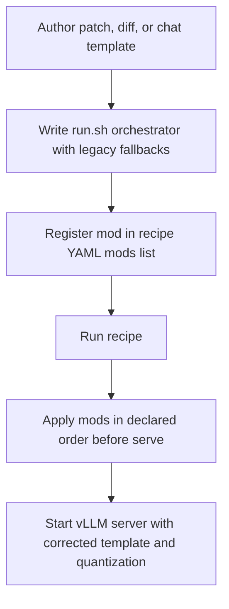
```mermaid
graph TD
    A["Author patch, diff, or chat template"] --> B["Write run.sh orchestrator with legacy fallbacks"]
    B --> C["Register mod in recipe YAML mods list"]
    C --> D["Run recipe"]
    D --> E["Apply mods in declared order before serve"]
    E --> F["Start vLLM server with corrected template and quantization"]
```

### 5.6 Data Flow Paths

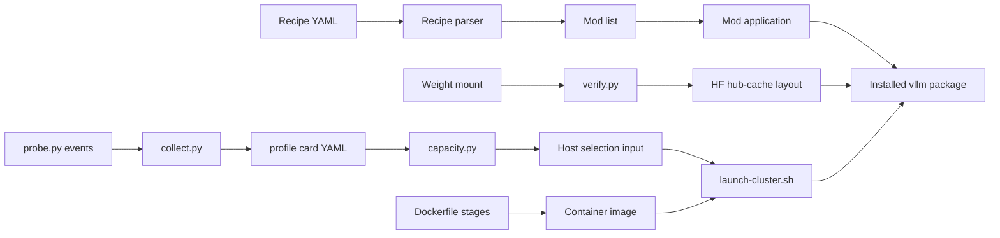
```mermaid
graph LR
    YML["Recipe YAML"] --> PARSE["Recipe parser"]
    PARSE --> MODL["Mod list"]
    MODL --> APPL["Mod application"]
    APPL --> VL["Installed vllm package"]
    WT["Weight mount"] --> VER["verify.py"]
    VER --> HC["HF hub-cache layout"]
    HC --> VL
    PROBE["probe.py events"] --> COL["collect.py"]
    COL --> CARD["profile card YAML"]
    CARD --> CAP["capacity.py"]
    CAP --> HOST["Host selection input"]
    HOST --> LAUNCH["launch-cluster.sh"]
    BUILD["Dockerfile stages"] --> IMG["Container image"]
    IMG --> LAUNCH
    LAUNCH --> VL
```

### 5.7 Exception Handling Mechanisms

| Failure class | Detection | Handling |
|---|---|---|
| **Unknown upstream source shape** | Exact-anchor `replace_once` finds ≠ 1 occurrence, or `ast.parse` fails | Hard abort with reason; never best-effort rewrite |
| **Double application** | Marker comment `# spark-vllm mod: …` already present | Skip (idempotent no-op) |
| **Corrupted rewrite output** | Compile check before write | Abort; original file left untouched |
| **Weight integrity failure** | Shard/index mismatch, size parity beyond 1.02 tolerance, missing `hf_quant_config.json` | Fail fast; recipe execution halts before launch |
| **Wheel validation failure** | `validate_flashinfer_wheels.py` | Build aborts; no final image layer committed |
| **Kernel preflight failure** | Non-SM12.x device, CUDA < 12.8, missing CUTLASS DSL API | Mod exits before any dispatch patch is written |
| **Host memory shortfall** | `capacity.py` topology validation | Deployment blocked; alternative host topology selected |
| **Rollback** | *Not formally implemented* | Idempotent patching mitigates blast radius, but no formal revert path exists (documented gap) |

---

## 6. Technical Implementation

### 6.1 Code View — The Mod Protocol (system-wide contract)

Every mod under `mods/<name>/` implements the same implicit interface, verified across `fix-qwen3-next-autoround`, `inkling-sm12-paged-kv`, `memory-profile`, `fes-weights`, and `fix-qwen3.5-chat-template`:

| Contract element | Implementation |
|---|---|
| Entry point | `run.sh` (bash with `set -euo pipefail`) |
| Target discovery | `importlib.util.find_spec("vllm")`; overridable via `VLLM_PACKAGE_ROOT` / `VLLM_SITE_PACKAGES` |
| Patch mechanism | Python rewriter (`patch_*.py`) with exact-anchor `replace_once`, `ast.parse` validation, compile-before-write |
| Idempotency | Marker comments (`# spark-vllm mod: <name> v<N>`) and "already patched → skip" checks |
| Failure policy | **Fail fast on unknown source shapes** |
| Composition | `launch-cluster.sh --apply-mod <dir>` (repeatable, order-preserving); declared in the recipe's `mods: []` |
| Assets | `.patch`/`.diff` files, Jinja chat templates, vendored kernel packages |

**Exemplar — `patch_inkling.py`:** validates target shape via `ast.parse`, refuses any source where the anchor does not appear exactly once, is idempotent via marker `# spark-vllm mod: inkling-sm12-paged-kv v1`, and compiles the patched output before writing. This is the reference implementation of the protocol's safety guarantees.

### 6.2 Two-Tier Patch Lifecycle (and the third channel)

```
BUILD TIME                                      RUNTIME
docker/patch_*.py  --->  image layer  --->      mods/*/run.sh  --->  container-local edits
(21 scripts run by Dockerfile)                  (invoked by launch-cluster.sh --apply-mod)

THIRD CHANNEL (undocumented in research):
launch-cluster.sh --apply-vllm-pr <PR#|URL>  --->  fetch PR, diff against origin/main,
                                                   apply to installed package with
                                                   SHA256-slugged label
```

Both of the first two tiers mutate the **same installed vLLM tree**, with no cross-tier dependency declaration. `run-recipe.py` mirrors the third channel through `runtime_vllm_pr_reference()` validation. Build-time builds emit `build-metadata.yaml`; runtime has **no equivalent record** of applied PRs.

### 6.3 Key Algorithm Design

**1. Anchor-based source rewriting with AST verification**
```
resolve target file (find_spec)
  → check marker present? skip (idempotent)
  → locate anchor text (must occur exactly once)
  → ast.parse(original)  → ast.parse(candidate)
  → compile(candidate)
  → atomic write
  → on any failure: abort with diagnostic
```

**2. Capability-gated kernel dispatch**
A cached predicate `_use_sm12_paged_kv()` inspects `torch.cuda.get_device_capability()`; when `capability.major == 12`, vLLM's FA4 dispatch routes to `inkling_sm120_fa4_adapter.flash_attn_varlen_func` instead of the stock kernel.

**3. Tile scheduling and split-K heuristics (`interface.py`, `tile_scheduler.py`)**
- Parses `FwdConfig`/`BwdConfig`, validates head dimensions, resolves causal/local-window parameters.
- Computes tile sizes and split-KV decisions; schedules persistent work tiles using CLC-based scheduling modes.
- When work is split across KV chunks, a combine kernel (`FlashAttentionForwardReduce`) merges partial results.
- Kernels are exposed through PyTorch autograd Functions: `FlashAttnFunc`, `FlashAttnVarlenFunc`.

**4. Weight verification (`verify.py`)**
- Cross-checks every shard referenced by `model.safetensors.index.json` exists and is non-empty.
- Compares summed shard sizes against index-declared total within a 1.02 tolerance.
- Enforces presence and parseability of `hf_quant_config.json` for NVFP4 checkpoints.
- Any violation aborts the recipe before launch.

**5. Capacity estimation (`capacity.py`)**
- Sums per-phase peak host memory from the profile card (startup RAM) and adds a KV-cache budget derived from model/parallelism configuration.
- Validates the total against probed available host memory for each candidate topology.
- Emits utilization metrics consumed by host selection in `launch-cluster.sh`.

### 6.4 Data Structure Design

**Recipe YAML schema (validated fields)**

```yaml
name: qwen3.5-397b-int4-autoround
recipe_version: <int>
container: <image flavour selector>
command: <vllm serve command template>
mods:
  - fix-qwen3.5-chat-template
  - fix-qwen3-next-autoround
  - fes-weights
  - inkling-sm12-paged-kv
defaults:
  <parallelism and serving defaults>
env:
  <environment variables>
build_args:
  <arguments forwarded to build-and-copy.sh / Dockerfile selection>
cluster_only: true        # or solo_only: true
```

**Profile card (YAML)** — keyed by model/recipe; contains per-phase peak host memory, CUDA memory, model/KV inventory, and derived startup-RAM and KV-budget figures.

**Memory event (JSONL, one line per sample)** — rank, phase identifier, native heap bytes, CUDA bytes, model/KV inventory snapshot.

**Mod marker (source comment)** — `# spark-vllm mod: <mod-name> v<version>`; the sole idempotency and traceability token in patched sources.

**`build-metadata.yaml`** — record of image build inputs (patch set, PR ranges, wheel versions) emitted by `build-and-copy.sh`.

### 6.5 Performance Optimization Strategies

| Strategy | Mechanism |
|---|---|
| **Blackwell-native attention** | CuTe-DSL kernels specialized for SM120, including TMA-accelerated variants (`flash_fwd_sm120_tma.py`), MLA kernels, and split-K combine — reducing wasted compute on large-KV workloads. |
| **Paged-KV cache layout** | `paged_kv.py` prepares cache layouts for direct kernel consumption, avoiding layout conversion at dispatch time. |
| **Persistent tile scheduling** | CLC-based scheduling keeps SMs occupied across the whole launch rather than per-wave re-dispatch. |
| **Cooperative top-k / MoE tuning** | `patch_vllm_sm120_cooperative_topk.py`, `patch_vllm_b12x_moe_tuning_memory.py`, routed-experts weight-shape fixes reduce MoE routing overhead and memory pressure. |
| **Memory trims** | Startup heap trim, Spark KV-cache cleanup, and prealloc-cleanup mods reclaim host/CUDA memory before serving, directly increasing usable KV budget. |
| **Zero-copy weight loading** | `instanttensor-zero-copy` rewrites the weight iterator to use tensor views, eliminating redundant host-device copies. |
| **JIT wheel caching** | FlashInfer JIT provider wheels are built once, validated, and cached (`wheels/` + GitHub Releases) so subsequent image builds skip compilation. |
| **Speculative/hybrid decoding support** | Hybrid draft loader and MRv2 speculator cudagraph-pool patches enable draft-based latency reduction where models support it. |
| **Offline serving** | Hub-cache layout removes network round-trips at startup — a latency *and* availability optimization for air-gapped clusters. |

### 6.6 Security and Safety Design

- **Build integrity:** fail-fast patch validation prevents silently corrupted images; wheel validation and CUTLASS DSL pinning give reproducible builds.
- **Data integrity:** weight verification gates serving on cryptographic-file-layout consistency (index ↔ shards ↔ quant config).
- **Change traceability:** mod markers make every source mutation auditable in the running image.
- **Isolation:** all modifications occur inside the container filesystem; the host is untouched except for image distribution.
- **Known weaknesses:** runtime `--apply-vllm-pr` bypasses marker/idempotency conventions and is not recorded (gap G5); no formal rollback path for failed runtime mods (documented in §5.7).

---

## 7. Deployment Architecture

### 7.1 Runtime Environment Requirements

| Requirement | Specification |
|---|---|
| GPU | NVIDIA Blackwell SM120/SM121 (Spark nodes); SM90/SM100 kernels available as fallback |
| CUDA | 12.8+ runtime; CUDA 13.0.2 in the base image |
| Container runtime | Docker with NVIDIA Container Toolkit |
| Python libraries | PyTorch 2.13, NCCL (sm_121), CUTLASS DSL 4.7.0, vLLM, FlashInfer JIT wheels (arch `12.1a`) |
| Storage | Mounted weight directory (`FES_WEIGHTS_DIR`) with sufficient capacity for full safetensors set |
| Network | Optional HF access for `hf-download.sh`; otherwise fully offline via hub-cache |
| Host memory | Determined per model/recipe by `mods/memory-profile` capacity analysis |
| Serving port | 8000 (OpenAI-compatible HTTP) |

### 7.2 Deployment Topology

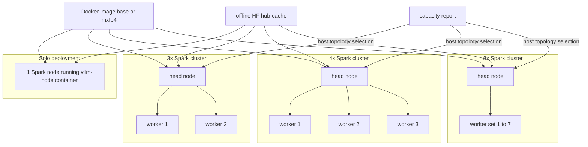
```mermaid
graph TD
    subgraph SOLO["Solo deployment"]
        S1["1 Spark node running vllm-node container"]
    end

    subgraph C3["3x Spark cluster"]
        H3["head node"]
        W3a["worker 1"]
        W3b["worker 2"]
        H3 --> W3a
        H3 --> W3b
    end

    subgraph C4["4x Spark cluster"]
        H4["head node"]
        W4a["worker 1"]
        W4b["worker 2"]
        W4c["worker 3"]
        H4 --> W4a
        H4 --> W4b
        H4 --> W4c
    end

    subgraph C8["8x Spark cluster"]
        H8["head node"]
        W8a["worker set 1 to 7"]
        H8 --> W8a
    end

    IMG["Docker image base or mxfp4"] --> S1
    IMG --> H3
    IMG --> H4
    IMG --> H8
    HC["offline HF hub-cache"] --> S1
    HC --> H3
    HC --> H4
    HC --> H8
    CAP["capacity report"] -->|"host topology selection"| H3
    CAP -->|"host topology selection"| H4
    CAP -->|"host topology selection"| H8
```

- **Recipe flavor gating:** `cluster_only` / `solo_only` flags restrict recipes to the correct topology; the catalog contains 36 top-level recipes plus `3x-spark-cluster/` (1), `4x-spark-cluster/` (4), `8x-spark-cluster/` (1) — 42 total.
- **Container flavor selection:** `mods/use-ngc-vllm` and `mods/use-official-vllm` switch the base engine build at launch time.
- **Image variants:** `vllm-node` (base) and `vllm-node-mxfp4`.

### 7.3 Scalability Design

| Dimension | Extension mechanism |
|---|---|
| **Model scale** | Tensor/pipeline parallelism declared per recipe (`defaults`, `mods` such as `fix-qwen35-tp4-marlin`); recipes encode the correct layout per model × cluster size. |
| **Cluster scale** | New topologies are pure configuration: add `recipes/Nx-spark-cluster/*.yaml`; `autodiscover.sh` resolves head/workers dynamically. |
| **Model onboarding** | New fix/feature mod + one recipe entry — no engine fork, no core changes (Section 5.5 flow). |
| **Hardware evolution** | Kernel domain is self-contained under `mods/inkling-sm12-paged-kv`; new SM generations add kernels plus a dispatch guard clause. |
| **Quantization schemes** | New quantization = fix mod (AST rewrite / template) + recipe entry; image variants (MXFP4) are separate Dockerfiles composed from the same patch library. |
| **Extension points** | Mod protocol (implicit but consistent), `--apply-mod` sequencing, `--vllm-prs` / `--apply-vllm-pr` for upstream changes, `build_args` for image-level variation. |

### 7.4 Monitoring and Operations

**What exists today**
- Per-rank JSONL memory events and merged YAML profile cards (`mods/memory-profile`).
- Human-readable capacity reports with host-topology validation metrics.
- `build-metadata.yaml` for build-time reproducibility (patch set, PR ranges, wheel versions).
- Fail-fast diagnostics from every patcher, verifier, and preflight check.
- Automated documentation shadow tree via `scripts/deepwiki/`.

**Operational guidance**
1. **Always profile before a new cluster launch.** Run `mods/memory-profile/run.sh`, inspect the capacity report, and select hosts that pass topology validation — this is the cheapest way to avoid out-of-memory launches.
2. **Verify weights before serving.** Let `mods/fes-weights` gate the recipe; treat any verification failure as blocking.
3. **Preserve mod ordering.** The `mods: []` list in the recipe is the contract; ordering can matter (e.g. weight setup before serve, kernel dispatch before engine start).
4. **Treat upstream vLLM upgrades as a full revalidation event.** Anchor stability is the system's primary risk; re-run all patches and confirm no `replace_once` failures.
5. **Record runtime PR grafts manually** until `--apply-vllm-pr` writes an equivalent of `build-metadata.yaml`.
6. **Prefer build-time patches for anything reusable.** Reserve runtime mods for model/recipe-specific variation to minimize container-start variance.

**Recommended monitoring additions (gap-driven)**
- Emit a runtime manifest listing applied mods and PRs per container start (parity with `build-metadata.yaml`).
- Add a formal revert path for failed runtime mod application.
- Surface patch-anchor failures as an early CI signal against upstream vLLM `main`.

---

## 8. Architecture Decisions, Drift, and Documentation Gaps

### 8.1 Key Architecture Decisions (implicit — no ADRs exist in-repo)

| ID | Decision | Rationale | Status |
|---|---|---|---|
| AD-1 | **Patch, never fork vLLM** | Preserves upstream rebasability while permitting deep behavioural change | Validated in code |
| AD-2 | **Exact-anchor rewrite + AST validation + compile-before-write + fail-fast** | Corrupt serving state is worse than refusing to start | Validated in code |
| AD-3 | **Recipe YAML as composition root** | Single reproducible user-facing artifact binds mods, weights, kernels, launch | Validated in code (`run-recipe.py` header documents the pipeline) |
| AD-4 | **Two-tier patch lifecycle** (build-time + runtime) | Separates environment-stable fixes from model/recipe-specific variation | Validated, with drift (G1) |
| AD-5 | **Vendored kernels in `vllm/third_party`** | Keeps the kernel domain self-contained and dispatch-injected | Validated in code |
| AD-6 | **Offline-first weights** | Air-gapped Spark clusters are a first-class deployment target | Validated in code |

> These decisions are conventions, not recorded ADRs. The repository contains **no README**, an **empty `docs/`**, and **no ADR files**, yet multiple recipes instruct users to "refer to README for details."

### 8.2 Architectural Drift and Gaps

| ID | Gap | Severity | Impact / Recommendation |
|---|---|---|---|
| **G1** | Engine Compatibility split across `docker/patch_*.py` (build) and `mods/fix-*` (runtime) with no cross-tier linkage | Confirmed drift | A build-time fix can be shadowed by a runtime mod (or vice versa). Introduce a manifest or naming convention linking paired patches; document which tier is authoritative per concern. |
| **G2** | Build-time patch set is larger than documented (21 patchers vs. 10 listed) | Inventory under-reporting | The true coupling surface to upstream vLLM internals exceeds the documented complexity estimate. |
| **G3** | `fastsafetensors*.patch` attributed to `docker/` but located at repository root | Minor location drift | Correct code-path inventories. |
| **G4** | Provided directory tree omits root-level orchestration scripts and Dockerfiles | Representation gap | A diagram drawn from the tree alone would **omit the composition root**. |
| **G5** | Third patching channel `--apply-vllm-pr` is undocumented and unrecorded at runtime | Under-documented risk | Bypasses marker/idempotency conventions; creates untracked environment variance. Record applied PRs alongside mod markers. |
| **G6** | No in-repo README, empty `docs/`, no ADRs, while recipes reference a README | Documentation gap | Knowledge lives only in inline docstrings (notably `run-recipe.py`) and the DeepWiki shadow tree — an automated substitute for written docs. |
| **G7** | Empty `wheels/` vs. dependency on `eugr/spark-vllm-docker` GitHub Releases | External dependency not in context report | Prebuilt artifacts are fetched remotely; add to the system-context external systems list. |

### 8.3 Validation Summary

| Element | Documented | Implemented | Verdict |
|---|---|---|---|
| Composition root (recipe + runner) | Yes | `run-recipe.sh` → `run-recipe.py` with schema | ✅ Match |
| 29 mods incl. fix/feature/kernel/profiling | Yes | 29 directories, expected files present | ✅ Match |
| Idempotent AST/text patching with markers | Yes | Verified in `patch_inkling.py`, `patch_vllm_flashinfer_b12x_swigluoai.py` | ✅ Match |
| Vendored FA4 kernel domain | Yes | `vendor/inkling_sm120_fa4/` + `_use_sm12_paged_kv()` injection | ✅ Match |
| Build-time patch library | Partial (10 listed) | 21 scripts present | ⚠️ G2 |
| 3x/4x/8x cluster recipes | Yes | 6 cluster + 36 top-level = 42 | ✅ Match |
| Memory probe → card → capacity chain | Yes | All seven components wired in `run.sh` | ✅ Match |
| Root orchestration scripts | Not in tree | Present and central | ⚠️ G4 |
| Runtime PR injection channel | Not documented | `--apply-vllm-pr` + `runtime_vllm_pr_reference()` | ⚠️ G5 |
| In-repo README / ADRs | Implied | Absent; `docs/` empty | ⚠️ G6 |

---

## 9. Development and Knowledge-Transfer Guidance

### 9.1 For New Team Members — a 30-Minute Orientation Path

1. Read `run-recipe.py`'s header — it contains the self-documented architecture overview and YAML schema (the closest thing to an in-repo design doc).
2. Open one recipe under `recipes/4x-spark-cluster/` and trace its `mods: []` entries to `mods/<name>/run.sh`.
3. Read `mods/inkling-sm12-paged-kv/patch_inkling.py` — the reference implementation of the mod protocol's safety guarantees.
4. Read `launch-cluster.sh` sections for `--apply-mod` and `--apply-vllm-pr` to understand the two-plus-one patching channels.
5. Run `mods/memory-profile` end-to-end to see instrumentation → profile card → capacity report.
6. Consult this document's Section 8 before assuming any documentation you find elsewhere is complete.

### 9.2 For Developers Adding Model Support

Author a fix or feature mod (patch, diff, or chat template) → write `run.sh` with legacy/main fallbacks and a marker → register it in a recipe YAML → run the recipe so mods apply in order and the server starts with the corrected template. Prefer AST-based validation with mod markers for any new patcher; avoid bare `git apply` for consistency and robustness against upstream refactoring.

### 9.3 For Operators

Treat the recipe as the unit of deployment, the profile card as the unit of capacity planning, and `build-metadata.yaml` as the unit of build provenance. Never launch a new topology without a capacity report; never accept a weight-verification failure as a warning.

---

*End of document. Diagrams conform to strict Mermaid parsing rules: ASCII node identifiers, quoted labels, nodes declared before edges, and supported graph headers only.*