I now have comprehensive understanding of both the orchestration layer and the compute layer. Let me write the complete workflow documentation.

# Core Workflows

## 1. Workflow Overview

### 1.1 System Positioning

`spark-vllm-docker` is a **patch-and-mod management repository** that customizes an externally installed vLLM inference stack without forking it. Its workflows operate at two fundamentally different layers that must be understood together:

| Layer | Nature | Primary Artifacts | Execution Environment |
|-------|--------|-------------------|----------------------|
| **Orchestration Layer** | Deployment-time mutation of installed vLLM source | `run.sh` entry scripts, AST patchers, diff patches, Jinja templates, YAML recipes | Host shell / Python interpreter |
| **Compute Layer** | Runtime attention math on NVIDIA GPUs | Vendored `inkling_sm120_fa4` CuTe-DSL kernels | GPU (SM90/SM100/SM120) |

The orchestration layer *enables* the compute layer: without `patch_inkling.py` injecting a capability check into vLLM's FA4 dispatch, the vendored paged-KV kernel never executes on SM12 hardware. This dependency chain is the backbone of the entire system.

### 1.2 Main Workflows

The system comprises five core workflows, ranked by business importance:

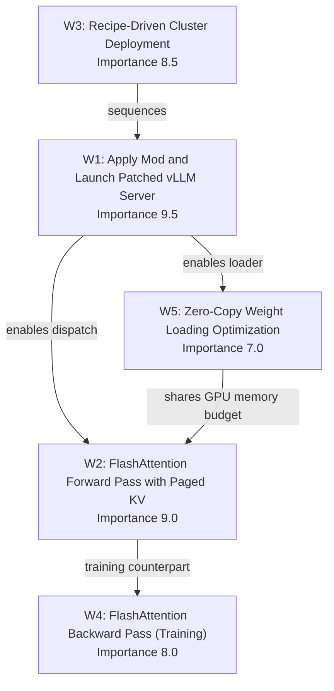

### 1.3 Core Execution Paths

**Path A — Deployment Path (Orchestration):**
`run-recipe.sh` → `run-recipe.py` → per-mod `run.sh` → AST/diff patch application → asset installation → vLLM server launch.

**Path B — Inference Path (Compute):**
Model forward call → `interface.py` validation & heuristics → `PagedKVManager` page-table/pointer setup → architecture-specific forward kernel → online softmax → optional split-K combine → attention output.

**Path C — Training Path (Compute):**
Training step → `flash_bwd_preprocess` → architecture-specific backward kernel (dQ/dK/dV) → softmax statistics recomputation → `flash_bwd_postprocess` → gradients to autograd.

### 1.4 Key Process Nodes

| Node | Location | Role |
|------|----------|------|
| Site-packages resolution | `run.sh` | Locate installed vLLM to target patches |
| Fail-fast guard | `set -euo pipefail` | All-or-nothing deployment semantics |
| AST validation | `patch_inkling.py`, `patch_weight_utils.py` | Refuse to patch unknown source shapes |
| Mod marker | `# spark-vllm mod: ... v1` | Idempotency + traceability |
| Capability check | `_use_sm12_paged_kv()` | Route SM12 devices to vendored kernel |
| Page-table load | `PagedKVManager.load_page_table` | Translate logical KV positions to physical pages |
| Online softmax | `Softmax.online_softmax` | Bounded-memory streaming normalization |
| Split-K combine | `FlashAttentionForwardCombine` | Log-sum-exp weighted merge |

### 1.5 Process Coordination Mechanisms

- **Patch-first, launch-second** is universal across all mods, making them composable and predictable.
- **Idempotency** is enforced by mod markers and `git apply --reverse --check` probes.
- **Version drift tolerance** is achieved through main/legacy patch fallback selection.
- **Architecture specialization cascades** via subclassing (SM120 reuses SM80 `mma.sync` code, overriding only the SMEM capacity check).

---

## 2. Main Workflows

### 2.1 Workflow 1 — Apply Mod and Launch Patched vLLM Server

**Importance: 9.5** — the dominant business flow and the reason the repository exists.

#### 2.1.1 Description

A self-contained mod executes its `run.sh`, which resolves the installed vLLM `site-packages` root, applies the mod's patches (AST rewrites and/or unified diffs) with main/legacy fallback ordering, installs customized assets (such as a corrected Jinja2 chat template), and finally launches the vLLM server bound to the patched package. The entire sequence runs under `set -euo pipefail` so any failure aborts the deployment rather than producing a silently half-patched server.

#### 2.1.2 Flow Diagram

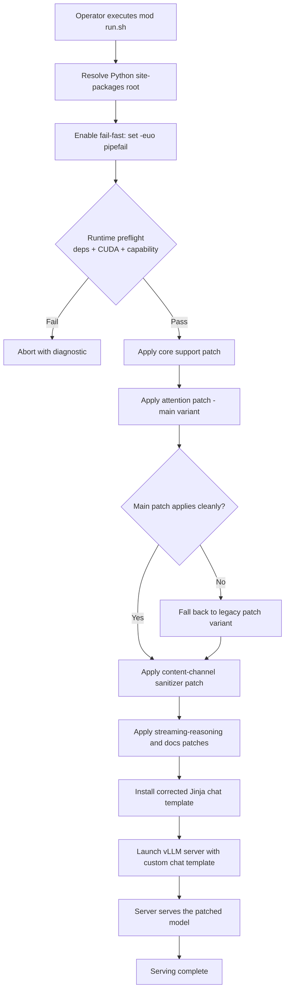

#### 2.1.3 Key Steps and Implementation Details

**Step 1 — Resolve site-packages root.**
The script resolves the target package root with a precedence chain. In `mods/diffusiongemma/run.sh`:
```bash
PYTHON_ROOT="${PYTHON_ROOT:-/usr/local/lib/python3.12/dist-packages}"
```
In `mods/inkling-sm12-paged-kv/run.sh`, the precedence is richer:
```bash
PYTHON_ROOT="${VLLM_SITE_PACKAGES:-${PYTHON_ROOT:-/usr/local/lib/python3.12/dist-packages}}"
```
The `instanttensor-zero-copy` mod goes further, using `importlib.util.find_spec("vllm")` to discover the package without importing vLLM (avoiding premature CUDA initialization in the container).

**Step 2 — Fail-fast behavior.**
Every `run.sh` begins with `set -euo pipefail`, guaranteeing deterministic, all-or-nothing deployment. A failed patch aborts the whole sequence rather than leaving a partially patched server.

**Step 3 — Runtime preflight (mod-specific).**
The `inkling-sm12-paged-kv` mod performs an extensive preflight before touching any source:
- Imports `torch`, `cuda.bindings.driver`, `cutlass`, `einops`, `quack`, `tvm_ffi`, and `cutlass.cute`.
- Verifies required CuTe APIs exist (`ThrMma`, `make_rmem_tensor`).
- Confirms `torch.cuda.is_available()`.
- Asserts the device is SM12x (`capability[0] != 12` → abort).
- Requires CUDA 12.8+.

This preflight can be bypassed for tests via `INKLING_SM12_MOD_SKIP_RUNTIME_CHECK=1`.

**Step 4 — Apply core support patch.**
For DiffusionGemma, `diffusiongemma-support.patch` registers the `DiffusionGemmaForBlockDiffusion` architecture and its config-parsing logic. The script first probes whether upstream support already exists:
```bash
has_upstream_diffusiongemma_support() {
  grep -q "class DiffusionGemmaForConditionalGeneration" "$model_file" || return 1
  grep -q "DiffusionGemmaForBlockDiffusion" "$model_registry" || return 1
  ...
}
```
If present, the patch is skipped. Otherwise, idempotency is checked via `git apply --reverse --check` (already applied) before `git apply --check` (can apply).

**Step 5 — Apply attention patch with fallback.**
The attention compatibility patch is selected dynamically based on the installed vLLM's shape:
```bash
select_attention_patch() {
  if has_marker "vllm/v1/attention/backends/flash_attn.py" "mm_prefix_range_tensor"; then
    echo "$ATTENTION_MAIN_PATCH_FILE"
  else
    echo "$ATTENTION_LEGACY_PATCH_FILE"
  fi
}
```
This is the concrete mechanism for tolerating installed-vLLM version drift.

**Step 6 — Apply sanitizer / streaming patches.**
Additional behavioral fixes (content-channel sanitizer, streaming reasoning, docs) follow the same probe-then-apply pattern, each with its own legacy fallback selector (`select_content_channel_sanitizer_patch`).

**Step 7 — Install chat template.**
The corrected Jinja template is copied to the workspace:
```bash
cp "$CHAT_TEMPLATE_FILE" "$CHAT_TEMPLATE_TARGET_DIR/fixed_chat_template.jinja"
echo "[diffusiongemma]=======> to apply chat template, use --chat-template fixed_chat_template.jinja"
```

**Step 8 — Launch server.**
The server starts against the now-patched package with the custom template.

#### 2.1.4 Input/Output Data Flow

| Stage | Input | Output |
|-------|-------|--------|
| Root resolution | Env vars (`PYTHON_ROOT`, `VLLM_SITE_PACKAGES`) | Absolute path to installed vLLM |
| Patch application | `.patch` files, target source files | Mutated vLLM source with mod markers |
| Asset install | `chat_template_no_think.jinja` | `fixed_chat_template.jinja` in workspace |
| Server launch | Patched package + template | Running inference server |

#### 2.1.5 The AST-Patcher Sub-Flow (patch_inkling.py)

The `inkling-sm12-paged-kv` mod's patcher is the most instructive example of the AST-based approach. Its execution is:

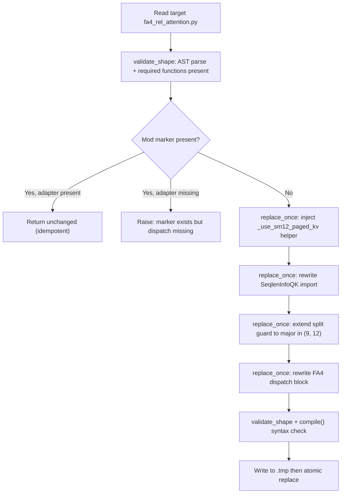

Key safety properties:
- **`replace_once`** raises if the anchor does not occur exactly once, preventing silent partial rewrites.
- **`validate_shape`** parses the AST and asserts the presence of `_use_sheared_bias`, `_get_score_mod`, `inkling_fa4_num_splits`, `inkling_fa4_rel_attention` — refusing to patch an unknown Inkling implementation.
- **`compile(text, ...)`** performs a final syntax validation before writing.
- **Atomic write** via `temporary.replace(args.target)` avoids corrupting the target on interruption.
- **`--check` mode** validates compatibility without writing, used by `run.sh` before installation.

The injected helper is the linchpin of the compute-layer routing:
```python
@cache
def _use_sm12_paged_kv() -> bool:
    capability = current_platform.get_device_capability()
    return capability is not None and capability.major == 12
```

---

### 2.2 Workflow 2 — FlashAttention Forward Pass with Paged KV

**Importance: 9.0** — the runtime attention computation path executed during inference.

#### 2.2.1 Description

The PyTorch-facing API validates inputs and selects tile sizes, the paged-KV manager loads KV blocks from non-contiguous paged memory, and the architecture-specific forward kernel computes attention using tiled MMA with online softmax. If the forward pass is split across KV chunks (split-K / varlen), a combine kernel merges the partial outputs.

#### 2.2.2 Flow Diagram

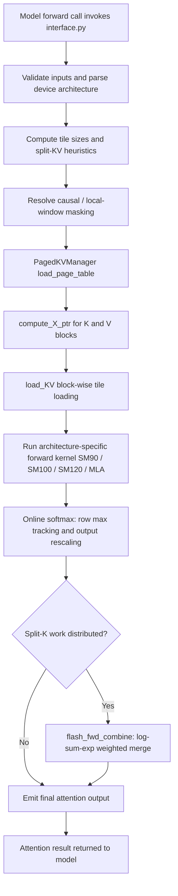

#### 2.2.3 Key Steps and Implementation Details

**Step 1 — Input validation and architecture parsing.**
`interface.py` (2417 lines, complexity 328) is the largest and most central file. It parses the device architecture with a cached function:
```python
@lru_cache(maxsize=None)
def _get_device_arch():
    arch_override = os.environ.get("FLASH_ATTENTION_ARCH", None)
    if arch_override is not None:
        return _parse_arch_str(arch_override)
    major, minor = torch.cuda.get_device_capability()
    return major * 10 + int(minor)
```
The `FLASH_ATTENTION_ARCH` override allows kernel selection independent of the compilation target (`CUTE_DSL_ARCH`), enabling CPU-only compilation. Head dimensions are validated per capability via `_validate_head_dims`, which supports standard ranges, DeepSeek shapes `(192, 128)`, and MLA-absorbed shapes `(64, 512)`.

**Step 2 — Tile-size and split-KV heuristics.**
`FwdConfig` dataclasses and functions like `_tile_size_fwd_sm90` select tile shapes based on head dim, causality, and locality. For example, for `head_dim <= 96` the Python kernel requires `noRS+OL` because "RS is catastrophic with 192× tiles (~300 vs ~600 TFLOPS)."

**Step 3 — Page-table and pointer setup.**
`PagedKVManager` (in `paged_kv.py`) translates logical KV positions into physical block pointers. Its `create` factory computes copy atoms and layouts:
```python
v_gmem_transposed = arch != 90  # SM100 transposes V in gmem to (dv, page_size, num_pages)
universal_copy_bits = 128
async_copy_elems = universal_copy_bits // dtype.width
```
`load_page_table` performs the fast divmod arithmetic:
```python
page_idx, page_offset = divmod(row_idx + self.leftpad_k, self.page_size_divmod)
```
using a `FastDivmodDivisor` to avoid expensive integer division on the GPU.

**Step 4 — Tiled MMA forward kernel.**
The architecture-specific kernel is selected from a family:
- `FlashAttentionForwardSm90` (Hopper)
- `FlashAttentionForwardSm100` (Blackwell datacenter, `tcgen05` MMA)
- `FlashAttentionForwardSm120` (CpAsync) and `FlashAttentionForwardSm120Tma` (TMA + warp specialization)
- `FlashAttentionMLAForwardSm100` (Multi-head Latent Attention for paged-KV inference)

The SM120 TMA variant uses `cp.async.bulk` loads, one DMA warp plus N MMA warps, and `PipelineTmaAsync` with mbarrier synchronization for KV double-buffering. It requires `Swizzle(B, 4, 3)` SMEM layouts (a TMA hardware requirement) rather than the `Swizzle(B, 3, 3)` used by CpAsync.

**Step 5 — Online softmax.**
`Softmax.online_softmax` (in `softmax.py`) implements the streaming normalization that keeps memory footprint bounded. It tracks running row maxima and rescales the output accumulator:
```python
row_scale[r] = cute.math.exp2((row_max_prev - row_max_cur) * scale_log2, fastmath=True)
acc_S_row_sum = utils.fadd_reduce(acc_S_row_exp, init_val=row_sum[r] * row_scale[r], arch=arch)
```
The `is_first` flag distinguishes the first n_block (no rescaling) from subsequent blocks. A `check_inf` guard replaces `-inf` row maxima with `0.0` to avoid NaN propagation.

**Step 6 — Split-K combine.**
When work is split across KV chunks, `FlashAttentionForwardCombine` merges partial outputs using log-sum-exp weighted merging. Its `can_implement` gate validates dtype, head-dim alignment, thread count, and split bounds (`max_splits <= 256`).

#### 2.2.4 Input/Output Data Flow

| Stage | Input | Output |
|-------|-------|--------|
| API validation | Q/K/V tensors, seqlen, mask params | Validated config + arch |
| Heuristics | head_dim, causal/local flags | `FwdConfig` (tile sizes, flags) |
| Paged KV | Page table, paged K/V tensors | Physical block pointers |
| Forward kernel | Q, K/V blocks, config | Attention output + LSE |
| Softmax | Raw scores | Normalized probabilities + row stats |
| Combine | Partial outputs + LSE | Final merged output |

---

### 2.3 Workflow 3 — Recipe-Driven Cluster Deployment

**Importance: 8.5** — the declarative deployment flow.

#### 2.3.1 Description

A YAML recipe declares the model, quantization, hardware topology, and required mods. The recipe runner parses this declaration, sequences the required mods, applies them, and launches a multi-node inference cluster on DGX Spark hardware.

#### 2.3.2 Flow Diagram

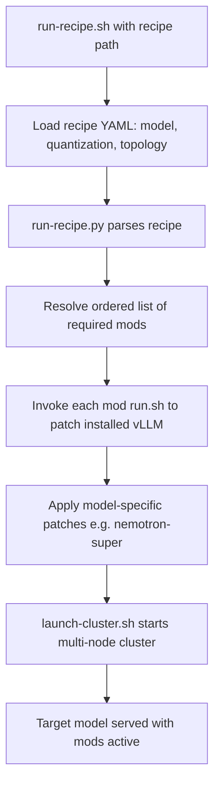

#### 2.3.3 Key Steps and Implementation Details

**Step 1 — Recipe load.**
The recipe YAML binds model + quantization + cluster topology. The schema (documented in `run-recipe.py`) includes `name`, `recipe_version`, `container`, `command`, `model`, `mods`, `defaults`, `env`, `build_args`, `cluster_only`, and `solo_only`.

**Step 2 — Recipe parsing and mod resolution.**
`run-recipe.py` (1546 lines) implements a phased pipeline documented in its header:
```
CLI Args → Load Recipe → Resolve Nodes → Build → Download → Run
```
Each phase can run independently (`--build-only`, etc.). Nodes are classified as Head (first) + Workers (rest), with images/models copied to workers.

**Step 3 — Mod application.**
Each required mod's `run.sh` patches the installed vLLM, following Workflow 1.

**Step 4 — Cluster launch.**
`launch-cluster.sh` starts the multi-node inference cluster with all patches active. `autodiscover.sh` detects network topology.

#### 2.3.4 Extension Points

The runner documents explicit extension points for developers: adding recipe fields (update `load_recipe()`), adding CLI options, adding deployment phases (follow the "check if needed → dry-run print → execute" pattern), supporting new model sources, and supporting new container runtimes.

---

### 2.4 Workflow 4 — FlashAttention Backward Pass (Training)

**Importance: 8.0** — the gradient computation path.

#### 2.4.1 Description

A preprocess kernel extracts per-row statistics, the architecture-specific backward kernel computes dQ, dK, and dV gradients through tiled MMA pipelines, softmax statistics are recomputed for gradient accumulation, and a postprocess kernel finalizes the gradients.

#### 2.4.2 Flow Diagram

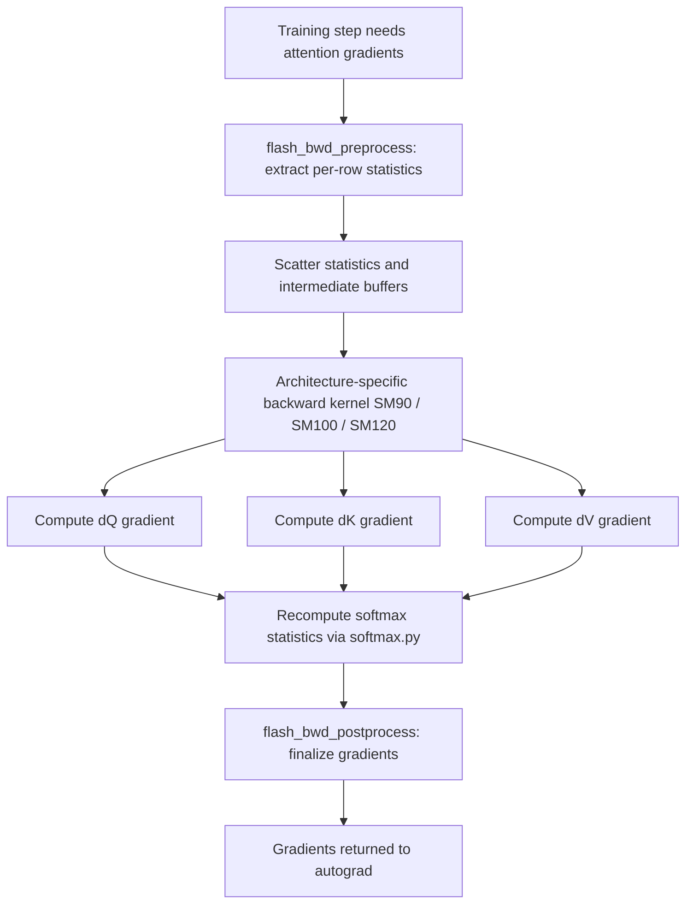

#### 2.4.3 Key Steps and Implementation Details

**Step 1 — Preprocess.**
`FlashAttentionBackwardPreprocess` computes `D_i = (dO_i * O_i).sum(dim=-1)`, optionally adjusted for LSE gradient:
```
D'_i = D_i - dLSE_i
```
This works because in the backward pass `dS_ij = P_ij * (dP_ij - D_i)`, and when LSE is differentiable an extra term `dLSE_i * P_ij` appears, giving `dS_ij = P_ij * (dP_ij - (D_i - dLSE_i))`. The main backward kernel is therefore unchanged; only `D` is replaced with `D'`.

**Step 2 — Backward kernel.**
The architecture-specific kernel computes dQ, dK, and dV. The SM120 variant is a minimal adapter:
```python
class FlashAttentionBackwardSm120(FlashAttentionBackwardSm80):
    @staticmethod
    def can_implement(...):
        ...
        smem_capacity = utils_basic.get_smem_capacity_in_bytes("sm_120")
        if smem_usage > smem_capacity:
            return False
        return True
```
Because SM120 uses the same SM80-era `mma.sync.aligned.m16n8k16` instructions but has 99 KB shared memory (vs 163 KB on SM80), only the SMEM capacity check is overridden. This keeps new-hardware bring-up minimal.

**Step 3 — Softmax recomputation.**
Statistics-based recomputation is used instead of storing the full attention matrix, keeping memory bounded.

**Step 4 — Postprocess.**
`FlashAttentionBackwardPostprocess` finalizes gradients for `FlashAttnFunc`/`FlashAttnVarlenFunc`. It supports `dQ_swapAB`, `use_2cta_instrs`, and cluster sizes for varlen offsets.

#### 2.4.4 BwdConfig Heuristics

`BwdConfig` dataclasses and `_tile_size_bwd_sm90` select backward tile shapes. For `head_dim <= 96`, the config uses `m_block_size=64, n_block_size=128` with `dQ_single_wg=True`. For `head_dim <= 128`, causal/local uses `m_block_size=64` while non-causal uses `80` with `dQ_swapAB`.

---

### 2.5 Workflow 5 — Zero-Copy Weight Loading Optimization

**Importance: 7.0** — a memory-optimization flow.

#### 2.5.1 Description

An AST patcher rewrites vLLM's InstantTensor weights iterator so that tensor copies are replaced by zero-copy views, reducing GPU memory overhead during model loading.

#### 2.5.2 Flow Diagram

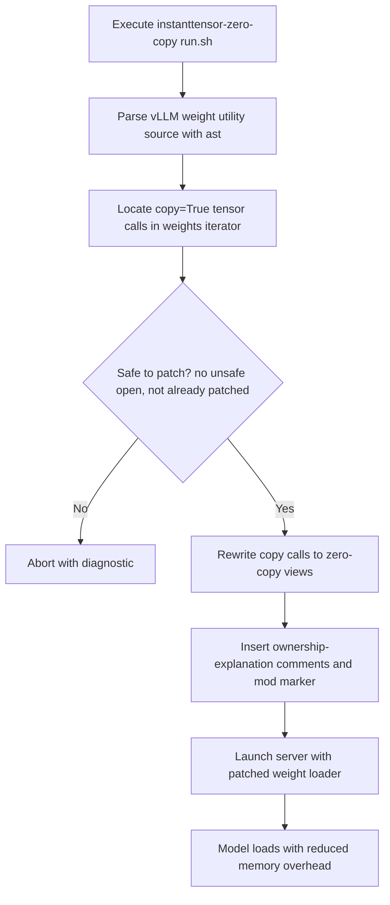

#### 2.5.3 Key Steps and Implementation Details

**Step 1 — Parse.**
`patch_weight_utils.py` uses the `ast` module to safely analyze the source. `_copy_keyword` locates exactly one `instanttensor_weights_iterator` function and exactly one `instanttensor.safe_open` call within it, then extracts the `copy` keyword.

**Step 2 — Locate.**
The patcher verifies the `copy` keyword is a bool literal and that its source range contains exactly the token `True`.

**Step 3 — Guard.**
`_is_safe_open_call` ensures the call is `instanttensor.safe_open` (an `ast.Attribute` on an `ast.Name` with id `instanttensor`). The patcher refuses to proceed if the marker occurs more than once, if `copy=True` is still enabled alongside a marker, or if the keyword is not on its own indented argument line.

**Step 4 — Rewrite.**
The patcher replaces `True` with `False` and inserts the mod marker and ownership comment:
```python
patched = text[:start] + "False" + text[end:]
patched = patched[:line_start] + f"{indentation}{MARKER}\n" + patched[line_start:]
```
A postcondition check re-parses the patched text to confirm `copy` is now disabled and exactly one marker exists.

**Step 5 — Launch.**
The server starts with the patched loader. The `run.sh` emits a warning: "use only with model loaders that consume each weight inline."

---

## 3. Flow Coordination and Control

### 3.1 Multi-Module Coordination Mechanisms

The system coordinates across six functional domains. The critical coordination edges are:

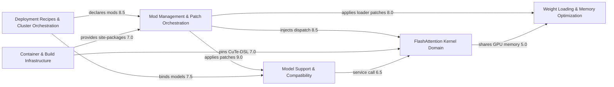

**Coordination principle:** The orchestration domain is the hub. It applies patches defined by the model-support domain, injects dispatch routing into the kernel domain, and applies loader patches to the memory domain. Recipes sit above orchestration as declarative configuration.

### 3.2 State Management and Synchronization

**Orchestration-layer state** is managed through:
- **Mod markers** (`# spark-vllm mod: <name> v1`) — persistent, greppable state indicating a patch has been applied.
- **`git apply --reverse --check`** — probes whether a diff patch is already applied.
- **`has_marker` / `has_*_patch` functions** — semantic probes that check for specific code signatures (e.g., `_strip_gemma4_content_channels`).

**Compute-layer state** is managed through:
- **`ClcState`** — owns the runtime state shared by CLC-capable tile schedulers, including the CLC response buffer, mbarrier storage, and launch geometry.
- **`PipelineState`** — producer/consumer pipeline states for async copies.
- **`Softmax` row_max/row_sum** — running statistics carried across n_block iterations.

### 3.3 Data Passing and Sharing

| Data | Producer | Consumer | Mechanism |
|------|----------|----------|-----------|
| Patched source | AST patcher | vLLM runtime | Atomic file replace |
| Chat template | Mod asset | vLLM server | File copy + `--chat-template` flag |
| Page table | `PagedKVManager.load_page_table` | Forward kernel | Register memory |
| Row statistics | `flash_bwd_preprocess` | Backward kernel | Global memory buffers |
| Partial outputs | Split forward kernel | `flash_fwd_combine` | Global memory + LSE |

### 3.4 Execution Control and Scheduling

**Orchestration scheduling** is strictly sequential under fail-fast. The recipe runner sequences mods in dependency order.

**Compute scheduling** uses `tile_scheduler.py` (1096 lines, 79 functions, 16 classes), which defines `SchedulingMode` (NONE, STATIC, DYNAMIC, CLC), `WorkTileInfo`, and `ClcState`. The CLC (Cluster Launch Control) mode integrates with `ClcDynamicPersistentTileScheduler` for hardware-driven work distribution. `ClcState.prefetch_next_work` advances the hardware scheduler via an mbarrier address:
```python
def prefetch_next_work(self, *, loc=None, ip=None):
    self._pipeline.producer_acquire(self._producer_state, loc=loc, ip=ip)
    mbarrier_addr = self._pipeline.producer_get_barrier(self._producer_state, loc=loc, ip=ip)
    self._hw_scheduler.advance_to_next_work(mbarrier_addr, loc=loc, ip=ip)
    self._producer_state.advance(loc=loc, ip=ip)
```

---

## 4. Exception Handling and Recovery

### 4.1 Error Detection and Handling

The system employs defense-in-depth error detection:

**Orchestration layer:**
- `set -euo pipefail` — any command failure aborts the deployment.
- Missing-file checks — `run.sh` verifies required mod files exist before proceeding.
- `git apply --check` — validates a patch can apply before applying it.
- Runtime preflight — verifies dependencies, CUDA version, and device capability.

**AST patcher layer:**
- `replace_once` raises `ValueError` if an anchor does not occur exactly once.
- `validate_shape` raises if required functions are missing.
- `compile()` raises `SyntaxError` on malformed output.
- Postcondition checks re-validate the patched text.

### 4.2 Exception Recovery Mechanisms

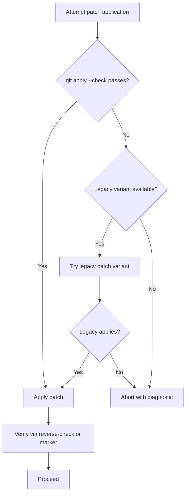

The primary recovery mechanism is **main/legacy fallback selection**. When the main attention patch cannot apply (because the installed vLLM differs), the script selects the legacy variant based on a code-signature probe.

### 4.3 Fault Tolerance Strategy Design

**Idempotency as fault tolerance.** Every patcher is designed to be safely re-runnable:
- `patch_inkling.py` returns unchanged text if the marker is present and the adapter dispatch exists.
- `patch_weight_utils.py` refuses to proceed if the marker exists but `copy=True` is still enabled (an inconsistent state).
- `run.sh` scripts skip already-applied patches.

**Atomic writes.** `patch_inkling.py` writes to a temporary file and atomically replaces the target:
```python
temporary = args.target.with_suffix(args.target.suffix + ".inkling-sm12-mod.tmp")
temporary.write_text(patched)
temporary.replace(args.target)
```

**Preflight gating.** The `inkling-sm12-paged-kv` mod refuses to install anything if the runtime preflight fails, and patches Inkling only after the complete vendored package imports successfully.

### 4.4 Failure Retry and Degradation

- **No automatic retry** — the fail-fast design intentionally avoids retries to prevent half-patched states.
- **Graceful degradation** — if upstream support already exists (`has_upstream_diffusiongemma_support`), the patch is skipped rather than failing.
- **Diagnostic guidance** — error messages direct operators to prerequisite mods: "Apply mods/use-official-vllm first if this container does not include git."

### 4.5 Numerical Fault Tolerance (Compute Layer)

The compute layer handles numerical edge cases:
- **`check_inf` guard** in `online_softmax` replaces `-inf` row maxima with `0.0` to prevent NaN.
- **Log-sum-exp merging** in `flash_fwd_combine` ensures numerically stable split-K reduction.
- **Statistics-based recomputation** in the backward pass avoids storing the full attention matrix, bounding memory.

---

## 5. Key Process Implementation

### 5.1 Core Algorithm Process — Online Softmax

The online softmax is the numerical heart of the forward pass. Its algorithm:

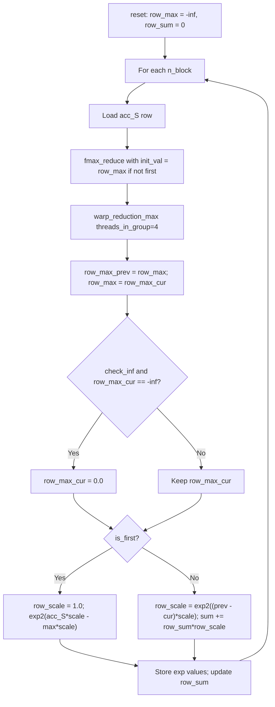

The critical numerical insight is that `row_scale` rescales the output accumulator `O` when the running maximum increases, preserving the invariant that the accumulated output always reflects the current normalization.

### 5.2 Data Processing Pipeline — Paged KV Loading

The paged-KV pipeline translates logical sequence positions into physical memory:

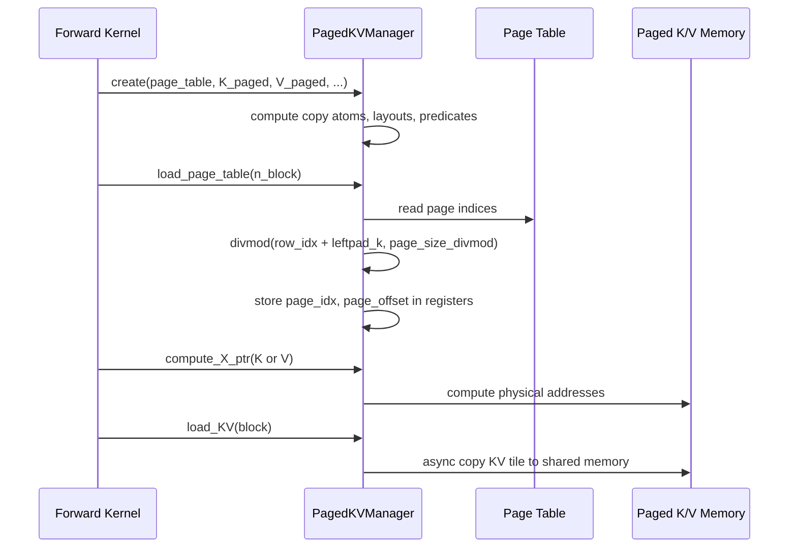

The `FastDivmodDivisor` avoids expensive GPU integer division. The `v_gmem_transposed` flag handles the SM100 layout difference where V is stored as `(dv, page_size, num_pages)` versus SM90's `(page_size, dv, num_pages)`.

### 5.3 Business Rule Execution — Patch Fallback Selection

The fallback selection is a business rule encoded in shell:

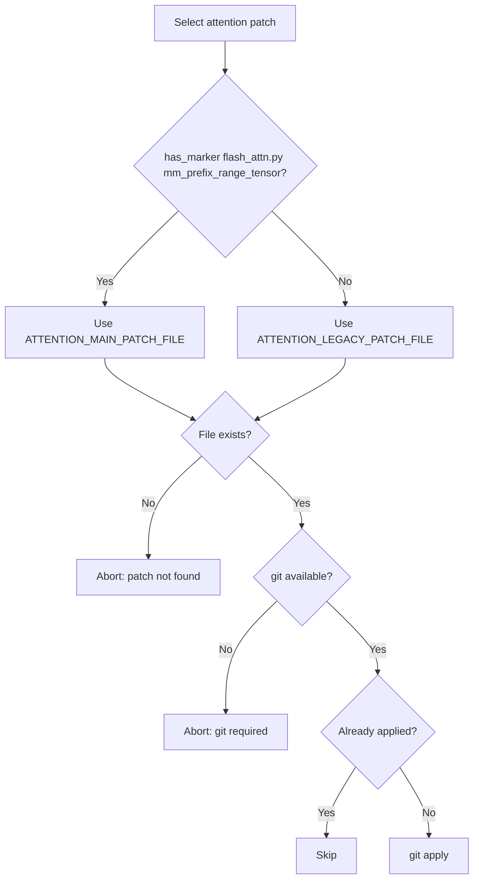

### 5.4 Technical Implementation Details — Architecture Specialization

The kernel package uses subclassing to minimize new-hardware bring-up:

| Architecture | Base Class | Override | MMA Instruction |
|--------------|-----------|----------|-----------------|
| SM80 | `FlashAttentionForwardBase` | Full implementation | `mma.sync.m16n8k16` |
| SM90 | `FlashAttentionForwardBase` | Hopper-specific | WGMMA |
| SM100 | `FlashAttentionForwardBase` | Blackwell datacenter | `tcgen05` |
| SM120 (CpAsync) | `FlashAttentionForwardSm80` | SMEM capacity (99 KB) | `mma.sync.m16n8k16` |
| SM120 (TMA) | `FlashAttentionForwardSm120` | TMA + warp specialization | `mma.sync.m16n8k16` |

The SM120 forward adapter is only 76 lines:
```python
class FlashAttentionForwardSm120(FlashAttentionForwardSm80):
    # Overrides only the SMEM capacity check for 99 KB
```

### 5.5 Performance Optimization Processes

**Concurrent processing:**
- **Warp specialization** — the SM120 TMA variant uses 1 DMA warp + N MMA warps, overlapping data movement with computation.
- **Software pipelining** — `PipelineTmaAsync` with mbarrier synchronization double-buffers KV tiles.
- **Multi-stage pipelines** — `num_stages_Q`, `num_stages_dO`, `num_stages_PdS` control pipeline depth.

**Resource management:**
- **SMEM budget adaptation** — SM120 kernels validate against 99 KB; SM80 against 163 KB.
- **Register-resident V** — `V_in_regs` flag allows `max(smem_usage_Q, smem_usage_V)` instead of the sum.
- **Fast divmod** — avoids GPU integer division in page-table arithmetic.

**Tile scheduling:**
- **CLC-based persistent kernels** — hardware-driven work distribution via `ClcDynamicPersistentTileScheduler`.
- **Split-K** — distributes KV work across blocks, combined via log-sum-exp.

### 5.6 Optimization Opportunities

Based on the workflow analysis, the following improvements are identified:

1. **Parallelize independent patch stages.** The main workflow applies patches strictly sequentially under fail-fast; a dependency graph could allow independent patches to run concurrently while preserving ordering where it matters.

2. **Formalize a patch compatibility matrix.** The main/legacy fallback logic is embedded in each `run.sh`; a declarative version compatibility manifest would make fallback selection explicit and testable.

3. **Unify the two scheduling layers.** The internal `tile_scheduler.py` (CLC-based work distribution) and the external recipe/mod orchestration both perform work distribution; documenting the boundary clearly would help kernel engineers reason about persistent-kernel launch configuration.

4. **Automate end-to-end validation.** Because every mod ends in a server launch, an automated smoke test that exercises the forward pass with a paged-KV cache after patching would catch dispatch-routing regressions early.

### 5.7 Documentation Consistency Notes

The implementation aligns closely with the documented business processes. Two areas where documentation is broader than the observed source and worth verifying against the live tree are:

- The exact fallback ordering used by attention patches in `run.sh` (verified: `select_attention_patch` probes for `mm_prefix_range_tensor`).
- The presence of dedicated `flash_bwd_preprocess.py`/`flash_bwd_postprocess.py` files (verified: both exist and are imported by `interface.py`).

---

## Appendix: Workflow Dependency Summary

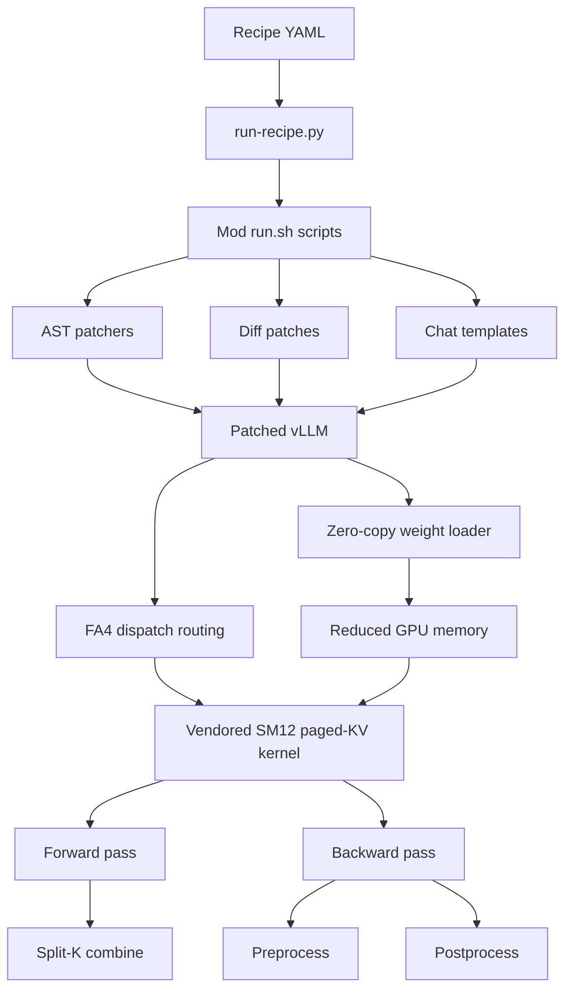

This dependency graph captures the essential insight of `spark-vllm-docker`: **orchestration enables compute**. The recipe declares intent, the mods mutate vLLM, the dispatch patch routes hardware, and the vendored kernels execute the attention math — each layer depending on the one above it, with idempotency and fail-fast semantics ensuring that a deployment either fully succeeds or cleanly aborts.