# Core Workflows

**Project**: `spark-vllm-docker`
**Scope**: Patch-and-orchestration layer that optimizes the vLLM serving engine for Spark clusters with NVIDIA Blackwell GPUs (SM90/SM100/SM120).
**Audience**: ML infrastructure engineers, AI model developers, operations teams, and new team members onboarding the system.

---

## 1. Workflow Overview

### 1.1 System Main Workflows

The system organizes all work into five interdependent workflows. Two of them (deployment and kernel dispatch) are executed on every serving launch, two (image build, memory profiling) are periodic preparation workflows, and one (model enablement) is a development workflow.

| # | Workflow | Entry Point | Primary Domains | Importance |
|---|----------|-------------|-----------------|------------|
| W1 | Recipe-Driven Cluster Model Deployment Flow | `run-recipe.sh` | Recipes & Orchestration, Engine Patching, Model Weights, Attention Kernel | 9.5 |
| W2 | Custom Container Image Build Flow | `build-and-copy.sh` → `Dockerfile` | Container Build, Engine Patching, Attention Kernel | 8.5 |
| W3 | Memory Profiling & Capacity Validation Flow | `mods/memory-profile/run.sh` | Memory Profiling & Capacity, Recipes & Orchestration | 8.5 |
| W4 | Attention Kernel Dispatch on Blackwell Flow | `mods/inkling-sm12-paged-kv/run.sh` (startup) / `interface.py` (per call) | Attention Kernel | 9.0 |
| W5 | Model Support Enablement Flow | `mods/<model-fix>/run.sh` | Engine Patching, Recipes & Orchestration | 8.0 |

### 1.2 Core Execution Paths

**Path A — Build path (offline, infrequent):** source checkout → `build-and-copy.sh` → Dockerfile build stages → build-time patch library under `docker/` → FlashInfer JIT provider wheel build and validation → vendored `inkling_sm120_fa4` kernel package copied in → base or MXFP4 image produced → image copied to cluster hosts.

**Path B — Deploy path (on every launch):** recipe YAML → `run-recipe.py` phases (Build → Download → Run) → generated launch script → `launch-cluster.sh` → head/worker containers started → mods applied in recipe order (`fes-weights` verification, fix mods, feature mods, `inkling-sm12-paged-kv` dispatch patch) → `vllm serve` command with template substitution → runtime FA4 dispatch routes SM12.x devices to the vendored kernel → serving.

**Path C — Profiling path (pre-deployment sizing):** `mods/memory-profile/patch.py` installs instrumentation → `probe.py` records per-phase startup memory → `profile_card.py` merges per-rank JSONL into a YAML profile card → `capacity.py` validates fit against host memory → findings guide host topology selection in Path B.

### 1.3 Key Process Nodes

| Node | Workflow | Function | Failure Impact |
|------|----------|----------|----------------|
| Recipe parsing (`load_recipe`) | W1 | Validates schema, resolves mods/defaults/env | Deployment cannot start |
| Weight verification (`mods/fes-weights/verify.py`) | W1 | Shard/index/size/quant-config integrity gate | Fail-fast; no serving from corrupt weights |
| Mod application (`mods/*/run.sh`) | W1, W5 | Applies idempotent patches to installed vLLM | Fail-fast; engine behavior stays consistent |
| Cluster launch (`launch-cluster.sh`) | W1 | Node bootstrap, container start, script execution | Deployment halts |
| FA4 dispatch patch (`patch_inkling.py`) | W4 | Injects `_use_sm12_paged_kv` capability check | SM12.x falls back to upstream kernel or fails preflight |
| Kernel interface (`interface.py`) | W4 | Validation, tile heuristics, split-KV, autograd wrap | Attention call rejected or misconfigured |
| Capacity analysis (`capacity.py`) | W3 | Fail-closed fit validation of profiled deployment | Host topology rejected before launch |
| Build-time patch set (`docker/patch_*.py`) | W2 | Bakes engine fixes into the image | Build aborts on unknown source shapes |

### 1.4 Process Coordination Mechanisms

- **Recipes as the composition root**: a single YAML file binds mods, weights, quantization, parallelism, environment, and the serve command template. Every other workflow is orchestrated through recipe execution or is a precondition of it.
- **The mod contract**: every mod is a directory with a `run.sh` entry that `launch-cluster.sh` executes inside the container before the launch script. Mods communicate only through environment variables, exit codes, and stdout markers (for example `FES_WEIGHTS_OK`, `FES_WEIGHTS_FAIL`).
- **Two-phase patching**: engine fixes are split by execution time — build-time patches under `docker/` are baked into the image; runtime mods under `mods/*` are applied at container start. Both target the same installed vLLM tree.
- **Idempotency markers**: every patcher stamps a mod marker comment (for example `# spark-vllm mod: inkling-sm12-paged-kv v1`) so re-execution is safe and double-patching is detectable.
- **Data artifacts as hand-offs**: `build-metadata.yaml` (build provenance), profile cards (`profile.yaml`), probe event JSONL (`host.jsonl`), and HF hub-cache shims are the durable artifacts passed between workflows.

### 1.5 Workflow Dependency Map

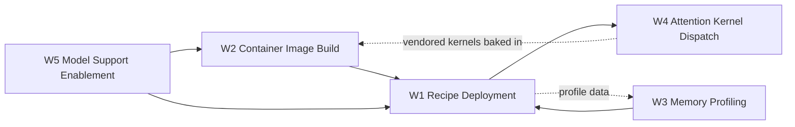
```mermaid
flowchart LR
    W2["W2 Container Image Build"] --> W1["W1 Recipe Deployment"]
    W3["W3 Memory Profiling"] --> W1
    W1 --> W4["W4 Attention Kernel Dispatch"]
    W5["W5 Model Support Enablement"] --> W1
    W5 --> W2
    W1 -. profile data .-> W3
    W4 -. vendored kernels baked in .-> W2
```

Hard dependencies: W1 cannot run without a W2-produced image; W1 halts without W5-applied (or explicitly absent) mods and without weight verification; W4 is a runtime sub-flow triggered during W1 engine startup; W3 output feeds host selection decisions in W1.

---

## 2. Main Workflows

### 2.1 W1: Recipe-Driven Cluster Model Deployment Flow (Primary Business Process)

**Description.** The system's primary end-to-end workflow. It begins when an operator selects a declarative YAML recipe (defining model, quantization, mods, parallelism, and cluster size) and ends with a running vLLM service on a Spark cluster serving inference requests through the architecture-appropriate attention kernel.

**Business value.** Turns a multi-day manual porting effort (patching vLLM for a new model on Blackwell hardware) into a single command, and guarantees that every deployment of a given recipe is reproducible and validated.

**Inputs:**
- Recipe YAML (e.g., `recipes/4x-spark-cluster/qwen3.5-397b-int4-autoround.yaml`) with `name`, `recipe_version`, `container`, `command`, `mods`, `defaults`, `env`, `model`, `cluster_only`/`solo_only`, `build_args`
- CLI overrides (port, host, tensor-parallel, GPU memory utilization, max model length, env vars, node list, Ray mode)
- Pre-built container image (or build request via `--setup`)
- Staged model weights (for offline `FES` serving) or Hugging Face cache (for `--download-model`)

**Outputs:**
- Generated temporary launch script containing the fully substituted `vllm serve` command
- A `launch-cluster.sh` invocation carrying `--apply-mod` flags for each recipe mod
- Running head and worker containers with mods applied and the patched FA4 dispatch
- Served inference endpoint (default port 8000)

**Main flow diagram:**

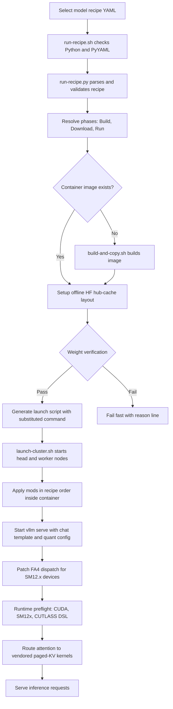
```mermaid
flowchart TD
    Start["Select model recipe YAML"] --> Wrap["run-recipe.sh checks Python and PyYAML"]
    Wrap --> Parse["run-recipe.py parses and validates recipe"]
    Parse --> Phase["Resolve phases: Build, Download, Run"]
    Phase --> Image{"Container image exists?"}
    Image -->|No| Build["build-and-copy.sh builds image"]
    Image -->|Yes| Weights["Setup offline HF hub-cache layout"]
    Build --> Weights
    Weights --> Verify{"Weight verification"}
    Verify -->|Pass| Gen["Generate launch script with substituted command"]
    Verify -->|Fail| Abort["Fail fast with reason line"]
    Gen --> Launch["launch-cluster.sh starts head and worker nodes"]
    Launch --> ApplyMods["Apply mods in recipe order inside container"]
    ApplyMods --> Serve["Start vllm serve with chat template and quant config"]
    Serve --> PatchFA["Patch FA4 dispatch for SM12.x devices"]
    PatchFA --> Preflight["Runtime preflight: CUDA, SM12x, CUTLASS DSL"]
    Preflight --> Kernels["Route attention to vendored paged-KV kernels"]
    Kernels --> Ready["Serve inference requests"]
```

**Detailed key steps:**

1. **Recipe selection and parsing** (`run-recipe.sh` → `run-recipe.py`, `load_recipe()`).
   The bash wrapper verifies Python 3.10+ and installs PyYAML if missing, then execs the Python runner. Recipe resolution search order: exact path → `recipes/` directory → append `.yaml` → append `.yml`. Required fields (`name`, `recipe_version`, `container`, `command`) are validated; missing optional fields get defaults. The runner also normalizes the serve command: `ensure_ray_backend()` appends `--distributed-executor-backend ray` when the recipe omits it in Ray mode, and `strip_distributed_executor_backend()` removes it in `--no-ray` mode so the launcher stays the single authority on distributed flags.

2. **Deployment pipeline phases.** `run-recipe.py` executes a strict phase pipeline: `CLI Args → Load Recipe → Resolve Nodes → Build → Download → Run`. Each phase can be run independently via `--build-only`, `--download-only`, or `--setup` (full pipeline). Node resolution distinguishes head (first node) from workers (remaining nodes); images and model caches are copied to workers during build/download phases.

3. **Offline hub-cache setup and weight verification** (`mods/fes-weights/run.sh`, `mods/fes-weights/verify.py`).
   The mod is opt-in: without `FES_WEIGHTS_ENABLED` it stays inert (logs `FES_WEIGHTS_SKIP`) so hub-cache-mode recipes are unaffected. When enabled it:
   - Verifies main weights at `FES_WEIGHTS_DIR` (default `/model`) and optional draft weights at `FES_DRAFT_DIR` (default `/drafter`) by invoking `verify.py`.
   - `verify.py` checks: directory exists and is non-empty; `config.json` parses; NVFP4 checkpoints (`quantization_config.format == "nvfp4"`) include `hf_quant_config.json`; shard files named in `model.safetensors.index.json` `weight_map` all exist; staged total size satisfies `total_size <= staged <= total_size * 1.02`; single-file fallback `model.safetensors` is honored. On success it prints a JSON summary (`shards`, `bytes`, `quant_format`); on failure it prints a single reason line to stderr and exits 1.
   - Builds HF hub-cache shims: for `FES_HUB_MODEL=org/model` it creates `hub/models--org--model/snapshots/fes-staged/` symlinking each staged file, writes `refs/main = fes-staged`, and fingerprints the source directory (sha256 of sorted file names and sizes) into `.fes-shim-fp` so unchanged shims are skipped on rerun.
   - Fixes HF cache permissions (`chown ubuntu:ubuntu`, `chmod u+rwX,g+rwX`) because the mod runs as root while the server runs as uid 1000 and peer ranks see the NFS cache through root_squash; `chown -h` protects symlinks into the read-only weights mount.
   - Emits the terminal marker `FES_WEIGHTS_OK op=verify dir=... slug=...`.

4. **Model-specific fix mods** (e.g., `mods/fix-qwen3-next-autoround/`, `mods/fix-qwen3.5-chat-template/`).
   Each fix mod provides a `run.sh` plus artifacts: AST-based Python rewriters (`patch_qwen3_next.py` locates `Qwen3NextSparseMoeBlock`, finds the gate call, and replaces it with checkpoint-configured quantization), Jinja chat templates (`chat_template.jinja` with namespace counters for image/video content and validation rejecting images in system messages), or `.patch`/`.diff` files. All are applied to the installed package before the server starts.

5. **Feature enablement mods** (e.g., `mods/diffusiongemma/run.sh`).
   Feature mods resolve the Python site-packages root, apply patches in a defined order (`diffusiongemma-support.patch` first, then main-branch attention/sanitizer patches with legacy fallbacks, then streaming-reasoning and docs patches), and optionally launch the server themselves with a custom chat template (`chat_template_no_think.jinja`). They run under `set -euo pipefail` for fail-fast behavior.

6. **Cluster launch** (`launch-cluster.sh`).
   The launcher accepts the generated launch script via `--launch-script`, applies each `--apply-mod` directory before launch, auto-detects Ethernet/InfiniBand interfaces (or loads `.env` / `autodiscover.sh` results), configures container runtime limits (default memory limit 110 GB in non-privileged mode, shm 64 GB, pids 4096, nofile 1048576, optional earlyoom), and starts head and worker containers with per-node distributed arguments injected automatically (`--nnodes`, `--node-rank`, `--master-addr`, `--master-port`, executor backend).

7. **Attention kernel dispatch preparation** (`mods/inkling-sm12-paged-kv/run.sh` → `patch_inkling.py`).
   Executed as one of the recipe mods inside the container; detailed in workflow W4 below.

**Data flow summary (W1):**

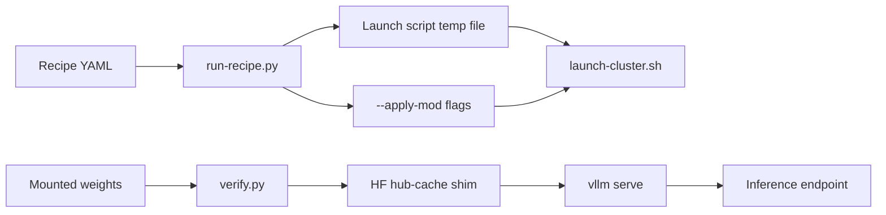
```mermaid
flowchart LR
    Recipe["Recipe YAML"] --> Runner["run-recipe.py"]
    Runner --> LScript["Launch script temp file"]
    Runner --> ModFlags["--apply-mod flags"]
    LScript --> Launcher["launch-cluster.sh"]
    ModFlags --> Launcher
    WeightsMount["Mounted weights"] --> Verify["verify.py"]
    Verify --> Shim["HF hub-cache shim"]
    Shim --> Server["vllm serve"]
    Server --> ServeOut["Inference endpoint"]
```

---

### 2.2 W2: Custom Container Image Build Flow

**Description.** Builds the custom vLLM Docker image (base `Dockerfile` or `Dockerfile.mxfp4` MXFP4 variant) by installing vLLM and FlashInfer, applying the shared build-time patch library, building FlashInfer JIT-cache provider wheels, vendoring the SM120 FlashAttention kernel package, and validating wheels for reproducibility. W1 cannot run without this workflow's output.

**Inputs:** repository source, vLLM repo/ref (or local source dir), FlashInfer ref, torch/CUDA/GPU-arch build arguments (default arch `12.1a`, CUTLASS DSL `4.7.0`), optional B12X and vLLM PR inputs.
**Outputs:** `vllm-node` (or custom-tag) image distributed to cluster hosts, `build-metadata.yaml` provenance record, validated FlashInfer JIT wheel caches.

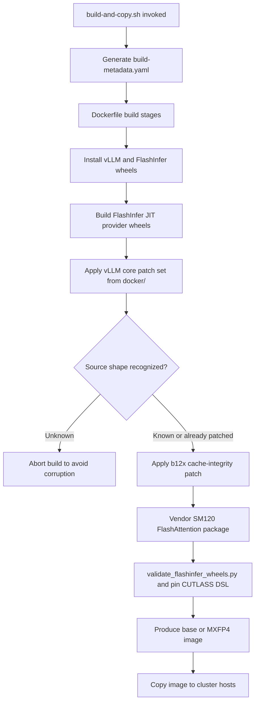
```mermaid
flowchart TD
    BuildStart["build-and-copy.sh invoked"] --> Meta["Generate build-metadata.yaml"]
    Meta --> Docker["Dockerfile build stages"]
    Docker --> Install["Install vLLM and FlashInfer wheels"]
    Install --> JIT["Build FlashInfer JIT provider wheels"]
    JIT --> CorePatches["Apply vLLM core patch set from docker/"]
    CorePatches --> Shape{"Source shape recognized?"}
    Shape -->|Unknown| FailBuild["Abort build to avoid corruption"]
    Shape -->|Known or already patched| Integrity["Apply b12x cache-integrity patch"]
    Integrity --> Vendor["Vendor SM120 FlashAttention package"]
    Vendor --> Validate["validate_flashinfer_wheels.py and pin CUTLASS DSL"]
    Validate --> Image["Produce base or MXFP4 image"]
    Image --> Copy["Copy image to cluster hosts"]
```

**Key steps and technical notes:**

1. **Build orchestration** (`build-and-copy.sh`, 1500+ lines). Manages the full build matrix: prebuilt runner images, wheel caching (`.wheel-cache`), parallel copies to `--copy-hosts`, FlashInfer/vLLM rebuild toggles (`REBUILD_FLASHINFER`, `REBUILD_VLLM`, architecture-mismatch detection), experimental B12X and MXFP4 modes, and torch/torchvision/torchaudio version pinning. A `cleanup` trap removes temporary images and staging directories on exit, and `generate_build_metadata` records repo refs, commits, GPU arch, CUTLASS DSL version, and PR lists for auditability.

2. **JIT provider wheel build** (`docker/build_flashinfer_jit_providers.sh`). Runs from a FlashInfer checkout, checks the legacy monolithic wheel path, and builds provider wheels for the specified CUDA architectures using the provided interpreter and output directory.

3. **The critical build-time patch** (`docker/patch_vllm_flashinfer_b12x_swigluoai.py`). Applies the runtime subset of vLLM PR #47392: it teaches FlashInfer B12x to receive SwiGLU-OAI parameters and lets the NVFP4 oracle select it. The patcher is **idempotent** (recognizes already-patched sources) and **fails on unknown source shapes**, which is the mechanism that prevents a partially patched, silently broken image.

4. **Companion patches.** `docker/patch_b12x_cache_integrity.py` applies `b12x-cache-integrity.patch` via `git apply` with existing-application detection for safe reapply; other patchers handle Spark KV-cache cleanup, startup heap trim, SM120 cooperative top-k, SWA block size, routed-expert weight shape, InstantTensor memory, top-k softplus controls, and torch schema enumeration.

5. **Validation and pinning** (`docker/validate_flashinfer_wheels.py`, `docker/pin_cutlass_dsl.py`). Wheels are validated and the CUTLASS DSL version is pinned (default 4.7.0) so JIT compilation inside the image is reproducible.

6. **Kernel vendoring.** The `mods/inkling-sm12-paged-kv/vendor/inkling_sm120_fa4` package (CuTe-DSL kernels for SM80/SM90/SM100/SM120 forward, backward, MLA, split-K combine, TMA variants, plus `interface.py`, `paged_kv.py`, `tile_scheduler.py`) is copied into the image so W4 can install it into `vllm/third_party/` at container start.

---

### 2.3 W3: Memory Profiling & Capacity Validation Flow

**Description.** Profiles a model's startup memory on the target cluster, consolidates per-rank events into a profile card, and validates that the deployment fits available host memory — enabling topology-aware host selection before cluster launch. This is a *fail-closed* workflow: only a complete, healthy profile can establish fit.

**Inputs:** installed vLLM package, a recipe launch (to observe real startup), host hardware probe data.
**Outputs:** per-rank event JSONL, consolidated `profile.yaml` card, capacity report with KV-cache budget, peak-host-memory estimate, and minimum GPU utilization.

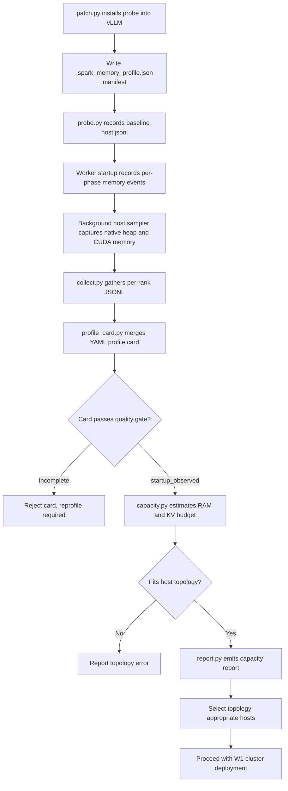
```mermaid
flowchart TD
    PatchPhase["patch.py installs probe into vLLM"] --> Manifest["Write _spark_memory_profile.json manifest"]
    Manifest --> Baseline["probe.py records baseline host.jsonl"]
    Baseline --> Record["Worker startup records per-phase memory events"]
    Record --> Sample["Background host sampler captures native heap and CUDA memory"]
    Sample --> Collect["collect.py gathers per-rank JSONL"]
    Collect --> Card["profile_card.py merges YAML profile card"]
    Card --> Quality{"Card passes quality gate?"}
    Quality -->|Incomplete| Reject["Reject card, reprofile required"]
    Quality -->|startup_observed| Capacity["capacity.py estimates RAM and KV budget"]
    Capacity --> Fit{"Fits host topology?"}
    Fit -->|No| ReportFail["Report topology error"]
    Fit -->|Yes| Report["report.py emits capacity report"]
    Report --> HostSelect["Select topology-appropriate hosts"]
    HostSelect --> Deploy["Proceed with W1 cluster deployment"]
```

**Key steps:**

1. **Startup probe installation** (`mods/memory-profile/patch.py` → `probe.py`). The patch registers the probe inside vLLM as `vllm._spark_memory_profile` and writes a manifest (`_spark_memory_profile.json`) pointing at a host-side profile directory. During worker startup the probe records phase-by-phase native heap, CUDA memory, model/KV inventory, per-rank metadata (parallel config, model config, hardware, utilization checkpoints), and API readiness events. A background sampler (`nohup probe.py >> monitor.log`) observes host memory throughout startup; a `--baseline` capture records `MemTotal`/`MemAvailable` before anything else runs.

2. **Profile card generation** (`profile_card.py`). Reads per-rank event JSONL, summarizes CUDA and KV memory, computes phase peaks (notably `startup_peak_increment_bytes`, `before_first_serving_kv_allocation_peak_increment_bytes`, and `from_first_serving_kv_allocation_peak_increment_bytes` per host), and writes a consolidated YAML card keyed by model/recipe.

3. **Quality gate** (`capacity.py`, `profile_problems()`). The estimator *fails closed*: a card is only usable if status is `startup_observed`, every expected rank appears exactly once with no instrumentation errors, at least one API process is ready on the rank-zero head host, host sampling covers startup, the topology is a consistent TP×PP layout with DP/DCP/PCP = 1 (one GPU rank per host), KV storage is measured GPU-only with no CPU offload, and utilization/KV-budget measurements are present and self-consistent.

4. **Capacity analysis** (`capacity.py`). Core computations:
   - `cache_model()` calibrates pool-block demand from recorded group-aware concurrency: it validates that KV backing storage matches a uniform shared pool (`pool_bytes = layers × page_size`), that recorded concurrency resolves to whole request blocks, and derives per-group residual and slack blocks (including speculative lookahead) without naively linear-scaling hybrid cache bytes.
   - `kv_breakdown()` computes total KV bytes for a requested context and sequence count: `blocks = sequences × (residual + full_attention + slack) + 1` (one shared null block), multiplied by pool bytes per block. Context outside the profiled/speculative bounds raises "a new profile is needed".
   - `shared_kv_budget()` handles TP/PP: all stages must fit the largest request block count.
   - `peak_requirement()` never subtracts serving KV from the loading/profiling peak: `max(before, after - old_kv + new_kv, 0)`.
   - `utilization_estimate()` inverts vLLM's automatic KV budget to derive the minimum `gpu_memory_utilization` per rank and identifies the limiting rank.
   - Topology violations raise `TopologyError`, which the reporter converts into a human-readable rejection.

5. **Reporting and host selection** (`report.py`, `host_probe.py`). Probes host hardware, renders tables of capacity utilization metrics, and feeds findings back into W1 so `run-recipe.sh` chooses hosts whose topology satisfies the profiled deployment.

**Coordination with W1:** the probe itself is installed through the same mod/patch mechanism as engine fixes (Instrumentation Dependency), and profile cards are consumed by the recipe runner when selecting hosts (Data Dependency). Capacity profile cards are keyed by model/recipe, making reuse across repeated deployments possible.

---

### 2.4 W4: Attention Kernel Dispatch on Blackwell Flow (Core Technical Process)

**Description.** At inference startup, vLLM's FlashAttention 4 dispatch is patched so compute-capability 12.x devices route attention work to the vendored paged-KV kernel. Per attention call, the kernel interface validates inputs, computes tile heuristics and split-KV strategy, schedules persistent work tiles, and executes the architecture-selected forward/MLA/backward kernel.

**Inputs:** Q/K/V tensors (paged KV via `page_table`), sequence metadata (`cu_seqlens_q/k`, `max_seqlen_*`), attention options (causal, window, softcap, pack_gqa, score_mod/aux_tensors), device capability.
**Outputs:** attention output tensor (optionally preallocated via `out=`), optional log-sum-exp; autograd graph in training contexts (vendored inference adapter restricts to inference-only).

**Phase 1 — Mod installation (container start):**

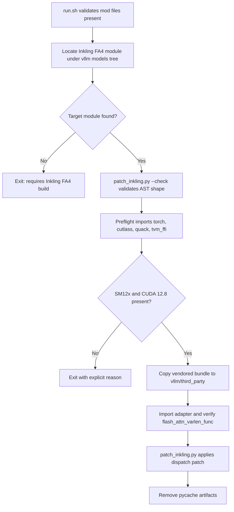
```mermaid
flowchart TD
    Run["run.sh validates mod files present"] --> Locate["Locate Inkling FA4 module under vllm models tree"]
    Locate --> Found{"Target module found?"}
    Found -->|No| Err1["Exit: requires Inkling FA4 build"]
    Found -->|Yes| Check["patch_inkling.py --check validates AST shape"]
    Check --> Preflight["Preflight imports torch, cutlass, quack, tvm_ffi"]
    Preflight --> Caps{"SM12x and CUDA 12.8 present?"}
    Caps -->|No| Err2["Exit with explicit reason"]
    Caps -->|Yes| Copy["Copy vendored bundle to vllm/third_party"]
    Copy --> Import["Import adapter and verify flash_attn_varlen_func"]
    Import --> Patch["patch_inkling.py applies dispatch patch"]
    Patch --> Cleanup["Remove pycache artifacts"]
```

`patch_inkling.py` performs AST-based validation requiring the presence of `_use_sheared_bias`, `_get_score_mod`, `inkling_fa4_num_splits`, and `inkling_fa4_rel_attention` before touching anything. It then performs exactly-one-occurrence text replacements for four anchors:
- injects a cached `_use_sm12_paged_kv()` helper (`capability.major == 12`) next to `_get_score_mod`;
- swaps the `SeqlenInfoQK` import to the vendored package when the helper returns true;
- widens the split guard from `major == 9` to `major in (9, 12)` so the vendored kernel is validated with a single split;
- rewrites the upstream dispatch block (standard *and* legacy variants are both recognized) to import `flash_attn_varlen_func` from `vllm.third_party.inkling_sm120_fa4_adapter` when SM12 paged-KV is active.

Before writing, the patched text is re-validated with `ast.parse` and `compile()`; writes go through a temporary file plus atomic `replace()`. If the mod marker already exists, the patcher verifies the adapter dispatch is present and otherwise refuses — this makes the patch both idempotent and self-healing-detecting.

**Phase 2 — Per-call kernel execution:**

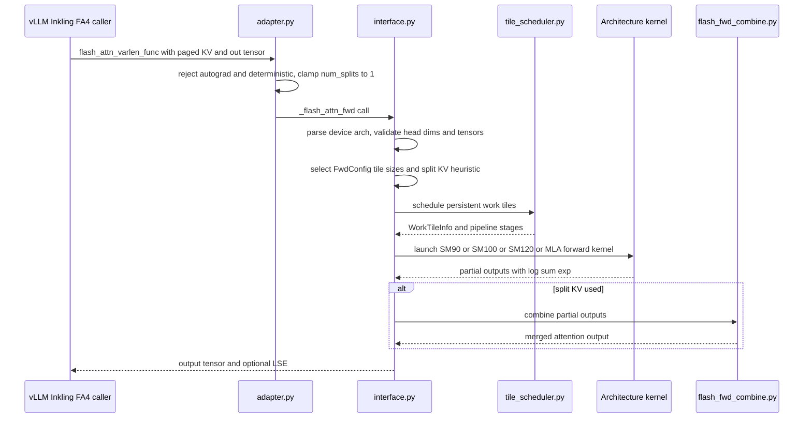
```mermaid
sequenceDiagram
    participant V as vLLM Inkling FA4 caller
    participant A as adapter.py
    participant I as interface.py
    participant T as tile_scheduler.py
    participant K as Architecture kernel
    participant C as flash_fwd_combine.py
    V->>A: flash_attn_varlen_func with paged KV and out tensor
    A->>A: reject autograd and deterministic, clamp num_splits to 1
    A->>I: _flash_attn_fwd call
    I->>I: parse device arch, validate head dims and tensors
    I->>I: select FwdConfig tile sizes and split KV heuristic
    I->>T: schedule persistent work tiles
    T-->>I: WorkTileInfo and pipeline stages
    I->>K: launch SM90 or SM100 or SM120 or MLA forward kernel
    K-->>I: partial outputs with log sum exp
    alt split KV used
        I->>C: combine partial outputs
        C-->>I: merged attention output
    end
    I-->>V: output tensor and optional LSE
```

**Key implementation details:**

1. **Dispatch patching** (`patch_inkling.py`, marker `# spark-vllm mod: inkling-sm12-paged-kv v1`). See Phase 1 above. The `--check` mode validates compatibility without writing, which `run.sh` uses as a refuse-before-install gate.

2. **Adapter contract enforcement** (`adapter.py`). The Inkling caller passes `out=` during warmup and inference; the vendored bundle's public wrapper does not expose preallocated output, so the adapter forwards to the internal `_flash_attn_fwd`. It also enforces three safety rules: autograd with `requires_grad` inputs raises "inference-only" `RuntimeError`; `deterministic=True` raises `ValueError`; and `num_splits` is unconditionally clamped to 1 as a second line of defense beneath `inkling_fa4_num_splits()` because the bundle is validated only for single-split decode.

3. **Kernel interface** (`interface.py`, 2417 lines, the largest file in the kernel package).
   - `_get_device_arch()` is `lru_cache`d and overridable via `FLASH_ATTENTION_ARCH` (kernel selection) and `CUTE_DSL_ARCH` (compilation target), enabling CPU-only compilation.
   - `_validate_head_dims()` enforces per-capability constraints: SM90 allows 8–256; SM100/SM110 allows 8–128 plus the DeepSeek `(192, 128)` and MLA-absorbed `(64, 512)` shapes; all must be divisible by the alignment.
   - `FwdConfig`/`BwdConfig` dataclasses carry tile sizes and pipeline stage counts selected by heuristics such as `_tile_size_fwd_sm90()` — e.g., head_dim ≤ 64 selects `192×128` RS+OL, while head_dim ≤ 96 forces noRS+OL because "RS is catastrophic with 192 tiles (~300 vs ~600 TFLOPS)". Backward configs encode `num_stages_Q/dO/PdS`, `SdP_swapAB`, `dKV_swapAB`, `dQ_swapAB`, atom layouts, and warp-group counts.
   - The function resolves causal/local window parameters, computes split-KV heuristics, and wraps kernels in `FlashAttnFunc` / `FlashAttnVarlenFunc` `torch.autograd.Function` classes; the vendored adapter path bypasses autograd (inference-only) but the machinery remains for training use of the bundle.
   - A JIT cache layer (`cache_utils.get_jit_cache`) plus optional PTX dump hook (`CUTE_DSL_PTXAS_PATH`) accelerates repeated kernel compilation.

4. **Tile scheduling** (`tile_scheduler.py`, 79 functions, 16 classes). Provides the work-distribution layer for persistent kernels: `SchedulingMode`, `WorkTileInfo`, `ClcState`, and a `TileSchedulerProtocol`, integrating with MLIR values and CUTLASS pipeline primitives for Cluster Launch Control (CLC) based scheduling. This keeps the GPU saturated by reusing resident kernels across work tiles instead of relaunching per tile.

5. **Kernel selection and execution.** Forward: `FlashAttentionForwardSm90` (Hopper warp-scheduler barrier sync), `FlashAttentionForwardSm100` (Blackwell tcgen05, MHA/GQA/MQA, varlen, sliding window, split-KV), `FlashAttentionForwardSm120` and `FlashAttentionForwardSm120Tma` (TMA `cp.async.bulk` loads, one DMA warp plus N MMA warps, mbarrier-synchronized KV double buffering), `FlashAttentionMLAForwardSm100` (Multi-head Latent Attention with hdim splitting, mbarrier multi-stage pipelines, TMA descriptors). Backward: `FlashAttentionBackwardSm80/Sm90/Sm100/Sm120` computing dQ/dK/dV with statistics-based softmax recomputation and pipelined async copies. When work is split across KV chunks, `FlashAttentionForwardCombine` merges partial outputs using log-sum-exp weighted reduction.

---

### 2.5 W5: Model Support Enablement Flow (Development Process)

**Description.** The workflow for onboarding a new or emerging model architecture: author a fix or feature mod, register it in a recipe, and have the recipe runner apply it before the vLLM server starts with the corrected template or configuration.

**Inputs:** knowledge of the model's failure mode (quantization, chat serialization, architecture support, attention backend).
**Outputs:** a new `mods/<name>/` directory and a recipe referencing it; W1 then applies it automatically.

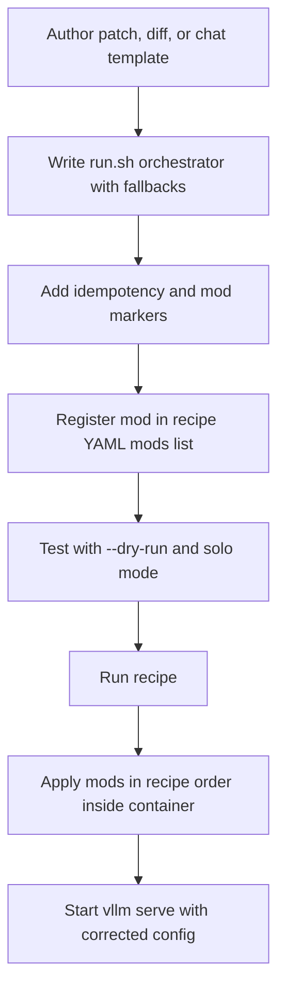
```mermaid
flowchart TD
    Author["Author patch, diff, or chat template"] --> Orchestrator["Write run.sh orchestrator with fallbacks"]
    Orchestrator --> Marker["Add idempotency and mod markers"]
    Marker --> Register["Register mod in recipe YAML mods list"]
    Register --> LocalTest["Test with --dry-run and solo mode"]
    LocalTest --> Run["Run recipe"]
    Run --> Apply["Apply mods in recipe order inside container"]
    Apply --> Server["Start vllm serve with corrected config"]
```

**Key steps:**

1. **Author model-support patches.** Examples: `mods/diffusiongemma/*.patch` (diffusiongemma support, attention backend, sanitizer, streaming reasoning, docs) with a `run.sh` that resolves site-packages and applies main-branch variants first with legacy fallbacks; `patch_qwen3_next.py` AST rewrites restoring checkpoint-configured MoE router quantization; `chat_template.jinja` for Qwen3.5 with multimodal namespace counters and system-message image rejection.
2. **Write the orchestrator with fallbacks.** Mods chain patch attempts (preferred variant → legacy variant) and run under `set -euo pipefail`.
3. **Register in a recipe.** Add the mod path to the `mods:` list of one or more recipe YAMLs (solo and cluster variants).
4. **Run the recipe.** `run-recipe.py` passes each mod as `--apply-mod`; `launch-cluster.sh` executes `run.sh` inside the container in recipe order before the launch script starts the server.
5. **Runtime vLLM PRs.** For upstream fixes not yet merged, `--apply-vllm-pr <number-or-URL>` applies a PR to the installed runtime package before launch, with validation of the PR reference format and content-addressed labeling (`owner-repo-number-digest`) to prevent collisions.

---

### 2.6 Process Execution Order and Dependencies

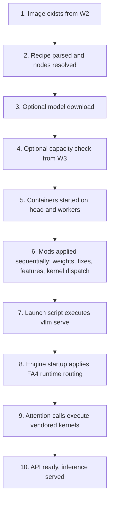
```mermaid
flowchart TD
    Order1["1. Image exists from W2"] --> Order2["2. Recipe parsed and nodes resolved"]
    Order2 --> Order3["3. Optional model download"]
    Order3 --> Order4["4. Optional capacity check from W3"]
    Order4 --> Order5["5. Containers started on head and workers"]
    Order5 --> Order6["6. Mods applied sequentially: weights, fixes, features, kernel dispatch"]
    Order6 --> Order7["7. Launch script executes vllm serve"]
    Order7 --> Order8["8. Engine startup applies FA4 runtime routing"]
    Order8 --> Order9["9. Attention calls execute vendored kernels"]
    Order9 --> Order10["10. API ready, inference served"]
```

| Predecessor | Successor | Dependency Type | Failure Semantics |
|-------------|-----------|-----------------|-------------------|
| W2 image build | W1 run phase | Hard (image must exist) | Prompt to build or abort |
| Weight verification | Mod application / launch | Hard data dependency | Exit 1, single reason line |
| W3 capacity profile | W1 host selection | Advisory → hard when enforced | `TopologyError` blocks launch |
| Mod application | `vllm serve` start | Ordering (recipe order matters) | `set -e` aborts container start |
| FA4 dispatch patch | Kernel routing | Runtime hard dependency | Preflight exits 1 before patching |
| Kernel interface validation | Kernel launch | Per-call hard dependency | Assertion/ValueError raised to caller |

---

## 3. Flow Coordination and Control

### 3.1 Multi-Module Coordination Mechanisms

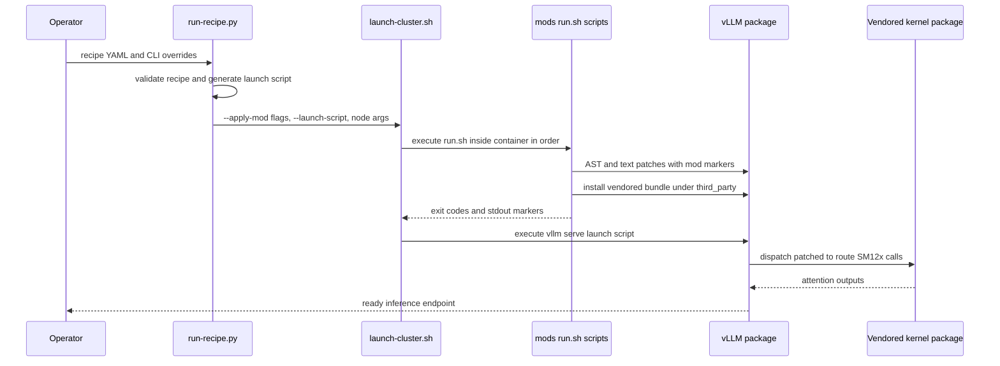
```mermaid
sequenceDiagram
    participant Op as Operator
    participant RR as run-recipe.py
    participant LC as launch-cluster.sh
    participant Mod as mods run.sh scripts
    participant VL as vLLM package
    participant KN as Vendored kernel package
    Op->>RR: recipe YAML and CLI overrides
    RR->>RR: validate recipe and generate launch script
    RR->>LC: --apply-mod flags, --launch-script, node args
    LC->>Mod: execute run.sh inside container in order
    Mod->>VL: AST and text patches with mod markers
    Mod->>VL: install vendored bundle under third_party
    Mod-->>LC: exit codes and stdout markers
    LC->>VL: execute vllm serve launch script
    VL->>KN: dispatch patched to route SM12x calls
    KN-->>VL: attention outputs
    VL-->>Op: ready inference endpoint
```

**Coordination principles:**

- **Convention over configuration.** Mods need no registration protocol beyond directory + `run.sh`; discovery is via the recipe `mods:` list and `--apply-mod` flags. The launcher executes them uniformly.
- **Environment variables as the control bus.** Configuration flows as `-e VAR=value` flags: `FES_WEIGHTS_ENABLED`, `FES_WEIGHTS_DIR`, `FES_HUB_MODEL`, `VLLM_SITE_PACKAGES`, `INKLING_SM12_MOD_SKIP_RUNTIME_CHECK`, `HF_HUB_OFFLINE`, `CONTAINER_*` (auto-mapped to container env). Mods opt in or out based on presence of these variables (e.g., fes-weights stays inert without `FES_WEIGHTS_ENABLED`).
- **Exit codes as commit signals.** Every mod is fail-fast (`set -euo pipefail`); a non-zero exit stops the launch sequence before the server starts, guaranteeing the engine never runs against a half-patched tree.
- **Standardized log markers.** Bracketed prefixes (`[fes-weights]`, `[inkling-sm12-paged-kv]`, `[memory-profile]`) and structured tokens (`FES_WEIGHTS_OK`, `FES_WEIGHTS_FAIL op=... reason=...`) allow operations teams to grep launch logs for per-mod outcomes.

### 3.2 State Management and Synchronization

**Patch state model** (each patched file independently):

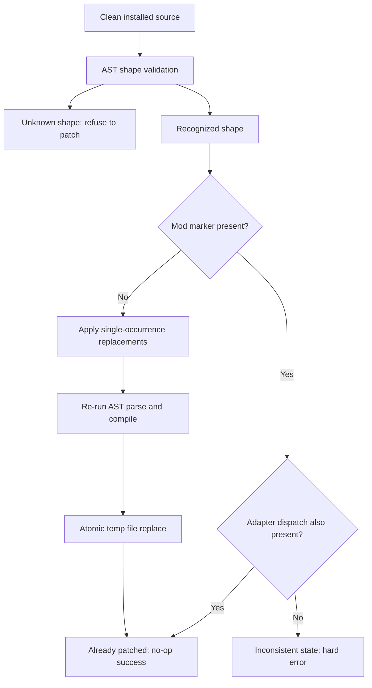
```mermaid
flowchart TD
    Clean["Clean installed source"] --> Validate["AST shape validation"]
    Validate --> ShapeBad["Unknown shape: refuse to patch"]
    Validate --> ShapeOk["Recognized shape"]
    ShapeOk --> MarkerCheck{"Mod marker present?"}
    MarkerCheck -->|Yes| Consistent{"Adapter dispatch also present?"}
    Consistent -->|Yes| Done["Already patched: no-op success"]
    Consistent -->|No| Corrupt["Inconsistent state: hard error"]
    MarkerCheck -->|No| Patch["Apply single-occurrence replacements"]
    Patch --> Recompile["Re-run AST parse and compile"]
    Recompile --> Atomic["Atomic temp file replace"]
    Atomic --> Done
```

State synchronization mechanisms:
- **Mod markers** (`# spark-vllm mod: <name> v<N>`) make patch state detectable and verifiable; presence without the expected code is treated as corruption, not as success.
- **Fingerprint files** (`.fes-shim-fp` in HF hub shims) let the weights mod skip regeneration when the staged directory is unchanged while still detecting drift.
- **JIT caches** (`~/.cache/flashinfer`, `~/.cache/b12x`, `~/.triton`, `~/.tilelang`, mounted by default) persist compiled artifacts across container restarts, synchronized between build (wheel providers) and runtime (kernel JIT).
- **NFS-shared HF cache**: node1's local ext4 cache is NFS-exported to peers; permission fix-ups run on every rank but only node1's root-run actually mutates the shared tree (peers are squashed to `nobody`), a documented convergence-by-idempotency pattern.
- **Profile card status field** (`startup_observed`) is the synchronization point between W3 producers and consumers; anything else is rejected by `capacity.py`.

### 3.3 Data Passing and Sharing

| Artifact | Producer | Consumer | Format | Retention |
|----------|----------|----------|--------|-----------|
| Recipe YAML | Model/infra developer | `run-recipe.py` | YAML | Versioned in repo |
| Generated launch script | `run-recipe.py` | `launch-cluster.sh` | Bash (temp file) | Deleted after run |
| `build-metadata.yaml` | `build-and-copy.sh` | Auditors, cache keys | YAML | Build output |
| FlashInfer JIT wheels | `build_flashinfer_jit_providers.sh` | Container runtime | Wheel + cache | `.wheel-cache` |
| Probe manifest `_spark_memory_profile.json` | `patch.py` | `probe.py` | JSON | Inside package |
| Per-rank event JSONL | `probe.py` | `collect.py` / `profile_card.py` | JSONL per host dir | Bind-mount recommended |
| Profile card | `profile_card.py` | `capacity.py`, `report.py` | YAML | Reusable per model/recipe |
| HF hub-cache shim | `fes-weights run.sh` | `vllm serve` | Symlink tree + refs | Rebuilt on fingerprint change |
| Capacity report | `report.py` | Operator / `run-recipe.py` host choice | Text/YAML | Per profiling run |

### 3.4 Execution Control and Scheduling

- **Phase gating in `run-recipe.py`.** `--build-only`, `--download-only`, `--setup`, `--force-download`, `--dry-run` allow any phase to run or be previewed in isolation. `--dry-run` prints the generated script and the exact `launch-cluster.sh` invocation without executing — the primary development-time control surface.
- **Mode selection.** Solo mode (skip autodetection, single node, no Ray, default `tensor_parallel=1`) versus cluster mode (autodiscovered nodes, head + workers, Ray or `--no-ray`). Recipes can declare `cluster_only: true` (as the Qwen3.5-397B recipe does) or `solo_only: true` to constrain execution mode.
- **Node role scheduling.** The first node is the head (rank 0, Ray master or PyTorch master at `MASTER_PORT`, default 29501); remaining nodes are workers receiving copied images/models. The launcher injects `--nnodes`, `--node-rank`, `--master-addr`, `--master-port` automatically — operators are explicitly instructed not to pass them to `vllm serve`.
- **GPU-level scheduling (W4).** Persistent-kernel CLC tile scheduling distributes work tiles without per-tile relaunch; warp specialization separates DMA and MMA warps; multi-stage mbarrier pipelines overlap load and compute.
- **Resource limits at container level.** Memory limit 110 GB (non-privileged), swap +10 GB, 4096 PIDs, 64 GB shm, 1048576 nofile, optional earlyoom (`-M 524288,102400 -s 200...` style args default `-M 524288,102400 -s 10 -r 60`) as a last-resort OOM handler.

---

## 4. Exception Handling and Recovery

### 4.1 Error Detection and Handling

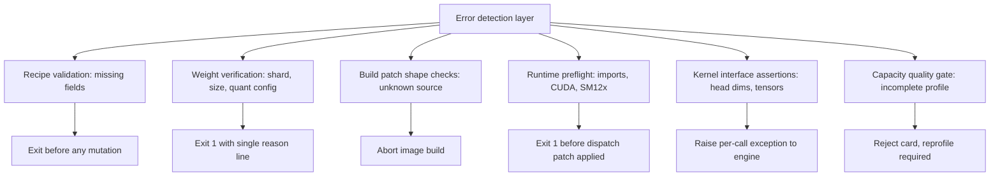
```mermaid
flowchart TD
    Detect["Error detection layer"] --> Gate1["Recipe validation: missing fields"]
    Detect --> Gate2["Weight verification: shard, size, quant config"]
    Detect --> Gate3["Build patch shape checks: unknown source"]
    Detect --> Gate4["Runtime preflight: imports, CUDA, SM12x"]
    Detect --> Gate5["Kernel interface assertions: head dims, tensors"]
    Detect --> Gate6["Capacity quality gate: incomplete profile"]
    Gate1 --> Act1["Exit before any mutation"]
    Gate2 --> Act2["Exit 1 with single reason line"]
    Gate3 --> Act3["Abort image build"]
    Gate4 --> Act4["Exit 1 before dispatch patch applied"]
    Gate5 --> Act5["Raise per-call exception to engine"]
    Gate6 --> Act6["Reject card, reprofile required"]
```

**Detection inventory by layer:**

| Layer | Mechanism | Example Error | Handling |
|-------|-----------|---------------|----------|
| Recipe | Required-field validation, mode constraints | Missing `recipe_version`; `cluster_only` recipe in solo mode | Refuse load; CLI error |
| Build | Shape-aware patchers, `git apply` checks | "expected exactly one anchor; found 0/2" | Build aborts; image not produced |
| Weights | `verify.py` explicit checks | "missing 3/12 shards, e.g. model-00003-of-00012.safetensors" | Single reason line; `FES_WEIGHTS_FAIL` marker; exit 1 |
| Mod runtime | `set -euo pipefail`, `--check` mode, import preflight | "CUTLASS DSL is missing required APIs: ThrMma" | Container start aborts before patching |
| Kernel call | `assert` in `_validate_head_dims`, adapter `RuntimeError`/`ValueError` | "(head_dim, head_dim_v)=(x, y) is not supported on SM100" | Exception propagates to vLLM error path |
| Capacity | `TopologyError`, `ValueError`, quality gate | "Live estimates currently support one GPU rank per physical host" | Fail-closed rejection with reason list |
| Container | earlyoom, docker resource limits | Host memory exhaustion | earlyoom kills lowest-priority processes; container limits prevent host OOM |

### 4.2 Exception Recovery Mechanisms

1. **Idempotent patch application as the primary recovery strategy.** Every patcher can be safely rerun: recognized already-patched state → no-op success; unknown state → hard error (never silent mutation). This means a crashed mod application is recovered simply by restarting the container.
2. **Legacy/main fallback chains.** Feature mods (e.g., diffusiongemma) try the main-branch patch first and fall back to legacy variants, tolerating upstream source drift without operator intervention.
3. **Atomic file replacement.** `patch_inkling.py` writes `<file>.inkling-sm12-mod.tmp` then `replace()`s it — an interrupted write never leaves a truncated Python source file.
4. **Pre-install validation order.** `run.sh` runs `--check` (validate target shape), then dependency preflight, then installs the vendored bundle, then verifies importability of `flash_attn_varlen_func`, and only *then* patches the dispatch. Each stage gates the next, so failure at any point leaves the original dispatch untouched and the engine functional with upstream kernels where supported.
5. **Fingerprint-based artifact rebuild.** HF hub shims are rebuilt only when the weights fingerprint changes, and deleted-then-recreated (`rm -rf snapshots/fes-staged`) when it does — no stale partial shims survive.
6. **Permission convergence.** `fix_hf_cache_perms` tolerates failures on squashed peer ranks (`|| true`) while node1's successful run fixes the shared tree — recovery by convergence rather than distributed coordination.
7. **Reprofiling as capacity recovery.** Context outside profiled bounds raises "a new profile is needed"; the recovery path is to rerun W3, not to guess.

### 4.3 Fault Tolerance Strategy Design

- **Fail-fast philosophy over retry.** The system deliberately avoids blind retries: a failed weight check or patch means *stop*, because proceeding risks serving a corrupted model or running a half-patched engine. Recovery is operator-driven with explicit reason lines.
- **Two-phase patching limits blast radius.** Build-time patches fail in CI/build, not in production; runtime mods fail before `vllm serve` starts, not mid-request.
- **Container-level containment.** Each rank runs in its own container with memory/pid/shm limits and optional earlyoom, so a single rank's runaway heap growth is contained.
- **Downstream fallback.** If the SM12 dispatch mod is absent or skipped, the engine continues with the upstream FA4 path (guarded by capability checks), preserving functionality at reduced optimization level — degradation, not failure.
- **Known gap — no formal mod rollback.** There is no documented revert workflow for a failed runtime mod. Idempotency plus container restart mitigates this (containers are ephemeral, so discarding and restarting re-applies mods cleanly), but a formal `run.sh --revert` path would strengthen operational safety.

### 4.4 Failure Retry and Degradation Matrix

| Failure | Retry Behavior | Degradation Path | Operator Action |
|---------|----------------|------------------|-----------------|
| Weight verification fail | No automatic retry | Serving blocked | Restage weights; rerun recipe |
| Build patch unknown shape | No retry (would corrupt) | Image unavailable | Update patcher for new upstream shape |
| Mod preflight fail (missing CUDA/SM12x) | No retry | Mod skipped only if explicitly bypassed | Fix environment or run on correct hardware |
| Kernel head-dim assertion | Per-call, deterministic | Request fails | Correct model config or use supported shape |
| `deterministic=True` request | N/A | Request rejected | Disable deterministic in engine config |
| Autograd through adapter | N/A | Request rejected (inference-only) | Use training path outside Inkling routing |
| Incomplete profile card | Reprofile (rerun W3) | Host selection blocked | Bind-mount profile dir; ensure full startup coverage |
| Host OOM at startup | Container restart | earlyoom intervention | Use W3 findings; pick larger host or lower KV budget |
| Node instability under load | Manual | — | Recipe-documented workaround: limit GPU clocks (`nvidia-smi -lgc 200,2150`) |

---

## 5. Key Process Implementation

### 5.1 Non-Invasive Source Patching Pipeline (Core Mechanism)

Nearly all system customization flows through one mechanism: idempotent rewriting of the installed vLLM package without modifying upstream in version control.

**Three patcher families:**
1. **AST-based rewriters** (`patch_qwen3_next.py`, `patch_weight_utils.py`, `memory-profile/patch.py`): parse with Python `ast`, locate target nodes by class/function name, regenerate source. Strongest protection against source drift — semantic anchors, not text.
2. **Shape-validated text patchers** (`patch_inkling.py`, `docker/patch_vllm_flashinfer_b12x_swigluoai.py`): AST-parse to verify required functions exist, then perform *exactly-one-occurrence* literal replacements, then `compile()` the result before atomic write. Balanced precision and simplicity.
3. **`git apply` patch files** (`b12x-cache-integrity.patch`, `*.diff`, `fastsafetensors.patch`): applied with pre-checks for existing application to allow idempotent reapply.

**Standard patcher invariants (as implemented):**
- Validate shape before mutating; refuse unknown shapes.
- Detect prior application via marker; verify consistency when found.
- Exactly-one-occurrence replacement counts (0 or 2+ = error).
- `ast.parse` + `compile()` the final text before writing.
- Atomic write via temp file + `replace()`.
- `--check` dry mode for pre-install validation.
- Emit a unique mod marker for traceability.

**Business rule execution:** the patch pipeline is how documented engine-compatibility requirements are *enforced* rather than merely described — the recipe's `mods:` list is the executable specification of which rules apply to a given deployment.

### 5.2 Attention Kernel Data Processing Pipeline (Core Algorithm)

The end-to-end per-request attention pipeline:

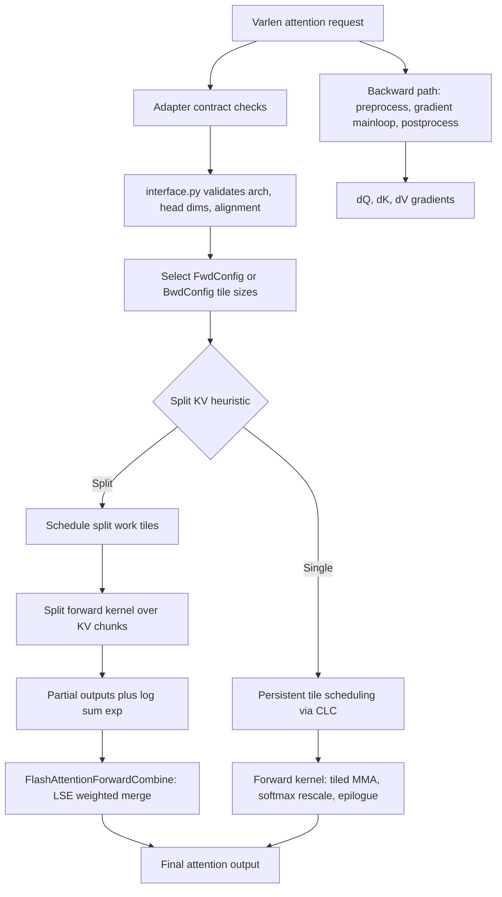
```mermaid
flowchart TD
    Req["Varlen attention request"] --> Adapt["Adapter contract checks"]
    Adapt --> Validate["interface.py validates arch, head dims, alignment"]
    Validate --> Heur["Select FwdConfig or BwdConfig tile sizes"]
    Heur --> Split{"Split KV heuristic"}
    Split -->|Single| Sched["Persistent tile scheduling via CLC"]
    Split -->|Split| SchedS["Schedule split work tiles"]
    SchedS --> FwdK["Split forward kernel over KV chunks"]
    FwdK --> Partial["Partial outputs plus log sum exp"]
    Partial --> Combine["FlashAttentionForwardCombine: LSE weighted merge"]
    Sched --> FwdS["Forward kernel: tiled MMA, softmax rescale, epilogue"]
    Combine --> Out["Final attention output"]
    FwdS --> Out
    Req --> BwdPath["Backward path: preprocess, gradient mainloop, postprocess"]
    BwdPath --> Grads["dQ, dK, dV gradients"]
```

**Algorithmic detail:**

1. **Input normalization and validation.** Architecture detection (cached, overridable), head-dim validation per compute capability (including DeepSeek `(192,128)` and MLA-absorbed `(64,512)` shapes), tensor alignment checks, causal/local window resolution.

2. **Tile-size heuristic selection.** Forward: `FwdConfig(m_block_size, n_block_size, mma_pv_is_rs, intra_wg_overlap)` selected from benchmarked per-head-dim tables; the register/shared-memory tradeoff differs per shape (e.g., RS vs noRS at 192× tiles). Backward: `BwdConfig` with pipeline stage counts for Q/dO/PdS, operand swap flags (`SdP_swapAB`, `dKV_swapAB`, `dQ_swapAB`), MMA atom layouts, warp-group count (`num_wg`), and `dQ_single_wg` for narrow shapes.

3. **Split-KV decision.** When the heuristic splits KV work, each split produces numerically-corrected partial outputs with log-sum-exp; `FlashAttentionForwardCombine` merges them via LSE-weighted reduction (`cpasync` data movement, self-contained shared storage). The Inkling adapter path clamps to `num_splits=1` for validated single-split decode.

4. **Tiled MMA execution.** Per-architecture inner loops:
   - **SM90 (Hopper):** warp-specialized producer/consumer pipelines, shared-memory layout atoms, warp-scheduler barrier synchronization; backward recomputes softmax from stored per-row statistics extracted with warp shuffles.
   - **SM100 (Blackwell datacenter):** `tcgen05` tensor-core MMA, TMA descriptor loads, mbarrier multi-stage pipelines, `SharedStorage` class layouts; MLA variant additionally performs hdim splitting for latent attention decomposition.
   - **SM120 (Blackwell consumer):** CpAsync baseline plus a TMA variant (`flash_fwd_sm120_tma.py`) with one DMA warp and N MMA warps, `PipelineTmaAsync`, and KV double buffering — SM80-compatible kernel semantics with Blackwell-era data movement.
   - **Backward mainloops** (`flash_bwd*.py`) orchestrate dQ/dK/dV gradient accumulation with software-pipelined Q and dO loads and hooks for the dQ MMA, reimplemented from CUTLASS C++ mainloops into CuTe-DSL.

5. **Softmax and masking.** Numerically stable online softmax with rescaling inside the mainloop; `mask.py` handles causal/local/window masks; `score_mod`/`aux_tensors` hooks allow relative-position score modifications (used by Inkling FA4 relative attention with `bias_kwargs`).

6. **Paged-KV integration.** `paged_kv.py` prepares page-table layouts; `gather_kv_indices` supports sampling; KV head indexing helpers support GQA/MQA across paged blocks.

### 5.3 Memory Profiling Analysis Pipeline (Data Processing)

```mermaid
flowchart LR
    Events["Per-rank JSONL events"] --> Merge["Merge and summarize"]
    Merge --> Peaks["Compute phase peaks per host"]
    Peaks --> CardY["profile.yaml card"]
    CardY --> Gate["Quality gate: coverage and consistency"]
    Gate --> Calib["cache_model calibration"]
    Calib --> KVE["KV breakdown per context and sequence count"]
    KVE --> Peak["Peak host requirement"]
    Peak --> Util["Minimum GPU utilization inversion"]
    Util --> Fit["Topology fit verdict"]
```

Key formulas implemented in `capacity.py`:
- **Pool geometry check**: `pool_bytes == layers × page_size_bytes` (uniform shared pool required).
- **Per-request blocks**: `per_request = blocks / concurrency`, must resolve to a whole number.
- **KV bytes**: `kv = (sequences × (residual_blocks + full_blocks + slack_blocks − 1) + 1) × pool_bytes`, where `full_blocks = Σ groups count × ceil(context / block_size)` and slack includes speculative lookahead (`1 + ceil(speculative_tokens / block_size)` per group).
- **Shared TP/PP budget**: `max(ceil(demand_i / pool_bytes_i)) × max(pool_bytes_i)` — all stages sized for the largest request.
- **Peak requirement**: `max(before_kv_peak, from_kv_peak − old_kv + new_kv, 0)` — serving KV is never subtracted from the loading peak.
- **Minimum utilization**: invert vLLM's automatic KV budget per rank (`(overhead + kv) / device_total`), limiting rank = maximum.

### 5.4 Weight Integrity Verification Algorithm

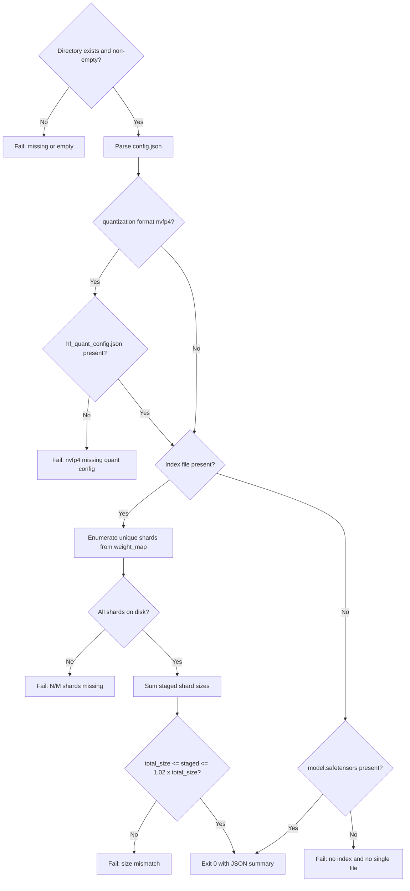
```mermaid
flowchart TD
    Dir{"Directory exists and non-empty?"} -->|No| FailA["Fail: missing or empty"]
    Dir -->|Yes| Cfg["Parse config.json"]
    Cfg --> Quant{"quantization format nvfp4?"}
    Quant -->|Yes| QC{"hf_quant_config.json present?"}
    QC -->|No| FailB["Fail: nvfp4 missing quant config"]
    QC -->|Yes| Idx
    Quant -->|No| Idx{"Index file present?"}
    Idx -->|Yes| Shards["Enumerate unique shards from weight_map"]
    Shards --> Missing{"All shards on disk?"}
    Missing -->|No| FailC["Fail: N/M shards missing"]
    Missing -->|Yes| Size["Sum staged shard sizes"]
    Size --> Tol{"total_size <= staged <= 1.02 x total_size?"}
    Tol -->|No| FailD["Fail: size mismatch"]
    Tol -->|Yes| Ok["Exit 0 with JSON summary"]
    Idx -->|No| Single{"model.safetensors present?"}
    Single -->|No| FailE["Fail: no index and no single file"]
    Single -->|Yes| Ok
```

This algorithm ports the FES cluster-config `verify_location` checks exactly, giving operational parity between the weight-staging toolchain and the serving-time gate.

### 5.5 Chat Template Rendering (Business Rule Execution)

The Qwen3.5 `chat_template.jinja` implements conversation serialization as an executable business rule:
- A `render_content` macro dispatches on content type: plain strings, iterables, and multimodal blocks (image/video) with namespace counters tracking occurrence order.
- **Validation rule**: images in system messages raise a template exception — invalid content placement is rejected at render time rather than silently producing a malformed prompt.
- Recipes select templates explicitly (e.g., `--chat-template unsloth.jinja` in the Qwen3.5-397B recipe, or `chat_template_no_think.jinja` for DiffusionGemma), and fix mods deliver corrected templates through the standard mod mechanism.

### 5.6 Performance Optimization Processes

**GPU compute optimization (kernel domain):**
- **Warp specialization**: dedicated DMA warps and MMA warps (SM120 TMA variant) overlap data movement with tensor-core computation.
- **Software pipelining**: multi-stage mbarrier pipelines (Q/dO loads in backward, KV in forward) keep tensor cores fed; double-buffered KV eliminates load/compute stalls.
- **TMA (Tensor Memory Accelerator)**: `cp.async.bulk` bulk loads replace per-thread async copies for Blackwell-era data movement efficiency.
- **Persistent kernels + CLC tile scheduling**: kernels stay resident and consume work tiles from `tile_scheduler.py`, avoiding repeated launch overhead; cluster launch control coordinates across thread-block clusters.
- **Benchmark-driven tile heuristics**: per-head-dim, per-causality tile selection documented with measured TFLOPS tradeoffs (e.g., avoiding RS at 192× tiles: ~300 vs ~600 TFLOPS).
- **Split-KV parallelism**: long KV sequences split across work units with LSE-correct merge, increasing GPU utilization for long-context decode.
- **JIT caching**: FlashInfer JIT-cache provider wheels prebuilt at image build time; CUTLASS DSL compilation results cached (`~/.cache/b12x` etc.) and bind-mounted across restarts; version pinning (CUTLASS DSL 4.7.0) guarantees cache validity.

**Host memory optimization:**
- **Profiling-driven sizing**: W3's capacity math allows exact KV budgets (`kv_cache_memory_bytes`) and `gpu_memory_utilization` values instead of conservative guesses, directly reclaiming host/GPU memory.
- **Startup heap trims**: `docker/patch_vllm_startup_heap_trim.py` and Spark KV-cache cleanup patches reduce steady-state footprint; `PYTORCH_CUDA_ALLOC_CONF=expandable_segments:True` is set by default in launch Docker args.
- **KV-cache management mods**: `kv-cache-prealloc-cleanup`, `gpu-mem-util-gb` (utilization in GB rather than percentage), and `drop-caches` give per-recipe memory tuning knobs (the Qwen3.5-397B recipe pins `gpu_memory_utilization: 108` GB and `kv_cache_memory_bytes: 2415919104`).
- **Offline serving**: HF hub-cache shims plus `HF_HUB_OFFLINE=1` eliminate network stalls and hub rate-limits at startup on air-gapped clusters.
- **Container guardrails**: memory limits, earlyoom, and nofile/shm/pid tuning prevent host-level memory contention between ranks.

**Build-time optimization:**
- Parallel image copies to worker hosts (`--parallel-copy`), wheel caching to avoid recompilation, architecture-mismatch detection to trigger rebuilds only when needed, and prebuilt runner images as build-cache bases.

---

### 5.7 Development, Operations, and Knowledge-Transfer Guidance

**For development teams:**
- Extend the system through the documented extension points in `run-recipe.py`: new recipe fields → `load_recipe()` validation; new CLI options → argument group + phase handling; new phases → follow the "check → dry-run print → execute" pattern with a `--phase-only` flag.
- Write every new patcher to satisfy the six invariants in §5.1 (shape validation, marker detection, single-occurrence counts, compile check, atomic write, `--check` mode).
- Test with `--dry-run` (prints the generated script and exact launcher invocation) and solo mode before cluster runs.

**For operations teams:**
- Grep launch logs for mod markers (`[fes-weights]`, `[inkling-sm12-paged-kv]`, `[memory-profile]`, `FES_WEIGHTS_OK`/`FES_WEIGHTS_FAIL`) to identify which mod failed and why — every failure emits a single reason line.
- Bind-mount memory-profile output directories to retain profiles after container removal; reuse profile cards keyed by model/recipe before re-profiling.
- Deployment ordering checklist: image built (check `build-metadata.yaml`) → weights verified → capacity profile available → recipe run → API ready.
- Known recipe operational notes are embedded in recipe headers (e.g., set memory utilization in GB not percentage; GPU clock limiting under node instability: `sudo nvidia-smi -lgc 200,2150`).

**For new team members — the five-minute mental model:**
1. `run-recipe.py` reads a YAML recipe and calls `launch-cluster.sh`.
2. The launcher starts containers and runs each mod's `run.sh` — mods patch the installed vLLM in place, idempotently, or die trying.
3. `vllm serve` starts; on SM12.x GPUs the FA4 dispatch patch routes attention to the vendored Blackwell paged-KV kernels.
4. Image builds (`docker/` patches) and memory profiling are the two supporting workflows that feed the deployment path.
5. Everything fails fast with an explicit reason; nothing proceeds on corrupted state.