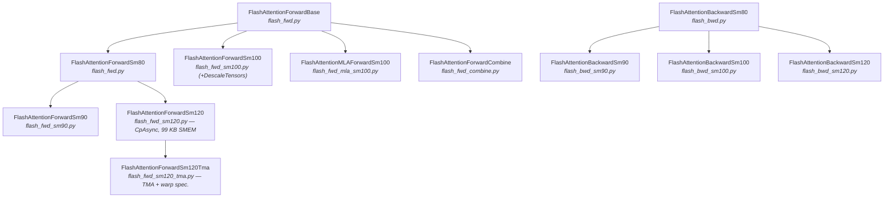
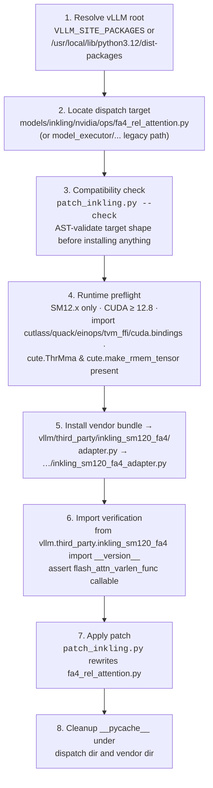
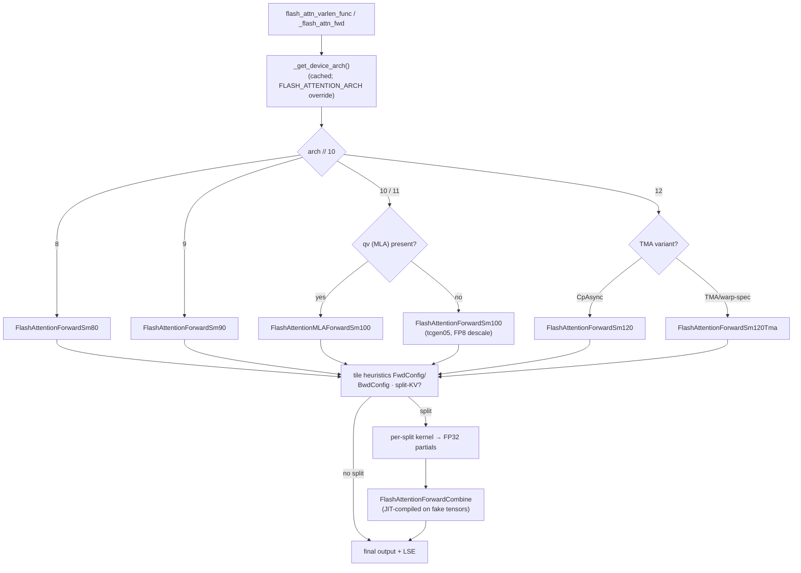

# Attention Kernel Domain — Technical Documentation

| Item | Value |
|---|---|
| **Project** | spark-vllm-docker |
| **Domain** | Attention Kernel Domain (Core Business Domain) |
| **Primary code root** | `mods/inkling-sm12-paged-kv/` |
| **Target hardware** | NVIDIA GPUs with compute capability 12.x (Blackwell — DGX Spark / SM120, SM121), with fallback kernels for SM80/SM90/SM100 |
| **Importance / Complexity** | 9.5 / 9.5 (research assessment) |
| **Interaction style** | Non-invasive, idempotent source patching of the installed vLLM package plus vendored third-party kernel installation |

---

## 1. Purpose and Scope

The Attention Kernel Domain provides the computational core of the spark-vllm-docker system: a **vendored FlashAttention 4 (FA4) kernel package written in NVIDIA CuTe-DSL (CUTLASS Python DSL)** that extends the vLLM serving engine with high-performance attention on Blackwell-class GPUs. Concretely, the domain:

1. **Vendors** a downstream distribution of the Dao-AILab FlashAttention 4 CuTe-DSL kernels, augmented with un-merged SM120 improvements (split-KV FlashDecoding, kernel-level paged-KV cache, TMA forward kernel, block-sparse attention, dropout).
2. **Integrates** those kernels into vLLM by patching the engine's FA4 dispatch source so that compute-capability 12.x devices route attention work to the vendored paged-KV kernel instead of the upstream `vllm.vllm_flash_attn.cute` path.
3. **Exposes** the kernels through a PyTorch-facing layer (autograd Functions, JIT compilation with on-disk cache, tile/split heuristics, input validation) so that downstream vLLM code changes are minimal — a single conditional import.

The domain is *inference-oriented* in its vLLM integration: the adapter that vLLM calls is explicitly inference-only, while the vendored package itself also carries backward kernels and training-capable public APIs for completeness.

### In-scope / Out-of-scope

| In scope | Out of scope |
|---|---|
| Vendored CuTe-DSL FA4 kernel sources (`vendor/inkling_sm120_fa4/`, 44 Python modules) | vLLM core attention backend development |
| PyTorch interface, autograd wrappers, JIT cache, heuristics (`interface.py`) | FlashInfer/B12X kernel libraries (separate domain) |
| vLLM FA4 dispatch patching (`patch_inkling.py`, `run.sh`) | GPU driver / CUDA toolkit provisioning (Container Build domain) |
| Adapter contract for vLLM Inkling models (`adapter.py`) | Model architecture or quantization fixes (Engine Patching domain) |

---

## 2. Sub-Module Structure

```
mods/inkling-sm12-paged-kv/
├── run.sh                        # Mod entry point: preflight, install, patch, verify
├── patch_inkling.py              # AST-validated, marker-guarded FA4 dispatch patcher
├── adapter.py                    # vLLM-facing adapter (installed as …_adapter.py)
└── vendor/inkling_sm120_fa4/     # Vendored kernel package (47 files, ~1.4 MB)
    ├── __init__.py               # Package docstring, __version__, public exports
    ├── UPSTREAM_COMMIT           # Provenance: upstream commits + API migration notes
    ├── LICENSE / AUTHORS
    ├── interface.py              # Kernel Runtime Support — PyTorch/autograd interface
    ├── flash_fwd.py              # Forward: FlashAttentionForwardBase / Sm80
    ├── flash_fwd_sm90.py         # Forward: Hopper (Hopper warp-specialized pipelines)
    ├── flash_fwd_sm100.py        # Forward: Blackwell datacenter (tcgen05, FP8 descale)
    ├── flash_fwd_sm120.py        # Forward: SM120 CpAsync variant
    ├── flash_fwd_sm120_tma.py    # Forward: SM120 TMA + warp specialization
    ├── flash_fwd_mla_sm100.py    # Forward: MLA weight-absorbed kernel (SM100)
    ├── flash_fwd_combine.py      # Split-KV combine kernel
    ├── flash_bwd.py              # Backward: FlashAttentionBackwardSm80
    ├── flash_bwd_sm90.py         # Backward: SM90
    ├── flash_bwd_sm100.py        # Backward: SM100
    ├── flash_bwd_sm120.py        # Backward: SM120
    ├── flash_bwd_preprocess.py / flash_bwd_postprocess.py
    ├── tile_scheduler.py         # Persistent/static/CLC tile scheduling
    ├── paged_kv.py               # Paged KV-cache manager (PagedKVManager)
    ├── mask.py / softmax.py      # Attention masking, online softmax
    ├── seqlen_info.py / block_info.py   # Sequence length & block-range logic
    ├── pipeline.py / barrier.py / named_barrier.py   # Multi-stage pipeline primitives
    ├── blackwell_helpers.py / ampere_helpers.py      # Architecture helpers (tcgen05 MMA, cp.async)
    ├── pack_gqa.py / topk_gather_kv.py / block_sparsity.py / block_sparse_utils.py
    ├── cache_utils.py / cute_dsl_utils.py / cute_dsl_ptxas.py / copy_utils.py
    ├── dropout.py / fast_math.py / fa_logging.py / utils.py / sm90_config_search.py
    └── benchmark*.py / bench_utils.py                # Micro-benchmark tooling
```

### 2.1 Sub-module: Vendored FlashAttention Kernel Library

**Code paths:** `mods/inkling-sm12-paged-kv/vendor/inkling_sm120_fa4/flash_fwd*.py`, `flash_bwd*.py`

A family of CuTe-DSL kernel classes covering forward and backward passes across SM80/SM90/SM100/SM120, plus MLA and split-K combine variants. The class hierarchy:



**Architectural notes verified in code:**

- **`FlashAttentionForwardBase` / `FlashAttentionForwardSm80`** (`flash_fwd.py`, 1,791 lines) — the CpAsync-based reference implementation. Constructor parameters expose the full configuration surface: `dtype`, `head_dim`, `head_dim_v`, `qhead_per_kvhead` (GQA/MQA), `is_causal`, `is_local` (sliding window), `is_split_kv`, `pack_gqa`, `tile_m`/`tile_n`, `num_stages`, `num_threads`, `Q_in_regs`, and `score_mod` (FlexAttention-style score modification). It imports `PagedKVManager`, `AttentionMask`, `Softmax`, `BlockInfo`, `SeqlenInfoQK`, `PackGQA`, and the tile schedulers — i.e., all runtime-support components are wired into the mainloop.
- **`FlashAttentionForwardSm90`** — Hopper path with warp-specialized pipelines and H100-tuned tile configurations (see `_tile_size_fwd_sm90` in `interface.py`, derived from `hopper/tile_size.h` with Python-specific register/shared-memory trade-offs).
- **`FlashAttentionForwardSm100`** — Blackwell datacenter path using `tcgen05` MMA instructions, TMEM accumulators, and `DescaleTensors` for FP8 per-tensor descaling.
- **`FlashAttentionForwardSm120`** (`flash_fwd_sm120.py`) — subclasses the SM80 kernel because SM120 uses the same `mma.sync.aligned.m16n8k16` instructions but has **99 KB shared memory (vs. 163 KB on SM80)**. Two explicit overrides are documented in code: (a) `self.arch = Arch.sm_80` so the O-epilogue uses CpAsync (no TMA-O support in this variant); (b) `self.pack_gqa = False`, disabling PackGQA on the SM80 code path because it is broken for GQA/MQA shapes (tracked upstream as Dao-AILab/flash-attention#2484). `can_implement()` validates dtype (fp16/bf16), head-dim divisibility (`% 8`), tile alignment, thread counts, and the SMEM budget against the SM120 capacity. For split-KV, FP32 partials are written directly from MMA accumulators to GMEM without an SMEM round-trip.
- **`FlashAttentionForwardSm120Tma`** (`flash_fwd_sm120_tma.py`) — the high-performance SM120 variant: `cp.async.bulk` TMA loads, warp specialization (1 DMA warp + N MMA warps), `PipelineTmaAsync` with mbarrier-based KV double-buffering, SM80-compatible tensor-core MMA, and `Swizzle(B, 4, 3)` SMEM layouts (TMA requires `swizzle_base=4`). Validated on SM121a (DGX Spark).
- **`FlashAttentionMLAForwardSm100`** (`flash_fwd_mla_sm100.py`, 3,440 lines) — multi-head-latent-attention weight-absorbed kernel implementing `O = softmax(scale * (Q @ K.T + Qv @ V.T)) @ V`, where `q` is `q_pe`, `qv` is `q_nope`, `K` is `pe_cache`, and `V` is `kv_cache`. Supports `gather_kv_indices` for top-k sparsity with MLA absorption.
- **`FlashAttentionForwardCombine`** (`flash_fwd_combine.py`) — reimplementation (CuTe-DSL) of the Hopper C++ `flash_fwd_combine_kernel.h`; merges FP32 partial outputs and LSE values from split-KV chunks. Parameterized by `dtype_partial`, `tile_m`, `k_block_size`, `log_max_splits` (max 16 splits by default), `num_threads`, `stages`.
- **Backward family** (`flash_bwd*.py`) — `FlashAttentionBackwardSm80` (with `SdP_swapAB`, `dKV_swapAB`, `dQ_swapAB`, `AtomLayout*` tuning knobs), specialized SM90/SM100/SM120 subclasses, plus `flash_bwd_preprocess.py` (dO·O dot products) and `flash_bwd_postprocess.py` (FP32→bf16/fp16 gradient conversion with optional dKV postprocess).

All kernels are expressed in CuTe-DSL and leverage `cpasync`, `tcgen05`, TMA, and multi-stage pipelines. They handle MHA/GQA/MQA, causal/non-causal, variable-length (varlen) batches, sliding-window locality, paged KV caches, block sparsity, and split-KV.

### 2.2 Sub-module: Kernel Runtime Support

**Code paths:** `interface.py`, `paged_kv.py`, `tile_scheduler.py`, `mask.py`, `softmax.py`, `blackwell_helpers.py`, `pipeline.py`, `seqlen_info.py`, `block_info.py`

This is the shared infrastructure that the kernel classes and the PyTorch layer both depend on.

#### `interface.py` (2,417 lines) — the single public façade

Responsibilities, in call order:

1. **Architecture detection** — `_get_device_arch()` (cached) parses `torch.cuda.get_device_capability()` or the `FLASH_ATTENTION_ARCH` environment override (e.g., `sm_80`, `120`) to select the kernel path independently of the compilation target (`CUTE_DSL_ARCH`). Supported capabilities: 8.x, 9.x, 10.x, 11.x, 12.x.
2. **Input validation** — dtype gates (`float16`, `bfloat16`, `float8_e4m3fn`, `float8_e5m2`), contiguity and int32 requirements for `cu_seqlens_*`/`seqused_*`, CUDA-device enforcement (skipped only in fake/compile mode), head-count divisibility, and `_validate_head_dims()` per capability (SM90: 8–256; SM100/110: 8–128 or DeepSeek `(192, 128)` or MLA-absorbed `(64, 512)`; alignment = 16 bytes / element size).
3. **Tile heuristics** — frozen dataclasses `FwdConfig` (`m_block_size`, `n_block_size`, `mma_pv_is_rs`, `intra_wg_overlap`) and `BwdConfig` with per-architecture selection functions (e.g., `_tile_size_fwd_sm90`). Head dims, causality, locality, and block-sparsity block size all influence tile choice.
4. **Kernel selection & compilation** — dispatches to the architecture-appropriate forward class, compiles via `cute.compile` (with `--enable-tvm-ffi`), and memoizes binaries through `cache_utils.get_jit_cache("fwd"/"bwd"/…)`. An optional `CUTE_DSL_PTXAS_PATH` hook (`cute_dsl_ptxas.py`) dumps PTX and compiles with the system ptxas for debugging.
5. **PyTorch/autograd surface** — `FlashAttnFunc` and `FlashAttnVarlenFunc` (`torch.autograd.Function`) wrap `_flash_attn_fwd` / `_flash_attn_bwd`, saving `q, k, v, out, lse` (and cu_seqlens/seqused for varlen) for backward. Public entry points: `flash_attn_func`, `flash_attn_varlen_func`, and `flash_attn_combine`.
6. **Split-K combine plumbing** — `_compile_fwd_combine()` builds the combine kernel against *fake* tensors (shape-only, no GPU needed) so it can be JIT-compiled ahead of first use; `_flash_attn_fwd_combine()` and `flash_attn_combine()` accept 4-D (varlen) or 5-D (batched) partial tensors shaped `(num_splits, …)`.

Notable constraints encoded in `interface.py`: FP8 inputs are **forward-only** (backward raises `NotImplementedError`); `deterministic=True` is not honored by the vendored path; FP8 outputs are promoted to bfloat16.

#### `tile_scheduler.py` (1,096 lines)

Defines `SchedulingMode` (`NONE`, `STATIC`, `DYNAMIC`, `CLC`), `TileSchedulerProtocol` (coordinate mapping from linear tile index → `(m_block, head, batch, split)` plus work distribution), `TileSchedulerArguments` (block/head/batch/split counts, tile shape, varlen tensors, `is_persistent`, `lpt`, `is_split_kv`, `head_swizzle` flags), and concrete schedulers (`SingleTileScheduler`, `SingleTileLPTScheduler`, `SingleTileVarlenScheduler`, plus persistent variants). The `ClcState` dataclass owns the **CLC (Cluster Launch Control) hardware scheduler** state shared between `FlashAttentionForwardSm100` (which creates the CLC response buffer, mbarrier storage, and launch geometry) and the individual schedulers; `WorkTileInfo` extends the CUTLASS utility with a fourth axis for split-KV.

#### `paged_kv.py` (234 lines)

`PagedKVManager` implements kernel-level paged KV-cache access: `load_page_table()` maps logical KV rows through the page table using `FastDivmodDivisor` (page-size divmod), `compute_X_ptr()` resolves per-page global pointers for K and V, and `load_KV()` stages tiles into shared memory through 128-bit `cp.async` copies. Layout differs by architecture: SM100 transposes V in GMEM to `(dv, page_size, num_pages)`, while SM90 keeps V in K's layout and transposes in SMEM before the MMA.

#### `mask.py` (723 lines)

`AttentionMask` computes causal, local (sliding-window), sequence-length, and FlexAttention-style `mask_mod` masking directly on accumulator tiles, including `aux_tensors`-driven modifications. An optimized **R2P (register-to-predicate) bitmask path** (`r2p_bitmask_below/above`, `mask_r2p_lambda`) replaces per-element branches, with coordinate conversions for SM90's non-contiguous MMA column layout and SM100's warp-group-interleaved TMEM rows.

#### `softmax.py` (628 lines)

`Softmax` implements the online softmax (`online_softmax`, `finalize`, `rescale_O`) with `scale_log2`/`exp2`-based math, warp reductions, and optional learnable attention sinks. `SoftmaxSm100` specializes it for the tcgen05 path (single-row accumulators, `rescale_threshold`, `max_offset`).

#### Supporting modules

| Module | Role |
|---|---|
| `seqlen_info.py` | `SeqlenInfo` / `SeqlenInfoQK` / `SeqlenInfoQKNewK` — consolidate cu_seqlens/seqused reads into one per-tile read; batch offsetting (ragged and PackGQA variants); new-K ranges for append-KV |
| `block_info.py` | `BlockInfo.get_n_block_min_max/get_m_block_min_max` — causal/local/split-KV block-range computation, the core loop-iteration bound logic |
| `pipeline.py` | `PipelineStateSimple` (index+phase packed in one Int32), `NamedBarrier`/`PipelineAsync`/`PipelineCpAsync`/`PipelineTmaAsync`/`PipelineUmmaAsync` subclasses adding `elect_one` producer/consumer semantics and `*_w_index_phase` APIs |
| `blackwell_helpers.py` | tcgen05 MMA wrappers (`gemm`, `gemm_ptx` with inline `tcgen05.mma` PTX), SMEM descriptor construction, MMA-kind mapping (f16/tf32/f8f6f4/mxf4…) |
| `ampere_helpers.py` | SM80-era cp.async helpers |
| `pack_gqa.py`, `topk_gather_kv.py`, `block_sparsity*.py` | GQA packing layouts, top-k KV gather, block-sparse tensor normalization and mainloop variants |
| `cache_utils.py`, `cute_dsl_utils.py`, `cute_dsl_ptxas.py` | JIT cache keying/lookup, `to_cte_tensor` conversions, ptxas override |
| `dropout.py`, `fast_math.py`, `fa_logging.py`, `utils.py` | Philox dropout, fast-math intrinsics (`clz`), logging, reduction/layout utilities |
| `sm90_config_search.py`, `benchmark*.py`, `bench_utils.py` | Tile-config search and micro-benchmark tooling |

### 2.3 Sub-module: vLLM Dispatch Integration

**Code paths:** `mods/inkling-sm12-paged-kv/run.sh`, `patch_inkling.py`, `adapter.py`

This sub-module composes the vendored kernels into the engine. It is applied at **runtime** by `launch-cluster.sh --apply-mod mods/inkling-sm12-paged-kv` (sequenced by the recipe's `mods:` list), immediately before `vllm serve` starts.

#### `run.sh` — the mod entry point

Executed with `set -euo pipefail`. The sequence is strictly ordered and fail-fast:



Key environment controls:

| Variable | Effect |
|---|---|
| `VLLM_SITE_PACKAGES` / `PYTHON_ROOT` | Overrides the installed-package root used for both patch target and vendor installation |
| `INKLING_SM12_MOD_SKIP_RUNTIME_CHECK=1` | Skips the CUDA/dependency preflight and import verification (test override only) |

The preflight refuses to proceed unless the device capability major is exactly 12 and PyTorch reports CUDA ≥ 12.8 — the mod is explicitly restricted to SM12.x.

#### `patch_inkling.py` — idempotent AST/text dispatch patcher

The patcher rewrites one file: vLLM's Inkling NVIDIA FA4 relative-attention module (`fa4_rel_attention.py`). It performs **four exact-anchor replacements**, each guarded by `replace_once()` which requires the anchor to occur *exactly once*:

| # | Anchor | Injection |
|---|---|---|
| 1 | `\n\n@cache\ndef _get_score_mod` | Adds the cached capability probe `_use_sm12_paged_kv()` returning `capability.major == 12` |
| 2 | `from vllm.vllm_flash_attn.cute.seqlen_info import SeqlenInfoQK` | Conditional import: `SeqlenInfoQK` from the vendored package when SM12 paged-KV is active, otherwise upstream |
| 3 | Split guard `capability.major == 9: return 1` | Widened to `capability.major in (9, 12): return 1` — the vendored SM12 kernel is validated only with a single split |
| 4 | The FA4 dispatch `else:` block (standard *or* legacy shape) | `flash_attn_varlen_func` is imported from `vllm.third_party.inkling_sm120_fa4_adapter` when `_use_sm12_paged_kv()` is true, otherwise from upstream `vllm.vllm_flash_attn.cute` |

Safety mechanisms (all verified in source):

- **Shape validation before and after** — `validate_shape()` parses the file with `ast.parse` and requires the functions `_use_sheared_bias`, `_get_score_mod`, `inkling_fa4_num_splits`, and `inkling_fa4_rel_attention` to exist; unknown upstream refactors raise instead of producing a corrupt rewrite.
- **Fail-fast on anchor drift** — `replace_once` raises if an anchor is missing or duplicated; the dispatcher block must match one of exactly two known shapes (standard or legacy), otherwise the patch aborts.
- **Compile-before-write** — the patched text is passed to `compile(..., "exec")` before any file is touched.
- **Idempotency marker** — `# spark-vllm mod: inkling-sm12-paged-kv v1`. If the marker is present, the patcher verifies the adapter dispatch is also present and skips; a marker without the adapter dispatch is treated as corruption and refused.
- **Dry-run mode** — `--check` validates compatibility without writing (`compatible` / `already patched`), invoked by `run.sh` *before* the vendor bundle is installed.
- **Atomic write** — the patched file is written to a temporary sibling and `Path.replace()`d into position.

#### `adapter.py` — the vLLM call contract

Installed as `vllm/third_party/inkling_sm120_fa4_adapter.py`, it exposes a single function, `flash_attn_varlen_func`, matching the upstream signature vLLM's Inkling path expects (including `out=`, which the bundled package's public wrapper does not forward — the adapter calls the internal `_flash_attn_fwd` directly to preserve the preallocated-output contract used during warmup and inference). Behavioral guarantees:

- **Inference-only**: raises `RuntimeError` if gradients are enabled and any of `q/k/v` requires grad.
- **`deterministic=True` rejected** — not supported by the adapter.
- **`num_splits` clamped to 1** — a second line of defense behind the patched `inkling_fa4_num_splits()` split guard, because the bundled SM12 interface and its published validation use single-split decode only.

---

## 3. Provenance and Dependencies

### Upstream lineage (from `UPSTREAM_COMMIT` and `__init__.py`)

```
SecondNatureComputing/flash-attn-4-sm120 @ 60117041e10fcc6f19882afd274318c755a5ef6e
  └── CUTLASS DSL 4.6 API migration mirrored from vllm-project/tml-fa4 @ b206834606ed5b5f21f8eed6b0683f528ea9cf7d
        Mechanical substitutions: cute.core.ThrMma → cute.ThrMma, cute.make_fragment → cute.make_rmem_tensor
```

The package (`__version__ = "0.1.0"`) is a downstream distribution of Dao-AILab/flash-attention bundling five open upstream PRs targeting SM120 (RTX PRO 6000, DGX Spark, RTX 5090):

| PR | Content |
|---|---|
| #2336 | SM120 split-KV (FlashDecoding) with FP32 partial outputs |
| #2348 | SM120 kernel-level paged KV cache support (includes #2336) |
| #2349 | SM120 TMA forward kernel with warp specialization |
| #2389 | SM80/SM120 block-sparse forward attention support |
| #2439 | FA4 dropout (Philox-based, per-element, all arches) |

The package docstring states that once these merge upstream, users should prefer the upstream package — the vendored copy exists to give SM120 users access today. The `LICENSE` and `AUTHORS` files travel with the bundle and are verified by `run.sh` before installation.

### Runtime dependencies (enforced by preflight)

| Dependency | Purpose | Version constraint |
|---|---|---|
| `nvidia-cutlass-dsl` (`cutlass`, `cutlass.cute`) | Kernel DSL and compilation | Pinned at **4.7.0** by the image build (`ARG CUTLASS_DSL_VERSION`); required APIs `cute.ThrMma`, `cute.make_rmem_tensor` asserted at preflight |
| `torch` | Tensor layer, autograd, capability query | CUDA ≥ **12.8** required |
| `cuda.bindings` (cuda-python) | Driver-level launches, events | importable |
| `quack` | CuTe-DSL utilities (`layout_utils`, `copy_utils`, `cute_dsl_utils`, `compile_utils`) | importable |
| `einops`, `tvm_ffi` | Tensor reshaping, TVM FFI kernel execution (`--enable-tvm-ffi`) | importable |
| vLLM build with Inkling FA4 | The dispatch target `fa4_rel_attention.py` must exist | mod exits 1 otherwise |

---

## 4. End-to-End Execution Flow

### 4.1 Attention Kernel Dispatch on Blackwell (business flow, importance 9.0)

```mermaid
sequenceDiagram
    participant Recipe as recipes/inkling-small-nvfp4.yaml
    participant LC as launch-cluster.sh --apply-mod
    participant Run as mods/inkling-sm12-paged-kv/run.sh
    participant Patch as patch_inkling.py
    participant VLM as vLLM (fa4_rel_attention.py)
    participant Adp as inkling_sm120_fa4_adapter
    participant IF as vendor/inkling_sm120_fa4/interface.py
    participant K as flash_fwd_sm90/sm100/sm120/mla kernels
    participant GPU as NVIDIA SM12.x GPU

    Recipe->>LC: mods: [mods/inkling-sm12-paged-kv, ...]
    LC->>Run: execute mod entry (ordered)
    Run->>Patch: --check target (AST shape validation)
    Run->>Run: preflight (SM12.x, CUDA ≥ 12.8, deps, CUTLASS APIs)
    Run->>VLM: copy vendor → vllm/third_party/inkling_sm120_fa4 (+ adapter)
    Run->>Run: import verification (bundle version, callable adapter)
    Run->>Patch: apply rewrite (marker-guarded, compile-before-write)
    VLM->>VLM: engine start — FA4 dispatch evaluates _use_sm12_paged_kv()
    Note over VLM: capability.major == 12 → vendored path;<br/>otherwise upstream vllm.vllm_flash_attn.cute
    VLM->>Adp: flash_attn_varlen_func(q, k, v, page_table, out=…)
    Adp->>IF: _flash_attn_fwd(...) with num_splits=1
    IF->>IF: validate inputs, select arch kernel, tile/split heuristics
    IF->>K: cute.compile + launch (cached binary)
    K->>GPU: paged-KV mainloop (cp.async/TMA, online softmax, masking)
    K-->>IF: output (+ optional LSE)
    IF-->>VLM: attention output tensor
```

### 4.2 Kernel-selection decision inside `interface.py`



---

## 5. Configuration and Composition

### 5.1 Recipe integration

The domain is activated declaratively. `recipes/inkling-small-nvfp4.yaml` (two-node DGX Spark deployment of `thinkingmachines/Inkling-Small-NVFP4`, `cluster_only: true`, tensor parallel 2) lists the mod first:

```yaml
mods:
  - mods/inkling-sm12-paged-kv
  - mods/drop-caches
  - mods/instanttensor-hybrid-draft-loader
```

`run-recipe.py` parses the recipe and `launch-cluster.sh` applies each mod directory in order on every node before `vllm serve` starts. No environment variable or flag is needed beyond membership in `mods:` — the mod self-selects at runtime via `_use_sm12_paged_kv()`, so on any device whose capability major is not 12 the patched dispatch transparently falls back to the upstream backend.

### 5.2 Relationship to the container build

The mod directory (including `vendor/inkling_sm120_fa4/`) ships with the repository and is composed into the `vllm-node` image; the *installation into `vllm/third_party/`* and the *dispatch rewrite* happen at mod-application time (container start), not during `docker build`. Build-time interactions with this domain are limited to the CUTLASS DSL pin (`docker/pin_cutlass_dsl.py`, `ARG CUTLASS_DSL_VERSION=4.7.0`) and FlashInfer wheel validation, which guarantee the DSL API surface the kernels compile against.

### 5.3 Domain relations (from architecture research, validated)

| Relation | Type | Strength |
|---|---|---|
| Attention Kernel → Engine Patching (`mods/…` injects `_use_sm12_paged_kv` guard into vLLM FA4 dispatch) | Module composition | 8.5 |
| Attention Kernel → Container Build (vendor sources bundled into image; CUTLASS DSL pinning) | Build-time composition | 7.0 |
| Recipes → Attention Kernel (`inkling-small-nvfp4` and other SM12-class recipes list the mod) | Configuration dependency | 6.0 |

---

## 6. Design Principles and Operational Guidance

**Design principles encoded in this domain**

1. **Patch, never fork.** vLLM receives a four-anchor, marker-guarded rewrite of a single file; everything else is additive (`third_party/` installation). Upstream remains unmodified in version control.
2. **Fail fast on unknown source shapes.** AST validation + exact-count anchors + compile-before-write mean an upstream refactor aborts deployment loudly instead of serving subtly wrong results.
3. **Idempotency via markers.** Re-running the mod (e.g., container restart) is safe: the marker short-circuits the rewrite, and `__pycache__` is purged to prevent stale bytecode.
4. **Guard-then-clamp defense in depth.** The capability check lives in the patched dispatch (`_use_sm12_paged_kv`), the split count is forced to 1 in `inkling_fa4_num_splits`, *and* the adapter clamps `num_splits = 1` again.
5. **Capability-gated activation.** Non-SM12 devices keep the upstream code path even when the patch is applied — the mod degrades to a no-op rather than a failure.

**Operational notes for maintainers**

- **Anchor stability is the primary risk.** Any vLLM change to `_get_score_mod`, the `SeqlenInfoQK` import, the SM9 split guard, or the FA4 dispatch block shape invalidates `patch_inkling.py`. Run `patch_inkling.py --check <target>` against new vLLM versions in CI; add a third dispatch shape if upstream introduces one.
- **Upgrade path.** When the five upstream SM120 PRs (#2336/#2348/#2349/#2389/#2439) merge into Dao-AILab/flash-attention and are picked up by `vllm.vllm_flash_attn.cute`, refresh `UPSTREAM_COMMIT`, re-validate, and retire the vendored bundle in favor of upstream — the dispatch guard makes removal a single-line revert.
- **Version pinning.** The CUTLASS DSL pin (4.7.0) and the API-migration commit (`tml-fa4`) must move together; the preflight's `ThrMma`/`make_rmem_tensor` assertions exist precisely because of the DSL 4.6→4.7 rename (`cute.core.ThrMma` → `cute.ThrMma`, `cute.make_fragment` → `cute.make_rmem_tensor`).
- **Scope boundary.** The adapter is inference-only by contract. Training or gradient-requiring workloads must go through the package's public `flash_attn_func`/`flash_attn_varlen_func` (which support backward, except for FP8), not through the vLLM adapter.
- **SM120 known limitations (documented in code).** PackGQA is disabled on the SM120 CpAsync path (upstream #2484); split-KV is single-split only on the Inkling decode path; TMA-O epilogue is unavailable in the CpAsync variant.

---

## 7. Summary

The Attention Kernel Domain is the highest-complexity asset in spark-vllm-docker: ~1.4 MB of vendored CuTe-DSL FlashAttention 4 sources spanning SM80→SM120 forward/backward/MLA/split-K/paged-KV variants, a 2,400-line PyTorch interface providing validation, heuristics, autograd, and JIT caching, and a small but rigorously guarded integration layer (≈60 lines of patcher + 90-line adapter + 150-line `run.sh`) that splices the vendored paged-KV kernel into vLLM's FA4 dispatch for Blackwell GPUs. Its architecture faithfully embodies the project's system-wide pattern — non-invasive, idempotent, fail-fast source patching with explicit mod markers — while its provenance files and capability-gated fallback keep the coupling to upstream vLLM and Dao-AILab FlashAttention auditable and reversible.