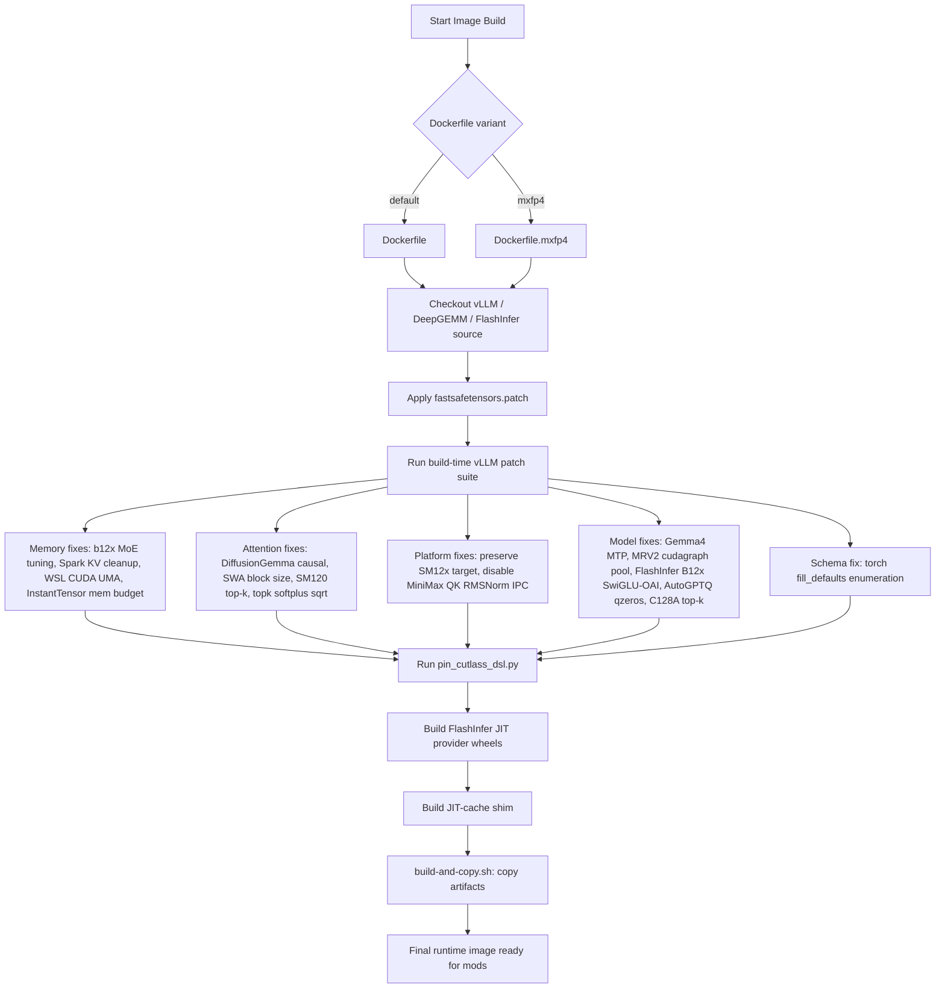
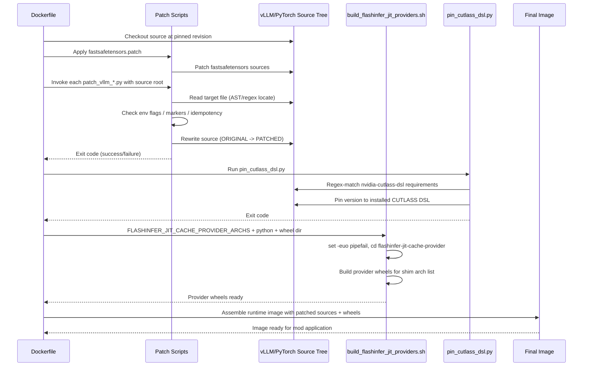

I now have comprehensive understanding of the Container & Build Infrastructure module. Let me write the technical documentation.

---

# Container & Build Infrastructure

## 1. Overview

The **Container & Build Infrastructure** domain is the foundation layer of `spark-vllm-docker`. It produces the runtime container image in which every mod is later applied, and it pre-conditions the same vLLM source tree that deployment-time mods mutate. Unlike the mod system — which operates at *deployment time* inside a running container — this domain operates entirely at *image build time*, baking deterministic, reproducible fixes and dependency pins into the artifact that ships to DGX Spark nodes.

The domain is deliberately scoped to three cooperating submodules:

| Submodule | Responsibility | Primary Artifacts |
|---|---|---|
| **Docker Build Assets** | Assemble the runtime image; build FlashInfer JIT-cache provider wheels; apply the fastsafetensors patch | `Dockerfile`, `Dockerfile.mxfp4`, `docker/build_flashinfer_jit_providers.sh`, `build-and-copy.sh`, `fastsafetensors.patch` |
| **Build-Time vLLM Patches** | A suite of AST/regex-based Python patch scripts applied to the vendored vLLM source during image build | `docker/patch_vllm_*.py`, `docker/patch_instanttensor_vllm_memory.py`, `docker/patch_torch_schema_enumeration.py` |
| **Dependency Pinning** | Pin the CUTLASS CuTe-DSL version required by the vendored attention kernels | `docker/pin_cutlass_dsl.py` |

The central architectural principle is **"patch the dependency, don't fork it"** — expressed here as a *build-time pre-conditioning* strategy. The image build applies a curated set of source transformations so that the resulting `site-packages` tree is already correct for the target hardware (SM12x / DGX Spark) before any mod runs. This split — build-time patches for structural/platform fixes, runtime mods for model-specific and experimental changes — keeps the image stable while allowing per-deployment flexibility.

---

## 2. Architecture

### 2.1 Build Pipeline

The image is assembled through a multi-stage Docker build orchestrated by `build-and-copy.sh`. The pipeline flows as follows:

### 2.2 Multi-Stage Dockerfile Structure

The default `Dockerfile` is a six-stage build that separates concerns and maximizes layer caching:

| Stage | Purpose | Key Outputs |
|---|---|---|
| `base` | Installs CUDA 13.0.2 toolchain, PyTorch 2.13.0, CUTLASS DSL 4.7.0, ccache, and builds NCCL with mesh support | Shared build environment |
| `flashinfer-builder` | Clones FlashInfer, applies optional PRs, builds `flashinfer-python`, `flashinfer-cubin`, and JIT-cache provider wheels | FlashInfer wheel set |
| `flashinfer-export` | Exports FlashInfer wheels via `scratch` stage | Wheel artifacts |
| `vllm-builder` | Clones vLLM + DeepGEMM, applies PR patches and the build-time patch suite, compiles the vLLM wheel | vLLM wheel |
| `vllm-export` | Exports vLLM wheels via `scratch` stage | Wheel artifacts |
| `runner` | Final runtime image; installs wheels from named contexts, applies installed-package patches, sets runtime environment | Deployable image |

The `runner` stage consumes wheels through **named build contexts** (`flashinfer_wheels`, `vllm_wheels`) bind-mounted without adding wheel files to an image layer, keeping the final image lean.

### 2.3 Build Orchestration

`build-and-copy.sh` is the top-level driver. It:

1. **Resolves build profiles** — `regular`, `custom`, or `b12x` for both FlashInfer and vLLM, based on whether refs, PRs, or architecture overrides were requested.
2. **Manages a wheel cache** under `./.wheel-cache/{flashinfer,vllm}/<profile>`, with architecture markers (`.flashinfer-arch`, `.vllm-arch`) that invalidate stale caches when the target GPU architecture changes.
3. **Downloads prebuilt wheels** from GitHub releases (`prebuilt-flashinfer-current`, `prebuilt-vllm-current`) when available, falling back to source builds.
4. **Builds the image** via `docker build`, then **copies it to worker nodes** over SSH (`docker load`).
5. **Generates `build-metadata.yaml`** recording build provenance (vLLM commit, FlashInfer commit, GPU arch, base image, all build args).

A key optimization is the **prebuilt runner image path**: when no custom build is requested, the script pulls `eugr/spark-vllm:latest` directly rather than compiling from source.

---

## 3. Build-Time vLLM Patch Suite

The heart of this domain is a collection of Python patch scripts applied during the `vllm-builder` stage. Each script exposes a `main()` CLI entry point accepting a source root (`argv[1]` or cwd), reads a target file, applies a transformation, and communicates success/failure via exit codes. They are invoked from the Dockerfile as `RUN python3 /tmp/vllm-patches/<script>.py .`.

### 3.1 Patching Techniques

The suite employs several distinct techniques, all designed for **idempotency** and **fail-closed** behavior:

- **AST-driven rewriting** — parse the source with the `ast` module, locate a specific node (class, method, or expression), and rewrite it. Examples: `patch_vllm_wsl_cuda_uma.py` (rewrites the `MemorySnapshot.measure` UMA guard), `patch_vllm_b12x_moe_tuning_memory.py` (rewrites `_PreparedMoECall.make` tensor ownership), `patch_torch_schema_enumeration.py` (rewrites the `fill_defaults` schema loop).
- **Anchored string replacement** — define `ORIGINAL` and `PATCHED` source snippets and replace the bad block with the fixed one, guarded by a `replace_once` helper that fails on zero or multiple matches. Examples: `patch_vllm_autogptq_symmetric_moe_qzeros.py`, `patch_vllm_diffusion_tensor_causal.py`, `patch_vllm_gemma4_mtp_embedding_share.py`, `patch_vllm_routed_experts_weight_shape.py`, `patch_vllm_topk_softplus_sqrt_control_flow.py`, `patch_instanttensor_vllm_memory.py`.
- **Regex/line-based injection** — locate lines by regex and insert blocks, tracking a `changed` flag. Example: `patch_vllm_spark_kv_cache_cleanup.py`.
- **Environment-gated edits** — only patch when an environment variable is set to a truthy value. Examples: `patch_vllm_preserve_sm12x_target.py` (`VLLM_PRESERVE_SM12X_TARGET`), `patch_vllm_b12x_c128a_topk_alignment.py` (`VLLM_PATCH_B12X_C128A_ALIGNMENT`).

### 3.2 Patch Catalog

The patches are grouped by concern:

**Memory & Profiling Fixes**
- `patch_vllm_spark_kv_cache_cleanup.py` — Injects profiling-allocation cleanup into `gpu_worker.py` before KV-cache sizing. It calls `_cleanup_profiling_kv_cache()`, runs `gc.collect()`, synchronizes CUDA, and empties the cache, then recomputes `non_kv_cache_memory`. This prevents warmup reservations from being charged against the KV-cache budget on DGX Spark UMA devices.
- `patch_vllm_b12x_moe_tuning_memory.py` — Rewrites `_PreparedMoECall.make` so temporary MoE tuning tensors are held only for the lifetime of their calls (via `route_ids`), rather than being exported as `PreparedCall.owners` into long-lived serving plans.
- `patch_vllm_mrv2_speculator_cudagraph_pool.py` — Isolates MRV2 speculator CUDA-graph managers during memory profiling. It redirects speculator prefill/decode managers to the throwaway profiling pool and clears their graphs before the real FULL capture, preventing stale allocator handles.
- `patch_vllm_wsl_cuda_uma.py` — Rewrites the `MemorySnapshot.measure` UMA guard so WSL guest RAM is not used to describe CUDA's allocation budget. It also injects the `in_wsl` import. Applied both at source-build time and to installed wheels (`--installed`).
- `patch_instanttensor_vllm_memory.py` — Rewrites InstantTensor's `safe_open._determine_io_params` to use vLLM's platform-aware `MemorySnapshot` free-memory accounting instead of raw `torch.cuda.mem_get_info()`.

**Attention & Kernel Behavior Fixes**
- `patch_vllm_swa_block_size.py` — Restores the unsupported-primary SWA block fallback changed by vLLM PR #53007. On FlashInfer SM12x, a block size of 64 does not divide Qwen3.8's 1648-token page, so it starts small and lets page unification scale the block exactly.
- `patch_vllm_diffusion_tensor_causal.py` — Allows DiffusionGemma to pass a per-request `torch.Tensor` causal mask after vLLM PR #47914 introduced `Mapping[int, bool]`-only handling.
- `patch_vllm_sm120_cooperative_topk.py` — Restricts the cooperative sparse-attention top-k path to SM90. On DGX Spark / SM12.x, `cooperative_topk` fails at launch with "invalid argument", so newer architectures fall back to `persistent_topk`.
- `patch_vllm_topk_softplus_sqrt_control_flow.py` — Fixes the misplaced XPU-only return in `topk_hash_softplus_sqrt` introduced by vLLM PR #49408, which made the CUDA/ROCm kernel call dead code.

**Platform & Build Fixes**
- `patch_vllm_preserve_sm12x_target.py` — Adds `10.3` and `12.1` to `CUDA_SUPPORTED_ARCHS` in `CMakeLists.txt` so CUDA 13 builds preserve the selected Blackwell subarchitecture (and its `a`/`f` suffix) instead of collapsing to generic family entries. Opt-in via `VLLM_PRESERVE_SM12X_TARGET`.
- `patch_vllm_disable_minimax_qk_rmsnorm_ipc.py` — Replaces the `minimax_allreduce_rms_qk` op lookup with `None` for DGX Spark multi-node, disabling the CUDA IPC fused path that fails during Lamport workspace allocation.

**Model-Specific Fixes**
- `patch_vllm_gemma4_mtp_embedding_share.py` — Scopes the EAGLE3 embedding-width guard to EAGLE-style draft models so Gemma4 MTP can share the target backbone embedding before `pre_projection`.
- `patch_vllm_flashinfer_b12x_swigluoai.py` — Orchestrates three patch functions (`patch_flashinfer_util`, `patch_expert`, `patch_oracle`) implementing the runtime subset of vLLM PR #47392, teaching the FlashInfer B12x backend to pass SwiGLU-OAI parameters through.
- `patch_vllm_autogptq_symmetric_moe_qzeros.py` — Prevents AutoGPTQ MoE zero-points from being passed for symmetric quantization, avoiding a wrong zero-point kernel path that crashes Qwen3-Coder-Next AutoRound.
- `patch_vllm_routed_experts_weight_shape.py` — Preserves vector `weight_shape` metadata in `RoutedExperts._load_single_value`, which vLLM PR #43362 incorrectly scalarized.
- `patch_vllm_b12x_c128a_topk_alignment.py` — Imports the missing `_C128A_TOPK_ALIGNMENT` constant used by the B12X DeepSeek V4 path. Opt-in and strictly source-shape-aware.

**Schema Fix**
- `patch_torch_schema_enumeration.py` — Rewrites PyTorch's `fill_defaults` to enumerate `schema.arguments` once via `enumerate()` instead of repeated indexed lookups. Applied to installed Torch (`--installed`).

### 3.3 Idempotency and Fail-Closed Design

Every patch script embodies the same defensive contract:

- **Marker detection** — a `MARKER` string (e.g. `"spark-vllm-docker: preserve unsupported-primary SWA fallback"`) is embedded in the patched source. If present, the script reports "already present; skipping".
- **Source-shape validation** — scripts verify the exact expected anchor count (`count != 1` raises `PatchError`), refusing to patch unknown layouts rather than making best-effort rewrites.
- **Postcondition checks** — after rewriting, scripts re-`compile()` the result and, in some cases, re-parse to confirm the fix is established.
- **Graceful absence** — if the target file or vulnerable pattern is absent (e.g. an older vLLM ref), the script prints a skip message and exits 0.

This design means the same patch suite can be applied across a range of vLLM refs without breaking builds, while still failing loudly on genuinely unexpected source shapes.

---

## 4. Dependency Pinning

### 4.1 CUTLASS DSL Pinning

`docker/pin_cutlass_dsl.py` ensures the CUTLASS CuTe-DSL version required by the vendored `inkling_sm120_fa4` kernels matches the version installed in the image. It uses a `REQUIREMENT` regex to match `nvidia-cutlass-dsl` variants (including `-libs-base/core/cu12/cu13` and `[cu13]` extras) and rewrites the version via `pin_text()`.

A critical reproducibility control is the `--expected-count` argument: the script fails if the number of matched requirements does not equal the expected count. This prevents silent drift when upstream requirement files change. It is invoked in two places:

- **vLLM source build**: `pin_cutlass_dsl.py "$CUTLASS_DSL_VERSION" --expected-count 1 requirements/cuda.txt`
- **B12X source install**: `pin_cutlass_dsl.py "$CUTLASS_DSL_VERSION" --expected-count 5 /tmp/b12x-source/pyproject.toml`

### 4.2 Version Overrides

The `runner` stage uses `uv pip install --override` files to pin `torch`, `torchvision`, `torchaudio`, `nvidia-cutlass-dsl[cu13]`, and `fastapi` so that transitive dependencies cannot trigger an upgrade/downgrade or swap the CUDA-built torch for PyPI's CPU wheel. This is essential because packages such as `quack-kernels 0.6.4` still declare an older CUTLASS DSL constraint that must be overridden by the image-wide pin.

---

## 5. FlashInfer JIT Provider Builds

`docker/build_flashinfer_jit_providers.sh` builds architecture-specific FlashInfer JIT-cache provider wheels. It:

- Runs under `set -euo pipefail` for fail-fast behavior.
- Exits early (0) if `flashinfer-jit-cache-provider` is absent, supporting older refs that build a monolithic JIT-cache wheel.
- Requires `FLASHINFER_JIT_CACHE_PROVIDER_ARCHS` (a whitespace-separated arch list matching the shim's list).
- Iterates over each architecture, cleaning `build` and `flashinfer_jit_cache_provider/jit_cache` directories between targets so each wheel is free of packages from the preceding target.
- Disables filename expansion (`set -f`) to correctly handle the whitespace-separated arch list.

The Dockerfile invokes it after building `flashinfer-python` and `flashinfer-cubin`, then builds the JIT-cache shim itself, and finally dumps the FlashInfer commit and target architecture into the wheels directory for provenance.

---

## 6. fastsafetensors Patch

`fastsafetensors.patch` is a standard unified diff applied during image assembly. It modifies `vllm/model_executor/model_loader/weight_utils.py` to sort `hf_weights_files` using `_natural_sort_key` before partitioning them into sub-lists for parallel loading. This ensures deterministic weight-file ordering in cluster setups (tracking vLLM issue #34180).

---

## 7. Runtime Environment Configuration

The `runner` stage sets several environment variables that shape runtime behavior:

| Variable | Value | Purpose |
|---|---|---|
| `TORCH_CUDA_ARCH_LIST` | `12.1a` | Target Blackwell consumer/DGX Spark architecture |
| `FLASHINFER_CUDA_ARCH_LIST` | `12.1a` | FlashInfer JIT target |
| `TRITON_PTXAS_PATH` | `/usr/local/cuda/bin/ptxas` | Triton JIT assembler |
| `TIKTOKEN_ENCODINGS_BASE` | `$VLLM_BASE_DIR/tiktoken_encodings` | Pre-downloaded tiktoken encodings |
| `VLLM_WSL2_ENABLE_PIN_MEMORY` | `1` | Enables vLLM's WSL2 pinned-memory path |
| `INSTANTTENSOR_IO_DEPTH` | `16` | Limits InstantTensor in-flight I/O to reduce GPU/pinned-host buffer usage |
| `DG_JIT_USE_NVRTC` | `0` | Disabled for DeepGEMM compatibility |

The runner also installs runtime dependencies (`ray[default]`, `fastsafetensors`, `instanttensor`), optionally installs the B12X kernel package from source or PyPI, and fixes the NCCL library symlink so the system NCCL is used instead of the pip-packaged one.

---

## 8. Interaction Model

The modules interact through a **build-time pipeline** rather than runtime APIs. The Dockerfiles act as orchestrators: they copy patch scripts and shell scripts into the build context and invoke them against the checked-out source trees.

### 8.1 Relationship to Other Domains

- **→ Mod Management & Patch Orchestration (Data Dependency, strength 7.0):** The container image provides the installed vLLM `site-packages` that mods patch at deployment time. Build-time patches pre-condition the same source tree, so mods can assume a known baseline.
- **→ FlashAttention Kernel Domain (Configuration Dependency, strength 7.0):** `pin_cutlass_dsl.py` pins the CUTLASS CuTe-DSL version required to compile the vendored `inkling_sm120_fa4` kernels, ensuring reproducible kernel compilation.

The build-time/runtime split is a deliberate architectural boundary: structural and platform fixes that are stable across deployments live in the image, while model-specific and experimental changes are deferred to mods.

---

## 9. Design Rationale and Trade-offs

### Strengths

1. **Reproducibility controls** — CUTLASS DSL pinned with exact-count enforcement; `build-metadata.yaml` records full build provenance; architecture markers invalidate stale wheel caches.
2. **Fail-closed patching** — Every patch validates source shape and refuses to guess, preventing silent corruption of the vLLM source tree.
3. **Layered caching** — Multi-stage builds, ccache, uv cache mounts, and a wheel cache with profile separation dramatically reduce rebuild times.
4. **Clean separation** — Build-time patches handle structural/platform concerns; runtime mods handle per-deployment customization.

### Trade-offs and Risks

1. **Patch maintenance surface** — The suite carries many "TEMPORARY PATCH" scripts tied to specific upstream PRs. Each must be removed once the fix lands in the oldest supported vLLM ref, requiring ongoing tracking.
2. **Source-shape coupling** — Anchored string replacement is brittle to upstream refactors; the fail-closed design mitigates this by aborting rather than mis-patching, but it can block builds when upstream changes.
3. **Network dependency** — The build fetches source from GitHub and wheels from GitHub releases; offline builds require pre-populated caches.
4. **Two divergent Dockerfiles** — `Dockerfile` (source-built, CUDA 13.0.2 base) and `Dockerfile.mxfp4` (NGC `nvcr.io/nvidia/pytorch:26.01-py3` base, pinned SHAs) maintain separate dependency strategies, increasing maintenance surface.

---

## 10. Summary

The Container & Build Infrastructure domain is the deterministic foundation of `spark-vllm-docker`. Through a multi-stage Docker build orchestrated by `build-and-copy.sh`, it assembles a runtime image that:

- Pins CUDA 13.0.2, PyTorch 2.13.0, and CUTLASS DSL 4.7.0 for reproducibility.
- Applies a curated, idempotent, fail-closed suite of AST/regex-based vLLM patches that fix memory accounting, attention behavior, platform issues, and model-specific bugs for SM12x / DGX Spark hardware.
- Builds architecture-specific FlashInfer JIT-cache provider wheels.
- Records full build provenance in `build-metadata.yaml`.

By pre-conditioning the vLLM source tree at build time, this domain establishes the stable baseline on which the deployment-time mod system operates — embodying the repository's core "patch the dependency, don't fork it" philosophy at the container layer.