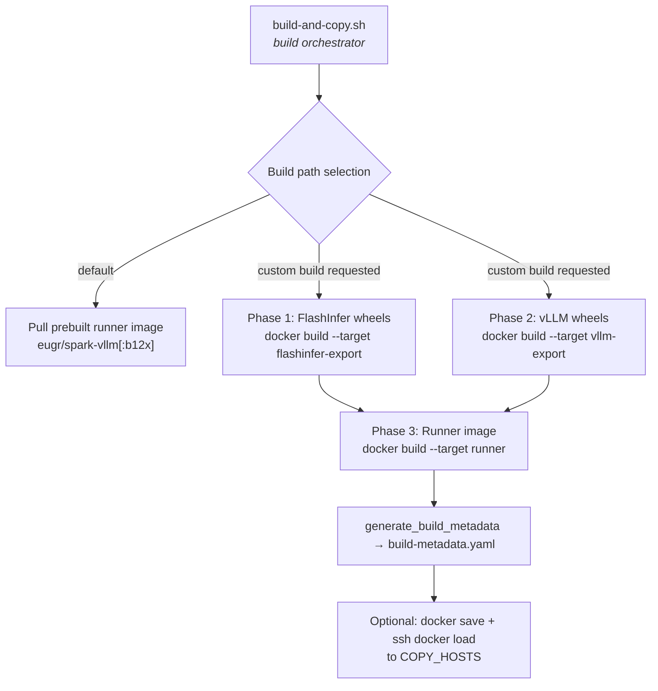
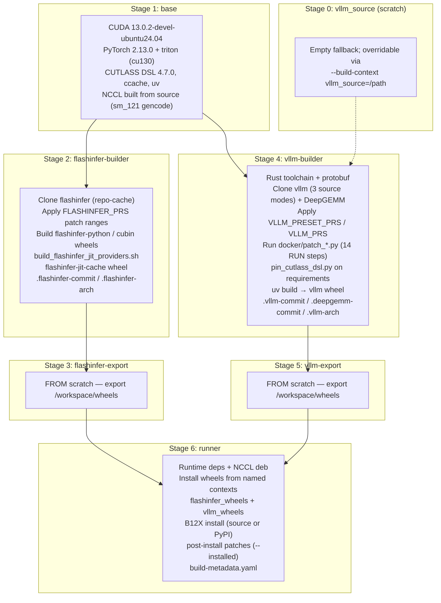
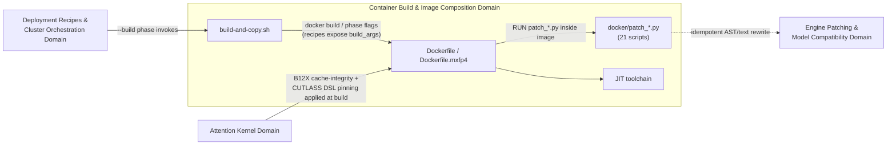

# Container Build & Image Composition Domain — Technical Documentation

**Project:** `spark-vllm-docker`
**Domain classification:** Infrastructure Domain
**Scope:** Dockerfile image definitions, build orchestration scripts, build-time source patch library, FlashInfer JIT toolchain, wheel validation, and MXFP4 image variant.
**Primary artifacts:** `Dockerfile`, `Dockerfile.mxfp4`, `build-and-copy.sh`, `docker/*` (21 Python patch scripts, 1 shell JIT tool, 1 validator, 1 `.patch` file), `fastsafetensors.patch`, `fastsafetensors_mxfp4.patch`

---

## 1. Domain Overview

The Container Build & Image Composition Domain is the infrastructure backbone of `spark-vllm-docker`. It is responsible for producing the deployable container image that carries the patched vLLM serving engine, the FlashInfer kernel stack, and all build-time source modifications required to run LLM inference on NVIDIA Blackwell (SM12.x, target arch `12.1a`) Spark clusters.

The domain answers three questions:

1. **How is the image composed?** — A multi-stage Docker build (`Dockerfile`, 901 lines) that separates dependency installation, FlashInfer wheel building, vLLM source building, wheel export, and final runner assembly into independent, cache-friendly stages.
2. **How is the build driven?** — A 1,505-line orchestrator (`build-and-copy.sh`) that resolves wheel caches, downloads prebuilt wheels from GitHub releases, invokes targeted `docker build --target` phases, validates outputs, generates provenance metadata, and optionally distributes the image to cluster hosts over SSH.
3. **How is upstream source corrected at build time?** — A shared library of 21 idempotent Python patch scripts under `docker/` that are executed as `RUN` steps during the build to rewrite installed vLLM, FlashInfer, B12X, PyTorch, and InstantTensor sources with fail-fast anchors.

This domain **never forks vLLM**. All engine customization is achieved through non-invasive, re-runnable patches applied at two lifecycle tiers: *build time* (this domain, baked into image layers) and *run time* (the Engine Patching & Model Compatibility Domain, applied by `mods/*/run.sh` just before `vllm serve`). Both tiers target the same installed package tree.



---

## 2. Component Map

| Sub-module | Code paths | Responsibility |
|---|---|---|
| **Image Definitions** | `Dockerfile`, `Dockerfile.mxfp4`, `build-and-copy.sh` | Multi-stage base and MXFP4 image definitions; build-and-copy automation with wheel caching, provenance, and host distribution |
| **Build-Time Patch & JIT Toolchain** | `docker/build_flashinfer_jit_providers.sh`, `docker/validate_flashinfer_wheels.py`, `docker/pin_cutlass_dsl.py`, `docker/patch_*.py` (21 scripts), `docker/b12x-cache-integrity.patch` | Patch scripts and shell tools executed during image build to modify installed vLLM/FlashInfer/B12X sources and produce validated FlashInfer JIT-cache provider wheels |
| **Legacy patch files (repo root)** | `fastsafetensors.patch`, `fastsafetensors_mxfp4.patch` | `patch(1)`-format diffs for fastsafetensors loading fixes; the regular Dockerfile variant has these commented out (tracked in vllm-project/vllm#34180), the MXFP4 variant still applies `fastsafetensors_mxfp4.patch` |

---

## 3. Multi-Stage Image Build Pipeline (`Dockerfile`)

The regular image is built through six stages. Each stage is a separate `docker build` target so that wheel artifacts can be exported to the host, cached, validated, and shared across runner builds.



### 3.1 Stage 1 — `base`

- **Base image:** `nvidia/cuda:13.0.2-devel-ubuntu24.04` (overridable via `--build-arg CUDA_IMAGE`).
- Installs build tooling (cmake, ninja, ccache, rdma-core, Python dev headers) and the Python package manager `uv`.
- Installs pinned PyTorch (`TORCH_VERSION=2.13.0`, torchvision `0.28.0`, torchaudio `2.11.0`) from the `cu130` index, plus `nvidia-cutlass-dsl[cu13]==4.7.0` and `apache-tvm-ffi==0.1.12`.
- **Build parallelism** is governed by `BUILD_JOBS` (default 16), exported as `MAX_JOBS`, `CMAKE_BUILD_PARALLEL_LEVEL`, `NINJAFLAGS`, and `MAKEFLAGS` to prevent out-of-memory failures.
- **NCCL is compiled from source** with `NVCC_GENCODE="-gencode=arch=compute_121,code=sm_121"` so that Spark's interconnect topology is supported; the resulting `.deb` is later bind-mounted into the runner stage.
- Environment invariants: `DG_JIT_USE_NVRTC=0` (DeepGEMM conflict avoidance), `USE_CUDNN=1`, `TORCH_CUDA_ARCH_LIST=12.1a`, ccache configured with a 50 GB compressed cache.

### 3.2 Stage 2 — `flashinfer-builder`

- Clones `flashinfer-ai/flashinfer` into a persistent BuildKit cache mount (`/repo-cache`) with cache-hit/fetch semantics to avoid full re-clones; `CACHEBUST_FLASHINFER` forces a fresh clone.
- **Upstream PR grafting:** `FLASHINFER_PRS` accepts PR numbers. For each PR, the build fetches `pull/<pr>/head`, computes the PR's patch range against `origin/main` (`merge-base..pr-head`), generates a binary-safe diff, checks idempotency via `git apply --reverse --check`, and applies with `--3way --index`. Conflicts fail the build. After all PRs, the requested ref must remain an ancestor of the final HEAD (verified with `git merge-base --is-ancestor`).
- Builds three wheel families into `/workspace/wheels`:
  1. `flashinfer-python` (license metadata normalized for uv build),
  2. `flashinfer-cubin`,
  3. `flashinfer-jit-cache` — preceded by **`docker/build_flashinfer_jit_providers.sh`**, which builds one `flashinfer-jit-cache-provider` wheel **per target architecture** in `FLASHINFER_JIT_CACHE_PROVIDER_ARCHS` (default `12.1a`), clearing `build/` and `flashinfer_jit_cache/` between iterations to prevent cross-arch contamination. A `cubins-cache` cache mount reuses checksum-verified cubins (FlashInfer PR #5240).
- Writes provenance markers `.flashinfer-commit` and `.flashinfer-arch` into the wheel directory.

### 3.3 Stage 4 — `vllm-builder`

- Installs a minimal Rust toolchain (required by the vLLM Rust frontend: `VLLM_REQUIRE_RUST_FRONTEND=1`) and protobuf compiler.
- **vLLM source acquisition has three modes** (mutually exclusive, selected by build args):
  1. **`remote` (default):** clone `VLLM_REPO` (default `https://github.com/vllm-project/vllm.git`) at `VLLM_REF` into the shared `/repo-cache`; upstream checkouts share the cache, custom forks bypass it entirely so a fork can never mutate the upstream clone.
  2. **Custom repository:** `VLLM_REPO != upstream` — cloned outside the shared cache.
  3. **Local source:** `--build-context vllm_source=<path>` with `VLLM_SOURCE_MODE=local` and `VLLM_SOURCE_COMMIT`; the staged checkout must be a clean Git worktree without submodules, and its `HEAD` must match the declared commit.
- DeepGEMM is pinned to commit `a6b593d2…` (`DEEPGEMM_REPO`/`DEEPGEMM_REF`) due to an SM121 MXFP4 grouped scale-factor regression first observed at `nv_dev f8e8fb5` (PR #384).
- **vLLM PR grafting (`VLLM_PRESET_PRS`, `VLLM_PRS`, `VLLM_APPLY_PRESET_PRS`):** numeric PR refs resolve against upstream `vllm-project/vllm`; full GitHub PR URLs download `<url>.diff` directly. Application semantics mirror FlashInfer's: merge-base patch ranges, idempotency check, `--3way` apply, commit per PR, ancestor verification. Conflicts in `tests/`, `docs/`, `*.md`, `*.rst` are tolerated (resolved with `--ours`); conflicts in code abort the build. Preset PRs apply by default only when building the default `main` ref with no custom PRs (`auto` mode).
- **Build-time patch execution** — 14 `RUN python3 /tmp/vllm-patches/patch_*.py .` steps (see §5) applied against the checked-out source tree before compilation.
- **Requirement preparation:** `pin_cutlass_dsl.py` rewrites every `nvidia-cutlass-dsl…==` pin in `requirements/cuda.txt` to the image-wide version (expected exactly 1 match — fails otherwise); `use_existing_torch.py` preserves the installed PyTorch; `flashinfer` and select test requirements are stripped so the wheel build cannot re-resolve them.
- Compiles the wheel with `uv build --no-build-isolation` under ccache + Cargo cache mounts, then writes `.vllm-commit`, `.deepgemm-commit`, `.vllm-arch`, and optionally bundles `examples/features/structured_diffusion/structured_server.py` as `.vllm-structured-server.py`.

### 3.4 Stage 6 — `runner`

The final production image (`vllm-node` by default):

- Starts fresh from `${CUDA_IMAGE}` (no compiler toolchain), installs runtime OS dependencies, and installs the **NCCL `.deb` produced by the base stage** via `--mount=type=bind,from=base`.
- Downloads Tiktoken encodings (`o200k_base`, `cl100k_base`) for offline use and sets `TIKTOKEN_ENCODINGS_BASE`.
- **Installs wheels from independent named BuildKit contexts** (`--build-context flashinfer_wheels=…`, `vllm_wheels=…`) bind-mounted into the layer — wheel files never persist in image layers. A generated `/tmp/wheel-override.txt` pins `torch`/`torchvision`/`torchaudio` to the installed versions, pins `nvidia-cutlass-dsl[cu13]==4.7.0` (overriding transitive pins such as quack-kernels 0.6.4's 4.6.2), and caps `fastapi[standard]<0.137.0` (FastAPI 0.137.0 `_IncludedRouter` breaks `prometheus-fastapi-instrumentator` route lookup).
- **Optional B12X installation** via `B12X_REPO`/`B12X_REF` (source clone + `pin_cutlass_dsl.py --expected-count 5` on its `pyproject.toml` + install with `--no-deps` + import verification) or `B12X_FROM_PYPI=1` (refreshed PyPI install). B12X kernels remain JIT-compiled at first use.
- **Post-install (installed-tree) patches** run after *all* package installs so they apply uniformly to source-built, prebuilt-wheel, and B12X runners:
  - `patch_b12x_cache_integrity.py --installed` (+ `b12x-cache-integrity.patch`) — validates cached CuTe objects and makes cache writes durable; accepts identical re-apply, fails on a mismatched source shape.
  - `patch_vllm_wsl_cuda_uma.py --installed` — fixes CUDA-on-WSL memory reporting for wheels predating the source-stage patch.
  - `patch_instanttensor_vllm_memory.py --installed` — aligns InstantTensor's memory accounting with vLLM on native UMA and WSL.
  - `patch_torch_schema_enumeration.py --installed` — enumerates Torch schema arguments once per `fill_defaults` call.
- Fixes the NCCL symlink (`libnccl.so.2` → system ARM64 library) and copies `build-metadata.yaml` to `/workspace/build-metadata.yaml`.

### 3.5 MXFP4 Variant (`Dockerfile.mxfp4`)

A separate 296-line Dockerfile for the experimental native-MXFP4 image (`vllm-node-mxfp4`), selected by `build-and-copy.sh --exp-mxfp4`:

- **Different base:** `nvcr.io/nvidia/pytorch:26.01-py3` for both `base` and `runner` stages (NVIDIA NGC PyTorch container).
- Uses pinned fork repositories (`christopherowen/vllm`, `christopherowen/flashinfer`, `christopherowen/cutlass` with explicit SHAs), builds FlashInfer wheels (`flashinfer-python`, `flashinfer-cubin`, `flashinfer-jit-cache`) in a `builder` stage, and applies `fastsafetensors_mxfp4.patch` with `patch -p1` before compiling vLLM.
- Three stages (`base` → `builder` → `runner`); the runner installs wheels from the `builder` bind mount, sets `B12X_AUTOTUNE=0`, and uninstalls `triton-kernels`.
- Flag incompatibility is enforced in `build-and-copy.sh`: `--exp-mxfp4` cannot be combined with `--vllm-repo`, `--vllm-ref`, `--torch-version`, `--torchvision-version`, `--torchaudio-version`, `--flashinfer-ref`, `--tf5`, `--rebuild-flashinfer`, or `--rebuild-vllm`.

---

## 4. Build Orchestration (`build-and-copy.sh`)

`build-and-copy.sh` (1,505 lines) is the single entry point for image preparation and distribution. Its pipeline is: **parse args → validate compatibility → resolve wheel profiles → prepare wheels (download/cache/build) → generate metadata → build runner → copy to hosts → report timings.**

### 4.1 Path selection

| Condition | Action |
|---|---|
| Default invocation (no content-changing flags) | `USE_PREBUILT_IMAGE=true` — pull the tested nightly runner (`eugr/spark-vllm:latest`, or `eugr/spark-vllm-b12x:latest` with `--exp-b12x`) |
| Any content-changing flag (`--exp-mxfp4`, `--vllm-ref`, `--vllm-repo`, `--apply-vllm-pr`, `--flashinfer-ref`, `--rebuild-*`, non-default arch/torch, …) | `CUSTOM_BUILD_REQUESTED=true` — perform a local build |
| `--use-wheels` | Build *only* the runner from existing/downloaded wheels; never compiles implicitly |
| `--no-build` | Skip build; requires `--copy-to` |

### 4.2 Wheel profiles and caching

Wheels are cached under `./.wheel-cache/` in per-profile directories, resolved independently of whether the invocation pulls a prebuilt image or builds locally:

```
.wheel-cache/
├── flashinfer/{regular|custom}/   # custom = non-default ref, PRs, or arch
└── vllm/{regular|b12x|custom}/    # b12x = --exp-b12x; custom = custom repo/ref/PR/torch/arch
```

- **Architecture safety:** every cache directory carries a marker (`.flashinfer-arch`, `.vllm-arch`). If the cached arch differs from `--gpu-arch` (default `12.1a`), the build forces a rebuild (`*_ARCH_REBUILD=true`); with `--use-wheels` (no rebuild requested), it fails with an explicit error instead of silently producing an incompatible image.
- **Prebuilt wheel download (`try_download_wheels`):** fetches release assets from GitHub (`WHEELS_REPO=eugr/spark-vllm-docker`, tags `prebuilt-flashinfer-current` / `prebuilt-vllm-current`) by parsing release HTML pages and HTTP `Last-Modified` headers (no GitHub API). Downloads are skipped when local wheels are newer than the release. A downloaded FlashInfer set must pass `validate_flashinfer_wheel_set` (exactly one `flashinfer_python`, `flashinfer_cubin`, `flashinfer_jit_cache` wheel plus provider completeness via `docker/validate_flashinfer_wheels.py`); on any failure, previously cached wheels and provenance markers are restored atomically. Downloaded sets record the release commit in `.{prefix}-commit`.
- **Atomic promotion:** rebuilds stage into a temp directory, run `validate_exported_wheel_set` (vLLM: exactly one `vllm-*.whl` plus `.vllm-commit`, `.deepgemm-commit`, `.vllm-arch`; FlashInfer: complete set plus commit/arch markers), then `promote_wheel_set` swaps it into the profile directory with backup-and-rollback on failure.
- `--cleanup` removes wheels and markers from all five cache profiles.

### 4.3 Build phases

1. **Phase 1 — FlashInfer wheels:** `docker build --target flashinfer-export --output type=local,dest=<staging>` with `FLASHINFER_REF`, `FLASHINFER_PRS`, `FLASHINFER_CUDA_ARCH_LIST` build args.
2. **Phase 2 — vLLM wheels:** `docker build --target vllm-export --output …` with `VLLM_REF`, `VLLM_REPO`, `VLLM_PRS`, `VLLM_APPLY_PRESET_PRS` (auto/1/0 policy: preset PRs apply by default only for default repo/ref builds), `CACHEBUST_VLLM` timestamp on forced rebuilds, and for `--exp-b12x` also `VLLM_PRESERVE_SM12X_TARGET=1` and `VLLM_PATCH_B12X_C128A_ALIGNMENT=1`. Local source builds add `--build-context vllm_source=…`, `VLLM_SOURCE_MODE=local`, `VLLM_SOURCE_COMMIT`.
3. **Phase 3 — Runner:** `docker build -t <tag> --build-context flashinfer_wheels=… --build-context vllm_wheels=…` with optional `B12X_*` args. Preceded by `validate_runner_wheel_inputs` and `generate_build_metadata`.

### 4.4 Provenance (`build-metadata.yaml`)

`generate_build_metadata` writes a YAML manifest (copied into the runner at `/workspace/build-metadata.yaml`) recording: `build_date`, `build_script_commit`, `vllm_version`, `vllm_commit`, `flashinfer_commit`, `gpu_arch`, `base_image` (extracted from the Dockerfile `FROM … AS runner` line), and the full `build_args` set (`vllm_repo`, `vllm_ref`, torch trio, `cutlass_dsl_version`, `b12x_repo/ref/from_pypi`, `transformers_5`, `exp_mxfp4`, `vllm_prs`, `build_jobs`). The file is removed from the host on exit via a cleanup trap.

### 4.5 Host distribution

With `-c/--copy-to [hosts]` (or `COPY_HOSTS` from `.env`/autodiscovery), the orchestrator:

1. Compares local vs. remote image IDs (`docker image inspect --format '{{.Id}}'` over SSH) and skips hosts whose image already matches.
2. `docker save` to a temp file once, then pipes `docker load` over SSH to each target host (`--copy-parallel` runs copies concurrently; any failure aborts).
3. Reports per-host and total transfer timings alongside FlashInfer/vLLM/runner build timings.

### 4.6 Key CLI surface (abridged)

| Flag | Purpose |
|---|---|
| `-t/--tag` | Image tag (defaults `vllm-node`; presets `vllm-node-tf5`, `vllm-node-mxfp4`, `vllm-node-b12x`) |
| `--use-wheels` | Runner-only build from wheels |
| `--gpu-arch` | NCCL/wheel/source target arch (default `12.1a`) |
| `--vllm-repo` / `--vllm-ref` / `--vllm-source-dir` | vLLM source selection (fork, ref, or clean local checkout) |
| `--flashinfer-ref` | FlashInfer ref |
| `--apply-vllm-pr <n\|url>` / `--apply-preset-vllm-prs` | Graft upstream vLLM PRs (repeatable) |
| `--apply-flashinfer-pr <n>` | Graft FlashInfer PRs (repeatable) |
| `--rebuild-flashinfer` / `--rebuild-vllm` / `--force-*-download` | Cache/download controls |
| `--exp-mxfp4` / `--exp-b12x` | Experimental image variants |
| `-j/--build-jobs`, `--network`, `--full-log` | Build environment controls |
| `--cleanup`, `--config`, `--setup`, `--no-build`, `-c/--copy-to [--copy-parallel]` | Cache, config, and distribution controls |

---

## 5. Build-Time Patch Protocol

### 5.1 Design contract

Every patch script under `docker/` adheres to a strict contract shared with the runtime mod protocol:

| Contract element | Implementation |
|---|---|
| Invocation | `COPY docker/patch_*.py /tmp/vllm-patches/` then `RUN python3 /tmp/vllm-patches/<script> .` (source root) or `--installed` (site-packages, located via `importlib.util.find_spec` without importing Torch/CUDA) |
| Anchor discipline | `replace_once(text, old, new, description)` — requires **exactly one** occurrence of the anchor; 0 or >1 raises `PatchError` with "the vLLM source shape has changed" |
| Idempotency | Each script checks whether its target construct already exists (`if f"def {helper}()" not in text`) and skips cleanly on re-run |
| Multi-shape tolerance | Known upstream variants are enumerated (e.g., two recognized `_supports_activation` shapes); anything unrecognized fails closed |
| Failure policy | **Fail fast on unknown source shapes** — never a best-effort rewrite; a drifted upstream aborts the Docker build rather than producing a silently corrupted image |
| Provenance | Comment blocks in the Dockerfile record the triggering upstream PR/commit, the reason, and the removal condition ("Remove once the oldest supported ref contains an equivalent upstream fix") |

### 5.2 Patch catalog

Grouped by target and concern (all paths under `docker/` unless noted):

**Attention / kernel correctness**
- `patch_vllm_flashinfer_b12x_swigluoai.py` — production subset of vLLM PR #47392: plumbs SwiGLU-OAI parameters (`swiglu_alpha/beta/limit`) through the FlashInfer B12x MoE expert path, adds `has_flashinfer_b12x_moe_activation()` capability detection, and lets the NVFP4 oracle select the activation when supported.
- `patch_vllm_sm120_cooperative_topk.py` — PR #43008 selects `cooperative_topk` on all SM90+ devices; it fails to launch on SM12.x ("invalid argument"), so cooperative stays on SM90 and newer archs fall back to `persistent_topk`.
- `patch_vllm_b12x_c128a_topk_alignment.py` — restores a missing alignment-constant import for DeepSeek-V4 C128A top-k width (B12X-only, gated by `VLLM_PATCH_B128A`/`VLLM_PATCH_B12X_C128A_ALIGNMENT`).
- `patch_vllm_topk_softplus_sqrt_control_flow.py` — PR #49408 misplaced the XPU-only return, making the CUDA/ROCm `topk_hash_softplus_sqrt` kernel call dead code (fixed by upstream #49452).
- `patch_vllm_swa_block_size.py` — PR #53007 chose a large SWA kernel block even when unsplit execution is impossible (64 does not divide Qwen3.8's 1648-token page on FlashInfer SM12x); restores the smallest-block fallback and supports both the original selector and #53175's per-layer KV-spec API.
- `patch_vllm_disable_minimax_qk_rmsnorm_ipc.py` — disables the MiniMax QK RMSNorm CUDA IPC fusion (PR #43410) that fails while allocating the Lamport workspace.
- `patch_vllm_diffusion_tensor_causal.py` — PR #47914's per-request `Mapping[int, bool]` causal metadata crashes DiffusionGemma's `torch.Tensor` causal masks.

**Quantization / model loading**
- `patch_vllm_autogptq_symmetric_moe_qzeros.py` — PR #43409 passes AutoGPTQ MoE qzeros for symmetric GPTQ, selecting a wrong zero-point Marlin kernel and crashing Qwen3-Coder-Next AutoRound; applied only when the vulnerable pattern is present.
- `patch_vllm_routed_experts_weight_shape.py` — PR #43362 scalarizes all `_load_single_value()` inputs, breaking 2-element `weight_shape` metadata for compressed-tensors MoE checkpoints.
- `patch_vllm_gemma4_mtp_embedding_share.py` — scopes PR #43957's embedding-width guard to EAGLE-style draft models so Gemma4 MTP's intentional draft/backbone embedding share (1024+2816 → 5632 pre_projection) works (upstream issue #47794).

**Memory / UMA / host RAM**
- `patch_vllm_spark_kv_cache_cleanup.py` — releases temporary CUDA allocator reservations left by profile warmup just before vLLM sizes KV-cache blocks (DGX Spark UMA cleanup).
- `patch_vllm_startup_heap_trim.py` — returns unused glibc CPU heap pages after startup GC in API servers and workers; kept in the source build so exported wheels carry it.
- `patch_vllm_b12x_moe_tuning_memory.py` — local-inference-lab/vllm `3d5f2b04` exports temporary MoE tuning tensors as `PreparedCall.owners` which B12X retains; the patch keeps trial lifetimes in call closures so KV profiling can reclaim them.
- `patch_vllm_wsl_cuda_uma.py` — WSL guest RAM does not describe CUDA's allocation budget on UMA devices; applied in both source and runner (`--installed`) stages.
- `patch_instanttensor_vllm_memory.py` — aligns InstantTensor's available-memory accounting with vLLM on native UMA and WSL.

**Speculative decoding / CUDA graphs**
- `patch_vllm_mrv2_speculator_cudagraph_pool.py` — PR #53307's throwaway CUDA-graph profiling pool only covers the main graph manager; MTP/autoregressive speculator managers could invalidate the persistent FULL-capture pool. Keeps all speculator managers in the throwaway pool.

**Build-system / dependency pinning**
- `pin_cutlass_dsl.py` — rewrites `nvidia-cutlass-dsl…==X` pins in arbitrary text files (used on vLLM `requirements/cuda.txt` with `--expected-count 1` and on B12X `pyproject.toml` with `--expected-count 5`); a count mismatch fails the build, guaranteeing wheel metadata matches the image-wide `CUTLASS_DSL_VERSION`.
- `patch_vllm_preserve_sm12x_target.py` — CUDA 13 vLLM builds collapse `10.3a`/`12.1a` to generic `10.0`/`12.0`; opt-in via `VLLM_PRESERVE_SM12X_TARGET=1` so CMake preserves the selected `a/f`-suffixed target.
- `patch_torch_schema_enumeration.py` — enumerates Torch schema arguments once per `fill_defaults` call (post-install tier).

**B12X cache integrity**
- `patch_b12x_cache_integrity.py` + `b12x-cache-integrity.patch` — applies a reviewed `git apply` patch to the installed/source `b12x/` package (excluding `compile_plan.py` on PyPI 1.3.0 which lacks the planner); `--check` first, then accepts an identical reverse-check (already patched) or fails with "B12X source differs from the reviewed cache implementation; refresh the upstream patch before building."

> **Note:** the research inventory lists 10 patch scripts; the directory actually contains **21** Python patchers. The catalog above covers all of them. Additionally, `fastsafetensors.patch` (repo root) is currently commented out in the regular Dockerfile (tracking vllm-project/vllm#34180), while `fastsafetensors_mxfp4.patch` remains active in `Dockerfile.mxfp4`.

---

## 6. FlashInfer JIT Provider Toolchain

Two scripts constitute the JIT sub-toolchain:

1. **`docker/build_flashinfer_jit_providers.sh`** — executed inside the FlashInfer checkout before building the JIT-cache shim. It no-ops on older refs that still ship a monolithic JIT-cache wheel (no `flashinfer-jit-cache-provider/` directory). For each whitespace-separated arch in `REQUIRED` `FLASHINFER_JIT_CACHE_PROVIDER_ARCHS`, it clears `build/` and `flashinfer_jit_cache/` (setuptools/provider reuse those directories) and runs `uv build --python <build_python> --no-build-isolation --wheel` with `FLASHINFER_JIT_CACHE_PROVIDER_ARCH=<arch>`.

2. **`docker/validate_flashinfer_wheels.py`** — a standard-library-only validator (usable host-side with no package installs) that:
   - Reads `.dist-info/METADATA` from the `flashinfer-jit-cache` wheel;
   - Parses `Requires-Dist` entries for `flashinfer-jit-cache-sm*` providers, **failing** if upstream's unconditional exact-pin format changes instead of silently skipping a dependency;
   - Maps each requested architecture to FlashInfer's provider tag (`12.1a` → `sm121a`, stripping `compute_`/`sm` prefixes and normalizing dots/underscores; rejects invalid arch strings);
   - Verifies a provider wheel exists for every declared dependency (all providers, not only the requested arch), is unique, and its version satisfies the pin (literal equality, or public-version prefix match for local build labels like `0.7.0+cu134`);
   - `--list-provider-wheels` prints validated paths for release publication; errors suggest re-running with `--rebuild-flashinfer`.

The validator is invoked from three places: the runner build's validation gate (`validate_flashinfer_wheel_set` in `build-and-copy.sh`), the downloaded-release completeness check, and the exported-wheel-set check.

---

## 7. Domain Interactions



- **From Deployment Recipes:** `run-recipe.py`'s *Build* phase delegates to `build-and-copy.sh`; recipes may declare `build_args` that flow into Docker build arguments.
- **To Engine Patching:** the `docker/` patch library is shared build infrastructure — engine-level fixes are baked in at build time, while the same installed tree is further patched at container start by `mods/*/run.sh` (a known cross-tier split with no formal linkage between paired patches).
- **To Attention Kernel Domain:** the vendored `inkling_sm120_fa4` kernel sources are copied into the image (via mods at launch), while related B12X cache-integrity and CUTLASS DSL pinning patches are applied at build time.
- **External systems:** vLLM upstream (`vllm-project/vllm`), FlashInfer upstream, fork repositories (`local-inference-lab/vllm`, `lukealonso/b12x`, `christopherowen/*`), PyPI, NVIDIA NGC images, and the GitHub release infrastructure `eugr/spark-vllm-docker` (prebuilt wheels) / `eugr/spark-vllm*` (prebuilt runner images).

---

## 8. Configuration Reference (selected build args / env)

| Argument / Env | Default | Scope | Meaning |
|---|---|---|---|
| `BUILD_JOBS` | `16` | all stages | Compile parallelism (MAX_JOBS/CMAKE/NINJA/MAKEFLAGS) |
| `CUDA_IMAGE` | `nvidia/cuda:13.0.2-devel-ubuntu24.04` | base, runner | Base OS/CUDA image |
| `TORCH_VERSION` / `TORCHVISION_VERSION` / `TORCHAUDIO_VERSION` | `2.13.0` / `0.28.0` / `2.11.0` | base, runner | PyTorch trio (`none` omits torchaudio) |
| `CUTLASS_DSL_VERSION` | `4.7.0` | all | Image-wide CUTLASS DSL pin |
| `TORCH_CUDA_ARCH_LIST` / `FLASHINFER_CUDA_ARCH_LIST` | `12.1a` | builder, runner | Target Blackwell sub-architecture |
| `NCCL_NVCC_GENCODE` | `-gencode=arch=compute_121,code=sm_121` | base | NCCL NVCC targets |
| `VLLM_REPO` / `VLLM_REF` / `VLLM_SOURCE_MODE` | upstream `main` / `remote` | vllm-builder | vLLM source selection |
| `VLLM_PRS` / `VLLM_PRESET_PRS` / `VLLM_APPLY_PRESET_PRS` | `""` / preset list / `auto` | vllm-builder | PR grafting policy |
| `FLASHINFER_REF` / `FLASHINFER_PRS` | `main` / `""` | flashinfer-builder | FlashInfer source + PR grafts |
| `FLASHINFER_JIT_CACHE_PROVIDER_ARCHS` | `12.1a` | flashinfer-builder | Per-arch provider wheel matrix |
| `B12X_REPO` / `B12X_REF` / `B12X_FROM_PYPI` / `B12X_CACHEBUST` | `""` / `""` / `0` / `""` | runner | B12X install mode + refresh key |
| `VLLM_PRESERVE_SM12X_TARGET` / `VLLM_PATCH_B12X_C128A_ALIGNMENT` | `0` / `0` | vllm-builder | Opt-in arch/patch toggles (set to `1` for `--exp-b12x`) |
| `CACHEBUST_FLASHINFER` / `CACHEBUST_VLLM` / `CACHEBUST_DEPS` | `1` (or timestamp) | builders | Force fresh clone/dependency layers |
| `DEEPGEMM_REPO` / `DEEPGEMM_REF` | DeepGEMM @ `a6b593d2…` | vllm-builder | Pinned DeepGEMM (regression guard) |
| `PRE_TRANSFORMERS` | `0` | runner | Legacy flag; no longer set by `build-and-copy.sh` for `--tf5` |

Runtime environment defaults baked into the runner include `VLLM_WSL2_ENABLE_PIN_MEMORY=1`, `INSTANTTENSOR_IO_DEPTH=16`, `TIKTOKEN_ENCODINGS_BASE`, `TRITON_PTXAS_PATH=/usr/local/cuda/bin/ptxas`, `DG_JIT_USE_NVRTC=0`, and `USE_CUDNN=1`.

---

## 9. Operational Practices & Design Rationale

- **Cache-everything BuildKit strategy:** persistent cache mounts for `uv-cache`, `ccache` (50 GB, compressed), `repo-cache` (Git checkouts), `cubins-cache`, Cargo registry/git/target — combined with smart clone-or-fetch Git logic, makes incremental rebuilds after ref bumps cheap while `CACHEBUST_*` args provide explicit invalidation.
- **Fail-fast over best-effort:** every patch, pin, and validation step errors out on unexpected input. This trades occasional build breakage on upstream refactors for the guarantee that no image ships with a silently half-applied patch.
- **Separation of wheel building from runner assembly** (export stages + named contexts) enables: host-side wheel caching and validation, prebuilt-wheel downloads, reuse of one wheel set across multiple runner flavors (regular/B12X/MXFP4), and architecture-mismatch detection via marker files.
- **Two-tier patching awareness:** fixes applied here are permanent image-layer changes; anything model- or recipe-specific stays in the runtime mod layer. Patches that must survive prebuilt-wheel paths are duplicated into the runner's `--installed` tier (WSL UMA, InstantTensor, Torch schema, B12X cache integrity).
- **Reproducibility:** `build-metadata.yaml` plus `.vllm-commit`/`.flashinfer-commit`/`.deepgemm-commit`/`.deepgemm-commit`/arch markers make any image traceable to exact source revisions, applied PRs, and build arguments. Runtime mod application and runtime `--apply-vllm-pr` injections are *not* covered by this metadata — only build-time content is.
- **Known architectural gaps (for maintainers):** (1) build-time (`docker/`) and runtime (`mods/fix-*`) patches form one conceptual "Engine Compatibility" concern without a cross-tier manifest; (2) `fastsafetensors*.patch` live at repo root though commonly attributed to `docker/`; (3) prebuilt wheel/image dependencies on `eugr/*` GitHub releases add external distribution infrastructure to the system boundary.

---

## 10. Summary

The Container Build & Image Composition Domain provides a reproducible, cache-efficient, fail-fast pipeline that transforms unmodified upstream sources (vLLM, FlashInfer, B12X, NCCL, DeepGEMM) into a hardened `vllm-node` runner image for NVIDIA Blackwell Spark clusters. Its defining characteristics are the **multi-stage wheel/runner split** with named BuildKit contexts, the **21-script idempotent build-time patch library** with exact-anchor discipline, the **per-architecture FlashInfer JIT provider build and validation toolchain**, and the **`build-and-copy.sh` orchestrator** that unifies wheel caching, prebuilt downloads, provenance capture, and cluster-wide image distribution — serving as the composition root on which the recipe-driven deployment flows depend.