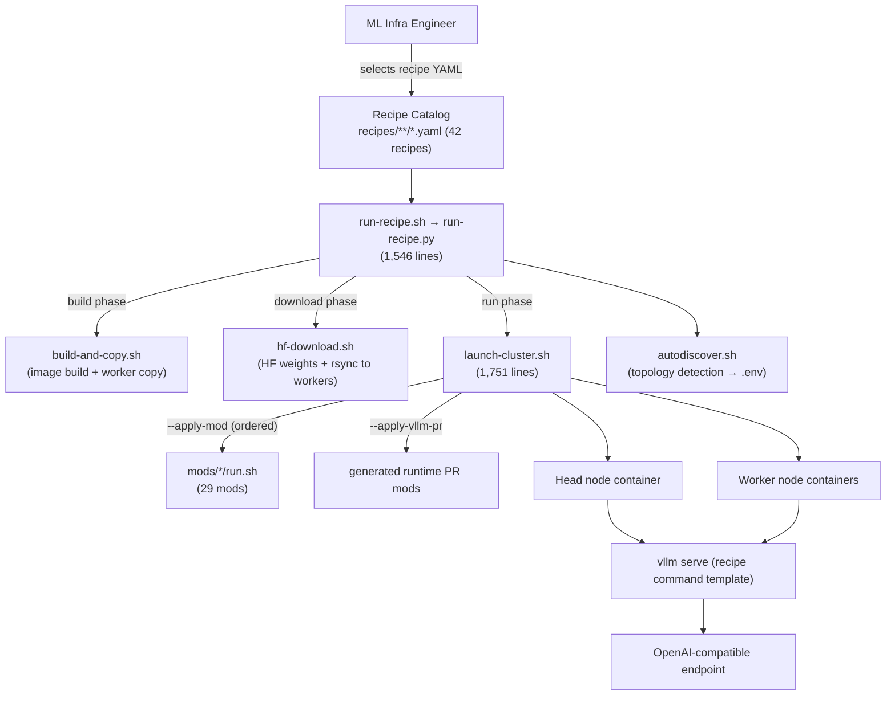
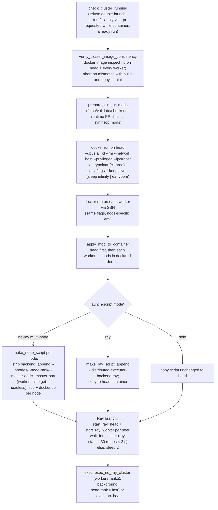

# Deployment Recipes & Cluster Orchestration Domain

**Project:** `spark-vllm-docker`
**Module type:** Core Business Domain (composition root)
**Primary artifacts:** `recipes/`, `run-recipe.sh`, `run-recipe.py`, `launch-cluster.sh`, `autodiscover.sh`, `build-and-copy.sh`, `hf-download.sh`, `examples/`

---

## 1. Domain Overview

The Deployment Recipes & Cluster Orchestration Domain is the **composition root** of `spark-vllm-docker`. It provides the primary user-facing deployment artifact — the declarative YAML *recipe* — and the runner/launcher toolchain that turns a recipe into a running vLLM service on a single Spark node or on a 3x/4x/8x DGX Spark cluster.

Architecturally, this domain sits **above all other domains**. A recipe binds together:

- **Engine Patching & Model Compatibility** — which `mods/fix-*` and feature mods must be applied to the installed vLLM package before serving;
- **Attention Kernel Domain** — which vendored kernel mods (e.g., `mods/inkling-sm12-paged-kv`) must be injected into the engine dispatch path;
- **Model Weights & Offline Serving** — which HuggingFace model to stage and verify for offline serving;
- **Container Build & Image Composition** — which container image (and which Dockerfile/build arguments) to build and distribute;
- **Memory Profiling & Capacity** — capacity profile findings that inform topology-aware host selection before launch.

The domain performs **container-level orchestration only**: node discovery, image distribution, container start, mod application, and `vllm serve` execution over passwordless SSH. Fleet management, training pipelines, and vLLM core development are explicitly out of scope.



### 1.1 Component Inventory

| Component | File(s) | Size | Role |
|---|---|---|---|
| Recipe wrapper | `run-recipe.sh` | 42 lines | Ensures Python 3.10+ and PyYAML, then `exec`s `run-recipe.py` |
| Recipe runner | `run-recipe.py` | 1,546 lines | Pipeline: CLI → Load Recipe → Resolve Nodes → Build → Download → Run |
| Cluster launcher | `launch-cluster.sh` | 1,751 lines | Container start/stop/status/exec across head + workers; mod application |
| Topology discovery | `autodiscover.sh` | 451 lines | IB/Ethernet/node detection, `.env` persistence |
| Image builder | `build-and-copy.sh` | 1,505 lines | Docker build + `build-metadata.yaml` + scp distribution |
| Weight downloader | `hf-download.sh` | 256 lines | HF hub download + rsync to worker hub caches |
| Recipe catalog | `recipes/**/*.yaml` | 42 YAML files | 36 solo/general + 1 (3x) + 4 (4x) + 1 (8x) |
| Direct launch profiles | `examples/*.sh` | 3 scripts | Raw `vllm serve` scripts consumed via `--launch-script` |
| Flavor mods | `mods/use-ngc-vllm`, `mods/use-official-vllm` | — | Container flavor selection/compatibility |

---

## 2. Recipe Catalog

### 2.1 Directory Organization

```
recipes/
├── *.yaml                     # 36 solo / general recipes (auto-solo if one node)
├── 3x-spark-cluster/          # 3-node pipeline-parallel (PP=3)
│   └── qwen3.5-397b-int4-autoround.yaml
├── 4x-spark-cluster/          # 4-node tensor-parallel (TP=4)
│   ├── minimax-m2.5.yaml
│   ├── nemotron-3-ultra-nvfp4.yaml
│   ├── qwen3.5-397b-a17B-fp8.yaml
│   └── qwen3.5-397b-int4-autoround.yaml
└── 8x-spark-cluster/          # 8-node tensor-parallel (TP=8)
    └── glm-5.2-nvfp4.yaml
```

The directory encodes the intended **topology**: cluster recipes declare `cluster_only: true` and set parallelism factors (`tensor_parallel`, `pipeline_parallel`, `decode_context_parallel`) in `defaults` so that the product of factors matches the node count.

### 2.2 Recipe YAML Schema (version `"1"`)

Validated by `load_recipe()` in `run-recipe.py`; supported schema version list is `["1"]` (unknown versions produce a compatibility warning, not a failure).

| Field | Type | Required | Description |
|---|---|---|---|
| `name` | str | ✅ | Human-readable name shown in `--list` and launch banner |
| `recipe_version` | str | ✅ | Schema version (`"1"`); used for compatibility checks |
| `container` | str | ✅ | Docker image tag (e.g., `vllm-node`, `vllm-node-mxfp4`, `vllm-node-b12x`) |
| `command` | str (multiline) | ✅ | `vllm serve` command template with `{placeholder}` variables |
| `description` | str | — | Brief description shown by `--list` |
| `model` | str | — | HuggingFace model ID used by `--setup` / `--download-only` |
| `mods` | list[str] | — | Ordered list of mod directories applied before serving (default `[]`) |
| `defaults` | dict | — | Default values for command placeholders (`port`, `host`, `tensor_parallel`, `pipeline_parallel`, `gpu_memory_utilization`, `max_model_len`, …) |
| `env` | dict | — | Environment variables exported in the launch script (and thus visible to `vllm serve`) |
| `build_args` | list[str] | — | Extra arguments forwarded to `build-and-copy.sh` (e.g., `['-f', 'Dockerfile.mxfp4']`) |
| `cluster_only` | bool | — | Recipe may not run solo (model too large for one node); default `false` |
| `solo_only` | bool | — | Recipe must run on a single node; default `false` |

**Recipe resolution order** (when the CLI argument is not an exact existing path): `path` → `path.yaml` → `path.yml` → `recipes/<name>` → `recipes/<name>.yaml` → `recipes/<name>.yml` → `recipes/<stem>.yaml`. Bare names (e.g., `glm-4.7-flash-awq`) therefore resolve without a path prefix.

### 2.3 Anatomy of a Recipe

Excerpt from `recipes/3x-spark-cluster/qwen3.5-397b-int4-autoround.yaml`:

```yaml
recipe_version: "1"
name: Qwen3.5-397B-INT4-Autoround (PP=3)
description: Recipe for Qwen3.5-397B-INT4-Autoround to run on 3-node mesh in pipeline-parallel mode
model: Intel/Qwen3.5-397B-A17B-int4-AutoRound
cluster_only: true
container: vllm-node

mods:
  - mods/fix-qwen3.5-chat-template      # runtime mod, applied before vllm serve

defaults:
  port: 8000
  host: 0.0.0.0
  pipeline_parallel: 3                  # 3 nodes, PP=3 → 1 GPU per node
  gpu_memory_utilization: 0.7
  max_model_len: 262144
  max_num_batched_tokens: 16384

env:
  VLLM_MARLIN_USE_ATOMIC_ADD: 1         # exported before vllm serve

command: |
  vllm serve Intel/Qwen3.5-397B-A17B-int4-AutoRound \
    --max-model-len {max_model_len} \
    ...
    -pp {pipeline_parallel} \
    --distributed-executor-backend ray
```

Key observations from real catalog entries:

- **`mods` is the contract to the patching domain.** `recipes/inkling-small-nvfp4.yaml` chains three mods (`inkling-sm12-paged-kv`, `drop-caches`, `instanttensor-hybrid-draft-loader`) demonstrating ordered composition of kernel, memory-pressure, and loader concerns in one recipe.
- **`env` carries engine feature flags** (e.g., `VLLM_B12X_MLA_CKV_GATHER`, `CUTE_DSL_ARCH: sm_121a` in the 8x GLM-5.2 recipe) that tune the patched engine without changing the command.
- **`cluster_only` / `solo_only` are enforced hard** by the runner with actionable error messages (suggesting `--discover` or `--solo` respectively).
- **Templates use `str.format()` semantics**; JSON-valued vLLM arguments are single-quoted (`'{{...}}'` escapes) so they pass through templating intact.

---

## 3. Recipe Runner — `run-recipe.sh` / `run-recipe.py`

### 3.1 Wrapper Responsibilities

`run-recipe.sh` is a thin bootstrap: it locates a Python 3 interpreter, verifies **Python ≥ 3.10**, installs PyYAML if missing, then `exec`s `run-recipe.py` with all arguments unchanged.

### 3.2 Deployment Pipeline

The runner self-documents its pipeline as:

```
CLI Args → Load Recipe → Resolve Nodes → Build → Download → Run
```

Each phase can be executed independently via phase-only flags.

```mermaid
sequenceDiagram
    actor User
    participant RR as run-recipe.py
    participant REC as recipes/*.yaml
    participant ENV as .env / autodiscover.sh
    participant BC as build-and-copy.sh
    participant HD as hf-download.sh
    participant LC as launch-cluster.sh
    participant C as containers (head + workers)

    User->>RR: ./run-recipe.py <recipe> [--setup]
    RR->>REC: load_recipe() — resolve path, validate required fields, apply defaults
    RR->>ENV: resolve nodes (CLI -n → .env CLUSTER_NODES → autodiscover)
    Note over RR: enforce cluster_only / solo_only; resolve ETH_IF / IB_IF / COPY_HOSTS
    alt --setup / --build-only / --force-build
        RR->>BC: -t <image> [build_args] [--copy-to workers --copy-parallel]
        BC-->>RR: image built, build-metadata.yaml, image scp'd to workers
    end
    alt --setup / --download-only / --force-download
        RR->>HD: <model> [--copy-to workers --copy-parallel]
        HD-->>RR: weights cached locally + rsynced to worker hub caches
    end
    RR->>RR: generate_launch_script() — merge defaults + CLI overrides, format command,
    RR->>RR:   export env vars, normalize ray/no-ray backend, append extra args
    RR->>LC: -t <image> --apply-mod <recipe mods> [CLI layers] --solo|-n nodes ... --launch-script <tmp.sh>
    LC->>C: start containers, apply mods, distribute launch script, start Ray / per-node ranks
    LC-->>User: vLLM serving (OpenAI-compatible endpoint)
```

### 3.3 Phase Semantics

| Phase | Trigger flags | Behavior |
|---|---|---|
| **Build** | `--setup`, `--build-only`, `--force-build` | Skips build if the image exists locally **and** on every copy target (`ssh docker image inspect`); otherwise builds via `build-and-copy.sh -t <image> [build_args] --copy-to <hosts> --copy-parallel` |
| **Download** | `--setup`, `--download-only`, `--force-download` | Skips if `~/.cache/huggingface/hub/models--<org>--<name>/snapshots` is non-empty; otherwise runs `hf-download.sh <model> --copy-to <hosts>` |
| **Run** | default (unless `--build-only`/`--download-only`) | Writes the generated launch script to a temp file, builds the `launch-cluster.sh` argument vector, executes it, and removes the temp file in a `finally` block |

Copy targets are resolved from `COPY_HOSTS` in `.env` first (mesh-mode topologies may differ from `CLUSTER_NODES`), falling back to worker nodes derived from `CLUSTER_NODES`.

### 3.4 Launch Script Generation

`generate_launch_script()` produces a self-contained bash script that is copied **into the container** and executed there:

1. **Parameter merge** — `{**recipe['defaults'], **overrides}`; CLI flags (`--port`, `--host`/`--tp`, `--gpu-mem`, `--max-model-len`) take precedence. Missing template keys abort with the list of available parameters.
2. **Env exports** — every `env:` entry becomes `export KEY="VALUE"` at the top of the script.
3. **Solo defaults** — in solo mode `tensor_parallel` defaults to `1` unless `--tp` was explicitly provided.
4. **Extra arguments** — anything after `--` is appended verbatim (shlex-quoted); duplicate flags against CLI overrides trigger a "vLLM uses last value" warning.
5. **Backend normalization** — *no-Ray is the default*. Solo mode (or absent `--ray`) strips `--distributed-executor-backend`; `--ray` ensures `--distributed-executor-backend ray` is appended to `vllm serve` commands.

Solo/cluster restrictions are validated: `--ray`/`--no-ray` are rejected in solo mode, `-p` port publishing is solo-only, and `--earlyoom` conflicts with `--keep-entrypoint`.

### 3.5 Node Resolution & Mode Detection

Precedence for cluster nodes:

1. CLI `-n HEAD,WORKER,...`
2. `CLUSTER_NODES` in `.env`
3. Interactive `autodiscover.sh` (invoked automatically, saving results to `.env`)

The first node is always the **head node**; the remainder are workers. If only one node resolves (and `--solo` was not passed), solo mode is activated implicitly. `cluster_only` recipes abort with guidance (`--discover`, then re-run); `solo_only` recipes abort with `--solo` guidance.

### 3.6 CLI Reference (selected)

```
Usage: ./run-recipe.py [recipe] [options] [-- extra vLLM args]

Setup:        --setup | --build-only | --download-only | --force-build | --force-download
Inspection:   --list | --dry-run | --show-env | --discover
Overrides:    --port --host --tp/--tensor-parallel --gpu-mem --max-model-len
Launch:       --solo -n <nodes> -d/--daemon -t <image> --name --master-port
              --ray | --no-ray --nccl-debug -e VAR=VAL -p H:C -v LOCAL:CONT
              --eth-if --ib-if -j N --no-cache-dirs --keep-entrypoint
              --earlyoom [--earlyoom-args ARGS]
              --non-privileged [--mem-limit-gb --mem-swap-limit-gb --pids-limit --shm-size-gb]
Layers:       --apply-mod <path> (repeatable, order-preserving)
              --apply-vllm-pr <PR#|URL> (repeatable, order-preserving)
Config:       --config <file>   (default: .env next to the scripts)
```

`--apply-mod` and `--apply-vllm-pr` use a custom `OrderedLaunchLayerAction` that records **both** the typed list and the mixed CLI ordering, so a user can interleave mods and PRs and have them applied exactly in the stated order after the recipe's own mods.

`--dry-run` prints the resolved configuration, the generated launch script, and the exact `launch-cluster.sh` command line without executing anything.

---

## 4. Cluster Launcher — `launch-cluster.sh`

### 4.1 Actions & Modes

| Action | Behavior |
|---|---|
| `start` | Start containers on all nodes and tail head logs (or `-d` daemon mode) |
| `exec` (default with `--launch-script`) | Start cluster, then execute the command/launch script |
| `stop` | Stop the named container on head and every worker |
| `status` | Report container state per node; print `ray status` when Ray is active |
| `--check-config` | Print resolved configuration (image, interfaces, docker args, runtime PRs) without launching |

### 4.2 Startup Sequence (`start_cluster`)



Notable engineering details:

- **Image consistency gate** — content-addressable image IDs are compared across the whole cluster before any container starts; drift aborts with the exact `build-and-copy.sh --no-build --copy-to` remediation command.
- **Parallelism preflight** — for multi-node `exec`, `-tp`/`-pp`/`-dp` are parsed from the command or launch script; `required = tp × pp × dp` is validated against configured nodes (over-provisioning trims `PEER_NODES`, under-provisioning is a hard error).
- **Network environment injection** — `get_env_flags()` emits per-node `-e` flags: `VLLM_HOST_IP`, `NCCL_SOCKET_IFNAME`/`NCCL_IB_HCA`/`NCCL_IB_DISABLE`, `GLOO_SOCKET_IFNAME`, `TP_SOCKET_IFNAME`, `UCX_NET_DEVICES`, and Ray tunables (`RAY_NODE_IP_ADDRESS`, `RAY_object_store_memory`, …). Solo mode binds everything to loopback with `NCCL_IB_DISABLE=1`.
- **Container privileges** — default is `--privileged --ipc=host --ulimit nofile=1048576`; `--non-privileged` switches to `--cap-add=IPC_LOCK` plus explicit `--memory/--pids-limit/--shm-size` limits. The image entrypoint is cleared by default (`--entrypoint=`) so the launcher fully controls PID 1 (`sleep infinity` or `earlyoom`).
- **Cache mounts** — `~/.cache/{vllm,flashinfer,b12x}`, `~/.triton`, `~/.tilelang` are bind-mounted (disable with `--no-cache-dirs`) to preserve JIT/compilation caches across container restarts.
- **Lifecycle safety** — an `EXIT/INT/TERM/HUP` trap stops head and worker containers unless the cluster was already running or daemon mode was requested; generated PR-mod temp dirs are always cleaned up.

### 4.3 Configuration Source — `.env` and `autodiscover.sh`

`autodiscover.sh` is both a standalone script and a sourced library. It loads `.env` into `DOTENV_*` variables and provides detection functions:

- `detect_interfaces()` — enumerates **active InfiniBand devices** via `ibdev2netdev`, sanity-checks that `enp*` interfaces hold IPs and that no two IP-bearing interfaces share a subnet, then selects IB + Ethernet pair (mesh-mode aware);
- `detect_nodes()`, `detect_local_ip()`, `detect_copy_hosts()`, `save_config()` — persist results to `.env`.

Supported `.env` keys: `CLUSTER_NODES`, `ETH_IF`, `IB_IF`, `MASTER_PORT` (default `29501`), `CONTAINER_NAME`, `LOCAL_IP`, `COPY_HOSTS`, plus any `CONTAINER_*` key which is automatically forwarded as a container `-e` flag (e.g., `CONTAINER_HF_TOKEN=…` → `-e HF_TOKEN=…`).

---

## 5. Mod Orchestration Protocol

### 5.1 How Recipes Drive Mods

A recipe's `mods:` list is translated 1:1 into ordered `--apply-mod` flags:

```
launch-cluster.sh -t <image> \
    --apply-mod <recipe mod 1> --apply-mod <recipe mod 2> ... \   # from recipe
    --apply-mod <cli layer> --apply-vllm-pr <pr> ... \            # CLI layers, in order
    --launch-script <generated script>
```

`launch-cluster.sh` validates each mod path **before** any container starts: a directory must exist and contain `run.sh`; a `.zip` must contain `run.sh` (checked via `unzip -l` or Python `zipfile` fallback); anything else is rejected. Paths are `realpath`-normalized.

### 5.2 Application Mechanics (`apply_mod_to_container`)

For each node (head first, then each worker) and each mod, in declared order:

1. **Stage on host** — local mods are used in place; remote mods are `scp`'d to `/tmp/vllm_mod_pkg_<ts>_<rand>` on the worker;
2. **Copy into container** — `docker exec mkdir -p /workspace/mods/<name>` then `docker cp` (directory contents or zip extraction via Python `zipfile`);
3. **Execute** — `docker exec … cd /workspace/mods/<name> && chmod +x run.sh && ./run.sh` with `WORKSPACE_DIR` exported; a non-zero exit aborts the entire launch with cleanup;
4. **Cleanup** — remote temp staging is removed.

Mods run against **idle containers** (no engine process yet), which removes the need for cross-node mod synchronization. The mod protocol (idempotent AST/text rewrites guarded by `# spark-vllm mod:` markers, fail-fast on unknown source shapes) is defined by the mod authors; this domain only guarantees ordering, distribution, and fail-fast propagation.

### 5.3 vLLM Flavor Selection Mods

| Mod | Purpose |
|---|---|
| `mods/use-ngc-vllm/run.sh` | No-op marker — container initialization is handled natively by `launch-cluster.sh` (the custom image is the default) |
| `mods/use-official-vllm/run.sh` | Compatibility layer for stock `vllm/vllm` images: installs `git`, `earlyoom`, `pytest`; installs `instanttensor` + `scipy` while **pinning the existing Torch build** via constraint/override files; redirects pip `nvidia-nccl-cu13` `libnccl.so.2` to the system NCCL soname to prevent multi-node hangs on DGX Spark |

These mods make the *container flavor* a recipe/CLI-time decision rather than a build-time fork.

---

## 6. Third Patch Channel: Runtime Upstream-PR Injection

Beyond build-time patches (`docker/patch_*.py`) and recipe mods, `launch-cluster.sh --apply-vllm-pr <PR# | GitHub URL>` grafts an **upstream vLLM PR onto the installed runtime package** just before launch:

1. **Normalize** the reference (positive integer or canonical `https://github.com/OWNER/REPO/pull/N` URL) — validated identically in `run-recipe.py` (`runtime_vllm_pr_reference`) and `launch-cluster.sh` (`normalize_vllm_pr_reference`).
2. **Fetch** the `.diff` (3 retries) from `patch-diff.githubusercontent.com` (or the URL + `.diff`), cached per `vllm_pr_slug` (owner-repo-number-sha256[:12]).
3. **Validate runtime applicability** with an embedded Python validator: only paths under `vllm/` are acceptable; docs/tests/CI/examples, `setup.py`, native sources (`.cu/.cpp/.so/...`), and build files are classified — non-runtime changes **reject the PR** with an explicit pointer to the build-time path: *“Use `build-and-copy.sh --apply-vllm-pr` instead.”*
4. **Checksum** — SHA-256 of the diff is recorded alongside the bundle.
5. **Synthesize a mod** — a temporary mod directory (`/tmp/vllm-runtime-pr-mod.XXXXXX`) is generated containing `pr.diff`, `pr-reference`, `pr-label`, `pr.sha256`, and a generated `run.sh` that verifies the checksum, locates the installed package via `importlib.util.find_spec("vllm")` (overridable with `VLLM_PACKAGE_DIR`), and applies the patch with `git apply --include='vllm/**'`.
6. **Idempotency** — `git apply --reverse --check` first; “already applied → skip”; non-clean application fails with rebuild guidance.

Guard rails: the channel refuses to run if cluster containers are already up (cannot verify layering), and the synthetic mod tree is always removed by the cleanup trap.

---

## 7. Direct Launch Profiles — `examples/`

`examples/*.sh` are raw `vllm serve` scripts usable **without a recipe**, via `launch-cluster.sh --launch-script <name>` (resolved against the path, `examples/<name>`, or `examples/<name>.sh`):

```bash
# examples/vllm-glm-4.7-nvfp4.sh
# NOTE: requires --apply-mod mods/fix-Salyut1-GLM-4.7-NVFP4
vllm serve Salyut1/GLM-4.7-NVFP4 \
    --attention-config.backend flashinfer \
    --tool-call-parser glm47 ... -tp 2 --gpu-memory-utilization 0.88
```

They function as low-level profiles: header comments document required companion mods, and the launcher's parallelism parser still validates `tp × pp × dp` against the node list.

---

## 8. Interaction with Sibling Domains

| Relation | Direction | Mechanism |
|---|---|---|
| Recipe → Engine Patching | This domain **configures** | `mods: []` list → ordered `--apply-mod` → `run.sh` execution inside containers |
| Recipe → Container Build | This domain **triggers** | `container` + `build_args` → `build-and-copy.sh -t … [-f Dockerfile.mxfp4]`; existence checks via `docker image inspect` |
| Recipe → Model Weights | This domain **data-depends on** | `model:` field → `hf-download.sh`; offline integrity via `mods/fes-weights` chained in a recipe |
| Recipe → Attention Kernel | This domain **enables** | SM12-class recipes (e.g., `inkling-small-nvfp4`) declare `mods/inkling-sm12-paged-kv` |
| Recipe ← Memory Profiling | This domain **consumes** | `capacity.py` / `report.py` findings guide topology-appropriate host selection before launch |
| Runner ↔ Launcher | This domain **internal** | `run-recipe.py` generates the launch script and composes the full `launch-cluster.sh` argv |

---

## 9. Operational Quick Reference

```bash
# Discover cluster topology once, persist to .env
./run-recipe.sh --discover

# List the catalog with metadata
./run-recipe.sh --list

# Full path: build image + download weights + launch cluster
./run-recipe.sh minimax-m2-awq --setup

# Single-node run with port override and an extra vLLM flag
./run-recipe.sh glm-4.7-flash-awq --solo --port 9000 -- --served-model-name my-api

# Preview everything without executing
./run-recipe.sh deepseek-v4-flash --dry-run

# Add an ad-hoc mod and an upstream PR on top of the recipe
./run-recipe.sh glm-4.7-flash-awq --solo \
    --apply-mod mods/use-official-vllm --apply-vllm-pr 12345

# Low-level cluster lifecycle
./launch-cluster.sh status | stop
./launch-cluster.sh --launch-script examples/example-vllm-minimax.sh --solo
```

**Failure semantics to remember:**

- Weight verification (`mods/fes-weights`) and patch scripts **fail fast** — recipe execution halts rather than serving a corrupted state.
- A failing mod aborts the launch and triggers cluster cleanup (containers stopped on all nodes).
- Image-ID mismatch across nodes aborts before any container starts.
- `cluster_only`/`solo_only` violations and `-p` in cluster mode are hard errors with remediation hints.

---

## 10. Extension Guide

### 10.1 Adding a New Recipe
1. Create `recipes/<topology-dir?>/<name>.yaml` with `recipe_version: "1"` and the four required fields (`name`, `recipe_version`, `container`, `command`).
2. Declare `mods:` **in dependency order** (fix mods before feature mods; kernel mods before launch-sensitive ones).
3. Set `cluster_only`/`solo_only` and matching `defaults` parallelism factors (`tp × pp × dp` = node count).
4. Verify with `./run-recipe.sh <name> --dry-run` — the printed `launch-cluster.sh` command is the ground truth.

### 10.2 Adding a New Mod Consumed by Recipes
1. Create `mods/<name>/run.sh` (`set -euo pipefail`); accept directories **or** zips as long as `run.sh` is present.
2. Resolve the vLLM package via `importlib.util.find_spec("vllm")` (honor `VLLM_PACKAGE_ROOT`/`VLLM_SITE_PACKAGES` overrides).
3. Be **idempotent** (marker comments / already-patched checks) — mods may re-run on restart.
4. Reference the mod from recipes or expose it ad hoc via `--apply-mod`.

### 10.3 Adding New Recipe Fields (runner extension points, per `run-recipe.py` header)
- Update `load_recipe()` (validation + `setdefault`), consume the field in `generate_launch_script()` or `main()`, and document it in the schema docstring; bump `recipe_version` and `SUPPORTED_VERSIONS` when semantics change.
- New CLI options belong to an argument group and must be forwarded in the run-phase `cmd` assembly (and mirrored in the `--dry-run` printer).
- New phases follow the pattern: check → dry-run print → execute → optional `--phase-only` flag.

---

## 11. Design Notes & Known Gaps

- **Composition-root discipline.** All cross-domain binding happens in recipes; no other module hard-codes mod lists or parallelism. This keeps the patch layer, kernel layer, and weight layer independently evolvable.
- **Two-tier patching, one target.** Engine fixes exist both as build-time scripts (`docker/patch_*.py`, baked into the image) and runtime mods (`mods/fix-*`, applied at container start); they mutate the same installed vLLM tree with no cross-tier manifest linking them — the main architectural drift to watch when modifying engine fixes.
- **Reproducibility asymmetry.** Builds emit `build-metadata.yaml` (vLLM/FlashInfer commits, PRs, Torch/CUTLASS versions); runtime mod + PR layers are logged to stdout only. Recording applied runtime PRs/mods alongside markers would close the audit loop.
- **No formal rollback for runtime mods.** Idempotent patching mitigates double-application, but a failed multi-mod sequence relies on container teardown rather than per-mod revert.
- **External documentation gap.** Several recipes and `--list` output reference a README that does not exist in-repository; authoritative knowledge currently lives in the `run-recipe.py` header docstring, `launch-cluster.sh` usage text, and this document.