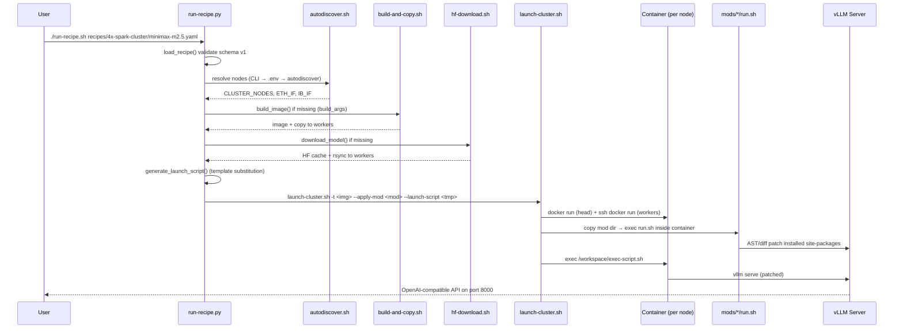

I now have comprehensive grounding in the actual source. Let me write the technical documentation.

---

# Deployment Recipes & Cluster Orchestration

## 1. Overview

The **Deployment Recipes & Cluster Orchestration** domain is the declarative control plane of `codekeeper`. It transforms a single YAML file into a fully provisioned, patched, and running vLLM inference service — either on one DGX Spark node or across a 3x/4x/8x multi-node cluster.

The domain owns three categories of artifacts:

| Artifact | Role |
|---|---|
| `recipes/**/*.yaml` | Declarative binding of model + quantization + container + mods + tuning + topology |
| `run-recipe.py` / `run-recipe.sh` | High-level recipe runner that compiles a recipe into an executable deployment |
| `launch-cluster.sh` | Low-level container orchestrator that provisions nodes, applies mods in-container, and starts the server |
| `hf-download.sh` | Model artifact fetcher and cluster-wide distributor |
| `autodiscover.sh` | Network topology detection (interfaces, node IPs, mesh mode) |

The central design principle is **declarative-to-imperative compilation**: a human-authored YAML recipe is validated, merged with CLI overrides, and compiled into a generated Bash launch script that executes *inside* the container. The launcher — not the recipe — owns cluster topology, deliberately stripping and re-injecting distributed-executor flags so that a recipe remains portable across solo and cluster deployments.

---

## 2. Recipe Schema

Every recipe is a YAML document validated against a versioned schema. `run-recipe.py` enforces `recipe_version` against `SUPPORTED_VERSIONS = ["1"]` and warns on mismatch.

### 2.1 Field Reference

| Field | Required | Type | Description |
|---|---|---|---|
| `name` | ✅ | str | Human-readable recipe name |
| `recipe_version` | ✅ | str | Schema version (`"1"`); gates feature availability |
| `container` | ✅ | str | Docker image tag (`vllm-node`, `vllm-node-b12x`, `vllm-node-mxfp4`) |
| `command` | ✅ | str | `vllm serve` template with `{placeholder}` substitution |
| `description` | — | str | Shown in `--list` |
| `model` | — | str | HuggingFace model ID for `--setup` downloads |
| `mods` | — | list[str] | Mod directories applied before launch |
| `defaults` | — | dict | Default values for command placeholders |
| `env` | — | dict | Environment variables exported before serving |
| `build_args` | — | list[str] | Extra args for `build-and-copy.sh` (e.g. `--exp-b12x`) |
| `cluster_only` | — | bool | Reject solo deployment |
| `solo_only` | — | bool | Reject cluster deployment |

### 2.2 Mode Constraints as Interface Contracts

`cluster_only` and `solo_only` are not hints — they are **enforced interface contracts**. The runner validates the requested topology against these flags and aborts on violation:

```python
if cluster_only and is_solo:
    print(f"Error: Recipe '{recipe['name']}' requires cluster mode.")
    print(f"This model is too large to run on a single node.")
    return 1
if solo_only and not is_solo:
    print(f"Error: Recipe '{recipe['name']}' requires solo mode.")
    return 1
```

This prevents a 397B-parameter model from being launched on a single node, or a single-node-only recipe from being spread across a cluster.

### 2.3 Container Variants

The `container` field selects the serving stack, and `build_args` selects the experimental build profile:

| Container | Build Args | Purpose |
|---|---|---|
| `vllm-node` | — | Standard vLLM image |
| `vllm-node-b12x` | `--exp-b12x` | B12X-optimized MLA / DeepGEMM stack |
| `vllm-node-mxfp4` | `--exp-mxfp4` | MXFP4 quantization support |

For example, `qwen3.8-flash-next-nvfp4-cluster.yaml` pairs `container: vllm-node-b12x` with `build_args: [--exp-b12x]`, while `openai-gpt-oss-120b.yaml` pairs `container: vllm-node-mxfp4` with `build_args: [--exp-mxfp4]`.

---

## 3. Recipe Catalog

The `recipes/` directory is organized into a flat set of single-node/model-specific recipes plus three topology-specific subdirectories.

### 3.1 Topology-Specific Cluster Recipes

| Directory | Example Recipe | Topology |
|---|---|---|
| `3x-spark-cluster/` | `qwen3.5-397b-int4-autoround.yaml` | Pipeline-parallel 3-node mesh (`pp=3`) |
| `4x-spark-cluster/` | `nemotron-3-ultra-nvfp4.yaml` | TP=4 across 4 nodes |
| `4x-spark-cluster/` | `minimax-m2.5.yaml` | TP=4 across 4 nodes |
| `8x-spark-cluster/` | `glm-5.2-nvfp4.yaml` | TP=8 across 8 nodes |

The 3-node recipe demonstrates **pipeline parallelism** rather than tensor parallelism:

```yaml
defaults:
  pipeline_parallel: 3
  gpu_memory_utilization: 0.7
command: |
  vllm serve Intel/Qwen3.5-397B-A17B-int4-AutoRound \
    -tp 1 \
    -pp {pipeline_parallel} \
    --distributed-executor-backend ray
```

The 8-node GLM-5.2 recipe demonstrates the B12X sparse-MLA stack with speculative decoding:

```yaml
container: vllm-node-b12x
env:
  VLLM_B12X_MLA_CKV_GATHER: "1"
  CUTE_DSL_ARCH: sm_121a
  VLLM_USE_AOT_COMPILE: "1"
defaults:
  tensor_parallel: 8
  max_model_len: 262144
  num_speculative_tokens: 4
```

### 3.2 Model Serving Recipes

The flat recipe set covers the full model portfolio: DeepSeek V4, DiffusionGemma (BF16/NVFP4, thinking/no-think), Gemma4, GLM-4.7/5.x, MiniMax M2/M2.5/M2.7, Nemotron 3 Nano/Super/Ultra, OpenAI GPT-OSS 120B, Qwen3.5/3.6/3.8, and Step-3.7.

### 3.3 Quantization & Backend Coverage

Recipes span the full quantization matrix and select backends explicitly:

| Quantization | Example Recipe | Backend Selection |
|---|---|---|
| NVFP4 | `qwen3.6-35b-a3b-nvfp4.yaml` | `--moe-backend marlin`, `--attention-backend flashinfer` |
| FP8 | `qwen3.5-397b-a17B-fp8.yaml` | `--attention-backend flashinfer` |
| INT4-AutoRound | `qwen3.5-397b-int4-autoround.yaml` | `VLLM_MARLIN_USE_ATOMIC_ADD=1` |
| AWQ 4-bit | `glm-4.7-flash-awq.yaml` | `--tool-call-parser glm47` |
| BF16 | `diffusion-gemma-bf16-thinking.yaml` | `--moe-backend triton` |
| MXFP4 | `openai-gpt-oss-120b.yaml` | `--mxfp4-backend CUTLASS` |

### 3.4 Speculative Decoding Configuration

Recipes configure speculative decoding through `--speculative-config` with three distinct draft strategies:

- **MTP** (Multi-Token Prediction) — Inkling-Small, Qwen3.6, GLM-5.2, DeepSeek V4
- **DFlash / DFlash2** — Qwen3.6 (`z-lab/Qwen3.6-35B-A3B-DFlash`), Qwen3.8 (`z-lab/Qwen3.8-27B-DFlash2`)
- **DSpark** — Nemotron 3.5 Lightning

Example from `qwen3.8-27b-nvfp4-dflash2.yaml`:

```yaml
--speculative-config '{"method":"dflash","model":"z-lab/Qwen3.8-27B-DFlash2","num_speculative_tokens":{num_speculative_tokens},"draft_tensor_parallel_size":{tensor_parallel}}'
```

---

## 4. The Recipe Runner (`run-recipe.py`)

The runner is the primary user-facing entry point. `run-recipe.sh` is a thin Bash wrapper that verifies Python 3.10+ and installs PyYAML if missing, then `exec`s the Python runner.

### 4.1 Deployment Pipeline

The runner implements a four-phase pipeline, each phase independently invocable:

```
CLI Args → Load Recipe → Resolve Nodes → Build → Download → Run
```

| Phase | Trigger Flags | Behavior |
|---|---|---|
| **Build** | `--build-only`, `--setup`, `--force-build` | Builds container if missing; copies to workers |
| **Download** | `--download-only`, `--setup`, `--force-download` | Downloads model if missing; rsyncs to workers |
| **Run** | default | Generates launch script; invokes `launch-cluster.sh` |

### 4.2 Node Resolution

Node resolution follows a strict precedence chain:

1. **CLI** — `-n HEAD_IP,WORKER_IP`
2. **`.env`** — `CLUSTER_NODES` written by `--discover`
3. **Autodiscovery** — interactive `autodiscover.sh` run

The first node is always the **head**; subsequent nodes are **workers**:

```python
def get_worker_nodes(nodes: list[str]) -> list[str]:
    if len(nodes) <= 1:
        return []
    return nodes[1:]
```

### 4.3 Launch Script Generation

`generate_launch_script()` compiles the recipe into a self-contained Bash script. It merges `defaults` with CLI `overrides`, exports `env` variables, performs `str.format()` substitution on the `command` template, and normalizes the distributed backend:

```python
params = {**recipe.get("defaults", {}), **overrides}
command = command.format(**params)
if is_solo or not use_ray:
    command = strip_distributed_executor_backend(command)
else:
    command = ensure_ray_backend(command)
```

**Solo behavior** strips `--distributed-executor-backend` and defaults `tensor_parallel` to 1. **Multi-node behavior** defaults to no-Ray, with `--ray` preserving or adding the Ray backend.

### 4.4 CLI Overrides

Serving defaults are overridable via CLI flags, which take precedence over recipe `defaults`:

| Flag | Overrides |
|---|---|
| `--port` | `port` |
| `--host` | `host` |
| `--tensor-parallel` / `--tp` | `tensor_parallel` |
| `--gpu-memory-utilization` / `--gpu-mem` | `gpu_memory_utilization` |
| `--max-model-len` | `max_model_len` |

Additional vLLM arguments can be passed verbatim after `--`; the runner warns when these duplicate a CLI override, since vLLM uses "last wins" semantics.

### 4.5 Mod and PR Layering

The runner supports two additional launch layers, both repeatable and order-preserving via `OrderedLaunchLayerAction`:

- `--apply-mod PATH` — additional mod directory or zip
- `--apply-vllm-pr PR_OR_URL` — an upstream vLLM PR applied at container launch time

Recipe-declared mods are resolved relative to the repo root and passed to `launch-cluster.sh` as `--apply-mod` arguments.

---

## 5. Cluster Orchestration (`launch-cluster.sh`)

`launch-cluster.sh` is the low-level orchestrator. It provisions containers across nodes, applies mods **inside** each container, and starts the server.

### 5.1 Inversion of Control: The Launcher Owns Topology

A defining architectural decision is that the launcher **strips** distributed-executor flags from user commands and re-injects them itself. The usage text documents this explicitly:

```
Do not pass --distributed-executor-backend, --nnodes, --node-rank,
--master-addr, --master-port, or --headless to vllm serve; the launcher
adds the backend and per-node multiprocessing arguments automatically.
```

For no-Ray multi-node launches, `make_node_script()` produces a per-node patched script:

```bash
sed -E 's/--distributed-executor-backend(=|[[:space:]]+)[^[:space:]]+//g' "$script_path" | \
    grep -Ev '^[[:space:]\\]*$' > "$tmp"
sed -i "$ s/$/ $extra/" "$tmp"
```

where `extra` is `--nnodes N --node-rank R --master-addr HEAD --master-port PORT` (plus `--headless` for workers). This keeps recipes portable: the same recipe runs solo or clustered without edits.

### 5.2 In-Container Mod Application

Mods are **not** applied on the host. `apply_mod_to_container()` copies each mod directory (or zip) into the target container and executes its `run.sh` inside:

```bash
local local_exec_cmd="export WORKSPACE_DIR=\$PWD && cd $container_dest && chmod +x run.sh && ./run.sh"
docker exec "$container" bash -c "$local_exec_cmd"
```

For remote workers, the mod is first `scp`'d to a temporary host path, then `docker cp`'d into the container. Mods are applied to the head and every worker before the server starts, and the launcher aborts the whole deployment if any mod fails.

### 5.3 Runtime vLLM PR Application

The `--apply-vllm-pr` layer fetches a PR diff, validates it as **runtime-only**, and generates a temporary mod bundle. `validate_vllm_runtime_diff()` rejects any PR touching native sources (`.cu`, `.cpp`, `.so`, etc.), build files, or non-`vllm/` paths:

```python
if unsupported_paths:
    raise SystemExit(
        f"Error: vLLM PR {pr_label} is not runtime-only. It changes files that "
        f"require a source build or cannot be installed safely..."
    )
```

The generated runner verifies a SHA-256 checksum before applying, and uses `git apply --reverse --check` for idempotency.

### 5.4 Cluster Provisioning Sequence

`start_cluster()` executes a deterministic sequence:

1. **Check for running cluster** — skip launch if containers already exist
2. **Verify image consistency** — `verify_cluster_image_consistency()` compares content-addressable image IDs across all nodes and aborts on mismatch
3. **Prepare runtime PR mods** — fetch and validate
4. **Launch containers** — head via `docker run`, workers via `ssh docker run`
5. **Apply mods** — head first, then each worker
6. **Copy launch scripts** — per-node patched scripts for no-Ray, or a single Ray script
7. **Start Ray** (if Ray mode) — `ray start --head` on head, `ray start --address` on workers, then `wait_for_cluster()`

### 5.5 Operational Hardening

The launcher encodes several operational safeguards:

- **Image consistency check** — prevents mixed-version clusters
- **SSH preflight** — `BatchMode=yes` connectivity check to every worker before launch
- **Parallelism validation** — `parse_parallelism_from_text()` computes `required_nodes = TP × PP × DP` and errors if the configured node count is insufficient
- **Non-privileged mode** — `--non-privileged` replaces `--privileged`/`--ipc=host` with explicit `--cap-add=IPC_LOCK`, memory, PID, and shm limits
- **earlyoom** — optional OOM-prevention daemon as the container foreground process
- **Cache mounting** — mounts `~/.cache/vllm`, `~/.cache/flashinfer`, `~/.cache/b12x`, `~/.triton`, `~/.tilelang` for warm compilation caches

### 5.6 Network Environment Injection

`get_env_flags()` injects per-node networking variables derived from the detected interfaces:

```bash
-e VLLM_HOST_IP=$node_ip \
-e RAY_NODE_IP_ADDRESS=$node_ip \
-e NCCL_SOCKET_IFNAME=$ETH_IF \
-e NCCL_IB_HCA=$IB_IF \
-e GLOO_SOCKET_IFNAME=$ETH_IF
```

This ensures NCCL, Gloo, and Ray all bind to the correct fabric on each node.

---

## 6. Model Artifact Distribution (`hf-download.sh`)

`hf-download.sh` downloads model weights via `uvx hf download` and optionally distributes them to worker nodes. It resolves the HuggingFace cache directory pattern (`models--ORG--MODEL`) and rsyncs to peers:

```bash
rsync -av --mkpath --progress "$model_dir" "${SSH_USER}@${host}:$HUB_PATH/"
```

The `--copy-parallel` flag distributes to all resolved hosts concurrently. Copy hosts are resolved from `--copy-to`, `.env` (`COPY_HOSTS`), or autodiscovery.

---

## 7. Topology Autodiscovery (`autodiscover.sh`)

`autodiscover.sh` detects the cluster fabric and node set, then persists the result to `.env`. It performs rigorous validation:

- **Interface detection** — parses `ibdev2netdev` for active IB/Ethernet pairs
- **IP sanity checks** — `enp*` interfaces must have an IP assigned
- **Subnet collision detection** — no two interfaces may share a subnet
- **Mesh mode detection** — determines whether the topology is a full mesh

The `.env` file persists `CLUSTER_NODES`, `ETH_IF`, `IB_IF`, `MASTER_PORT`, `CONTAINER_NAME`, and `LOCAL_IP`. Any `CONTAINER_*` variable (except `CONTAINER_NAME`) is translated into a `-e` flag, e.g. `CONTAINER_NCCL_DEBUG=INFO` → `-e NCCL_DEBUG=INFO`.

---

## 8. End-to-End Deployment Flow



---

## 9. Cluster Operational Caveats

Cluster recipes encode topology-specific operational knowledge directly in comments and configuration:

- **`--no-ray` multi-node launches** — required for certain models (e.g. Qwen3.5-397B INT4-AutoRound) to fit full context across nodes
- **GPU clock limiting** — `sudo nvidia-smi -lgc 200,2150` prevents node shutdowns under sustained load
- **Driver version constraints** — 580.x required; 590.x causes CUDAGraph deadlock on GB10
- **GB-based memory utilization** — some recipes require memory utilization specified in GB rather than percentage
- **`VLLM_ALLOW_LONG_MAX_MODEL_LEN`** — required for context lengths exceeding the model's declared maximum

These caveats are surfaced as recipe comments, e.g.:

```yaml
# Important: set memory utilization in GB, not percentage! Requires --no-ray to fit full context on two sparks.
# If you experience node shutdown, please limit GPU clocks on the affected node (or both): `sudo nvidia-smi -lgc 200,2150`
```

---

## 10. Design Insights

**Declarative-to-imperative compilation.** The recipe is a pure declaration; the runner compiles it into an executable script. This separation lets the same recipe target solo or cluster topologies without modification.

**Launcher-owned topology.** By stripping and re-injecting distributed-executor flags, the launcher guarantees that cluster topology is always consistent with the actual node set — a recipe cannot accidentally declare a topology that contradicts the deployment.

**In-container mod application.** Applying mods inside the container (rather than on the host) ensures that patches target the exact installed `site-packages` tree that the server will import, and that every node in the cluster receives an identical patch set.

**Fail-fast, all-or-nothing deployment.** Every phase — build, download, mod application, image consistency, SSH preflight — aborts the entire deployment on failure, preventing partially-patched or mixed-version clusters from serving traffic.

**Reproducibility controls.** Image consistency verification, SHA-256 checksums on runtime PRs, and pinned CUTLASS DSL versions ensure that a recipe produces a deterministic deployment across nodes and over time.