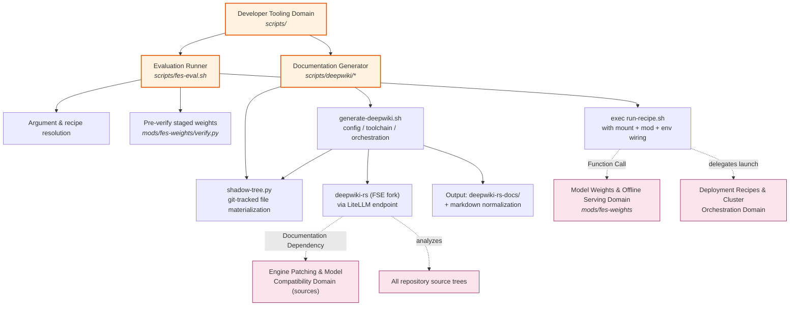
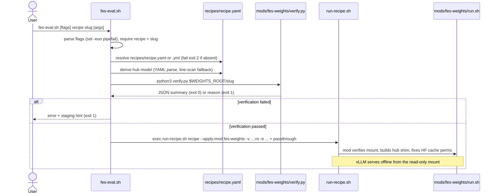

# Developer Tooling Domain — Technical Documentation

| Item | Value |
|---|---|
| **Project** | spark-vllm-docker |
| **Domain** | Developer Tooling Domain (Tool Support Domain) |
| **Domain importance** | 3.5 / 10 (supporting role; core domains are recipes, patching, kernels) |
| **Code paths** | `scripts/fes-eval.sh`, `scripts/deepwiki/generate-deepwiki.sh`, `scripts/deepwiki/shadow-tree.py` |
| **Document scope** | Sub-modules, CLI contracts, execution flows, cross-domain interactions, operational guidance |

---

## 1. Domain Overview

The Developer Tooling Domain is a small, self-contained collection of auxiliary command-line scripts that support two developer workflows in the `spark-vllm-docker` repository:

1. **Evaluation Runner** (`scripts/fes-eval.sh`) — a host-side launcher that pre-verifies staged FES model weights and then runs a deployment recipe with the read-only weights mount, the `fes-weights` verification mod, and the offline Hugging Face hub shim fully wired up. It is a convenience façade over the Deployment Recipes domain and the Model Weights & Offline Serving domain.

2. **Documentation Generator** (`scripts/deepwiki/generate-deepwiki.sh` + `scripts/deepwiki/shadow-tree.py`) — an automated pipeline that produces AI-generated C4 architecture documentation for the repository (or any subtree of it) using `deepwiki-rs` (the "Litho" tool) backed by a LiteLLM gateway, including a git-accurate "shadow tree" sanitization step so the analysis only sees tracked source files.

Both tools are invoked directly from the command line, operate independently of each other, and do not participate in the runtime serving path. Their value lies in *developer productivity and knowledge capture*: one short-circuits a repetitive offline-evaluation launch sequence, the other substitutes for the currently absent written architecture documentation in the repository (there is no README and `docs/` is empty).



---

## 2. Sub-module: Evaluation Runner (`scripts/fes-eval.sh`)

### 2.1 Purpose

`fes-eval.sh` is the host-side companion for the `mods/fes-weights` mod. Evaluating an FES-staged model normally requires the operator to manually assemble a long `run-recipe.sh` invocation: apply the `fes-weights` mod, bind the staged weight directory read-only at `/model`, and export four environment variables (`FES_WEIGHTS_ENABLED`, `FES_WEIGHTS_DIR`, `FES_HUB_MODEL`, `HF_HUB_OFFLINE`). The script collapses this into one command, and adds a **fail-fast pre-verification gate** on the host before any cluster resource is consumed.

### 2.2 CLI Contract

```
scripts/fes-eval.sh [--weights-root DIR] [--hub-model ID] <recipe> <fes-slug> [run-recipe.sh args...]
```

| Argument / Flag | Required | Default | Description |
|---|---|---|---|
| `<recipe>` | yes | — | Recipe name resolved against `recipes/<name>.yaml` (falls back to `.yml`); must exist under `recipes/` |
| `<fes-slug>` | yes | — | Slug of the staged weight directory: `$WEIGHTS_ROOT/<slug>` |
| `--weights-root DIR` | no | `/opt/llm/models` | Root directory under which weight slugs are staged |
| `--hub-model ID` | no | recipe's `model:` field | `org/model` id the recipe serves; used to build the offline hub shim |
| `-h`, `--help` | no | — | Prints the header usage block (lines 2–16 of the script) |
| *remaining args* | no | — | Passed verbatim to `run-recipe.sh` (e.g. `--solo`, `-n <ip>`) |

Examples taken from the script header:

```bash
scripts/fes-eval.sh glm-5.3-flash glm-5.3-flash-nvfp4 --solo
scripts/fes-eval.sh qwen3.8-27b-nvfp4-w4a4 qwen3.8-27b-nvfp4-w4a4 -n 10.10.10.165
```

### 2.3 Execution Flow



Step-by-step implementation detail:

1. **Flag parsing** — `--weights-root` and `--hub-model` are consumed first; everything after the first non-flag token is treated as `<recipe> <slug>` followed by passthrough arguments. The script runs under `set -euo pipefail`.
2. **Recipe resolution** — searches `recipes/$RECIPE.yaml`, then `recipes/$RECIPE.yml`, relative to the repository root computed from `SCRIPT_DIR/..`. Missing recipe → error to stderr, exit 2.
3. **Hub-model defaulting** — if `--hub-model` was not given, the script runs an embedded Python snippet that reads the recipe's `model:` field. It prefers `yaml.safe_load` (PyYAML) and falls back to a plain line scan when PyYAML is unavailable — a deliberate degradation so the tool works on minimal hosts. No `model:` field → exit 2 with instruction to pass `--hub-model`.
4. **Host-side weight pre-verification** — invokes `python3 mods/fes-weights/verify.py "$WEIGHTS_ROOT/$SLUG"` with stdout suppressed. `verify.py` validates: directory exists and is non-empty, `config.json` is readable, NVFP4 checkpoints carry `hf_quant_config.json`, all shards referenced by `model.safetensors.index.json`'s `weight_map` exist, and staged total size is within the `1.02` tolerance of the index `total_size` (single-file `model.safetensors` fallback supported). On failure the script prints the staging remediation hint (`cluster-config scripts/model-weights.sh stage <slug>`) and exits 1 — **before** any build or cluster launch occurs.
5. **Launch delegation** — `exec`s `run-recipe.sh` (replacing the process, so exit codes propagate) with the fixed wiring:

   | Injected argument | Value | Purpose |
   |---|---|---|
   | `--apply-mod` | `<repo>/mods/fes-weights` | Runs the in-container verification + hub-shim mod |
   | `-v` | `$weights_dir:/model:ro` | Read-only weights mount inside every container |
   | `-e` | `FES_WEIGHTS_ENABLED=1` | Opt-in flag; without it `fes-weights/run.sh` stays inert (hub-cache mode) |
   | `-e` | `FES_WEIGHTS_DIR=/model` | Mount point consumed by the mod |
   | `-e` | `FES_HUB_MODEL=<id>` | Drives creation of the `models--org--name/snapshots/fes-staged` shim |
   | `-e` | `HF_HUB_OFFLINE=1` | Guarantees `vllm serve` never reaches the Hugging Face hub |

   Any user-supplied passthrough arguments are appended last, so they can extend or override the launch.

### 2.4 Multi-node Semantics

For multi-node recipes, **every listed node must have the slug staged** under the weights root (`cluster-config scripts/model-weights.sh stage <slug>` fans it out), because `launch-cluster.sh` applies the volume mount on every node's container. The pre-verification in step 4 only checks the local node — it is a fast gate, not a cluster-wide guarantee.

### 2.5 Downstream Behavior of the `fes-weights` Mod (context)

For completeness, the mod that `fes-eval.sh` activates behaves as follows inside the container (runs on head and every worker before the launch script):

- Skips itself unless `FES_WEIGHTS_ENABLED` is set (opt-in contract).
- Re-runs `verify.py` on `FES_WEIGHTS_DIR` (default `/model`) and optionally `FES_DRAFT_DIR` (default `/drafter`).
- Builds the HF hub-cache shim: `<HF_HOME>/hub/models--<org>--<name>/snapshots/fes-staged` containing symlinks into the read-only mount, plus `refs/main` = `fes-staged`. A SHA-256 fingerprint of the top-level file list (` .fes-shim-fp`) makes shim creation idempotent — "up to date" short-circuits on re-runs.
- Fixes HF cache ownership/permissions to `ubuntu:ubuntu` (the non-root serving user) to avoid `EACCES` on the NFS-exported cache with `root_squash` on peer ranks.
- Emits structured log lines: `[fes-weights] FES_WEIGHTS_OK|FAIL|SKIP op=verify ...`.

---

## 3. Sub-module: Documentation Generator (`scripts/deepwiki/`)

### 3.1 Purpose

The repository contains no README, an empty `docs/`, and no ADRs, while recipes and code comments repeatedly refer users to external documentation. The Documentation Generator closes this gap by generating AI-produced C4 architecture documentation from the actual source tree:

- **`generate-deepwiki.sh`** (554 lines) — the orchestrator: argument parsing, four-layer configuration resolution, API-key handling, toolchain checks, shadow-tree construction, `deepwiki-rs` execution, and post-generation output normalization.
- **`shadow-tree.py`** (67 lines) — a focused helper that materializes exactly the git-tracked files of a subtree into a scratch directory.

Output is written to `deepwiki-rs-docs/` (intended to be committed); the LLM/tool cache lives under `.litho/`, which is local-only and gitignored.

### 3.2 Why a Shadow Tree?

`deepwiki-rs` honors `.gitignore` only for *files* in its later stages — its directory walk and per-directory dossier reads see **every** gitignored directory (`node_modules/`, `coverage/`, `packages/*/lib/`, build output). Pointing the tool at the working tree would pollute the analysis. Git itself resolves the full `.gitignore` cascade (root + nested files + negations + force-added files), so `shadow-tree.py` materializes exactly `git ls-files` output into a scratch tree, and the script points `deepwiki-rs` at that tree instead of the working tree.

Notably, this also *preserves* tracked sources that live inside ignored directories (e.g. tracked helpers under a `lib/` build-output rule) which a naive `.gitignore` filter would drop.

### 3.3 `shadow-tree.py` Contract & Algorithm

| Element | Detail |
|---|---|
| Invocation | Environment-driven (no CLI flags): `REPO_ROOT` (cwd for git), `TARGET` (subtree, `.`/empty = whole repo), `SHADOW` (destination, rebuilt by caller) |
| stdout | Single value: the number of entries successfully linked (parsed by the caller as `SHADOW_COUNT`) |
| Core command | `git ls-files -z` run in `REPO_ROOT`, optionally scoped with `-- <target>` |
| Materialization | For each NUL-separated path: rebase it relative to `TARGET` (skip anything escaping via `..`), `os.makedirs` parents, then **hardlink** (`os.link`); on `OSError` fall back to `shutil.copy2`; on a second failure (submodule gitlinks, non-files) silently skip |
| Failure | Non-zero git exit → `git ls-files failed` on stderr, exit 1 |

Hardlinks make the shadow tree cheap (no data duplication) and safe: the tree is `rm -rf`'d and rebuilt on every run, but hardlinked inodes keep the originals untouched.

### 3.4 `generate-deepwiki.sh` — Configuration Model

**Precedence (documented in-script):** `CLI flag > process environment > repo-root .env > built-in default`.

`.env` values are read with `grep`/`cut` (`read_env_file_value`) and **never sourced**, with surrounding quote stripping — a deliberate security choice so an arbitrary `.env` cannot execute shell code.

| Setting | CLI flag | Env / `.env` key | Built-in default |
|---|---|---|---|
| Target subtree | positional `[path]` | — | `.` (whole repo) |
| Output directory | `--output DIR` | — | `deepwiki-rs-docs` (or `deepwiki-rs-docs/<path>`) |
| LLM API base URL | `--base-url URL` | `DEEPWIKI_API_BASE_URL` | `https://dell.fulton-home.fultonengineeringservices.com/litellm` |
| Efficient model slot | `--model-efficient` | `DEEPWIKI_MODEL_EFFICIENT` | `cluster/glm-5.3-flash` |
| Powerful model slot | `--model-powerful` | `DEEPWIKI_MODEL_POWERFUL` | `cluster/glm-5.3-flash` |
| Max parallel LLM calls | `--max-parallels N` | `DEEPWIKI_MAX_PARALLELS` | `8` |
| Context length (tokens) | `--context-length N` | `DEEPWIKI_CONTEXT_LENGTH` | `1000000` (glm-5.3-flash 1M window) |
| Max output tokens | `--max-tokens N` | `DEEPWIKI_MAX_TOKENS` | unset → tool default `131072` |
| Sampling temperature | `--temperature F` | `DEEPWIKI_TEMPERATURE` | unset → tool default `0.1` (header recommends ~0.95 for this workload) |
| deepwiki-rs source | `--update-deepwiki` | `DEEPWIKI_GIT_URL` / `DEEPWIKI_GIT_REF` | FSE fork `https://github.com/Fulton-Engineering-Services/deepwiki-rs.git`, ref `feat/filter-explain` |
| Shadow tree | `--no-shadow` (disables) | — | enabled; root at `.litho/tree` |

Numeric/shape validation runs after resolution: `max-parallels` and `context-length` must be positive integers; `max-tokens` (when set) a positive integer; `temperature` (when set) a decimal in `[0, 2]` (checked with `awk`). The base URL's trailing slash is trimmed defensively (a double-slash path would 404 behind the Starlette-based proxy).

Pass-through flags forwarded verbatim to `deepwiki-rs` via `EXTRA_ARGS`: `--force-regenerate`, `--no-cache`, `--macro-scan`, `--no-macro-scan`, `--skip-preprocessing`, `--skip-research`, `--skip-documentation`, `--only-agent-content`, `--disable-preset-tools`, `--show-streaming-thinking-and-output`, `--verbose`.

**Toolchain-only actions** exit early, before any config/API-key work: `--check-toolchain` and `--install-toolchain` (delegated to `scripts/deepwiki/lib/toolchain.sh`), and `--update-deepwiki`, which installs/refreshes `deepwiki-rs` from the FSE fork:

```bash
CARGO_NET_GIT_FETCH_WITH_CLI=true \
    cargo install --git "$DEEPWIKI_GIT_URL" --branch "$DEEPWIKI_GIT_REF" --force deepwiki-rs
```

(The system git CLI is forced for the fetch so `gh`'s credential helper is honored — cargo's built-in libgit2 would otherwise 404/auth-fail on the private-aware remote.)

### 3.5 Secret & API-Key Handling

1. The LiteLLM key is resolved from `$LITELLM_API_KEY`, else from the repo-root `.env` (parsed, never sourced).
2. Missing key or the placeholder value `REPLACE_THIS_VALUE` → hard failure with actionable remediation: `cp .env.example .env && $EDITOR .env`.
3. The key is exported to the child process **only** as `LITHO_LLM_API_KEY` and **never appears on the command line** (invisible to `ps` and shell history).

### 3.6 Preconditions

| Check | Failure behavior |
|---|---|
| `scripts/deepwiki/lib/common.sh` and `lib/toolchain.sh` exist | Loud failure — a missing lib is treated as a broken checkout, no degraded inline fallback |
| `deepwiki-rs` on PATH | Error + install hint (`--update-deepwiki`) |
| `mermaid-fixer` on PATH (`cargo install mermaid-fixer`) | Error up-front — `deepwiki-rs` bails at startup without it; this converts the tool's bare error into an actionable one |
| `python3` present (shadow mode only) | Error + install hint (`xcode-select --install`), or the discouraged `--no-shadow` bypass |
| Target path exists and does not escape the repo root | Resolved with `pwd -P`, then matched against `$REPO_ROOT` / `$REPO_ROOT/*` — prevents path-traversal out of the repository |

`$CARGO_BIN_DIR` (`${CARGO_HOME:-$HOME/.cargo}/bin`) is prepended to `PATH` for the process tree because `deepwiki-rs` spawns `mermaid-fixer` as a bare PATH lookup. The script declares compatibility with **bash 3.2 + BSD coreutils** (macOS stock `/bin/bash`).

### 3.7 End-to-End Execution Flow

```mermaid
sequenceDiagram
    actor User
    participant G as generate-deepwiki.sh
    participant E as .env (repo root)
    participant ST as shadow-tree.py
    participant DR as deepwiki-rs (FSE fork)
    participant LM as LiteLLM endpoint
    participant MF as mermaid-fixer

    User->>G: generate-deepwiki.sh [path] [options]
    G->>G: parse args, validate toolchain (--check/--install/--update exit here)
    G->>G: normalize + validate target path (must stay in repo root)
    G->>E: read keys via grep/cut (never sourced)
    G->>G: resolve config: CLI > env > .env > defaults; validate numbers
    G->>G: resolve LITELLM_API_KEY (fail fast with remediation if absent)
    G->>ST: rm -rf shadow dir, then REPO_ROOT/TARGET/SHADOW python3 shadow-tree.py
    ST->>ST: git ls-files -z (cwd=repo, scoped -- target)
    ST-->>G: hardlink/copy tracked files; print count (fail if 0)
    G->>DR: export LITHO_LLM_API_KEY (child only), exec from repo root:<br/>-p shadow -o output --name ... --llm-api-base-url ... model/parallel/context flags
    DR->>DR: discover ./litho.toml, walk source, build dossiers<br/>(macro-scan auto above 150 directory dossiers)
    DR->>MF: validate generated Mermaid diagrams
    DR->>LM: chat/completions requests (efficient + powerful model slots, ≤ max-parallels)
    LM-->>DR: completions
    DR-->>G: markdown written to deepwiki-rs-docs/... (exit code captured)
    G->>G: normalize .md: strip trailing whitespace, single EOF newline<br/>(keeps lefthook whitespace check green)
    G-->>User: exit with deepwiki-rs's original exit code
```

Key implementation notes:

- **Working directory discipline** — everything runs from `REPO_ROOT` because `deepwiki-rs` discovers `./litho.toml` from the CWD and resolves `-p`/`-o` relative to it. Consequently the tool cache is always `.litho` at the repo root, with path-namespaced keys (e.g. `cache/directory_scoring_scripts/`), so a single root cache serves all subtree runs.
- **Shadow rebuild semantics** — `rm -rf "$SHADOW_DIR"; mkdir -p` before every run. The script documents that rebuilding also drops the tool's internal-path cache *inside the shadow tree* (`<shadow>/.litho`); this is currently inert because `litho.toml` omits the `[knowledge]` section, but would wipe local-docs sync state if that feature were ever enabled. Shadow roots: `.litho/tree/repo` for the whole repo, `.litho/tree/<path>` for subtrees.
- **Zero-tracked-file guard** — an empty `SHADOW_COUNT` aborts with "No git-tracked files found under '<path>' — nothing to analyze."
- **Exit-code preservation** — the tool is run without `exec` (`set +e` … `TOOL_EXIT=$?` … `set -e`) specifically so post-processing can run while still returning the tool's status.
- **Output normalization** — `deepwiki-rs` emits trailing whitespace and a blank line at EOF, which the repo's lefthook `whitespace` gate (`git diff --cached --check`) rejects. The script normalizes every generated `*.md` with a `perl -0pi` one-liner (`s/[ \t]+$//mg; s/\n+\z/\n/`), using `find -exec` because bash 3.2's `read` lacks `-d` for NUL loops. This repo runs no prettier, so this is the only whitespace gate the docs pass through.

### 3.8 Tool Requirements

- `deepwiki-rs` — FSE fork build (hierarchical macro-scan pipeline + path-explain matcher debug); installed via `--update-deepwiki`.
- `mermaid-fixer` — `cargo install mermaid-fixer`; hard prerequisite of `deepwiki-rs` startup.
- Rust toolchain + Python 3 (interpreter selection prefers pyenv over system python3, via `lib/toolchain.sh`).
- Tracked helpers `scripts/deepwiki/lib/common.sh` (logging: `log_step`, `log_error`, `log_config`, `log_header`, `log_success`, `die`) and `scripts/deepwiki/lib/toolchain.sh` (`toolchain_check`, `toolchain_install`, `toolchain_check_rust`, `toolchain_python_bin`).

---

## 4. Cross-Domain Interactions

| # | From | Relation | To | Strength | Description |
|---|---|---|---|---|---|
| 1 | Developer Tooling (`fes-eval.sh`) | **Function Call** | Model Weights & Offline Serving | 4.0 | Invokes `mods/fes-weights/verify.py` as a host-side pre-gate, then activates the same mod in-container via `--apply-mod` |
| 2 | Developer Tooling (`fes-eval.sh`) | **Delegation** | Deployment Recipes & Cluster Orchestration | — | `exec`s `run-recipe.sh` with injected mount/mod/env arguments; passthrough args preserved |
| 3 | Developer Tooling (DeepWiki) | **Documentation Dependency** | Engine Patching & Model Compatibility | 3.0 | Documentation generation walks the repository source tree — including patch scripts and mod sources — to produce reference docs |
| 4 | Model Weights (`verify.py`, `fes-weights/run.sh`) | **Runtime Input** | Developer Tooling | — | The verification semantics and hub-shim behavior implemented by the weights mod are the contract that `fes-eval.sh` relies on |

Neither tool mutates engine source, participates in image builds, or affects serving behavior; both are safe to run (or skip) without touching the deployment pipeline.

---

## 5. Design Principles Observed in This Domain

1. **Fail fast with actionable remediation.** Every failure mode prints a concrete next step: staging hint for weight verification, `cp .env.example .env` for a missing API key, `cargo install mermaid-fixer`, `--update-deepwiki`, `xcode-select --install`. Preconditions are checked *before* expensive work begins (tool checks precede shadow build; host verification precedes cluster launch).
2. **Security-conscious secret handling.** `.env` is parsed, never sourced (no shell-code execution from a config file); the API key is injected only into the child process environment and never on a command line.
3. **Declarative input validation mirrors upstream tooling.** `verify.py` is a direct port of the cluster-config `model-weights.sh verify_location` checks (shard/index parity, 1.02 size tolerance, `hf_quant_config.json` for NVFP4), giving the host gate the same semantics as the cluster-side verifier.
4. **Process-replacement and exit-code fidelity.** `fes-eval.sh` uses `exec run-recipe.sh` and `generate-deepwiki.sh` captures and re-returns `deepwiki-rs`'s exit code — the tools never mask downstream status.
5. **Git as the single source of truth for "real source."** The shadow-tree approach delegates ignore-rule resolution to Git rather than re-implementing `.gitignore` logic, guaranteeing the analyzed file set equals the committed file set.
6. **Portability over cleverness.** Both shell scripts target bash 3.2 + BSD userland (macOS stock), avoid GNU-only constructs where avoidable (`find -exec` instead of NUL `read` loops), and degrade gracefully (PyYAML-less fallback recipe parsing).
7. **Idempotency where it matters.** The shadow tree is rebuilt from scratch each run (deterministic input); the downstream hub shim uses fingerprint short-circuiting so repeated runs are no-ops.

---

## 6. Operational Notes & Limitations

- **Weight staging is external.** `fes-eval.sh` verifies but does not stage; staging is performed by `cluster-config scripts/model-weights.sh stage <slug>`, which must be run on *every* node of a multi-node recipe.
- **Pre-verification scope.** The host-side `verify.py` run checks only the local weights directory; the in-container mod re-verifies on each node independently.
- **Documentation output is intended for commit.** Generated markdown is normalized specifically so `deepwiki-rs-docs/` passes the lefthook whitespace check; the `.litho/` cache must remain uncommitted (gitignored).
- **LLM gateway dependency.** The generator depends on a reachable LiteLLM endpoint and a valid `LITELLM_API_KEY`; the defaults are environment-specific and should be overridden via `.env` outside the default environment.
- **Tracked-lib requirement.** `generate-deepwiki.sh` refuses to run when `scripts/deepwiki/lib/{common.sh,toolchain.sh}` are missing — this is intentional (a missing lib signals a broken checkout), but means a partial copy of `scripts/deepwiki/` is non-functional.
- **Tool fork pinning.** Documentation is generated by a fork (`feat/filter-explain` branch) rather than the crates.io release; regenerate the tool with `--update-deepwiki` when the fork advances, and note that doc output may differ between tool versions.
- **Complementary, not authoritative.** The DeepWiki output is an automated *substitute* for written architecture docs in a repository that currently has none — it should not be treated as an ADR replacement for recurring decisions (e.g., "patch, never fork").

---

## 7. Summary

The Developer Tooling Domain, though small (three scripts, ~1,600 lines total), provides two high-leverage developer workflows:

| Sub-module | Files | Entry point | Primary consumer | Downstream targets |
|---|---|---|---|---|
| Evaluation Runner | `scripts/fes-eval.sh` | CLI command | ML Infrastructure Engineer | `mods/fes-weights/verify.py`, `run-recipe.sh` |
| Documentation Generator | `scripts/deepwiki/generate-deepwiki.sh`, `scripts/deepwiki/shadow-tree.py` | CLI command | All contributors | `deepwiki-rs` + LiteLLM, repo source tree |

Its architecture is intentionally thin: both tools are orchestrating façades that add validation, sanitization, and correct wiring around existing domain capabilities rather than reimplementing them — consistent with the broader `spark-vllm-docker` philosophy of non-invasive composition over duplication.