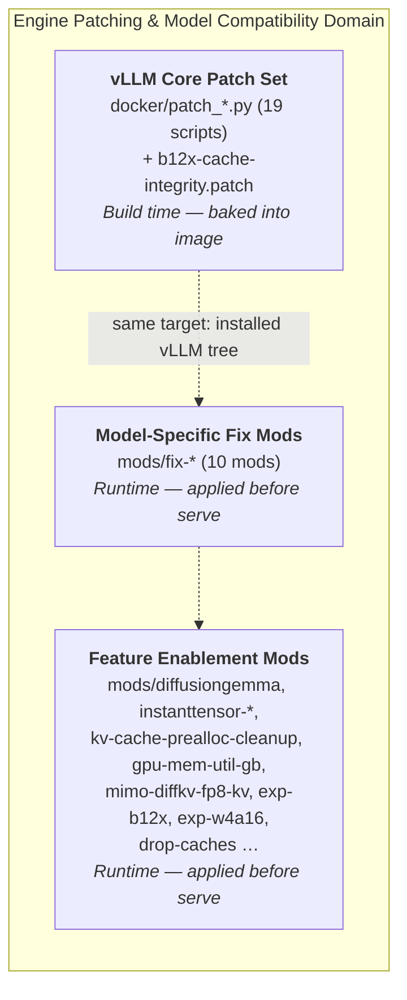
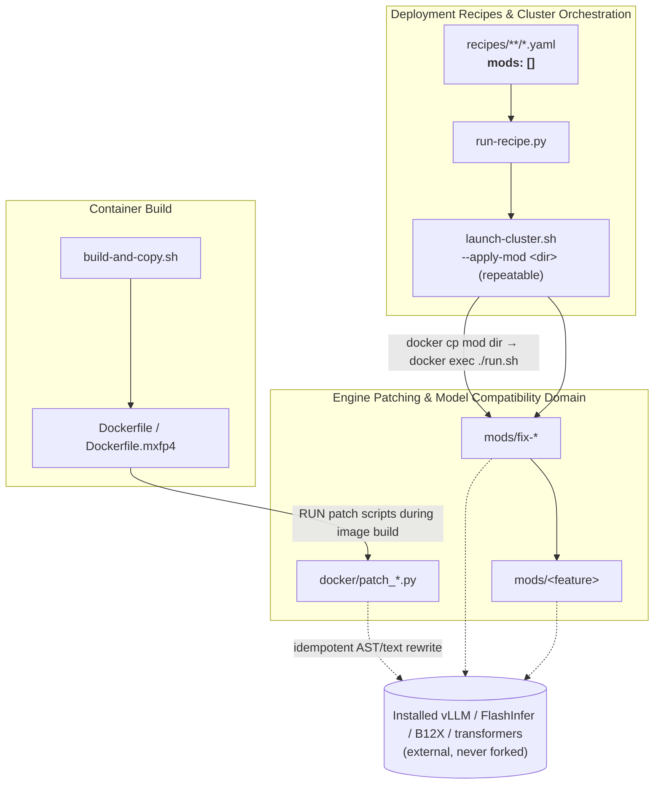
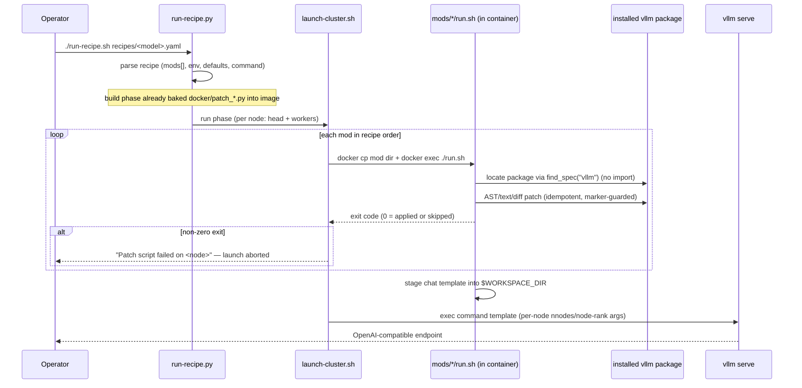

# Engine Patching & Model Compatibility Domain

**Technical Documentation — spark-vllm-docker**

| Item | Value |
|---|---|
| Domain classification | Core Business Domain |
| Physical scope | `docker/` (build-time patch library), `mods/fix-*` and feature `mods/*` (runtime mods) |
| Patch targets | Installed `vllm` package, `transformers`, FlashInfer, B12X, CUTLASS DSL, model config/chat templates |
| Interaction style | Non-invasive, idempotent source patching (AST rewrites, exact-anchor text replacement, unified diffs) |
| Composition root | Recipe YAML (`recipes/**/*.yaml`) → `run-recipe.py` → `launch-cluster.sh --apply-mod` |

---

## 1. Domain Overview

The **Engine Patching & Model Compatibility Domain** is the mechanism by which `spark-vllm-docker` makes the unmodified, upstream **vLLM** serving engine (and its satellite libraries) correctly serve a rapidly evolving catalogue of LLM architectures — Qwen3/Qwen3.5/Qwen3.6, Gemma4, DiffusionGemma, GLM-4.7/5.x, Nemotron, MiniMax, Step-3.7, Mimo, RadixArk, DeepSeek-V4 and others — on NVIDIA Blackwell (SM12.x) Spark clusters, across a wide range of quantization schemes (NVFP4, FP8, AWQ, INT4-AutoRound, MXFP4, W4A16, B12X).

The project deliberately **does not fork vLLM**. Instead, every compatibility fix, performance workaround, and feature backport is delivered as a *source patch applied to the installed Python package*. This yields three defining properties:

1. **Non-invasiveness** — the upstream repository is never modified in version control; all deltas live in this repository as patch artifacts.
2. **Idempotency** — every patcher detects an already-applied state and skips re-application, so mods can be re-run safely.
3. **Fail-fast on drift** — patchers refuse to rewrite a source tree whose shape no longer matches the reviewed anchor, instead of producing a silently corrupted engine.

### 1.1 Sub-modules

The domain is organized into three sub-modules, distinguished by *what* they patch and *when* they execute:



| Sub-module | Location | Executes | Purpose |
|---|---|---|---|
| vLLM Core Patch Set | `docker/patch_*.py`, `docker/*.patch` | Docker image build (`RUN python3 /tmp/vllm-patches/…`) | Engine-wide fixes valid for *all* models: attention backend corrections, memory trims, quantization plumbing, SWA block fallbacks |
| Model-Specific Fix Mods | `mods/fix-*/` | Container start, before `vllm serve` | Restore correct behavior for a specific model family: router quantization, chat templates, TP constraints, tool parsers, crash/slowness fixes |
| Feature Enablement Mods | `mods/<feature>/` | Container start, before `vllm serve` | Enable architectures or runtime behaviors not present upstream: DiffusionGemma support, zero-copy weight loading, KV-cache tuning, experimental backends |

---

## 2. Architectural Position



Key cross-domain relationships (verified in code):

- **Recipes → this domain (Configuration Dependency, strength 9/10).** A recipe's `mods:` list is the declarative contract. For example, `recipes/4x-spark-cluster/qwen3.5-397b-int4-autoround.yaml` declares `mods: [mods/fix-qwen3-coder-next, mods/fix-qwen35-tp4-marlin]`; `recipes/diffusion-gemma-nvfp4.yaml` declares `mods: [mods/diffusiongemma]`.
- **Container Build ↔ this domain (Build-Time Composition).** `Dockerfile` executes the `docker/patch_*.py` library against the vLLM source checkout before compiling the wheel; runtime mods target the same installed tree inside the finished image.
- **Attention Kernel Domain → this domain (Module Composition).** `mods/inkling-sm12-paged-kv` injects a `_use_sm12_paged_kv()` capability guard into vLLM's FA4 dispatch — a patching act that composes the vendored CuTe-DSL kernels into the engine.
- **Memory Profiling → this domain (Instrumentation Dependency).** `mods/memory-profile/patch.py` installs a probe as `vllm._spark_memory_profile` using the same patch protocol.

---

## 3. The Two-Tier (+1) Patching Lifecycle

All engine modifications flow through lifecycle channels that differ only by *execution moment*:

```
 BUILD TIME                                     RUNTIME
 ─────────────────────────────────────          ─────────────────────────────────────
 docker/patch_*.py  ──► image layer             mods/*/run.sh  ──► container-local edits
 (executed by Dockerfile,                      (invoked by launch-cluster.sh
  19 patch scripts + 1 .patch)                   --apply-mod, in recipe order,
                                                 on head AND every worker)

                                                launch-cluster.sh --apply-vllm-pr <PR>
                                                ──► generated synthetic mod bundle
                                                    (third channel: upstream PR injection)
```

### 3.1 Build-time tier (`docker/`)

Executed inside the Docker build stage against the cloned/installed vLLM source root (the Dockerfile invokes them as `RUN python3 /tmp/vllm-patches/<script> .`). The inventory (19 patchers + 2 tooling scripts + 1 unified diff):

| Script | Concern |
|---|---|
| `patch_vllm_flashinfer_b12x_swigluoai.py` | Downstream subset of upstream PR #47392: plumbs SwiGLU-OAI activation parameters through FlashInfer B12x MoE backend; capability-probes `B12xMoEWrapper` signature at runtime |
| `patch_b12x_cache_integrity.py` + `b12x-cache-integrity.patch` | Applies reviewed upstream CuTe cache-validation/durable-write fix to installed `b12x` via `git apply` with reverse-check idempotency; auto-excludes `compile_plan.py` for PyPI 1.3.0 layouts |
| `patch_vllm_spark_kv_cache_cleanup.py` | Clears leftover CUDA allocator reservations from warmup profiling before KV-cache sizing (DGX Spark UMA cleanup) |
| `patch_vllm_startup_heap_trim.py` | Calls glibc `malloc_trim(0)` after `freeze_gc_heap()`'s final `gc.freeze()` to return idle CPU heap pages; AST-verifies the exact freeze sequence before injecting |
| `patch_vllm_swa_block_size.py` | Restores an unsupported-primary sliding-window block-size fallback altered by upstream PR #53007; supports both #53007 and #53175 source layouts |
| `patch_vllm_routed_experts_weight_shape.py` | Preserves 2-element `weight_shape` vector metadata when loading compressed-tensors MoE checkpoints (counteracts PR #43362 scalarization) |
| `patch_vllm_sm120_cooperative_topk.py` | SM120 cooperative top-k kernel adjustment |
| `patch_vllm_b12x_c128a_topk_alignment.py` / `patch_vllm_b12x_moe_tuning_memory.py` | B12x C128A top-k alignment; keeps MoE tuning tensors out of retained serving plans so KV profiling can reclaim them |
| `patch_vllm_gemma4_mtp_embedding_share.py` | Gemma4 MTP embedding sharing |
| `patch_vllm_diffusion_tensor_causal.py` | Diffusion tensor causal-mask handling |
| `patch_vllm_topk_softplus_sqrt_control_flow.py` | top-k softplus/sqrt control-flow fix |
| `patch_vllm_disable_minimax_qk_rmsnorm_ipc.py` | Disables the MiniMax QK-RMSNorm CUDA IPC fusion (PR #43410) that fails allocating the Lamport workspace |
| `patch_vllm_mrv2_speculator_cudagraph_pool.py` | MRv2 speculator CUDA-graph memory pool |
| `patch_vllm_preserve_sm12x_target.py` | Preserves the SM12x compilation target |
| `patch_vllm_wsl_cuda_uma.py` | WSL guest RAM does not describe CUDA's budget on UMA devices |
| `patch_vllm_autogptq_symmetric_moe_qzeros.py` | AutoGPTQ symmetric MoE qzeros handling |
| `patch_instanttensor_vllm_memory.py` | InstantTensor memory adjustments |
| `patch_torch_schema_enumeration.py` | Torch schema enumeration fix |
| `pin_cutlass_dsl.py`, `validate_flashinfer_wheels.py` | Tooling: pin `nvidia-cutlass-dsl` version in requirements; validate built FlashInfer wheels |

A representative pattern (`patch_vllm_startup_heap_trim.py`): locate the single `freeze_gc_heap` function via `ast.parse`, assert it ends with a bare `gc.freeze()` preceded by a full `gc.collect()`, detect an existing marker (`spark-vllm-docker: trim unused CPU heap pages after startup GC`), inject the trim block, `compile()` the result, and write — or raise `ValueError` if the source shape is not the reviewed one.

### 3.2 Runtime tier (`mods/*/run.sh`)

Applied **inside a running container, immediately before `vllm serve`**, on the head node and every worker. `launch-cluster.sh` copies each mod directory into the container (`docker cp`), then executes:

```bash
export WORKSPACE_DIR=$PWD && cd <container_dest> && chmod +x run.sh && ./run.sh
```

Mods are applied in recipe order; any non-zero exit aborts the launch ("Patch script failed on \<node\>").

### 3.3 Third channel: runtime upstream-PR injection

`launch-cluster.sh --apply-vllm-pr <PR#|URL>` (mirrored by `run-recipe.py`'s `runtime_vllm_pr_reference()` validation) provides an ad-hoc channel:

1. `download_vllm_pr_diff()` fetches `https://patch-diff.githubusercontent.com/raw/vllm-project/vllm/pull/<n>.diff`.
2. `validate_vllm_runtime_diff()` parses every `diff --git` header and classifies paths: docs/tests/CI/`setup.py` are ignored; `vllm/**` Python paths are runtime-applicable; native sources (`.cu`, `.cpp`, `.so`, `CMakeLists.txt`) or anything outside `vllm/` **rejects the PR** with a pointer to the build-time `build-and-copy.sh --apply-vllm-pr` path.
3. `write_vllm_pr_mod_runner()` generates a *synthetic mod bundle* (`pr.diff`, `pr-reference`, `pr-label`, `pr.sha256`, `run.sh`) under `/tmp/vllm-runtime-pr-mod.*`, which then flows through the ordinary `--apply-mod` pipeline. The generated runner verifies the SHA-256 checksum before applying, and applies via `git apply --binary --include='vllm/**'` with reverse-check idempotency.

> **Operational note:** this channel bypasses the mod-marker conventions of the other two tiers and produces no persistent audit record equivalent to `build-metadata.yaml`. Operators should prefer build-time PR application or authored mods for anything that must be reproducible.

---

## 4. The Mod Protocol (System-Wide Contract)

Every mod directory under `mods/` conforms to an implicit interface. Verified across `fix-qwen3-next-autoround`, `fix-eagle-fine-prefix`, `instanttensor-zero-copy`, `diffusiongemma`, `kv-cache-prealloc-cleanup`, and others:

| Contract element | Implementation |
|---|---|
| **Entry point** | `run.sh` at the mod root; bash with `set -euo pipefail` (lenient mods use `set -e`) |
| **Target discovery** | Locate the installed package *without importing vLLM or initializing CUDA*: `python3 -c 'importlib.util.find_spec("vllm")'`. Overridable via `VLLM_PACKAGE_ROOT`, `VLLM_SITE_PACKAGES`, `PYTHON_ROOT` (default `/usr/local/lib/python3.12/dist-packages`) |
| **Patch mechanisms** | (a) Python rewriter scripts with exact-anchor `replace_once` + AST validation; (b) `git apply` with reverse-check; (c) `patch --forward --batch` unified diffs; (d) Jinja chat-template drop-in files; (e) inline Python heredocs |
| **Idempotency** | Marker comments (`# spark-vllm mod: …`, `# spark-vllm-docker: …`), `git apply --reverse --check` probes, `grep` marker probes, or "output == input → skip" comparisons |
| **Failure policy** | **Fail fast on unknown source shapes** in AST/anchor patchers (never best-effort rewrite). `git apply` mods fail with an actionable message naming the required upstream baseline (e.g. *"Requires vLLM with PR #46384, based on 41ea2dd…"*) |
| **Prerequisite handling** | Some mods declare dependencies explicitly: `exp-b12x` refuses to run without B12x support (instructing `./build-and-copy.sh --apply-vllm-pr 40082`) and without `VLLM_NVFP4_GEMM_BACKEND=flashinfer-b12x`; several mods require `git` and point to `mods/use-official-vllm` if the image lacks it |
| **Side-channel output** | Mods write deliverables (chat templates) into `$WORKSPACE_DIR` so the serve command can reference them (`--chat-template fixed_chat_template.jinja`) |
| **Composition** | `launch-cluster.sh --apply-mod <dir>` (repeatable, ordered); recipes declare `mods: []` |

Canonical target-discovery snippet (from `mods/fix-qwen3-next-autoround/run.sh`):

```bash
if [[ -z "${VLLM_PACKAGE_ROOT:-}" ]]; then
    VLLM_PACKAGE_ROOT=$(python3 - <<'PY'
import importlib.util
spec = importlib.util.find_spec("vllm")
if spec is None or not spec.submodule_search_locations:
    raise SystemExit("vLLM package is not installed for the active Python interpreter")
print(next(iter(spec.submodule_search_locations)))
PY
    )
fi
python3 "$MOD_DIR/patch_qwen3_next.py" "$VLLM_PACKAGE_ROOT/model_executor/models/qwen3_next.py"
```

---

## 5. Sub-module: Model-Specific Fix Mods (`mods/fix-*`)

Ten fix mods restore correct per-model behavior. They fall into four technique families:

### 5.1 AST-structural rewrite — `mods/fix-qwen3-next-autoround`

**Problem:** the Qwen3-Next MoE router gate is constructed unquantized, ignoring the checkpoint's AutoRound quantization config.

**Implementation (`patch_qwen3_next.py`):**
1. `ast.parse` the model file; require **exactly one** `Qwen3NextSparseMoeBlock` class, one `__init__`, one `quant_config = vllm_config.quant_config` binding, and one `self.gate` assignment whose constructor is `ReplicatedLinear`/`GateLinear` with expected dimensions and `f"{prefix}.gate"` keyword — every violation raises `ValueError`.
2. Compute the byte range of the `quant_config` keyword value (AST columns are UTF-8 byte offsets; the patcher operates on `source.encode("utf-8")` slices to stay correct with non-ASCII comments) and splice in `quant_config=quant_config` when the keyword is absent (GateLinear post-PR #58234 default) or replace a `None` constant.
3. `compile()` both original and patched source; re-run structural validation as a **postcondition** (`gate quantization patch postcondition failed`).
4. If patched output equals input, print "already uses the model quantization config" — idempotent by construction.

### 5.2 Unified-diff application with probes

| Mod | Technique | Idempotency probe |
|---|---|---|
| `fix-qwen35-tp4-marlin` | `patch --forward --batch -p0` for `qwen3_next.patch` / `qwen3_5.patch` (replaces `MergedColumnParallelLinear` with two `ReplicatedLinear` because `output_size=128 / TP=4 = 32 < min_thread_n=64` in Marlin), plus `fix_rope.py` | `--forward` skips reversed hunks |
| `fix-eagle-fine-prefix` | `git apply` of `fix-eagle-fine-prefix.patch` (changed-suffix EAGLE fine-prefix MTP) | `git apply --reverse --check` first; fails with required baseline `PR #46384 @ 41ea2dd` |
| `fix-glm-4.7-flash-AWQ` | `patch -p1` of local AWQ speed patches + `curl …/pull/34695.diff \| patch -p1` | `grep` for `and hasattr(self.kv_b_proj, "weight")` in `mla_attention.py` |
| `fix-Salyut1-GLM-4.7-NVFP4` | `glm4_moe.patch` MoE fix | diff-skew tolerant apply |
| `fix-qwen3.5-autoround` | `patch -p1 < transformers.patch` against **transformers** (not vLLM) | warn-and-skip if not applicable |
| `fix-qwen3-coder-next` | `fix_crash.diff`, `fix_slowness.diff`, plus a `.pth`/`_triton_alloc_setup.py` sitecustomize-style Triton allocator hook | diff application |
| `fix-gemma4-tool-parser` | `curl` upstream PR #38909 `.diff` → `git apply --exclude="tests/*"` | warn-and-skip on failure |

### 5.3 Chat-template drop-in

Chat templates are *not* patched into Python source; they are staged as files consumed by the serve command:

- `mods/fix-qwen3.5-chat-template/run.sh` (4 lines): `cp chat_template.jinja $WORKSPACE_DIR/unsloth.jinja`, then instructs `--chat-template unsloth.jinja`.
- `mods/fix-qwen3.6-chat-template` follows the same pattern.
- `mods/diffusiongemma` stages `chat_template_no_think.jinja` as `fixed_chat_template.jinja` (referenced by `recipes/diffusion-gemma-nvfp4.yaml` via `--chat-template fixed_chat_template.jinja`).

The template rendered for Qwen3.5 includes multimodal content validation; DiffusionGemma's disables thinking mode via `--default-chat-template-kwargs '{"enable_thinking": false}'`.

---

## 6. Sub-module: Feature Enablement Mods

These mods go beyond bug fixes to *add capabilities* absent from the installed engine:

### 6.1 `mods/diffusiongemma` — architecture onboarding exemplar

The most elaborate mod (9 files, ~230 KB): seven unified diffs + a Jinja template orchestrated by `run.sh`.

**Layered fallback design:**

1. **Upstream detection first.** `has_upstream_diffusiongemma_support()` greps for `class DiffusionGemmaForConditionalGeneration`, registry entries, and `DiffusionConfig` — if present, the entire support patch is skipped ("Installed vLLM already has DiffusionGemma support").
2. **Reverse-check idempotency.** `git apply --reverse --check` → "already applied; skipping"; else `git apply --check` → apply; else fail with an actionable error.
3. **Source-layout variant selection.** `select_attention_patch()` probes for `mm_prefix_range_tensor` in `flash_attn.py` to choose `diffusiongemma-attention-main.patch` vs `diffusiongemma-attention-legacy.patch`; `select_content_channel_sanitizer_patch()` analogously chooses main vs legacy sanitizer patches.
4. **Engine-parser supersession.** If `has_gemma4_engine_parser_patch()` (probing `vllm/parser/gemma4.py`, adapters, engine reasoning/tool parsers) is true, the older streaming-reasoning and content-channel patches are skipped entirely.
5. **Scoped application** via `--exclude` lists (benchmarks, cmake, docs, examples, tests, specific attention-backend files) so the 175 KB support diff only touches the package.
6. **Template staging** to `$WORKSPACE_DIR/fixed_chat_template.jinja`.

This mod is the reference implementation for onboarding any new architecture.

### 6.2 Other feature mods

| Mod | What it enables | Mechanism |
|---|---|---|
| `instanttensor-zero-copy` | Avoids per-tensor ownership clone in weight iteration (`copy=False`) | Python AST patcher with `--check` pre/post verification; warns "use only with loaders that consume each weight inline" |
| `instanttensor-hybrid-draft-loader` | Hybrid draft (speculative) model loading | `patch_model_loader.py` |
| `kv-cache-prealloc-cleanup` | Skip CUDA-graph memory profiling when `VLLM_MEMORY_PROFILER_ESTIMATE_CUDAGRAPHS=0`; allow `--gpu-memory-utilization-gb` together with `--kv-cache-memory-bytes` | Inline Python heredoc with regex line-finding, marker `spark-vllm-docker: …`, hard-fail if pattern not found |
| `gpu-mem-util-gb` | Fixed-GiB GPU memory reservation CLI | `gpu_mem.patch` + inline Python with `replace_once`/`replace_regex_once` helpers (611-line `run.sh`) |
| `mimo-diffkv-fp8-kv` | MiMo differential-KV FP8 KV-cache | 11 KB shell orchestrator with env-gated steps |
| `exp-b12x` | Experimental FlashInfer B12x NVFP4 MoE backend on SM121 | Preflight env/build checks; pins `nvidia-cutlass-dsl==4.7.0` (+ CU13 companion libs); `sed`-patches CUTLASS `mma.py`/`copy.py` arch allow-lists for `sm_120a/sm_121a/sm_120f`; removes stale `sm120_moe_dispatch_context` import; clears `__pycache__` |
| `exp-w4a16` | Experimental W4A16 quantization flags | env/flag wiring |
| `drop-caches` | Background `sync; echo 3 > /proc/sys/vm/drop_caches` loop (60 s) to prevent FS-cache stalls while loading huge checkpoints (e.g. Qwen3.5-397B) | nohup daemon + PID file |

---

## 7. Patching Techniques — Implementation Reference

### 7.1 Exact-anchor `replace_once` (strictest form)

From `docker/patch_vllm_flashinfer_b12x_swigluoai.py`:

```python
def replace_once(text: str, old: str, new: str, description: str) -> str:
    count = text.count(old)
    if count != 1:
        raise PatchError(
            f"expected one {description} source anchor, found {count}; "
            "the vLLM source shape has changed"
        )
    return text.replace(old, new, 1)
```

Design rules embodied here:
- **Exactly-one anchor** — zero matches means upstream refactored; multiple matches means ambiguity. Both abort.
- **Capability probing over version sniffing** — the patch inserts `has_flashinfer_b12x_moe_activation()`, which inspects `inspect.signature(B12xMoEWrapper).parameters` at runtime rather than hard-coding a FlashInfer version.
- **Self-verification** — after patching, the script asserts the helper definition and `__all__` export are both present, raising `PatchError` otherwise.
- **Idempotent entry** — a missing helper triggers insertion; a present helper short-circuits.

### 7.2 Marker-based idempotency

Injected blocks carry machine-checkable markers, e.g. `# spark-vllm-docker: trim unused CPU heap pages after startup GC`, `# spark-vllm mod: inkling-sm12-paged-kv v1`. Re-application logic typically verifies *marker count == 1* **and** AST-equality of the injected block against the expected node — detecting partial or hand-edited states as errors ("Incomplete startup CPU heap trim patch").

### 7.3 Multi-layout tolerance

`patch_vllm_swa_block_size.py` maintains two reviewed anchors (pre/post PR #53175 layouts) plus a legacy-call probe: if the legacy pre-#53007 call shape is present, the patch is "not applicable, skipping"; if exactly one modern anchor matches, the corresponding replacement is spliced and `ast.parse`d; otherwise `PatchError`. This pattern lets one patcher span several upstream revisions safely.

### 7.4 Reverse-check `git apply` (diff mods)

The standard triple-probe used by `diffusiongemma`, `fix-eagle-fine-prefix`, `patch_b12x_cache_integrity.py`, and the generated PR runner:

```bash
if git apply --reverse --check "$PATCH_FILE" 2>/dev/null; then
    echo "already applied; skipping"
elif git apply --check "$PATCH_FILE"; then
    git apply "$PATCH_FILE"
else
    echo "could not apply to installed vLLM" >&2; exit 1
fi
```

`patch_b12x_cache_integrity.py` adds a nuance: it first `--check`s the full patch, and if that fails, tries the reverse check to distinguish "already applied" from "source differs from the reviewed cache implementation — refresh the upstream patch before building".

### 7.5 Failure-policy spectrum

| Policy | Used by | Rationale |
|---|---|---|
| Strict fail-fast (`exit 1`) | `fix-eagle-fine-prefix`, `diffusiongemma`, all `docker/patch_*.py` AST patchers, `kv-cache-prealloc-cleanup` | A half-patched engine is worse than no patch; recipe aborts before serve |
| Warn-and-continue | `fix-glm-4.7-flash-AWQ` (upstream PR hunks), `fix-qwen3.5-autoround` (not-applicable diff) | Fix targets optional code paths or a frequently rebuilt dependency |
| Preflight-reject with remediation | `exp-b12x` (missing build PR / missing env vars → prints exact `launch-cluster.sh -e …` flags to add) | Environment, not source shape, is the blocker |

---

## 8. End-to-End Sequence



---

## 9. Design Principles

1. **Patch, never fork.** Upstream stays pristine; all deltas are reviewable artifacts in this repo. The trade-off is coupling to upstream refactoring velocity, mitigated by principle 2.
2. **Fail fast on source-shape change.** Exact anchors + AST validation + compile-before-write guarantee the patch either applies to the reviewed layout or refuses. No best-effort rewrites.
3. **Idempotency as a precondition.** Mods must be safely re-runnable (containers restart, recipes re-run) via markers, reverse-checks, or output-equality.
4. **Discovery without import.** Package location uses `importlib.util.find_spec` so container preparation can never initialize CUDA before the serving process; environment overrides (`VLLM_PACKAGE_ROOT`, `PYTHON_ROOT`, `VLLM_SITE_PACKAGES`) support tests and unusual layouts.
5. **Declarative selection.** Models never reference patches directly — recipes declare *which mods*, and the runner owns ordering, distribution, and error propagation.
6. **Capability probing over version pinning.** Runtime signature introspection (B12x activation), upstream-feature greps (DiffusionGemma), and layout probes (main/legacy variants) keep patches working across builds.
7. **Actionable diagnostics.** Every failure names the missing anchor, the required upstream baseline/PR, or the exact CLI/env remediation.

---

## 10. Known Limitations & Recommendations

| # | Observation | Risk | Recommendation |
|---|---|---|---|
| G1 | Engine-compatibility fixes split across build time (`docker/`) and runtime (`mods/fix-*`) with no cross-tier linkage | A build-time fix can be shadowed or invalidated by a runtime mod (or vice versa) without declaration | Introduce a patch manifest with execution-phase annotations; document which tier is authoritative per concern |
| G2 | Third channel (`--apply-vllm-pr`) bypasses marker/idempotency conventions and leaves no runtime audit record (build time has `build-metadata.yaml`) | Untracked environment variance between launches | Persist applied PR references + SHA-256 alongside mod markers per run |
| G3 | Heterogeneous patcher styles (AST, anchor-text, `git apply`, `patch`, `sed`, heredoc) | Uneven robustness against upstream drift; onboarding engineers must learn several idioms | Standardize new patchers on AST validation + markers (as in `patch_qwen3_next.py` / `patch_vllm_swa_block_size.py`) |
| G4 | A few mods hard-code `/usr/local/lib/python3.12/dist-packages` instead of `find_spec` discovery | Breaks on non-standard images | Adopt the `VLLM_PACKAGE_ROOT` discovery snippet uniformly |
| G5 | No formal rollback path for failed runtime mod application | Idempotency mitigates re-runs, but a partial multi-mod failure has no revert | Snapshot package hashes pre-mod, or rely on container recreation (current de-facto rollback) |

---

## 11. Extending the Domain — New Model Onboarding Checklist

1. **Create** `mods/fix-<model>/` (bug fix) or `mods/<feature>/` (new capability) containing `run.sh` + patch artifact(s) (`*.patch` / `patch_*.py` / `chat_template.jinja`).
2. **Implement discovery** with the `find_spec("vllm")` snippet and env overrides; never import vLLM.
3. **Make it idempotent** (marker, reverse-check, or output-equality) and **fail fast** on unexpected source shape with a message naming the required upstream baseline.
4. **Probe for upstream absorption** — if a future vLLM release ships the fix, skip gracefully (pattern: `has_upstream_diffusiongemma_support`).
5. **Register in a recipe**: add the mod path to `mods:` in the appropriate `recipes/*.yaml`; set required `env:` entries; reference any staged template in the `command:` (e.g. `--chat-template fixed_chat_template.jinja`).
6. **Validate** via `run-recipe.sh` — the runner enforces ordering, runs the mod on head and workers, and aborts the launch on any patch failure.

---

*Sources: `docker/patch_*.py`, `mods/fix-*/`, `mods/diffusiongemma/run.sh`, `mods/instanttensor-zero-copy/`, `mods/kv-cache-prealloc-cleanup/run.sh`, `mods/exp-b12x/run.sh`, `mods/gpu-mem-util-gb/run.sh`, `launch-cluster.sh` (`--apply-mod` / `--apply-vllm-pr` machinery), `Dockerfile`, and recipe YAMLs under `recipes/`.*