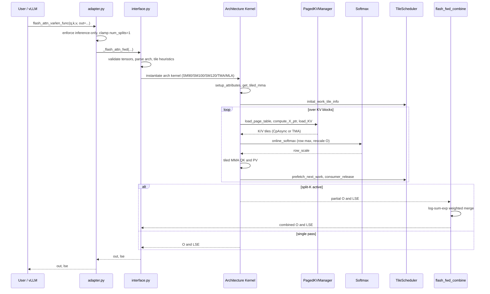

# FlashAttention Kernel Domain — Technical Implementation Documentation

## 1. Overview

The **FlashAttention Kernel Domain** is the compute core of the `spark-vllm-docker` repository. It is realized by a single vendored Python package, **`inkling_sm120_fa4`**, located at:

```
mods/inkling-sm12-paged-kv/vendor/inkling_sm120_fa4/
```

This package is a **CUTLASS CuTe-DSL reimplementation** of Tri Dao's FlashAttention C++/CUDA kernels. It provides high-performance attention primitives for three NVIDIA GPU generations:

| Architecture | Marketing name | Role in this domain |
|---|---|---|
| **SM90** | Hopper (H100) | Warpgroup-MMA forward/backward, TMA KV loads |
| **SM100 / SM110** | Blackwell datacenter (B200) | `tcgen05` MMA, TMEM accumulators, warp-specialized pipelines |
| **SM120 / SM121** | Blackwell consumer (RTX PRO 6000, DGX Spark, RTX 5090) | SM80-era `mma.sync` kernels with a reduced 99 KB SMEM budget, plus a TMA warp-specialized variant |

The package is a **downstream distribution** of `Dao-AILab/flash-attention` that bundles five open upstream PRs targeting SM120 (documented in `__init__.py`):

- **#2336** — SM120 split-KV (FlashDecoding) with FP32 partial outputs
- **#2348** — SM120 kernel-level paged KV cache support (includes #2336)
- **#2349** — SM120 TMA forward kernel with warp specialization
- **#2389** — SM80/SM120 block-sparse forward attention support
- **#2439** — FA4 dropout (Philox-based, per-element, all architectures)

The package exposes only two public entry points (`__init__.py`):

```python
from .interface import flash_attn_func, flash_attn_varlen_func
__all__ = ["flash_attn_func", "flash_attn_varlen_func"]
```

Everything else is an internal building block composed by the architecture-specific kernel classes.

---

## 2. Position Within the System

The kernel domain is a **Core Technical Domain** of `spark-vllm-docker`. It does not run standalone; it is installed into an externally installed vLLM package and invoked through a patched dispatch path. The integration chain is:

```
vLLM Inkling FA4 dispatch (fa4_rel_attention.py)
        │  patched by patch_inkling.py
        ▼
vllm/third_party/inkling_sm120_fa4_adapter.py   ← adapter.py (call-contract shim)
        ▼
vllm/third_party/inkling_sm120_fa4/interface.py ← vendored bundle
        ▼
Architecture-specific kernel (SM90 / SM100 / SM120 / SM120-TMA / MLA)
```

Two orchestration artifacts bind the kernel domain to vLLM:

1. **`mods/inkling-sm12-paged-kv/run.sh`** — a fail-fast installer that:
   - Resolves the vLLM `site-packages` root (`VLLM_SITE_PACKAGES` / `PYTHON_ROOT`, default `/usr/local/lib/python3.12/dist-packages`).
   - Runs a **runtime preflight** verifying SM12x capability, CUDA ≥ 12.8, and the presence of required CuTe APIs (`ThrMma`, `make_rmem_tensor`).
   - Copies the vendored bundle to `vllm/third_party/inkling_sm120_fa4` and the adapter to `vllm/third_party/inkling_sm120_fa4_adapter.py`.
   - Verifies the bundle imports, then applies `patch_inkling.py`.

2. **`mods/inkling-sm12-paged-kv/patch_inkling.py`** — an AST-guarded patcher that injects a capability check into vLLM's FA4 dispatch so that SM12 devices route to the vendored paged-KV kernel. It inserts:

   ```python
   @cache
   def _use_sm12_paged_kv() -> bool:
       capability = current_platform.get_device_capability()
       return capability is not None and capability.major == 12
   ```

   and rewrites the dispatch block to import `flash_attn_varlen_func` from the adapter when `_use_sm12_paged_kv()` is true. The patcher is **idempotent** (guarded by the marker `# spark-vllm mod: inkling-sm12-paged-kv v1`), validates the module shape via `ast.parse`, and re-`compile()`s the result.

### 2.1 The Adapter (`adapter.py`)

The adapter is a first-class integration seam that is **not part of the vendored bundle**. It exists because the bundle's public `flash_attn_varlen_func` lacks the `out=` preallocated-output contract that vLLM Inkling passes during both warmup and inference. The adapter:

- Preserves the `out=` contract by forwarding to the bundle's internal `_flash_attn_fwd`.
- Enforces **inference-only** semantics — raises `RuntimeError` if autograd is enabled and any of `q/k/v` requires grad.
- Rejects `deterministic=True`.
- **Clamps `num_splits = 1`** as a defensive measure, since the SM12 paged-KV kernel is validated only with a single split.

---

## 3. Layered Architecture

The domain is organized into eight submodules that compose through well-defined abstractions:

```
┌──────────────────────────────────────────────────────────────┐
│  Public API & Autograd Interface  (interface.py, mask.py,     │
│  seqlen_info.py, pack_gqa.py, dropout.py)                     │
├──────────────────────────────────────────────────────────────┤
│  Forward Pass Kernels        │  Backward Pass Kernels          │
│  flash_fwd.py (Base/Sm80)    │  flash_bwd.py (Sm80)            │
│  flash_fwd_sm90.py           │  flash_bwd_sm90.py              │
│  flash_fwd_sm100.py          │  flash_bwd_sm100.py             │
│  flash_fwd_sm120.py          │  flash_bwd_sm120.py             │
│  flash_fwd_sm120_tma.py      │  flash_bwd_preprocess.py        │
│  flash_fwd_mla_sm100.py      │  flash_bwd_postprocess.py       │
├──────────────────────────────────────────────────────────────┤
│  Split-K Combine  │  Softmax & Numerical Core                │
│  flash_fwd_combine│  softmax.py, fast_math.py                │
├──────────────────────────────────────────────────────────────┤
│  Paged KV Cache Management  │  Tile Scheduling & Pipelines    │
│  paged_kv.py, topk_gather_kv│  tile_scheduler.py, pipeline.py │
│  cache_utils.py             │  barrier.py, named_barrier.py   │
├──────────────────────────────────────────────────────────────┤
│  Kernel Utilities & Blackwell Helpers                         │
│  utils.py, blackwell_helpers.py, ampere_helpers.py,           │
│  copy_utils.py, block_sparse_utils.py, mma_sm100_desc.py,     │
│  cute_dsl_utils.py                                            │
└──────────────────────────────────────────────────────────────┘
```

---

## 4. Public API & Autograd Interface

### 4.1 Configuration Dataclasses

`interface.py` defines two frozen dataclasses that capture tile geometry and pipeline flags:

```python
@dataclass(frozen=True)
class FwdConfig:
    m_block_size: int
    n_block_size: int
    mma_pv_is_rs: bool
    intra_wg_overlap: bool

@dataclass(frozen=True)
class BwdConfig:
    m_block_size: int
    n_block_size: int
    num_stages_Q: int
    num_stages_dO: int
    num_stages_PdS: int
    SdP_swapAB: bool
    dKV_swapAB: bool
    dQ_swapAB: bool
    AtomLayoutMSdP: int
    AtomLayoutNdKV: int
    AtomLayoutMdQ: int
    num_wg: int = 2
    dQ_single_wg: bool = False
```

### 4.2 Tile-Size Heuristics

`_tile_size_fwd_sm90` and `_tile_size_bwd_sm90` return tuned `FwdConfig`/`BwdConfig` values based on `head_dim`, `head_dim_v`, causal/local masking, and block-sparse constraints. These are ported from the C++ `hopper/tile_size.h` and `flash_bwd_launch_template.h` but adjusted for the Python kernel's different register/SMEM tradeoffs (benchmarked on H100 SXM). For example, for `head_dim <= 96` the forward heuristic deliberately selects `mma_pv_is_rs=False` because register-sourced PV is "catastrophic with 192× tiles (~300 vs ~600 TFLOPS)".

### 4.3 Architecture Parsing and Validation

- `_parse_arch_str` converts strings such as `'sm_90a'` or `'100'` into an integer (`90`, `100`).
- `_get_device_arch` is `lru_cache`d and reads `torch.cuda.get_device_capability()`, overridable via the `FLASH_ATTENTION_ARCH` environment variable for CPU-only compilation.
- `_validate_head_dims` enforces per-architecture head-dimension constraints:
  - **SM90**: `8 ≤ head_dim, head_dim_v ≤ 256`, divisible by alignment.
  - **SM100/SM110**: standard range `8..128`, plus DeepSeek shapes `(192, 128)` and MLA-absorbed `(64, 512)`.
- `_validate_tensor` checks shape, dtype, device, and CUDA residency (skipped in fake mode).

### 4.4 Split-KV Heuristic

```python
def num_splits_heuristic(total_mblocks, num_SMs, num_n_blocks, max_splits):
    if num_n_blocks <= 4:
        return 1
    return min(num_SMs // total_mblocks, max_splits, num_n_blocks)
```

### 4.5 Autograd Functions

Two `torch.autograd.Function` classes form the torch-facing surface:

- **`FlashAttnFunc`** — fixed-length batched attention.
- **`FlashAttnVarlenFunc`** — variable-length attention with `cu_seqlens_q/k`, `seqused_q/k`.

Both `forward` methods call `_flash_attn_fwd`, save `(q, k, v, out, lse)` for backward, and return `(out, lse)`. Both `backward` methods call `_flash_attn_bwd` and return `dq, dk, dv` followed by `(None,) * 30` for the remaining non-differentiable arguments. `ctx.set_materialize_grads(False)` avoids materializing zero gradients for unused inputs.

### 4.6 Masking, Sequence Info, GQA Packing, Dropout

- **`mask.py`** — implements R2P (register-to-predicate) bitmask masking via inline PTX (`r2p_bitmask_below`, `r2p_bitmask_above`), plus `sm90_col_to_r2p_idx` to translate SM90 MMA column coordinates into contiguous element indices.
- **`seqlen_info.py`** — `SeqlenInfo` and `SeqlenInfoQK` consolidate all sequence-length metadata (offsets, padded offsets, per-batch lengths) so global-memory reads happen once per tile.
- **`pack_gqa.py`** — `pack_gqa_layout` folds `qhead_per_kvhead` into the sequence dimension, and `make_packgqa_tiled_tma_atom` builds a TMA atom that preserves the standard 4D TMA dimensionality after packing.
- **`dropout.py`** — FA2-style Philox 4×32 PRNG dropout keyed on MMA layout positions; forward and backward tiles are matched so mask assignments are identical.

---

## 5. Forward Pass Kernels

### 5.1 Base Class — `FlashAttentionForwardBase` (`flash_fwd.py`)

The base class (a reimplementation of `flash_fwd_kernel_sm80.h` / `sm90.h`) holds all shared configuration: dtype, head dimensions (padded to a multiple of 16), `qhead_per_kvhead`, causal/local flags, tile sizes, pipeline stages, thread count, score/mask modifiers, and dropout parameters. It computes compile-time constants such as `check_hdim_oob` and `check_hdim_v_oob` to elide predication when head dims are already aligned.

`FlashAttentionForwardSm80` extends this with the SM80-era `mma.sync.aligned.m16n8k16` mainloop and CpAsync KV loads.

### 5.2 SM90 — `FlashAttentionForwardSm90` (`flash_fwd_sm90.py`)

Adds Hopper-specific features:
- Warpgroup MMA (`warpgroup` namespace) with warp-scheduler barriers.
- `intra_wg_overlap` and `mma_pv_is_rs` flags controlling register-sourced PV.
- TMA KV loads by default (`use_tma_KV = not paged_kv_non_tma`).
- `cluster_shape_mn = (1, 1)` and an assertion restricting to SM 9.x.

### 5.3 SM100 — `FlashAttentionForwardSm100` (`flash_fwd_sm100.py`)

The largest forward file (~3,150 lines). Supported features (per its header):
- BF16 & FP16 dtype; causal & non-causal; MHA/GQA/MQA; head dims 64/96/128/(192,128); varlen; sliding window; split-KV.
- Uses `tcgen05` MMA with TMEM accumulators and warp-specialized producer/consumer pipelines.
- Contains an agent-editable `_TUNING_CONFIG` table keyed by `(use_2cta_instrs, is_causal, head_dim_padded, is_sm103)` controlling `ex2_emu_freq`, `ex2_emu_start_frg`, and register budgets for softmax/correction warps.
- Exposes `DescaleTensors` for FP8 descaling and `kv_head_idx`/`offset_kv_smem` helpers.

### 5.4 SM120 — `FlashAttentionForwardSm120` (`flash_fwd_sm120.py`)

A pragmatic subclass of `FlashAttentionForwardSm80` that overrides only what differs on consumer Blackwell:

```python
class FlashAttentionForwardSm120(FlashAttentionForwardSm80):
    def __init__(self, *args, **kwargs):
        super().__init__(*args, **kwargs)
        self.arch = Arch.sm_80   # force CpAsync epilogue (no TMA-O)
        self.pack_gqa = False    # GQA packing broken on the Sm80 path
```

Its `can_implement` reuses the SM80 logic but substitutes the **99 KB** SMEM capacity (`get_smem_capacity_in_bytes("sm_120")`) for SM80's 163 KB. For split-KV, FP32 partials are written directly from MMA accumulators to GMEM, so `sO` does not consume SMEM budget.

### 5.5 SM120 TMA — `FlashAttentionForwardSm120Tma` (`flash_fwd_sm120_tma.py`)

A separate warp-specialized variant that adds:
- **TMA (`cp.async.bulk`)** for Q/K/V global→shared transfers.
- **Warp specialization**: one dedicated DMA/producer warp plus N MMA warps (`num_threads = (num_mma_warps + 1) * 32`).
- **`PipelineTmaAsync`** with mbarrier synchronization for KV double-buffering.
- **`Swizzle(B, 4, 3)`** SMEM layouts (TMA requires `swizzle_base=4`, unlike CpAsync's `swizzle_base=3`), selected by `get_smem_layout_atom_tma`.
- Still uses SM80-era `mma.sync.aligned.m16n8k16` tensor cores — no WGMMA, no tcgen05, no TMEM.

Validated on SM121a (DGX Spark).

### 5.6 MLA — `FlashAttentionMLAForwardSm100` (`flash_fwd_mla_sm100.py`)

Implements Multi-head Latent Attention (MLA) inference with warp-specialized pipelines, `tcgen05` MMA, and paged KV. It supports the weight-absorbed formula:

```
O = softmax(scale * (Q @ K.T + Qv @ V.T)) @ V
```

where `Q = q_pe`, `Qv = q_nope`, `K = pe_cache`, `V = kv_cache`. It integrates `CpasyncGatherKVManager` for top-K sparse KV selection (DSA path, requiring MQA with `qhead_per_kvhead == 128`).

### 5.7 Forward Dispatch Logic

`_flash_attn_fwd` selects the kernel by architecture:

- **SM80/SM120** → 128 threads (4 warps).
- **SM120** dispatch order (documented inline):
  1. **TMA kernel** when viable: no paged KV, no varlen, no block-sparse, no dropout.
  2. **Non-TMA kernel** otherwise: `num_stages=2` when paged (to overlap page-table lookups with MMA; SMEM budget `sQ+sK+sV` at `tile_n=64` = 96 KB ≤ 99 KB), else `num_stages=1`.
- **SM120 does not support SplitKV** in this variant — `num_splits` is forced to 1.
- **SM100/SM110** may use 2-CTA instructions when a long list of conditions holds (non-causal, non-local, no split-KV, no varlen, page size ∈ {None, 128}, head dims in {128, 192}×128, etc.).

---

## 6. Backward Pass Kernels

### 6.1 Preprocess — `FlashAttentionBackwardPreprocess` (`flash_bwd_preprocess.py`)

Computes the per-row statistic `D_i = (dO_i * O_i).sum(dim=-1)`, optionally adjusted for a differentiable LSE gradient:

```
D'_i = D_i - dLSE_i
```

This works because `dS_ij = P_ij * (dP_ij - D_i) + dLSE_i * P_ij = P_ij * (dP_ij - (D_i - dLSE_i))`, so the main backward kernel is unchanged. Uses PDL (programmatic dependent launch) on SM90+.

### 6.2 Main Backward Kernels

- **`FlashAttentionBackwardSm80`** (`flash_bwd.py`) — reimplementation of `mainloop_bwd_sm80.hpp`; orchestrates tiled MMA pipelines for dQ/dK/dV accumulation with `SdP_swapAB`, `dKV_swapAB`, `dQ_swapAB` layout controls.
- **`FlashAttentionBackwardSm90`** (`flash_bwd_sm90.py`) — warpgroup MMA with `_qkv_transpose` and `_get_stat` helpers; supports `dQ_single_wg`.
- **`FlashAttentionBackwardSm100`** (`flash_bwd_sm100.py`) — the largest file (~4,050 lines); `tcgen05` MMA, `SharedStorageSeparateQV`/`SharedStorageSharedQV` variants, 2-CTA instructions.
- **`FlashAttentionBackwardSm120`** (`flash_bwd_sm120.py`) — subclasses `FlashAttentionBackwardSm80`, overriding only `can_implement` to use the 99 KB SMEM budget.

### 6.3 Postprocess — `FlashAttentionBackwardPostprocess` (`flash_bwd_postprocess.py`)

Converts the FP32 `dq_accum` (and optionally `dk_accum`/`dv_accum`) into the output dtype, applying `softmax_scale` and handling varlen offsets. Supports Ampere (8.x), Hopper (9.x), and Blackwell (10.x/11.x/12.x).

### 6.4 Backward Flow

```
flash_bwd_preprocess  →  D = rowsum(dO * O)  [− dLSE]
        ▼
architecture-specific backward kernel  →  dQ, dK, dV (FP32 accumulators)
        ▼
softmax statistics recomputation (softmax.py)
        ▼
flash_bwd_postprocess  →  normalize/convert dQ (and dK/dV)
        ▼
gradients returned to FlashAttnFunc / FlashAttnVarlenFunc
```

---

## 7. Paged KV Cache Management

### 7.1 `PagedKVManager` (`paged_kv.py`)

A `ParamsBase` dataclass that translates logical KV positions into physical block pointers. Key methods:

- **`create(...)`** — builds the manager, choosing a `v_gmem_transposed` layout: SM100 transposes V in GMEM to `(dv, page_size, num_pages)`, while SM90 keeps V as `(page_size, dv, num_pages)` (same as K). It constructs a CpAsync tiled copy (`CopyG2SOp`) with 128-bit universal copies and computes `page_entry_per_thread`.
- **`load_page_table(n_block)`** — for each thread, computes `page_idx, page_offset = divmod(row_idx + leftpad_k, page_size_divmod)` using `FastDivmodDivisor` page-size arithmetic, and stores the page and offset into register tensors `tPrPage`/`tPrPageOffset`.
- **`compute_X_ptr(K_or_V)`** — converts page/offset pairs into 64-bit element pointers, respecting the transposed-V layout.
- **`load_KV(n_block, sX, K_or_V)`** — performs block-wise CpAsync tile loading from non-contiguous paged memory, with row-validity predication against `seqlen_k`.

### 7.2 `CpasyncGatherKVManager` (`topk_gather_kv.py`)

Extends paged-KV loading to **top-K selected blocks** for sparse MLA inference. It manages a top-K index tensor, a bitmask, and an optional bitmask pipeline, with `disable_bitmask` as a compile-time flag when indices are guaranteed in-bounds.

### 7.3 `cache_utils.py`

Provides the AOT JIT cache infrastructure:
- **`FileLock`** — advisory `fcntl.flock`-based locking for concurrent cache access.
- **`_compute_source_fingerprint`** — SHA-256 over all CuTe Python sources plus Python minor version, `cutlass.__version__`, and `tvm_ffi.__version__`, so the cache invalidates on any source or ABI change.
- Pre-loads CuTe DSL runtime libraries with `RTLD_GLOBAL` so cached `.so` modules resolve symbols correctly.

---

## 8. Split-K Combine

`FlashAttentionForwardCombine` (`flash_fwd_combine.py`) merges partial outputs from the split-K forward pass using **log-sum-exp weighted merging**. It is a reimplementation of `flash_fwd_combine_kernel.h`.

- Accepts `out_partial` and `lse_partial` shaped `(num_splits, batch, seqlen, nheads, headdim)` (batched) or `(num_splits, total_q, nheads, headdim)` (varlen).
- `can_implement` restricts `max_splits ≤ 256`, `head_dim % 8 == 0`, and `(tile_m * max_splits) % num_threads == 0`.
- The user-facing `flash_attn_combine` computes `k_block_size` (64 for `head_dim ≤ 64`, else 128), `tile_m` (8/16/32), and `log_max_splits = max(ceil(log2(num_splits)), 4)` (bumped to 5 when `tile_m == 8`).
- Compilation is cached per `compile_key` via `get_jit_cache("fwd_combine")`.

---

## 9. Softmax & Numerical Core

### 9.1 `Softmax` (`softmax.py`)

Implements **online (streaming) softmax** on `cute.TensorSSA` fragments:

- `reset()` initializes `row_max = -inf` and `row_sum = 0`.
- `online_softmax(acc_S, is_first, check_inf)` processes one row at a time:
  - Computes the current row max via `fmax_reduce`, then a warp-level `warp_reduction_max(threads_in_group=4)`.
  - Updates `row_max[r]` and computes `row_scale[r] = exp2((row_max_prev - row_max_cur) * scale_log2)`.
  - Applies `exp2(acc_S * scale_log2 - row_max_cur * scale_log2)` with `fastmath=True`.
  - Accumulates `row_sum` with the rescaled previous sum.
  - Returns `row_scale` so the caller can rescale the O accumulator.
- `finalize(final_scale, sink_val)` produces the final LSE, supporting learnable sinks.

`SoftmaxSm100` provides the Blackwell-specific variant used by the SM100 forward and MLA kernels.

### 9.2 `fast_math.py`

Provides `clz` (count-leading-zeros) and related bit primitives used by the tile scheduler and masking logic.

---

## 10. Tile Scheduling & Pipelines

### 10.1 `tile_scheduler.py`

Defines the persistent-kernel work-distribution layer:

- **`SchedulingMode`** — `NONE`, `STATIC`, `DYNAMIC`, `CLC`.
- **`ClcState`** — owns the runtime state shared by CLC-capable schedulers: a `ClcDynamicPersistentTileScheduler`, a `PipelineClcFetchAsync`, and consumer/producer `PipelineState`s. It exposes `initial_work_tile_info`, `get_current_work`, `prefetch_next_work`, `consumer_wait`, `consumer_release`, and `producer_tail`.
- **`WorkTileInfo`** — extends `cutlass.utils.WorkTileInfo` with four axes: `(block, head, batch, split)`.
- **`TileSchedulerProtocol`** — a `runtime_checkable` Protocol defining `get_current_work`, `initial_work_tile_info`, and `advance_to_next_work`. Concrete schedulers include `SingleTileScheduler`, `SingleTileVarlenScheduler`, `SingleTileLPTScheduler`, `StaticPersistentTileScheduler`, and `SingleTileLPTBwdScheduler`.

CLC (cluster launch control) is enabled via the `FA_CLC` environment variable and is disabled for varlen MHA and dense non-causal shapes, where it regresses.

### 10.2 `pipeline.py`

Wraps `cutlass.pipeline` stages with DSL state cloning. The `_override_create` helper constructs a parent pipeline object and re-classes it to the child via `object.__setattr__` (necessary because the dataclass is frozen). `PipelineStateSimple` packs index and phase into a single `Int32`, using bit-twiddling when `stages` is a power of two.

### 10.3 `barrier.py` and `named_barrier.py`

- `barrier.py` provides `ld_acquire`/`wait_eq` primitives.
- `named_barrier.py` enumerates hardware named-barrier IDs shared between producer and consumer warps: `NamedBarrierFwd`, `NamedBarrierFwdSm100`, `NamedBarrierBwd`, `NamedBarrierBwdSm100`, and `NamedBarrierFwdSm100_MLA2CTA`. Barrier 0 is reserved for `sync_threads()`, so enumeration starts at 1.

---

## 11. Kernel Utilities & Blackwell Helpers

### 11.1 `utils.py`

Shared device-side primitives: `fmax_reduce`, `fadd_reduce`, `shuffle_sync`, `elem_pointer`, `predicate_k`, `smid`, `atomic_add_fp32`, `warp_prefix_sum`, `hash_callable`, `create_softcap_scoremod`, and the `POLY_EX2` polynomial coefficients for emulated `exp2`. It also exposes environment-driven defaults:

```python
_fa_clc_enabled = os.environ.get("FA_CLC", "0") == "1"
_fa_disable_2cta_enabled = os.environ.get("FA_DISABLE_2CTA", "0") == "1"
```

and auto-disables 2-CTA on CUDA 12 due to an ~18% codegen regression fixed in CUDA 13.

### 11.2 `blackwell_helpers.py`

Provides `tcgen05` MMA primitives:
- `_tcgen05_mma_kind` maps MMA op types to kind strings (`f16`, `tf32`, `i8`, `f8f6f4`, `mxf8f6f4`, `mxf4`, `mxf4nvf4`).
- `gemm_w_idx`, `gemm_ptx_w_idx`, and `gemm` wrap `cute.gemm` with index selection, `zero_init`, and `swap_AB` support.
- `gemm_ptx_partial` emits raw PTX for TMEM-accumulator MMAs.

### 11.3 `mma_sm100_desc.py`

Ports the SM100 MMA descriptor enum encodings from CUTLASS C++ (`mma_sm100_desc.hpp`, `mma_traits_sm100.hpp`). Enumerations (`Major`, `ScaleIn`, `Saturate`, `CFormat`, `F16F32Format`, `S8Format`, `MXF8F6F4Format`, `MaxShift`) carry values that **must stay identical to the hardware encodings**, plus SMEM descriptor builders.

### 11.4 `copy_utils.py`

Data-movement utilities: `cvt_copy` (type-converting copy), `load_s2r` (shared→register autovec copy), `get_copy_atom`, `make_tmem_copy`, `copy_bulk`, `copy_tma`, and `tma_producer_copy_fn`.

### 11.5 `ampere_helpers.py`

Provides `get_smem_layout_atom` for the SM80-era SMEM layout atoms used by the SM80/SM120 kernels.

### 11.6 `block_sparse_utils.py` and `block_sparsity.py`

Implement block-sparse attention. `block_sparse_utils.py` contains runtime execution functions (`run_block_sparse_mainloop_sm80`, `produce_block_sparse_loads_sm100`, `softmax_block_sparse_sm100`, `handle_block_sparse_empty_tile_correction_sm100`, etc.) and documents the mbarrier contract for empty tiles (a Q tile with zero active KV blocks seeds fully-masked-row stats so output/LSE remain well-defined).

### 11.7 `cute_dsl_utils.py`

Provides `to_cute_tensor`, `to_cute_aux_tensor`, `get_aux_tensor_metadata`, `get_broadcast_dims`, `assume_tensor_aligned`, `assume_strides_aligned`, and the `torch2cute_dtype_map` used throughout the interface.

---

## 12. Compilation & Caching

Kernel compilation is expensive, so the domain mitigates it through:

1. **AOT JIT cache** (`cache_utils.py`) — keyed by a source fingerprint that changes whenever any `.py` file, the Python minor version, or the `cutlass`/`tvm_ffi` versions change. Enabled via `FLASH_ATTENTION_CUTE_DSL_CACHE_ENABLED=1`; directory overridable via `FLASH_ATTENTION_CUTE_DSL_CACHE_DIR`.
2. **`cute_dsl_ptxas.py`** — a ptxas replacement shim activated when `CUTE_DSL_PTXAS_PATH` is set; dumps PTX and compiles it with the system ptxas.
3. **Compile-key caching** — `_flash_attn_fwd.compile_cache`, `_flash_attn_bwd.compile_cache`, and `_flash_attn_fwd_combine.compile_cache` are populated via `get_jit_cache(...)` and keyed on a tuple of dtype, head dims, masking flags, varlen flags, page-table presence, score/mask-mod hashes, and aux-tensor metadata.
4. **Environment-driven defaults** — `FA_CLC` and `FA_DISABLE_2CTA` select scheduling and 2-SM-CTA modes without recompilation.

---

## 13. End-to-End Runtime Sequence



---

## 14. Design Decisions and Constraints

| Decision | Rationale |
|---|---|
| **SM120 subclasses SM80** | Consumer Blackwell shares the SM80 `mma.sync` instruction set; only the SMEM capacity (99 KB vs 163 KB) differs, so bring-up is minimal. |
| **Separate TMA variant for SM120** | TMA + warp specialization is a distinct execution model; keeping it separate avoids complicating the CpAsync path. |
| **`pack_gqa = False` on SM120** | GQA packing is broken on the SM80 code path (crd2idx errors against the packed layout); the non-packed path is functionally correct on all tested GQA/MQA shapes (tracked upstream as #2484). |
| **`num_splits = 1` clamp in the adapter** | The SM12 paged-KV kernel is validated only with a single split; the clamp is a defensive second line of defense. |
| **Inference-only adapter** | The vendored bundle's public wrapper lacks the `out=` contract and autograd support; the adapter enforces the inference contract explicitly. |
| **Numerically stable split-K** | A dedicated combine kernel and statistics-based backward recomputation prioritize memory-bounded, numerically stable computation via log-sum-exp merging and online softmax. |
| **Idempotent, marker-guarded patching** | `patch_inkling.py` injects `# spark-vllm mod: inkling-sm12-paged-kv v1` and validates module shape before and after rewriting, enabling safe re-application and auditability. |

---

## 15. Summary

The FlashAttention Kernel Domain is a self-contained, vendored CuTe-DSL attention library that spans three GPU generations and two execution models (CpAsync and TMA warp-specialized). Its eight submodules compose through stable abstractions — `PagedKVManager`, `Softmax`, `TileSchedulerProtocol`, and the pipeline/barrier primitives — while the `interface.py` autograd layer presents a torch-compatible surface. Integration with vLLM is achieved through a fail-fast installer (`run.sh`), an AST-guarded dispatch patcher (`patch_inkling.py`), and a call-contract adapter (`adapter.py`) that preserves vLLM's `out=` contract and enforces inference-only semantics. Compilation cost is contained by a source-fingerprinted AOT JIT cache and environment-driven scheduling defaults.