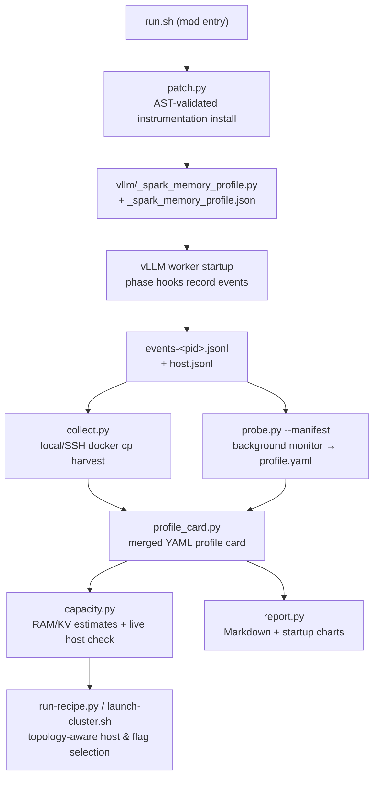
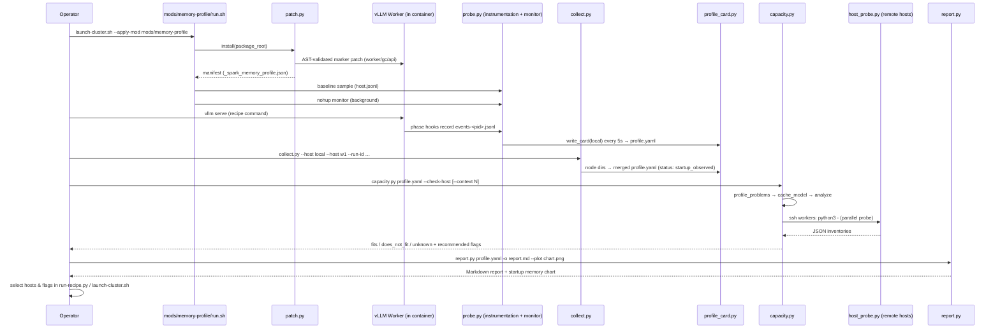

# Memory Profiling & Capacity Domain — Technical Documentation

| Item | Value |
|---|---|
| **Project** | spark-vllm-docker |
| **Domain** | Memory Profiling & Capacity (Supporting Domain) |
| **Location** | `mods/memory-profile/` |
| **Files** | `run.sh`, `patch.py`, `probe.py`, `collect.py`, `profile_card.py`, `capacity.py`, `report.py`, `host_probe.py` |
| **Schema** | `spark-vllm-memory-profile/v1` |
| **Mod marker** | `# spark-vllm mod: memory-profile v1` |

---

## 1. Purpose and Scope

The **Memory Profiling & Capacity Domain** answers one operational question before a large-model deployment consumes cluster resources: *will this model, on this topology, fit into the available host and device memory — and if so, which hosts and which `vllm serve` settings should be used?*

It does so with a three-stage pipeline:

1. **Startup instrumentation** — a non-invasive mod that injects an opt-in profiler into the installed vLLM package and records phase-by-phase native heap, CUDA, and model/KV-cache memory while a worker starts.
2. **Profile consolidation** — collection of per-rank JSONL event streams from every node, merged into a single YAML *profile card* keyed by model/recipe and run ID.
3. **Capacity analysis and reporting** — a fail-closed estimator that derives startup RAM requirements, budgets the KV cache for alternative contexts and concurrency levels, probes target hosts live over SSH, and emits fit verdicts (`fits` / `does_not_fit` / `unknown`) plus a human-readable Markdown report and charts.

The domain is classified as a **supporting domain**: it observes the engine (Instrumentation Dependency on the Engine Patching domain) and feeds its findings back to the Deployment Recipes & Cluster Orchestration domain to guide topology-aware host selection (Data Dependency).



---

## 2. Component Overview

| Sub-module | Files | Responsibility |
|---|---|---|
| **Startup Memory Probe** | `run.sh`, `patch.py`, `probe.py` | Installs the profiler into the installed vLLM tree without importing vLLM or initializing CUDA; records per-phase memory events and a background host sampler. |
| **Profile Collection & Card Generation** | `collect.py`, `profile_card.py` | Harvests per-rank JSONL from local or remote containers; validates and merges them into a schema-checked YAML profile card. |
| **Capacity Analysis & Reporting** | `capacity.py`, `report.py`, `host_probe.py` | Validates card completeness, models startup RAM and KV-cache budgets, probes live hosts, renders Markdown/console/JSON verdicts and CPU/CUDA startup charts. |

---

## 3. Startup Memory Probe

### 3.1 `run.sh` — mod entry point

`run.sh` follows the system-wide mod contract (`set -euo pipefail`, `run.sh` entry, target discovery via `importlib.util.find_spec("vllm")`, overridable with `VLLM_PACKAGE_ROOT`):

1. Resolves the installed vLLM package root.
2. Runs `patch.py <package_root>` to install (or verify) the instrumentation.
3. Reads the output directory (`host_directory`) from the installed manifest `<package_root>/_spark_memory_profile.json`.
4. If no baseline host sample exists (`host.jsonl` empty), takes one via `probe.py --manifest … --baseline` — the pre-vLLM reference point for all later increments.
5. Starts the long-running sampler with `nohup python3 probe.py --manifest … >> monitor.log 2>&1 &`.
6. Prints the output directory and reminds the operator to **bind-mount `/memory-profiles`** so profiles survive container removal.

### 3.2 `patch.py` — instrumentation installation

`patch.py` installs the profiler using **AST-validated, marker-guarded text rewriting** — the same fail-fast patch idiom used across the project — and never imports vLLM or touches CUDA.

**Patch targets and kinds**

| Kind | Target file (inside vllm package) | Injected suffix |
|---|---|---|
| `worker` | `v1/worker/gpu_worker.py` | `install_worker(globals())` |
| `gc` | `utils/gc_utils.py` | `freeze_gc_heap = wrap_gc(freeze_gc_heap)` |
| `api` | `entrypoints/launchers/utils/server_utils.py` **or** `entrypoints/openai/api_server.py` (first that defines an `asynccontextmanager` `lifespan`) | `lifespan = wrap_lifespan(lifespan)` |

**Validation performed before any write** (`patched()`):

- Exactly one `Worker` class must exist; it must define all of `WORKER_METHODS = ("init_device", "load_model", "determine_available_memory", "initialize_from_config", "compile_or_warm_up_model")`.
- `init_device` must contain exactly one `request_memory(snapshot, cache_config)` call with two arguments.
- `freeze_gc_heap` must be a single top-level function; `lifespan` must be a single top-level `asyncfunctionmanager`-decorated async function.
- The `# spark-vllm mod: memory-profile v1` marker, if already present, must appear exactly once and the file must end with the expected suffix (idempotent re-run); any other shape raises `ValueError`.
- The patched source is `compile()`-checked before writing.
- `yaml` is imported first as a dependency preflight (the card writer needs it) *before* vLLM is modified.

**Install sequence** (`install()`): all checks, manifest construction, and directory creation (`exist_ok=False`) happen **before** any source file is overwritten, so a failed install never leaves a half-patched package. On success it writes:

- `<package_root>/_spark_memory_profile.py` — a verbatim, SHA-256-stamped copy of `probe.py` (imported at runtime as `vllm._spark_memory_profile`),
- `<package_root>/_spark_memory_profile.json` — the manifest, mirrored into the output directory,
- the three patched source files.

**Manifest contents** (`spark-vllm-memory-profile/v1`): `run_id`, `host_id` (SHA-256 of `/proc/sys/kernel/random/boot_id`, truncated to 16 hex chars), `hostname`, `recipe`, `image`, `host_directory`, `start_monotonic`, `started_at`, sampling knobs, `synchronize`, `driver_version`, `heap_trim_patch_detected` (detects the build-time startup heap-trim patch), `source_sha256` of each patched file, and `probe_sha256`.

**Already-installed detection**: if the marker is present in all targets, the install is accepted only when the manifest and probe copy are also present and consistent; a requested `VLLM_MEMORY_PROFILE_RUN_ID` that differs from the recorded one fails with *"use a fresh container"* — one container equals one profiling run.

### 3.3 `probe.py` — instrumentation and standalone sampler

`probe.py` serves two roles from a single file: it is imported **inside** the engine as `vllm._spark_memory_profile`, and it is executed directly as a **CPU-only host sampler** (so observing the server never imports a second copy of vLLM or Torch).

#### Data sources

| Source | Function | Captured data |
|---|---|---|
| `/proc/meminfo` | `host_memory()` | `MemTotal/MemAvailable/MemFree/Cached/SReclaimable/Shmem/Swap*` + derived `unavailable_bytes` |
| `/proc/<pid>/smaps_rollup` | `process_memory()` | `Pss`, `Pss_Anon/File/Shmem`, `Rss`, `Anonymous`, `Swap`, `Locked` |
| `/proc/<pid>/stat` | `process_start()` | process start ticks |
| libc `mallinfo2` (ctypes) | `native_heap()` | `arena`, `uordblks`, `fordblks`, `hblkhd` |
| PyTorch CUDA (only if Torch already initialized) | `cuda_memory()` | allocated/reserved bytes, device free/total via `mem_get_info`, peak since vLLM reset, inactive split, pinned-host allocator stats; optional `torch.cuda.synchronize` controlled by manifest `synchronize` |
| tensor storages | `storage_inventory()` | deduplicated `untyped_storage()` byte totals per device (CUDA/CPU) — dedup avoids double-counting aliased tensors |
| vLLM configs | `metadata()` | curated `CONFIG_FIELDS` across model/parallel/cache/scheduler/speculative/compilation/kernel/load configs, `multimodal_config`, draft model, selected `ENV_FIELDS` (e.g. `PYTORCH_CUDA_ALLOC_CONF`, `B12X_*`), package versions (`vllm`, `torch`, `b12x`, `flashinfer-python`, `transformers`), GPU name/CC/integrated/CUDA runtime, plus a `configuration_sha256` fingerprint |
| vLLM KV cache | `kv_inventory()` | storage bytes, `num_blocks`, per-group spec (type, layers, block/page size, draft/host-resident flags), `configured_tensor_bytes`, `equivalent_capacity_tokens`, `max_concurrency`, and `effective_bytes_per_1000_capacity_tokens` (explicitly flagged as *not* a universal token slope) |

#### Phase hooks

`install_worker(namespace)` wraps the worker lifecycle methods with before/after event pairs:

| Worker method | Before phase | After phase | Extra payload on "after" |
|---|---|---|---|
| `init_device` | `before_device_init` | `device_initialized` | full `metadata()` snapshot |
| `load_model` | `before_model_load` | `model_loaded` | `model_storage` inventory; installs model-runner wraps |
| `determine_available_memory` | `before_memory_profile` | `kv_budget_decision` | `kv_budget_bytes` (returned KV budget) |
| `initialize_from_config` | `before_kv_allocation` | `kv_allocated` | full `kv_cache` inventory |
| `compile_or_warm_up_model` | `before_compile_warmup` | **`worker_ready`** | model + KV inventory and metadata |

Additionally:

- `request_memory` is wrapped to persist the exact admission `snapshot` and `gpu_memory_utilization` (`utilization_check`) and the granted `requested_memory_bytes` (`utilization_check_passed`) **before vLLM's own admission check runs**.
- Model-runner methods `profile_run`, `profile_cudagraph_memory`, `capture_model` are wrapped as `before_/after_<method>` events with `returned_bytes` where numeric.
- Failures are recorded as `worker_failed` with `failed_phase` and `exception_type`, then re-raised.
- `wrap_gc` records `before_startup_gc` / `after_startup_gc`; `wrap_lifespan` records `api_startup`, `api_ready`, `api_failed`, `api_shutdown_failed` and flips the process `role` to `api`.

**Error containment**: every instrumentation call goes through `observe()`, which catches exceptions, de-duplicates warnings per `(function, error-type)`, and returns `None` — *instrumentation errors must never replace model results or exceptions*. Any accumulated errors are embedded in subsequent event rows as `instrumentation_errors`.

#### Event records

`record(phase, worker, **extra)` appends one JSON line to `events-<pid>.jsonl` (serialized under a lock, `allow_nan=False`, sorted keys) containing: `time_unix`, `elapsed_seconds` (monotonic from manifest start), `phase`, `pid`, `role`, `host_id`, `run_id`, host memory, CPU PSS, native heap, CUDA counters, and — for workers — `rank`, `data_parallel_rank`, `rank_key` (`dp{dp}/rank{r}`), `worker_memory` (requested/total consumed/peak activation/cudagraph estimate/available KV bytes), and `model_loader_reported_bytes`.

#### Background monitor

Running with `--manifest` (no `--baseline`), `monitor()`:

- takes an exclusive `fcntl` lock (`monitor.lock`) so only one sampler per host directory runs;
- samples host memory + cgroup counters (`memory.current`, `memory.peak`, `memory.swap.current`) every `sample_interval_seconds` (default **0.5 s**);
- enumerates all processes' PSS every `process_interval_seconds` (default **5 s**), writing `process_namespace_pss_bytes`;
- rewrites `profile.yaml` (via `profile_card.write_card(..., local=True)`) every 5 seconds so a live card is always available;
- runs for `duration_seconds` (default **3600 s**) or until a `STOP` file appears, then writes a final card.

---

## 4. Profile Collection & Card Generation

### 4.1 `collect.py` — run harvest

CLI that gathers one complete profiling run from any mix of local and SSH-reachable containers:

```
collect.py --host local --host worker1 [--host worker2 …]
           --run-id <ID> [--container vllm_node] [--directory /memory-profiles]
           --output <new-local-dir>
```

- Executes `docker cp <container>:/memory-profiles/<run_id>/. -` locally, or the same command over `ssh -o BatchMode=yes` per host.
- Extracts the tar stream with a hardened reader: absolute paths, `..` components, symlinks, devices, and non-regular entries are rejected; output must be a **new** directory to preserve previous profiles.
- Each node lands in `node-<index>/`, then `write_card()` merges all node directories into `<output>/profile.yaml`.
- Prints `<status>: <output>/profile.yaml`.

### 4.2 `profile_card.py` — consolidation and validation

**Discovery & parsing.** `host_directories()` locates host directories by `manifest.json` (direct child or recursive). The JSONL reader ignores a truncated final line (a concurrent writer may still be flushing). Events are sorted globally by `elapsed_seconds` per host and rejected if any `host_id`/`run_id` disagrees with the manifest.

**Per-rank card (`rank_card()`).** For each `(rank_key, pid)` worker group it derives:

- `worker_ready` flag, `metadata` (configuration + versions + hardware + fingerprint),
- `utilization_check` (snapshot, `gpu_memory_utilization`, granted `requested_memory_bytes`) and `kv_budget_bytes`,
- `kv_cache` summary with **deduplicated storage bytes** and `group_layouts` (identical groups collapsed with counts),
- `model_storage_at_ready`, `model_loader_reported_bytes`,
- `non_kv_torch_at_ready` — a derived residual (`CUDA allocated − KV storage`) explicitly labelled *"Derived residual of simultaneous ready counters; not a complete native/driver inventory"*,
- CUDA-graph `captures` (profiling vs serving phase deltas for `capture_model`, flagged `deltas_are_not_isolated_graph_object_sizes`),
- `startup_gc` rows, the full `checkpoints` timeline (phase, elapsed, host-unavailable, CPU PSS, CUDA allocated/reserved), and `failures`.

**Per-host aggregation.** Baseline sample, `startup_peak_unavailable_bytes`, `startup_peak_increment_bytes`, and — split at the first `before_kv_allocation` — `before_first_serving_kv_allocation_peak_increment_bytes` vs `from_first_serving_kv_allocation_peak_increment_bytes`. Readiness cutoff is `max(ready_times)` only when **all workers are ready**; an API marker extends the local cutoff; the card explicitly performs *no cross-host clock comparison or summation*. Flags record honesty constraints: `peaks_are_sampled_lower_bounds: true`, `sampling_covers_startup`, `heap_trim_patch_detected`, `source_sha256`, `probe_sha256`.

**Cross-run validation (fail closed).** One run ID only; unique physical host IDs (the same host must not be counted twice); exactly one model; one parallel topology; `expected_ranks` derived from `(world_size, data_parallel_size)` → `dp{d}/rank{r}`. The `status` is `startup_observed` only when every expected rank is ready, no duplicates/failures/errors exist, the API readiness was observed, and every host's sampling covers startup; otherwise `incomplete`.

**Card structure** (top level): `profile_schema`, `run_id`, `generated_at`, `model`, `recipe`, `scope` (`host`|`run`), `status`, `coverage` (expected/recorded/ready/missing/duplicate ranks, `api_readiness_observed`, `instrumentation_errors`, `workload: startup_only`, `maximum_serving_workload_tested: false`), `hosts[]`, `ranks[]`, `api_processes[]`, and `evaluation` — a block of hard interpretive rules: `do_not_add_host_and_cuda_memory`, `do_not_sum_host_measurements_across_ranks`, plus notes on UMA competition, PSS omissions, KV ratio caveats, and reprofile triggers.

**Atomic write.** `write_card()` serializes to a `NamedTemporaryFile`, `fchmod`s it to `0644` (containers run as root; the host user must still be able to read a bind-mounted card), then `os.replace()`s it into place.

---

## 5. Capacity Analysis & Reporting

### 5.1 `capacity.py` — the estimator and live checker

`capacity.py` (≈23 functions plus `TopologyError`) implements four responsibilities: profile admission, a calibrated KV-cache model, host-RAM requirement estimation, and live cluster validation.

#### Admission gate — `profile_problems()` (fail closed)

A card is analyzed only if it is a complete `startup_observed` profile with every expected rank, a ready API process co-located with rank 0's head host, **one GPU rank per physical host**, host sampling covering startup, valid non-negative peak increments, a positive `MemTotal/MemAvailable` baseline, a consistent TP×PP topology with `DP=DCP=PCP=1`, native-Linux **unified-memory** GPU hardware (`integrated is True`), a resolved `max_model_len`, an *automatic-KV* profile (explicit `kv_cache_memory_bytes` bypasses sizing-cost measurement and is rejected), GPU-only KV storage (no CPU offload), and a complete utilization admission record (`gpu_memory_utilization ∈ (0,1]`, positive total/free/requested/kv-budget with `kv_budget ≤ requested`). Any problem short-circuits `analyze()` and yields verdict `UNKNOWN`.

#### KV-cache model

- **`cache_model(rank)`** calibrates pool geometry from the recorded demand: `pool_bytes = cuda_storage_bytes / num_blocks`, validates a uniform shared pool (`page_size` uniform, `pool_bytes == max(layers) × page_size`), verifies that `blocks / concurrency` resolves to whole per-request blocks, then decomposes demand into `full_groups` (only `FullAttentionSpec` blocks scale with context), `residual_blocks` (non-full groups — Mamba/SlidingWindow state — are *never* linearly rescaled), `slack_blocks` (one null pool block plus per-group lookahead including `num_speculative_tokens`), and `minimum_context = max(1, speculative + 1)`.
- **`kv_breakdown(model, context, sequences)`** computes `blocks = sequences × (residual + ⌈context/block_size⌉×count + slack − 1) + 1` (shared null block) and rejects contexts outside profiled/speculative bounds — *"a new profile is needed"*.
- **`shared_kv_budget(models, demands)`** mirrors vLLM TP/PP semantics: the shared budget is `max(⌈demand/pool_bytes⌉) × max(pool_bytes)` — all stages must fit the largest request block count.

#### Host-RAM requirement math

- `peak_requirement(host, old_kv, new_kv) = max(pre_kv_peak, post_kv_peak − old_kv + new_kv, 0)` — **serving KV is never subtracted from the loading/profiling peak**.
- `init_growth()` = baseline `MemAvailable` − free memory at the utilization gate.
- `budget_overhead()` (the "sizing cost") = `requested_memory_bytes − kv_budget_bytes`.
- `resized_requirement()` = `max(peak_requirement, init_growth + request) + reserve`, with `request = ⌈utilization × device_total⌉`.
- `utilization_estimate()` **inverts vLLM's automatic KV budget** (not the host-RAM peak): `min_util = max over ranks of (sizing_cost + kv) / device_total`; `setting` rounds up to 0.001; the limiting rank is reported. Three scenarios are estimated: `profiled_cache`, `target_context` (default **128 Ki tokens**, single sequence), and `full_concurrency` (`max_num_seqs` full-context sequences).
- `analyze(card, context=131072, reserve=4 GiB)` assembles per-host `profiled_available/total`, `target_available/total`, the target KV budget, the recommended `target_gpu_memory_utilization`, and a `target_host_memory_breakdown` (background, pre-/post-KV peaks, removed/added KV, initial gate, reserve).

#### Live cluster check

- **`select_hosts()`** resolves targets: explicit `--host` (local first, then one distinct SSH host per rank), or by importing `run-recipe.py` to read `.env` (`CLUSTER_NODES`, `LOCAL_IP`), verifying via `ip -j -4 address` that the check really runs on the configured head. Insufficient nodes raise `TopologyError` — *"Topology cannot be reduced from this card."*
- **`probe_host()`** ships `host_probe.py`'s source over `ssh … python3 -` (stdin execution, batch mode, 5 s connect / 20 s overall timeout), probed in parallel via `ThreadPoolExecutor`.
- **`check_cluster()`** evaluates each host **independently** (*"spare RAM on a peer cannot compensate"*). Rejection reasons include duplicate physical host IDs, WSL accounting, `MemAvailable > MemTotal`, GPU count ≠ 1, GPU name/CC/integrated mismatch with the profile, and CUDA-total vs host-total disagreement beyond **5 %** (native UMA accounting sanity). Compatible hosts receive per-host verdicts:
  - `status`: profiled cache/settings → `fits` iff `available ≥ required` **and** the automatic KV resize on the live device would not shrink (`new_kv ≥ old_kv`);
  - `target_status`: reduced KV at target context;
  - `any_kv_status`: startup floor (`peak_requirement(old_kv, 0) + reserve`) vs minimum-context KV budget — with a conservative small-cache fallback configuration;
  - aggregate status across hosts: any `does_not_fit` wins, then `unknown`, else `fits`.
- **Exit codes:** `0` fits, `1` does not fit, `2` unknown/incomplete profile.

#### Output formats

`--format markdown|console|json` (or `--json`). The renderer (`render()`) documents its own semantics in prose: what "required available" vs "total" vs `MemAvailable` mean, that utilization is not a host-RAM cap, that sizing cost = requested − KV budget, and that estimates are conservative rather than exact minima. For a fitting target it prints a ready-to-use flag block:

```text
--max-model-len <context> --max-num-seqs 1
--kv-cache-memory-bytes <budget> --gpu-memory-utilization <setting>
```

### 5.2 `report.py` — Markdown report and startup charts

- **Helpers**: `number()`, `amount()` (GiB/MiB formatting, `"unavailable"` for non-finite), `cell()` (escapes `& < > \ |` and newlines so profile labels cannot break Markdown tables), `table()`, and `load_card()` — a full structural validator (schema match, unique host IDs, process↔host referential integrity, finite `elapsed_seconds`).
- **`markdown_report()`** sections: run header and coverage; host memory table (total / baseline / ready / growth / sampled peak); rank storage & CUDA table; CPU memory at readiness (PSS/RSS, used/free glibc heap) plus an estimated combined per-host PSS with an explicit *"snapshots occur at different times"* caveat; per-rank detail (utilization gate, KV budget, KV per 1,000 equivalent capacity tokens, graph profiling estimate, graph capture deltas, worker failures); and the full startup checkpoint timeline.
- **Charting** (`plot_card()`, matplotlib Agg): three axes per host — system RAM (with baseline and sampled-peak reference lines), CPU PSS (stacked last-observation carry-forward via `cpu_stack_series()`/`plot_cpu_stack()`, with gray shading wherever any contributor is *unknown* — never substituted with zero), and GPU allocated/reserved curves with event markers at `model_loaded` (◆), `kv_allocated` (■), `worker_ready` (★). `--relative` plots growth from recorded baselines; `series()` keeps missing observations as `NaN` gaps.
- CLI: `report.py card.yaml [-o out.md] [--plot chart.png|.svg|.pdf | --no-plot] [--relative]`.

### 5.3 `host_probe.py` — remote inventory

A read-only, dependency-free script that prints one JSON object: `hostname`, `host_id` (boot_id hash), `MemTotal`/`MemAvailable`, WSL detection, and per-GPU `name`, `total_memory_bytes`, `compute_capability`, `integrated`. It uses **ctypes against `libcuda.so.1`** (`cuInit`, `cuDeviceGetCount`, `cuDeviceGet`, `cuDeviceGetName`, `cuDeviceTotalMem_v2`, attributes 75/76/18) — it never creates a CUDA context and never imports Torch, so it can run over SSH on hosts without a Python/PyTorch environment. Driver errors are captured as `gpu_error` instead of failing.

---

## 6. Artifacts and Output Layout

```
/memory-profiles/                       # VLLM_MEMORY_PROFILE_DIR (bind-mount to retain)
└── <run_id>/                           # default: UTC timestamp + 8 hex chars
    └── <host_id>/                      # sha256(boot_id)[:16]
        ├── manifest.json               # run configuration + source hashes
        ├── events-<pid>.jsonl          # one stream per instrumented process
        ├── host.jsonl                  # background host samples + cgroup + PSS
        ├── profile.yaml                # live card, refreshed every 5 s
        ├── monitor.lock / STOP         # single-instance lock / stop signal
        └── monitor.log                 # background sampler stdout/stderr
```

Harvested runs are additionally stored per node (`node-0/ …`) with a merged `profile.yaml` at the output root, from which `report.py` and `capacity.py` consume.

---

## 7. End-to-End Workflow



---

## 8. Integration with the Wider System

| Relation | Mechanism |
|---|---|
| **Engine Patching domain (Instrumentation Dependency)** | `patch.py` rewrites three installed vLLM sources with the `# spark-vllm mod: memory-profile v1` marker and drops `vllm/_spark_memory_profile.py`; it also detects the build-time heap-trim patch (`heap_trim_patch_detected`) and records `source_sha256` of every patched file, so profiles remain attributable to a specific engine build. |
| **Deployment domain (Configuration)** | The mod is applied through the standard protocol: `launch-cluster.sh --apply-mod mods/memory-profile` (repeatable, ordered) or a recipe's `mods:` list, before `vllm serve` starts. |
| **Deployment domain (Data Dependency)** | `capacity.py` reuses `run-recipe.py`'s `load_env_file()` / `parse_nodes()` to resolve `CLUSTER_NODES` for live checks, and its verdicts guide topology-appropriate host selection and serve-flag tuning for subsequent launches. |
| **Container/infrastructure** | Output defaults to `/memory-profiles` inside the container; `run.sh` instructs operators to bind-mount it (`-v`/`VOLUME_MAPPINGS` in `launch-cluster.sh`) so profiles survive container removal. |

---

## 9. Configuration Reference

### Environment variables (read by `patch.py` at install time)

| Variable | Default | Constraint / meaning |
|---|---|---|
| `VLLM_MEMORY_PROFILE_DIR` | `/memory-profiles` | Must be an **absolute** path. |
| `VLLM_MEMORY_PROFILE_RUN_ID` | UTC `YYYYMMDDTHHMMSSZ-<8hex>` | 1–96 chars of `[A-Za-z0-9._-]`, starting alphanumeric; must match an existing install. |
| `VLLM_MEMORY_PROFILE_HOST_ID` | boot-id hash | Same identifier rules. |
| `VLLM_MEMORY_PROFILE_RECIPE` | — | Recorded in the manifest. |
| `VLLM_MEMORY_PROFILE_IMAGE` | — | Recorded in the manifest. |
| `VLLM_MEMORY_PROFILE_INTERVAL` | `0.5` | Host sample interval, ≥ 0.1 s. |
| `VLLM_MEMORY_PROFILE_PROCESS_INTERVAL` | `5` | Process PSS interval, ≥ 0.1 s. |
| `VLLM_MEMORY_PROFILE_DURATION` | `3600` | Monitor lifetime in seconds, ≥ 0.1. |
| `VLLM_MEMORY_PROFILE_SYNC` | `1` | `0|1` — `torch.cuda.synchronize` before CUDA sampling. |
| `VLLM_PACKAGE_ROOT` | auto (`find_spec`) | Overrides vLLM package discovery in `run.sh`. |

### CLI summary

| Tool | Purpose | Key flags |
|---|---|---|
| `collect.py` | Harvest one run | `--host` (repeat), `--run-id`, `--container`, `--directory`, `--output` (new dir) |
| `profile_card.py` | Merge run/host directories | `inputs…`, `-o/--output` |
| `capacity.py` | Fit analysis | `card`, `--context` (131072), `--reserve-gib` (4), `--check-host`, `--config` (`.env`), `--host`, `--format markdown|console|json`, `-o` |
| `report.py` | Markdown + chart | `card`, `-o`, `--plot`/`--no-plot`, `--relative` |
| `host_probe.py` | Host/GPU inventory | none (JSON on stdout) |
| `probe.py` | Sampler/monitor | `--manifest`, `--baseline` |

---

## 10. Design Principles and Operational Caveats

1. **Fail closed.** An incomplete, partial, or instrumentally degraded profile can never yield a positive fit verdict — `profile_problems()` rejects it and the verdict becomes `UNKNOWN`.
2. **Observation must never perturb the workload.** Every probe call runs under `observe()`; errors are recorded, warned once, and swallowed. Patch installation validates *everything* before writing the first byte.
3. **Idempotent, traceable patching.** Marker-guarded suffixes, AST shape validation, compile-before-write, SHA-256 source/probe stamps, and a one-run-per-container rule keep profiles attributable and re-runs safe.
4. **Honest units.** Host RAM and CUDA counters are never added (UMA systems share one pool); host measurements are never summed across ranks; sampled peaks are declared lower bounds; chart gaps stay gaps — zeros are never fabricated for missing samples.
5. **Conservative estimation.** Non-full-attention KV state is retained rather than linearly rescaled; block/alignment slack and speculative lookahead are added; loading/warmup peaks are never discounted by serving-KV reductions; a 4 GiB per-host reserve is the default.
6. **Single-rank-per-host and unified-memory assumptions are explicit.** Live estimates currently support one GPU rank per physical host on native Linux integrated (UMA) GPUs; CUDA-vs-host totals must agree within 5 %.
7. **Reprofile triggers** (per card `evaluation.notes`): model revision, parallelism, kernels, quantization, CUDA graphs, batching, or speculation changes — and always on different host sizes when retuning utilization.
8. **Scope boundary.** The profile covers **startup only** (`maximum_serving_workload_tested: false`); it validates memory fit, not model files, network transport, software compatibility, or sustained serving load.