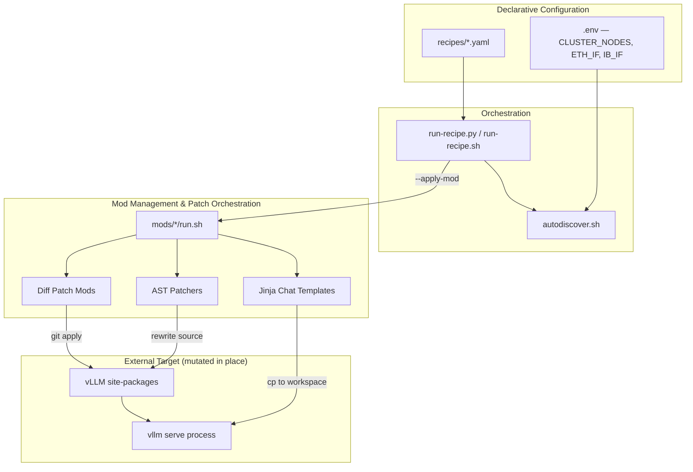
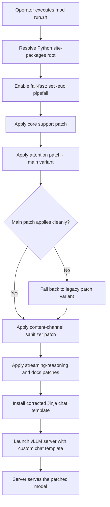
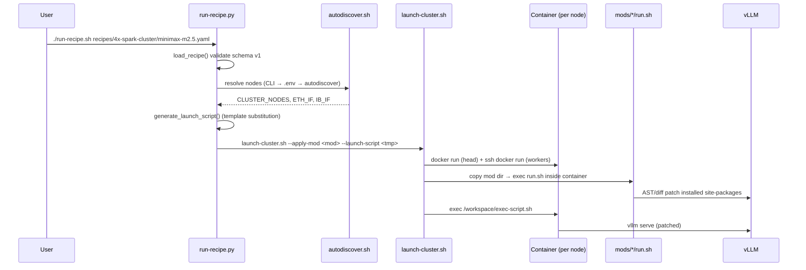

The project filesystem is not accessible in this environment, so I'll base the documentation on the comprehensive research materials provided, which include direct source inspection findings. Let me write the documentation.

---

# Mod Management & Patch Orchestration

## 1. Overview

The **Mod Management & Patch Orchestration** domain is the core business domain of `codekeeper`. It is the mechanism by which the repository customizes an *externally installed* vLLM inference stack **without forking it**. Rather than maintaining a divergent vLLM branch, `codekeeper` expresses every customization as a self-contained, reversible, and traceable **mod** that mutates vLLM's installed `site-packages` in place at deployment time.

This domain owns four responsibilities:

1. **Defining mods** — self-contained units of change (AST rewriters, unified diff patches, Jinja templates, shell launchers).
2. **Applying mods** — idempotent, marker-guarded source mutation with legacy/main fallback ordering.
3. **Orchestrating mods** — resolving and sequencing the mods required for a given model/hardware combination.
4. **Launching patched servers** — starting the vLLM server bound to the mutated package.

The guiding architectural principle is **"patch the dependency, don't fork it."** Every customization is a marker-guarded transformation applied at container launch time, with build-time patches pre-conditioning the same source tree.

---

## 2. Domain Position and Relationships

The domain sits at the center of the repository's dependency graph, acting as the **tool-support layer** for every other domain:

| Direction | Related Domain | Relationship | Strength |
|---|---|---|---|
| → | Model Support & Compatibility | Tool Support — applies model-support patches and chat templates | 9.0 |
| → | FlashAttention Kernel Domain | Tool Support — injects capability checks into FA4 dispatch | 8.5 |
| → | Weight Loading & Memory Optimization | Tool Support — applies AST-based weight/memory patches | 8.0 |
| ← | Deployment Recipes & Cluster Orchestration | Configuration Dependency — recipes declare which mods to apply | 8.5 |
| ← | Container & Build Infrastructure | Data Dependency — the image provides the site-packages that mods patch | 7.0 |

In short, the **Deployment Recipes** domain declares *what* to apply, the **Container & Build Infrastructure** domain provides *where* to apply it, and this domain performs the *application* and *launch*.

---

## 3. Architecture

### 3.1 Component Decomposition

The domain is composed of four sub-modules:

```
Mod Management & Patch Orchestration
├── AST-Based Source Patchers      (patch_*.py — idempotent AST rewrites)
├── Diff Patch Mods                (*.patch — unified diffs via git apply)
├── Mod Entry Scripts              (mods/*/run.sh — fail-fast launchers)
└── Recipe Runner                  (run-recipe.py / run-recipe.sh / autodiscover.sh)
```

#### AST-Based Source Patchers

Python tools that parse vLLM source with the standard `ast` module and perform **idempotent, single-occurrence text rewrites** guarded by mod markers. Representative patchers include:

- `patch_inkling.py` — injects a `_use_sm12_paged_kv` capability check into vLLM's FA4 dispatch so SM12 devices route to the vendored paged-KV kernel.
- `patch_weight_utils.py` — rewrites `copy=True` tensor calls to zero-copy views.
- `patch_model_loader.py` — patches the model loader for hybrid draft-model loading.
- Docker payload patchers (`patch_instanttensor_vllm_memory.py`, `patch_torch_schema_enumeration.py`, `patch_vllm_b12x_moe_tuning_memory.py`, `patch_vllm_sm120_cooperative_topk.py`).

Each patcher locates a *unique* anchor shape, validates the postcondition, re-`compile()`s the result, and inserts a mod marker (e.g. `# spark-vllm mod: inkling-sm12-paged-kv v1`) for traceability.

#### Diff Patch Mods

Per-model and per-fix mods that ship **unified diff patches** applied to vLLM source, covering quantization (AWQ, NVFP4, AutoRound), attention backends, RoPE, MoE, and parser fixes. Examples include `fix-glm-4.7-flash-AWQ`, `fix-qwen35-tp4-marlin`, `fix-qwen3-coder-next`, `fix-Salyut1-GLM-4.7-NVFP4`, `fix-eagle-fine-prefix`, `radixark-dspark`, and `step-3.7-flash`.

#### Mod Entry Scripts

Fail-fast Bash launchers (`mods/*/run.sh`) that:

1. Resolve the Python `site-packages` root (`PYTHON_ROOT` / `VLLM_SITE_PACKAGES`, defaulting to `/usr/local/lib/python3.12/dist-packages`).
2. Check prerequisites.
3. Copy vendored kernels or adapters.
4. Apply the correct patch variant with legacy/main fallback ordering.
5. Launch the vLLM server with the appropriate configuration and chat template.

All scripts run under `set -euo pipefail` to guarantee deterministic, all-or-nothing deployment.

#### Recipe Runner

Top-level orchestration (`run-recipe.py`, `run-recipe.sh`, `autodiscover.sh`) that reads YAML recipes and drives mod application and server launch for a given model/hardware combination.

### 3.2 Layered View



---

## 4. Core Mechanisms

The domain combines **four patching mechanisms**, each suited to a different class of change.

### 4.1 AST-Based Source Patching

AST patchers use the `ast` module to safely analyze source, locate a single target node, and perform a single-occurrence text replacement. The workflow is:

1. **Parse** — read the installed vLLM file and build an AST.
2. **Locate** — find the unique anchor shape (e.g. a specific function call or dispatch branch).
3. **Guard** — refuse to patch if the mod marker is already present (idempotency) or if an unsafe pattern is detected.
4. **Rewrite** — replace the matched text exactly once.
5. **Validate** — re-`compile()` the patched source to confirm syntactic validity.
6. **Annotate** — insert a mod marker for traceability.

This approach is preferred because it is **idempotent** (safe to re-run), **traceable** (markers identify which mod touched which line), and **validated** (postcondition checks prevent silent corruption).

### 4.2 Diff-Based Patching

Diff patch mods ship unified diffs applied with `git apply` (or `patch`). The application sequence is defensive:

1. `git apply --reverse --check` — detect whether the patch is **already applied**; if so, skip.
2. `git apply --check` — verify the patch applies cleanly.
3. `git apply` — apply the patch, with `--exclude` filters for `tests/`, `docs/`, and `examples/`.

**Legacy/main fallback ordering** tolerates installed-vLLM version drift: `mods/diffusiongemma/run.sh`, for example, selects between `*-main.patch` and `*-legacy.patch` based on marker presence in the installed source.

### 4.3 Vendored Asset Installation

Some mods install assets rather than rewrite source: vendored kernel bundles, Jinja chat templates, `.pth` hooks, and adapters are copied into `site-packages`. For example, `inkling-sm12-paged-kv` installs the vendored `inkling_sm120_fa4` package into `vllm/third_party/` and installs an adapter shim (`inkling_sm120_fa4_adapter.py`) that preserves vLLM's `out=` preallocated-output contract.

### 4.4 Inline Rewriting (Supplementary)

A smaller set of mods uses inline Python AST/regex rewriting (`replace_once`, `replace_regex_once`, `replace_function`) or `sed -i`. Notably, `gpu-mem-util-gb` uses inline rewriting rather than a unified diff, and `exp-b12x` uses `sed -i` for CUTLASS/FlashInfer architecture patches. These techniques broaden the maintenance surface and are candidates for consolidation into the AST framework.

---

## 5. Primary Workflow: Apply Mod and Launch Patched vLLM Server

**Importance: 9.5** — the dominant end-to-end flow and the reason the project exists.

### 5.1 Description

A self-contained mod executes its `run.sh`, which resolves the installed vLLM `site-packages` root, applies the mod's patches (AST rewrites and/or unified diffs) with main/legacy fallback ordering, installs any customized assets (such as a corrected Jinja2 chat template), and finally launches the vLLM server bound to the patched package. The entire sequence runs under `set -euo pipefail` so any failure aborts the deployment rather than producing a silently half-patched server.

### 5.2 Flow Diagram



### 5.3 Key Steps

| Step | Operation | Representative Entry Point |
|---|---|---|
| 1 | Resolve the Python site-packages root and set fail-fast behavior | `mods/diffusiongemma/run.sh` |
| 2 | Apply AST-based source patches with idempotency and mod-marker guards | `mods/inkling-sm12-paged-kv/patch_inkling.py` |
| 3 | Apply unified diff patches with main/legacy fallback ordering | `mods/diffusiongemma/diffusiongemma-support.patch` |
| 4 | Install the corrected chat template used by the server | `mods/diffusiongemma/chat_template_no_think.jinja` |
| 5 | Launch the vLLM server with the patched package and custom template | `mods/diffusiongemma/run.sh` |

---

## 6. Recipe-Driven Orchestration

**Importance: 8.5** — the higher-level flow that turns deployment into a declarative operation.

### 6.1 Description

A YAML recipe declares the model, quantization, hardware topology, and required mods. The recipe runner parses this declaration, resolves and sequences the required mods, applies them, and launches a multi-node inference cluster on DGX Spark hardware.

### 6.2 Recipe Schema

Recipes are YAML documents with a documented schema validated against `SUPPORTED_VERSIONS = ["1"]`:

| Field | Purpose |
|---|---|
| `name` | Recipe identifier |
| `recipe_version` | Schema version (currently `"1"`) |
| `container` | Container image reference |
| `command` | Server command template |
| `model` | Model identifier |
| `mods` | Ordered list of required mods |
| `defaults` | Default parameter values |
| `env` | Environment variables |
| `build_args` | Image build arguments |
| `cluster_only` / `solo_only` | Topology applicability flags |

### 6.3 Sequence Diagram



### 6.4 In-Container Application

A critical architectural detail: **mods are applied inside the target container, not on the host.** `run-recipe.py` does not execute `run.sh` directly. Instead, it passes mod paths to `launch-cluster.sh` via `--apply-mod`, and `launch-cluster.sh` copies each mod directory into the target container and executes `run.sh` inside it (`apply_mod_to_container()`). This ensures the patch targets the exact site-packages tree that the server will use.

### 6.5 Inversion of Control

`launch-cluster.sh` **strips** cluster-topology flags (`--distributed-executor-backend`, `--nnodes`, `--node-rank`, `--master-addr`, `--master-port`, `--headless`) from user commands and re-injects them itself. This is a deliberate inversion of control: **the launcher owns cluster topology, not the recipe.**

---

## 7. Interaction Patterns

| Pattern | Description | Evidence |
|---|---|---|
| **Idempotent in-place mutation** | Every patch detects prior application (marker / `git apply --reverse --check`) and skips | `patch_inkling.py`, `step-3.7-flash/run.sh` |
| **Marker-based traceability** | Mods inject `# spark-vllm mod: <name> v<n>` comments | `patch_inkling.py`, `patch_weight_utils.py` |
| **Fail-fast orchestration** | `set -euo pipefail`; explicit `exit 1` on missing anchors | all `run.sh` |
| **Capability-gated dispatch** | `_use_sm12_paged_kv()` checks `capability.major == 12` to route to the vendored kernel | `patch_inkling.py` |
| **Inversion of control (launcher)** | Launcher strips/owns distributed-executor flags | `launch-cluster.sh` |
| **Build-time pre-conditioning** | Docker patches mutate the same source tree mods later patch | `Dockerfile` `RUN python3 ... --installed` |
| **Declarative → imperative compilation** | YAML recipe → generated Bash launch script | `generate_launch_script()` |

---

## 8. Interfaces and Contracts

The domain exposes and consumes the following interfaces:

- **YAML recipes** — consumed by `run-recipe.py` / `run-recipe.sh`.
- **Mod directories** — each containing `run.sh` as the executable contract.
- **AST patcher CLIs** — `patch_inkling.py`, `patch_weight_utils.py`, `patch_model_loader.py`, and the Docker payload patchers.
- **Unified diff files** — applied by `patch` or `git apply`.
- **Vendored packages, Jinja chat templates, `.pth` hooks** — copied into `site-packages`.
- **The final vLLM server command line** — the terminal output of the flow.

The recipe runner orchestrates by resolving mod names, calling `run.sh` scripts, and passing environment variables such as `PYTHON_ROOT`, `VLLM_ROOT`, and `WORKSPACE_DIR`.

---

## 9. Design Rationale and Strengths

1. **Non-invasive customization** — no vLLM fork; patches are reversible and marker-traceable.
2. **Defense in depth** — idempotency guards, postcondition validation, `compile()` checks, and runtime preflight (e.g. `inkling-sm12-paged-kv/run.sh` verifies SM12x, CUDA ≥ 12.8, and required CuTe APIs before installing).
3. **Reproducibility controls** — CUTLASS DSL pinned to `4.7.0` with exact-count enforcement; `build-metadata.yaml` records build provenance.
4. **Clear separation of concerns** — declarative recipes vs. imperative launchers vs. self-contained mods.
5. **Composability** — the uniform "patch-first, launch-second" shape makes mods predictable and combinable.

---

## 10. Known Risks and Gaps

| # | Risk | Impact |
|---|---|---|
| R1 | **Runtime network fetches** — `fix-glm-4.7-flash-AWQ`, `fix-gemma4-tool-parser`, and `exp-w4a16` fetch live PR diffs from GitHub at runtime (`curl ... \| patch`) | Breaks reproducibility and offline deployment |
| R2 | **Three divergent patching techniques** (AST, `git apply`, `sed`) | Increased maintenance surface and inconsistency |
| R3 | **Undocumented adapter** (`inkling_sm120_fa4_adapter.py`) | Critical integration seam with no architectural documentation |
| R4 | **Mods mutate both source and environment** (`exp-b12x` performs `uv pip install`) | Blurs the "patch" abstraction |
| R5 | **Side-effect daemons** — `mods/drop-caches/run.sh` spawns a background `drop_caches` loop | Does not fit the "patch" taxonomy |
| R6 | **No formal ADRs** | Architectural intent lives only in code comments |

### Recommended Improvements

1. **Document the adapter** as a first-class component, including its `out=` contract and `num_splits=1` clamp.
2. **Vendor runtime PR diffs** into the repository (or a pinned artifact store) to eliminate live GitHub fetches.
3. **Unify the patching taxonomy** — migrate `sed`-based and inline-regex mods to the AST patcher framework where feasible.
4. **Reclassify mods** — move `gpu-mem-util-gb` to AST patchers; add a "Runtime/Environment Mods" category for `drop-caches`, `exp-b12x`, and PR-fetching mods.
5. **Introduce ADRs** for key decisions: "patch-don't-fork," "launcher owns topology," "build-time vs. runtime patch split," and "vendored kernel + adapter."
6. **Add a mod manifest/schema** declaring each mod's technique, target files, network requirements, and idempotency marker to enable automated validation.

---

## 11. Summary

The **Mod Management & Patch Orchestration** domain is the operational heart of `codekeeper`. It transforms deployment from a manual, fork-based customization exercise into a declarative, reproducible, and traceable operation. By combining AST-based source patching, unified diff application, vendored asset installation, and recipe-driven orchestration — all under fail-fast, idempotent, marker-guarded discipline — it enables teams to apply isolated patches for new model support, hardware-specific kernel optimizations, and deployment fixes, then launch patched servers without ever forking upstream vLLM.

The domain's principal strengths are its non-invasive philosophy and defense-in-depth validation. Its principal risks are non-deterministic runtime network fetches and a divergent patching taxonomy. Addressing these gaps — particularly by vendoring runtime PR diffs and unifying the patching framework — would materially improve the repository's reproducibility and maintainability.