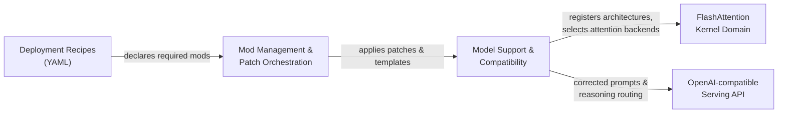
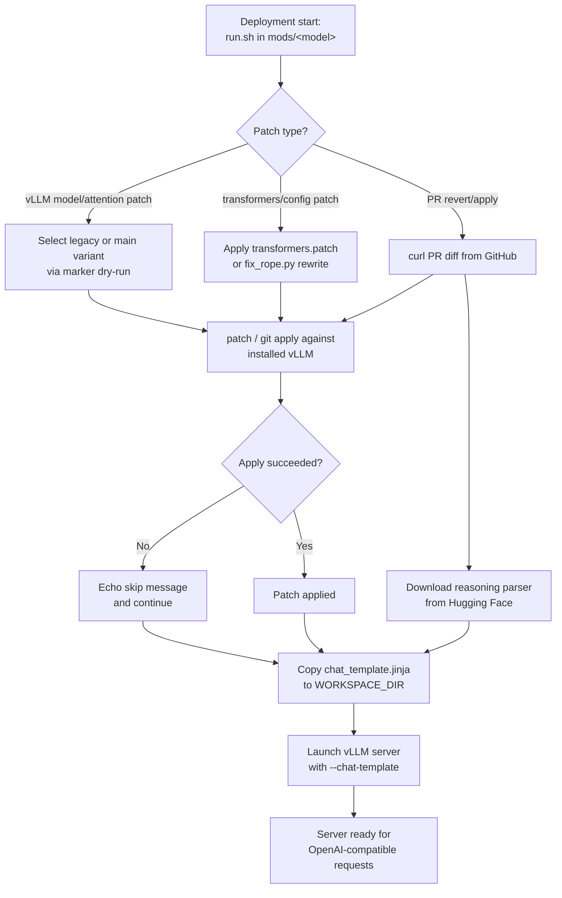
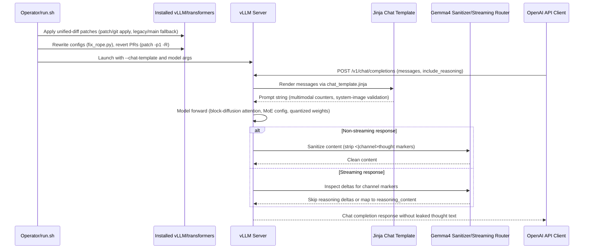

I now have comprehensive information about the Model Support & Compatibility module. Let me write the technical documentation.

---

# Model Support & Compatibility

## 1. Overview

The **Model Support & Compatibility** domain is one of the two core business domains of the `spark-vllm-docker` repository. Its purpose is to make an *externally installed* vLLM inference stack correctly serve a broad portfolio of cutting-edge and vendor-specific model families — **DiffusionGemma/Gemma4, Qwen3.x/3.5/3.6/3.8, GLM-4.7/5.x, Nemotron Nano/Super, Step-3.7, MiniMax, and DSpark draft models** — without forking vLLM.

Rather than shipping a modified inference engine, this domain delivers **per-model compatibility as a set of self-contained, reversible patches and launchers** under `mods/`. Each model family owns a dedicated `mods/<name>/` directory containing:

- **Unified-diff patches** (`*.patch`, `*.diff`) applied to the installed vLLM/transformers source tree.
- **AST/regex rewriters** (`fix_rope.py`) for surgical, idempotent source edits.
- **Jinja2 chat templates** (`*.jinja`) that serialize conversation messages into model-correct prompts.
- **Bash launchers** (`run.sh`) that orchestrate patch application with legacy/main fallbacks and graceful skip-on-failure semantics.

The domain sits at the intersection of three concerns:

| Concern | What it fixes | Representative artifacts |
|---|---|---|
| **Architecture registration** | Teaching vLLM about new model classes and their config parsing | `diffusiongemma-support.patch`, `step-3.7-support.patch`, `radixark-dspark.patch` |
| **Quantization compatibility** | Making AWQ / NVFP4 / AutoRound / Marlin checkpoints load and run | `glm47_flash.patch`, `glm4_moe.patch`, `transformers.patch`, `qwen3_5.patch` |
| **Prompt-format correctness** | Producing the exact token stream each model expects | `chat_template.jinja`, `chat_template_no_think.jinja` |

A fourth, cross-cutting concern — **reasoning-channel handling** — ensures that model "thought" output is either stripped or surfaced as `reasoning_content` depending on the client's `include_reasoning` flag.

---

## 2. Architectural Position

The domain is a **consumer of the Mod Management & Patch Orchestration** domain and a **provider of model behavior** to the runtime. The relationships are:



- **Recipes → Mods.** A recipe such as `recipes/diffusion-gemma-nvfp4.yaml` declares `mods: [mods/diffusiongemma]`, binding a model to the exact set of compatibility patches it needs.
- **Orchestration → Model Support.** The recipe runner and `launch-cluster.sh --apply-mod` execute each mod's `run.sh` *inside the target container*, mutating the installed vLLM `site-packages`.
- **Model Support → Kernel Domain.** Attention-backend patches (e.g., the DiffusionGemma per-token causal extension) select and configure the FlashAttention path that the model's forward pass uses.
- **Model Support → Serving API.** Chat templates and reasoning-channel patches shape the request/response contract exposed to OpenAI-compatible clients.

---

## 3. Patch Application Model

Every mod follows a consistent, **fail-fast, idempotent** application pattern. The canonical flow is illustrated below.



### 3.1 Idempotency and Fallback Selection

The most sophisticated mods — `diffusiongemma` and `step-3.7-flash` — implement a **three-tier idempotency guard**:

1. **Upstream detection.** A helper such as `has_upstream_diffusiongemma_support()` greps the installed source for the target class and config symbols. If upstream vLLM already ships the feature, the mod skips entirely.
2. **Reverse-apply check.** `git apply --reverse --check` detects whether the patch is already present, avoiding double application.
3. **Forward-apply check.** `git apply --check` validates applicability before committing the change; a failure aborts with a diagnostic rather than producing a half-patched tree.

**Legacy/main fallback** is resolved dynamically by inspecting markers in the installed source. For example, `select_attention_patch()` chooses between `diffusiongemma-attention-main.patch` and `diffusiongemma-attention-legacy.patch` based on whether the installed `flash_attn.py` already contains the `mm_prefix_range_tensor` symbol:

```bash
select_attention_patch() {
  if has_marker "vllm/v1/attention/backends/flash_attn.py" "mm_prefix_range_tensor"; then
    echo "$ATTENTION_MAIN_PATCH_FILE"
  else
    echo "$ATTENTION_LEGACY_PATCH_FILE"
  fi
}
```

This tolerates version drift between vLLM releases without maintaining separate mods.

### 3.2 Graceful Degradation

Simpler mods use `patch ... || echo "skipping"` semantics so that a single incompatible patch does not abort an entire deployment. This is a deliberate trade-off: the model may lose a specific fix, but the server still launches. Mods that fetch live PR diffs (e.g., `fix-glm-4.7-flash-AWQ`, `fix-gemma4-tool-parser`) follow the same pattern, warning and continuing on failure.

---

## 4. Model Family Coverage

### 4.1 DiffusionGemma / Gemma4

The `mods/diffusiongemma/` mod is the largest and most complex in the domain. It registers the **`DiffusionGemmaForBlockDiffusion`** architecture — a discrete diffusion language model (dLLM) that generates tokens via iterative denoising over a fixed-length canvas rather than left-to-right autoregressive decoding.

**Architecture registration** (`diffusiongemma-support.patch`) touches the model registry, config registry, and serving modules:

- Adds `DiffusionGemmaForConditionalGeneration` and `DiffusionGemmaForBlockDiffusion` to `vllm/model_executor/models/registry.py`.
- Registers `diffusion_gemma` / `diffusion_gemma4` config types in `vllm/transformers_utils/config.py` (with a `TODO` noting the `...4` aliases are transitional until checkpoints finalize to RC0.1).
- Introduces a new `DiffusionConfig` (`vllm/config/diffusion.py`) with `canvas_length` and `max_denoising_steps` fields, wired through `EngineArgs` (`--diffusion-config` / `-dc`) and `VllmConfig`.
- Adds `ModelConfig.is_diffusion`, detected from the presence of `canvas_length` in the HF config.
- Extends `benchmark_moe.py`'s `get_model_params` to read MoE parameters (`num_experts`, `top_k_experts`, `moe_intermediate_size`, `hidden_size`) from `text_config` for the `DiffusionGemmaForBlockDiffusion` architecture.

The model itself (`vllm/model_executor/models/diffusion_gemma.py`, ~1369 lines) reuses the Gemma4 backbone in two modes — **encoder** (causal attention, KV write) and **decoder** (bidirectional attention, KV read-only) — plus a `DiffusionGemmaSelfConditioning` gated MLP. A compiled decode step implements temperature scheduling, Gumbel-max sampling, entropy-bound acceptance, and convergence detection.

**Attention extension** (`diffusiongemma-attention-main.patch` / `-legacy.patch`) widens `FlashAttentionMetadata.causal` from a scalar `bool` to `bool | torch.Tensor`, enabling **per-sequence causal masking** so that some sequences in a batch attend causally while others attend bidirectionally. The main variant additionally propagates a `dynamic_causal` tensor and `block_sparse_tensors` through `flash_attn_varlen_func`; the legacy variant carries `mask_mod` / `aux_tensors` instead. Both require FA4 for per-sequence causal and raise `NotImplementedError` otherwise.

**Reasoning-channel handling** is split across two patches:

- `gemma4-content-channel-sanitizer.patch` inserts module-level constants (`_GEMMA4_REASONING_START = "<|channel>"`, `_GEMMA4_REASONING_END = "<channel|>"`, `_GEMMA4_THOUGHT_PREFIX = "thought\n"`) and a `_strip_gemma4_content_channels()` function into `vllm/entrypoints/openai/chat_completion/serving.py`. It removes complete thought-channel spans from non-streaming content.
- `gemma4-streaming-reasoning.patch` inspects streaming deltas, skipping or converting reasoning-channel `DeltaMessage`s based on `include_reasoning`, and adds a `wait_for_end` parameter to `_strip_disabled_thinking_channel` so partial channel spans are buffered rather than leaked.

**Chat template** (`chat_template_no_think.jinja`) is a DiffusionGemma substitute template whose single intentional change is that, when `add_generation_prompt` is true and thinking is disabled, it does **not** prefill an empty `<|channel>thought\n<channel|>` block after `<|turn>model\n`.

**Documentation patch** (`mr5-attention-backends-docs.patch`) updates `docs/design/attention_backends.md` and its generator to footnote `FLASHINFER_FMHA_V2`'s fp8 KV-cache behavior (dequantized to BF16 on the fly, no fp8 attention compute).

### 4.2 Qwen Family

The Qwen mods address chat-template correctness, quantization, and tensor-parallel constraints.

**Chat templates** (`fix-qwen3.5-chat-template`, `fix-qwen3.6-chat-template`) provide corrected Jinja templates that:

- Use `image_count` / `video_count` namespaces and a `render_content` macro to handle multimodal content.
- Detect `image` / `image_url` / `video` items and emit `<|vision_start|><|image_pad|><|vision_end|>` placeholders.
- Call `raise_exception('System message cannot contain images.')` when images appear in system messages.
- In the 3.6 variant, support `<|think_off|>` / `<|think_on|>` inline markers and auto-close unclosed ` thinking` blocks before `<tool_call>`.

The launchers are minimal — they copy the template into `$WORKSPACE_DIR` and echo the `--chat-template` flag to use.

**AutoRound / RoPE fixes** (`fix-qwen3.5-autoround`, `fix-qwen35-tp4-marlin`) address a transformers/vLLM type mismatch. `transformers.patch` coerces `ignore_keys_at_rope_validation` to a `set(...)` before unioning with `{'partial_rotary_factor'}`; `fix_rope.py` performs the equivalent regex rewrite on `qwen3_5_moe.py`, changing a list literal to a set literal.

**TP4 Marlin fix** (`qwen3_5.patch`, `qwen3_next.patch`) replaces the sharded `in_proj_ba` `MergedColumnParallelLinear` with two `ReplicatedLinear` projections (`in_proj_b`, `in_proj_a`). The rationale is documented inline: `in_proj_ba` output size 128 divided by TP=4 yields 32, which is below Marlin's `min_thread_n=64`. Each rank now loads the full weights and slices to its local TP partition in the forward pass.

**Crash/slowness fix** (`fix-qwen3-coder-next`) applies `fix_crash.diff` to `single_type_kv_cache_manager.py` — replacing an `assert block.block_hash is not None` with a `if block.is_null: continue` guard — and reverts PR #34279 to restore performance.

### 4.3 GLM / Nemotron / Step / MiniMax

**GLM-4.7 Flash AWQ** (`fix-glm-4.7-flash-AWQ`) applies a Triton MLA patch that replaces a fixed `num_kv_splits = 4` with dynamic sizing (`max(32, min(128, max_seq_len // 1500))`, targeting ~1.5K tokens per split), then fetches and applies PR #34695 for a crash fix.

**GLM-4.7 NVFP4** (`fix-Salyut1-GLM-4.7-NVFP4`) adds a `continue` guard in `glm4_moe.py` weight loading when `k_scale` / `v_scale` names are absent from `params_dict`, tolerating checkpoints that omit those parameters.

**Nemotron Nano/Super** (`nemotron-nano`, `nemotron-super`) are deliberately minimal: each `run.sh` downloads a reasoning-parser `.py` file from Hugging Face into `$WORKSPACE_DIR`. They do **not** patch vLLM source.

**Step-3.7 Flash** (`step-3.7-flash`) registers `Step3p7ForConditionalGeneration` across the model registry, tokenizer registry, and speculative config, and extends the MTP (multi-token prediction) path to recognize `step3p7` model types. It also patches `trtllm_fp8_moe.py` / `trtllm_nvfp4_moe.py` to reject `float32` router logits, and fixes ModelOpt NVFP4 `w13` input-scale shard handling in `fused_moe/layer.py`.

**DSpark** (`radixark-dspark`) patches `vllm/config/speculative.py` to recognize `DSparkDraftModel` architectures with `model_type == "qwen3"`, normalizing them to `Qwen3DSparkModel`. Its launcher is notable for discovering the vLLM package via `importlib.util.find_spec` (avoiding CUDA initialization during container preparation) and validating a postcondition with `py_compile`.

---

## 5. Interaction Model

The domain interacts at three distinct levels.



1. **Deployment level.** Bash `run.sh` scripts are the entry points. They apply patches via `patch` / `git apply` (often with dry-run checks and legacy/main fallbacks) against `/usr/local/lib/python3.12/dist-packages`, download auxiliary assets from Hugging Face, copy chat templates into `$WORKSPACE_DIR`, and launch the vLLM server with `--chat-template` flags.

2. **Inference API level.** The patched vLLM exposes the OpenAI-compatible chat completion endpoint. Requests flow through the custom Jinja templates for prompt serialization; responses pass through the Gemma4 content-channel sanitizer and streaming reasoning router so thought-channel text is stripped or emitted as `reasoning_content` depending on `include_reasoning`.

3. **Internal framework level.** Patches modify vLLM interfaces including the model registry and config parsers (architecture registration, MoE `text_config` parsing), attention backend metadata (`FlashAttentionMetadata.causal` widened to per-token tensors, Triton MLA split sizing), the KV cache manager (`cache_blocks` fix), speculative decoding config (draft architecture matching), and weight loading (skipping absent `k_scale`/`v_scale` params).

---

## 6. Key Components Reference

| Component | Path | Responsibility |
|---|---|---|
| DiffusionGemma support | `mods/diffusiongemma/diffusiongemma-support.patch` | Register `DiffusionGemmaForBlockDiffusion`, `DiffusionConfig`, MoE config parsing |
| DiffusionGemma attention | `mods/diffusiongemma/diffusiongemma-attention-{main,legacy}.patch` | Per-sequence causal masking in FlashAttention |
| Gemma4 sanitizer | `mods/diffusiongemma/gemma4-content-channel-sanitizer.patch` | Strip `<|channel>thought` spans from content |
| Gemma4 streaming | `mods/diffusiongemma/gemma4-streaming-reasoning.patch` | Route reasoning deltas by `include_reasoning` |
| DiffusionGemma template | `mods/diffusiongemma/chat_template_no_think.jinja` | No-think prompt serialization |
| Qwen templates | `mods/fix-qwen3.{5,6}-chat-template/chat_template.jinja` | Multimodal rendering, system-image rejection |
| Qwen AutoRound | `mods/fix-qwen3.5-autoround/transformers.patch` | RoPE validation set coercion |
| Qwen TP4 Marlin | `mods/fix-qwen35-tp4-marlin/{qwen3_5,qwen3_next}.patch` | Replicated B/A projections |
| Qwen RoPE rewrite | `mods/fix-qwen35-tp4-marlin/fix_rope.py` | List→set config rewrite |
| Qwen coder-next | `mods/fix-qwen3-coder-next/fix_crash.diff` | KV cache manager null-block guard |
| GLM AWQ | `mods/fix-glm-4.7-flash-AWQ/glm47_flash.patch` | Dynamic Triton MLA split sizing |
| GLM NVFP4 | `mods/fix-Salyut1-GLM-4.7-NVFP4/glm4_moe.patch` | Tolerate absent k/v scales |
| Nemotron | `mods/nemotron-{nano,super}/run.sh` | Download reasoning parser |
| Step-3.7 | `mods/step-3.7-flash/step-3.7-support.patch` | Architecture + MTP registration |
| DSpark | `mods/radixark-dspark/radixark-dspark.patch` | Draft architecture normalization |

---

## 7. Design Characteristics and Considerations

### Strengths

- **Non-invasive customization.** No vLLM fork; every change is a reversible, marker-traceable patch applied at deployment time.
- **Version-drift tolerance.** Legacy/main fallback selection and upstream-detection guards let a single mod span multiple vLLM releases.
- **Defense in depth.** Idempotency guards, reverse-apply checks, postcondition validation, and `py_compile` checks prevent silent corruption.
- **Declarative binding.** Recipes declare which mods a model needs, turning model support into a declarative operation.

### Risks and Constraints

- **Runtime network fetches.** Several mods (`fix-glm-4.7-flash-AWQ`, `fix-gemma4-tool-parser`, `fix-qwen3-next-autoround`) fetch live PR diffs from GitHub at deploy time, introducing network dependency and non-determinism.
- **Divergent patching techniques.** The domain mixes `git apply`, `patch -p1`, inline Python regex rewriting (`fix_rope.py`), and `sed`, increasing the maintenance surface.
- **Graceful-skip opacity.** Because some mods continue on patch failure, a deployment can succeed while silently omitting a fix; operators must inspect launcher output to confirm which patches landed.
- **Transitional aliases.** The `diffusion_gemma4` config aliases and pre-RC0.1 architecture names are explicitly marked as temporary and will need cleanup once checkpoints finalize.

---

## 8. Summary

The **Model Support & Compatibility** domain is the mechanism by which `spark-vllm-docker` extends an unmodified vLLM to serve a wide, fast-moving portfolio of model families. It achieves this through a disciplined, patch-based approach: unified diffs and AST rewrites for architecture registration and quantization fixes, Jinja templates for prompt correctness, and reasoning-channel patches for clean API responses — all orchestrated by fail-fast, idempotent `run.sh` launchers with legacy/main fallbacks. The domain's design prioritizes reversibility, traceability, and tolerance of upstream version drift, at the cost of some technique divergence and reliance on runtime network fetches that operators should be aware of.