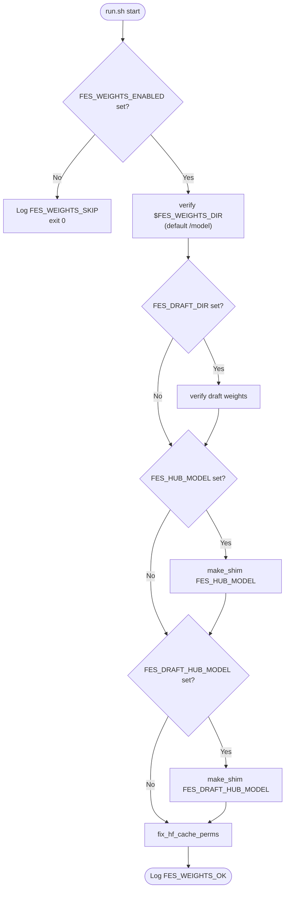
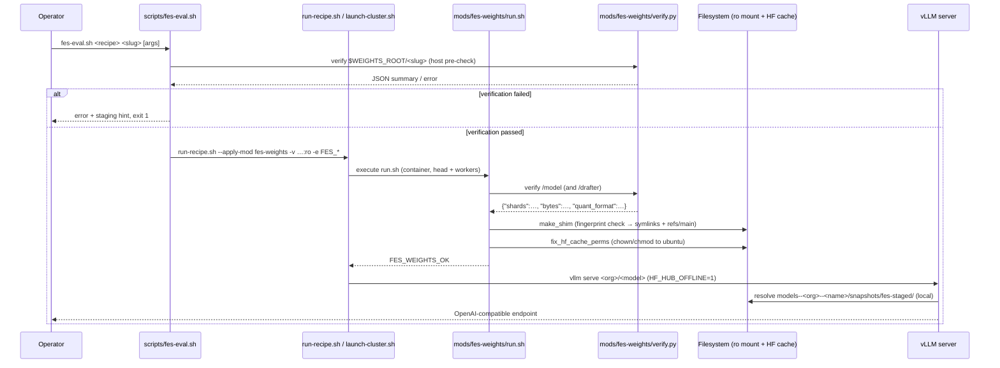

# Model Weights & Offline Serving Domain — Technical Documentation

**Project:** spark-vllm-docker
**Domain:** Model Weights & Offline Serving (Supporting Domain)
**Scope:** `mods/fes-weights/`, `hf-download.sh`, `scripts/fes-eval.sh`

---

## 1. Overview

The **Model Weights & Offline Serving Domain** prepares, validates, and stages model checkpoint weights so that the vLLM serving engine can resolve model files entirely from local storage — never contacting the Hugging Face Hub at inference time. This is essential for the air-gapped or network-constrained Spark clusters that spark-vllm-docker targets: worker nodes in these clusters typically have no outbound internet access, and even where they do, resolving models from a hub at startup introduces nondeterministic latency and failure modes.

The domain contributes two capabilities to the deployment pipeline:

1. **Weight Verification** — a fail-fast integrity check that validates staged shards against the safetensors index, enforces size parity, and requires the quantization config for NVFP4 checkpoints before any server is launched.
2. **Offline Hub Cache Setup** — construction of a local Hugging Face hub-cache directory layout (symlink "shims") so that vLLM's `huggingface_hub`-based model resolution operates fully offline.

The domain is classified as a *Supporting Domain*: it does not implement serving logic itself but gates and enables the primary Recipe-Driven Cluster Model Deployment Flow. Its importance score is 7.5/10, reflecting that a deployment cannot proceed past it (it is a hard data dependency), even though its implementation complexity is comparatively low (4.0/10).

---

## 2. Architecture Position

```
Deployment Recipes & Cluster Orchestration Domain
        │  (invokes via --apply-mod)
        ▼
┌───────────────────────────────────────────────────────────┐
│      Model Weights & Offline Serving Domain               │
│                                                           │
│  scripts/fes-eval.sh ──(host pre-verification)──┐         │
│                                                  ▼         │
│                                        mods/fes-weights/   │
│                                        ┌──────────────┐    │
│  run-recipe.sh ── -e FES_* ──────────► │   run.sh     │    │
│  launch-cluster.sh --apply-mod ──────► │  (entrypoint)│    │
│                                        └──────┬───────┘    │
│                                               │ invokes    │
│                                        ┌──────▼───────┐    │
│                                        │  verify.py   │    │
│                                        │  (verifier)  │    │
│                                        └──────┬───────┘    │
│                                               │            │
│                                        HF hub-cache shim   │
│                                        ($HF_HOME/hub/…)    │
└───────────────────────────────────────────────────────────┘
        │                                              ▲
        │ (staged weights read-only mount)             │ (download helper)
        ▼                                              │
   /model (container)  ◄──── rsync from ──────  hf-download.sh
                                               (host, networked)
```

**Relations to other domains (verified):**

| From | To | Relation | Strength |
|---|---|---|---|
| Deployment Recipes & Cluster Orchestration | Model Weights & Offline Serving | Data Dependency — `fes-weights` runs before launch to verify mounts and build the offline cache | 7.0 |
| Model Weights & Offline Serving | Deployment Recipes & Cluster Orchestration | Runtime Input — verified weights + hub-cache layout are consumed by the recipe-launched vLLM server | 6.0 |
| Developer Tooling (`scripts/fes-eval.sh`) | Model Weights & Offline Serving | Function Call — invokes `verify.py` to score staged weight directories | 4.0 |

---

## 3. Sub-Module: Weight Verification

**Code path:** `mods/fes-weights/verify.py`
**Importance:** 8.0

### 3.1 Purpose

`verify.py` is a standalone, dependency-free Python 3 script that validates a staged model weights directory. It is a port of the FES cluster-config `scripts/model-weights.sh verify_location` logic into Python, providing structured output and precise failure reasons.

### 3.2 Invocation Contract

```
usage: verify.py <weights-dir>
```

| Outcome | Stream | Format |
|---|---|---|
| Success (exit 0) | stdout | Single-line JSON summary |
| Failure (exit 1) | stderr | Single-line human-readable reason |
| Usage error (exit 2) | stderr | Usage message |

### 3.3 Validation Sequence

The verifier executes checks in a strict order, failing at the first violation:

1. **Directory existence** — `<weights-dir>` must be an existing directory.
2. **Non-emptiness** — the directory must contain at least one entry.
3. **`config.json` presence and parseability** — the model configuration must exist and be valid JSON. From it, the script extracts `quantization_config.format` (lowercased).
4. **NVFP4 quantization config enforcement** — if `quantization_config.format` equals `nvfp4`, the file `hf_quant_config.json` **must** be present in the weights directory. NVFP4 checkpoints carry per-tensor quantization parameters in this auxiliary file; serving without it would produce silently incorrect dequantization.
5. **Sharded checkpoint validation** (when `model.safetensors.index.json` exists):
   - The index must parse as JSON and contain a non-empty `weight_map`.
   - The set of unique shard filenames referenced by `weight_map` must all exist as files in the directory. Missing shards are reported with a count (e.g., `missing 3/47 shards, e.g. model-00012-of-00047.safetensors`).
   - **Size parity check**: the sum of staged shard byte sizes must satisfy `total_size <= staged <= total_size * 1.02`. The 2% tolerance (`SIZE_TOLERANCE = 1.02`) accommodates filesystem block-allocation overhead while still catching truncated or partially-copied shards.
6. **Single-file fallback** — if no index exists, a single `model.safetensors` file must be present.

### 3.4 Success Output Schema

```json
{
  "shards": 47,
  "bytes": 73400320000,
  "quant_format": "nvfp4"
}
```

- `shards` — number of shard files validated (or `1` for a single-file checkpoint).
- `bytes` — total validated size in bytes.
- `quant_format` — normalized quantization format string (empty string when unquantized).

### 3.5 Implementation Notes

- The script uses **only the standard library** (`json`, `os`, `sys`), ensuring it runs inside any container image without package installation.
- The `fail(reason)` helper writes to stderr and exits immediately, guaranteeing the fail-fast behavior required by the mod protocol: a corrupted weight set never reaches the vLLM server.
- The verifier is deliberately usable both as a subprocess (invoked by `run.sh`) and as a standalone CLI (invoked by `scripts/fes-eval.sh`).

---

## 4. Sub-Module: Offline Hub Cache Setup

**Code paths:** `mods/fes-weights/run.sh`, `hf-download.sh`
**Importance:** 7.5

### 4.1 Purpose

`run.sh` is the mod entrypoint executed by `launch-cluster.sh --apply-mod` inside every node's container, before `vllm serve` starts. It performs three duties:

1. Optionally (and by default, unless enabled) verifies the mounted weight directories via `verify.py`.
2. Builds a Hugging Face hub-cache layout so that `vllm serve <org>/<model>` resolves to the local staged files.
3. Normalizes ownership/permissions of the HF cache tree so the non-root serving user can write its dynamic-module cache.

### 4.2 Environment Variables

| Variable | Default | Purpose |
|---|---|---|
| `FES_WEIGHTS_ENABLED` | *(unset)* | **Opt-in gate.** When unset, the mod exits immediately with a `FES_WEIGHTS_SKIP` log line and performs no verification or shim creation. This allows recipes to list `fes-weights` unconditionally without affecting standard hub-cache-mode deployments. |
| `FES_WEIGHTS_DIR` | `/model` | Read-only mount point of the main model weights inside the container. |
| `FES_DRAFT_DIR` | `/drafter` | Optional mount for speculative-decoding draft-model weights. |
| `FES_HUB_MODEL` | *(unset)* | `org/model` identifier the recipe serves; triggers creation of the main hub shim. |
| `FES_DRAFT_HUB_MODEL` | *(unset)* | Draft model identifier; triggers a second shim over `FES_DRAFT_DIR`. |
| `HF_HOME` | `/root/.cache/huggingface` | Root of the Hugging Face cache; the hub shim is created under `$HF_HOME/hub`. |
| `HF_HUB_OFFLINE` | *(set by caller)* | Should be set to `1` by the launcher (`scripts/fes-eval.sh` sets it) so the serving process never reaches the hub. |

### 4.3 Execution Flow



All verification failures route through `fail(dir, reason)`, which emits `FES_WEIGHTS_FAIL` to stderr and exits non-zero — aborting the container launch before `vllm serve` can start.

### 4.4 Hub Shim Construction (`make_shim`)

The Hugging Face client resolves models by scanning `$HF_HOME/hub` for directories named `models--<org>--<name>` containing `snapshots/<revision>/` trees and a `refs/<branch>` file. `make_shim` synthesizes this structure with **symlinks** pointing back into the read-only weights mount:

```
$HF_HOME/hub/
└── models--<org>--<name>/
    ├── refs/
    │   └── main                    → contains "fes-staged"
    ├── snapshots/
    │   └── fes-staged/
    │       ├── config.json         → symlink to /model/config.json
    │       ├── model.safetensors…  → symlink to /model/…
    │       └── hf_quant_config.json → …
    └── .fes-shim-fp                → content fingerprint (SHA-256)
```

**Key behaviors:**

- **Input validation** — the model identifier must be of the form `org/model`; otherwise the shim creation fails with an explicit reason.
- **Content fingerprinting** — before rebuilding, the script computes a SHA-256 over the sorted `filename size` listing of the source directory (`find . -maxdepth 1 -type f -printf '%f %s\n' | sort | sha256sum`). If the fingerprint file `.fes-shim-fp` matches and the snapshot directory exists, the shim is reported as *up to date* and no I/O is performed. This makes repeated container starts idempotent.
- **Hidden-file filtering** — dotfiles in the weights directory (e.g., `.gitattributes`, `.fes-shim-fp` itself) are skipped.
- **Revision pinning** — `refs/main` is written with the literal value `fes-staged`, a sentinel revision name that clearly identifies shimmed (non-hub) snapshots in diagnostics.
- **Symlink semantics** — `ln -sfn` creates relative-safe absolute symlinks into the read-only mount; because the source is read-only, symlinked files cannot be mutated by the serving process.

### 4.5 Permission Normalization (`fix_hf_cache_perms`)

The mod runs as root inside the container, but the vLLM server runs as the image's non-root user (`ubuntu`, uid 1000). Two ownership hazards are addressed:

1. **Shim artifacts** — `snapshots/` and `refs/` directories created by `make_shim` are root-owned.
2. **Transformers dynamic-module cache** — the first root-run Python process that imports `transformers` creates `<HF_HOME>/modules/` (observed incident on 2026-09-22: `dynamic_module_utils makedirs '/root/.cache/huggingface/modules'` failing with `EACCES` on NFS peers with `root_squash`).

`fix_hf_cache_perms` pre-creates `modules/`, then runs `chown -R -h ubuntu:ubuntu` and `chmod -R u+rwX,g+rwX` over the HF cache tree:

- `-h` keeps `chown` off the `fes-staged` symlinks themselves (symlink targets live on the read-only mount and cannot be re-owned).
- `chmod` naturally skips symlinks.
- On `root_squash` NFS peers, the `chown`/`chmod` calls fail harmlessly (`|| true`); the head node's run corrects the shared tree for all ranks.

### 4.6 HF Hub Cache Topology on the Cluster

As documented in the mod source: the HF cache resides on node1's local ext4 filesystem and is NFS-exported to peer ranks with `root_squash` (via `cluster.env` `LLM_HF_CACHE_DIR` / `/etc/exports`). This means:

- The shim is created once authoritatively on node1 (real root), and symlinked structure propagates over NFS.
- All ranks read the same snapshot tree, guaranteeing model-version consistency across the cluster.

---

## 5. Host-Side Companion: `scripts/fes-eval.sh`

**Code path:** `scripts/fes-eval.sh` (Developer Tooling Domain entrypoint into this domain)

### 5.1 Purpose

`fes-eval.sh` is the recommended operator-facing wrapper for launching a recipe against FES-staged offline weights. It performs **pre-flight host-side verification** (catching staging errors before containers start) and then delegates to `run-recipe.sh` with the correct mounts, environment variables, and mod registration.

### 5.2 Usage

```
scripts/fes-eval.sh [--weights-root DIR] [--hub-model ID] <recipe> <fes-slug> [run-recipe.sh args...]

Examples:
  scripts/fes-eval.sh glm-5.3-flash glm-5.3-flash-nvfp4 --solo
  scripts/fes-eval.sh qwen3.8-27b-nvfp4-w4a4 qwen3.8-27b-nvfp4-w4a4 -n 10.10.10.165
```

| Argument | Default | Meaning |
|---|---|---|
| `--weights-root DIR` | `/opt/llm/models` | Root directory under which FES slugs are staged. |
| `--hub-model ID` | Recipe's `model:` field | `org/model` identifier used for the hub shim. Parsed from the recipe YAML (PyYAML with a line-based fallback). |
| `<recipe>` | *(required)* | Recipe name resolved under `recipes/` (`.yaml` or `.yml`). |
| `<fes-slug>` | *(required)* | Staged-weights slug; the weights live at `$WEIGHTS_ROOT/<slug>`. |
| *remaining args* | — | Passed verbatim to `run-recipe.sh`. |

### 5.3 Delegation Contract

After verifying the staged directory with `mods/fes-weights/verify.py`, `fes-eval.sh` execs:

```bash
run-recipe.sh <recipe> \
    --apply-mod <repo>/mods/fes-weights \
    -v "$weights_dir:/model:ro" \
    -e FES_WEIGHTS_ENABLED=1 \
    -e FES_WEIGHTS_DIR=/model \
    -e FES_HUB_MODEL=$HUB_MODEL \
    -e HF_HUB_OFFLINE=1 \
    "$@"
```

Notable points:

- The weights mount is **read-only** (`:ro`), protecting checkpoint integrity from accidental mutation by the serving process.
- `FES_WEIGHTS_ENABLED=1` activates the otherwise-inert mod.
- `HF_HUB_OFFLINE=1` forces `huggingface_hub` into offline mode, providing defense-in-depth on top of the shim.
- On verification failure the script exits with a remediation hint: `stage them first: cluster-config scripts/model-weights.sh stage <slug>`.

### 5.4 Multi-Node Requirement

For cluster recipes, **every listed node must have the slug staged** under the weights root, because `launch-cluster.sh` applies the volume mount on every node's container. Staging fan-out is performed by the external cluster-config tooling (`scripts/model-weights.sh stage <slug>`).

---

## 6. Weight Acquisition Helper: `hf-download.sh`

**Code path:** `hf-download.sh` (repository root; called by `run-recipe.py` during the *Download* phase)

`hf-download.sh` is the online counterpart of this domain: it populates the local hub cache on a networked host so deployments can subsequently run offline.

### 6.1 Capabilities

1. **Download** — invokes `uvx hf download <org/model>` to fetch the model into `${HF_HOME:-$HOME/.cache/huggingface}/hub`. Requires the `uvx` toolchain (installation guidance is printed if missing).
2. **Locate** — derives the hub directory path from the model identifier, mapping `QuantTrio/MiniMax-M2-AWQ` → `models--QuantTrio--MiniMax-M2-AWQ`, with fallbacks for models without an organization namespace.
3. **Distribute** — optionally rsyncs the downloaded model directory to peer hosts:

   ```bash
   rsync -av --mkpath --progress --copy-unsafe-links \
       "$model_dir/" user@host:$HUB_PATH/$(basename "$model_dir")/
   ```

   The **trailing slash** makes the model directory the transfer root: snapshot symlinks are preserved, while links to hub-level blobs are materialized as repo-local files (`--copy-unsafe-links`), yielding each host a self-contained model tree at the cost of potential blob duplication across models.

### 6.2 Host Resolution

Copy targets are resolved in priority order:

1. Explicit `--copy-to host1,host2` arguments.
2. `COPY_HOSTS` from the `.env` configuration file (loaded through `autodiscover.sh`).
3. Network autodiscovery (`detect_interfaces` → `detect_local_ip` → `detect_nodes` → `detect_copy_hosts`) — only invoked when `--copy-to` was requested without explicit hosts.

Copies can be parallelized with `--copy-parallel` (background jobs with aggregated failure detection).

### 6.3 Reporting

The script emits a timing summary (Download / Copy / Total in `HH:MM:SS`), supporting capacity planning for large multi-hundred-gigabyte checkpoints.

---

## 7. End-to-End Integration in the Deployment Flow

Placed within the primary **Recipe-Driven Cluster Model Deployment Flow**:

| Step | Component | Domain | Operation |
|---|---|---|---|
| 1 | `run-recipe.py` | Orchestration | Parses recipe; resolves mods, parallelism, quantization |
| 2 | `hf-download.sh` *(optional, `--setup`)* | **Model Weights** | Downloads weights to host hub cache; optional rsync to peers |
| 3 | `scripts/fes-eval.sh` *(optional, host)* | **Model Weights** | Pre-verifies staged slug; emits `--apply-mod` + `-v/-e` flags |
| 4 | `mods/fes-weights/run.sh` | **Model Weights** | Container-side: verifies `/model` (+ `/drafter`), builds hub shim, fixes cache perms |
| 5 | `mods/fes-weights/verify.py` | **Model Weights** | Shard/index/size/quant-config validation; fail-fast |
| 6 | `mods/fix-*`, `mods/<feature>/*` | Engine Patching | Model-specific patches and chat templates applied |
| 7 | `launch-cluster.sh` | Orchestration | Starts head/worker nodes; `vllm serve` resolves `<org>/<model>` from the local shim under `HF_HUB_OFFLINE=1` |

**Failure semantics:** a non-zero exit from `verify.py` propagates through `run.sh`'s `fail()` → mod execution → `launch-cluster.sh` abort, ensuring no server ever starts on a corrupt or incomplete checkpoint.

---

## 8. Design Principles & Operational Characteristics

| Principle | Implementation |
|---|---|
| **Fail fast** | `verify.py` exits at the first structural inconsistency; `run.sh` uses `set -euo pipefail` and a dedicated `fail()` that surfaces a single machine-parseable reason line (`FES_WEIGHTS_FAIL op=verify dir=… reason=…`). |
| **Opt-in activation** | The mod is inert unless `FES_WEIGHTS_ENABLED` is set, so recipes may list `fes-weights` unconditionally without altering non-FES deployments. |
| **Idempotency** | The hub shim is fingerprinted (SHA-256 over filename+size listing); unchanged weights short-circuit with *"hub shim up to date"*. Re-running the mod is safe. |
| **Zero-copy staging** | The shim uses symlinks into a read-only mount — no checkpoint bytes are duplicated inside the container, and the read-only mount protects integrity. |
| **Structured observability** | Success (`FES_WEIGHTS_OK … slug=…`), skip (`FES_WEIGHTS_SKIP …`), and failure (`FES_WEIGHTS_FAIL …`) log lines use a consistent `key=value` format greppable from cluster launch logs. |
| **Offline determinism** | Combined shim + `HF_HUB_OFFLINE=1` removes all network dependence from model resolution, making startup deterministic in air-gapped environments. |
| **Multi-tenant filesystem awareness** | Permission handling explicitly accounts for NFS `root_squash`, non-root serving users, and read-only mounts — a direct consequence of the Spark cluster topology. |

---

## 9. Interaction Summary (Sequence)



---

## 10. File Inventory

| File | Role | Language | Size |
|---|---|---|---|
| `mods/fes-weights/run.sh` | Mod entrypoint: activation gate, verification orchestration, hub shim creation, permission fix-up | Bash | ~4.2 KB |
| `mods/fes-weights/verify.py` | Standalone weight-directory verifier (index/shard/size/quant checks) | Python 3 (stdlib only) | ~2.8 KB |
| `hf-download.sh` | Host-side model download (`uvx hf download`) + optional rsync distribution to peers | Bash | ~8.6 KB |
| `scripts/fes-eval.sh` | Host-side companion: pre-verify staged slug, then launch recipe with mounts/env/mod wired | Bash | ~2.8 KB |

---

## 11. Summary

The Model Weights & Offline Serving Domain is a compact but critical gate in the spark-vllm-docker pipeline. By combining a strict, fail-fast verifier (`verify.py`) with an idempotent, symlink-based HF hub-cache shim (`run.sh`), it converts arbitrary staged checkpoint directories into a deterministic, offline-resolvable model source that vLLM consumes without modification. The host-side tools (`hf-download.sh` for acquisition/distribution, `scripts/fes-eval.sh` for pre-flight validation and launch wiring) complete the lifecycle from networked download to air-gapped serving. Its design consistently applies the project's core conventions: opt-in mods with environment-gated activation, structured `key=value` log lines, read-only data protection, and fail-fast validation before any engine start.