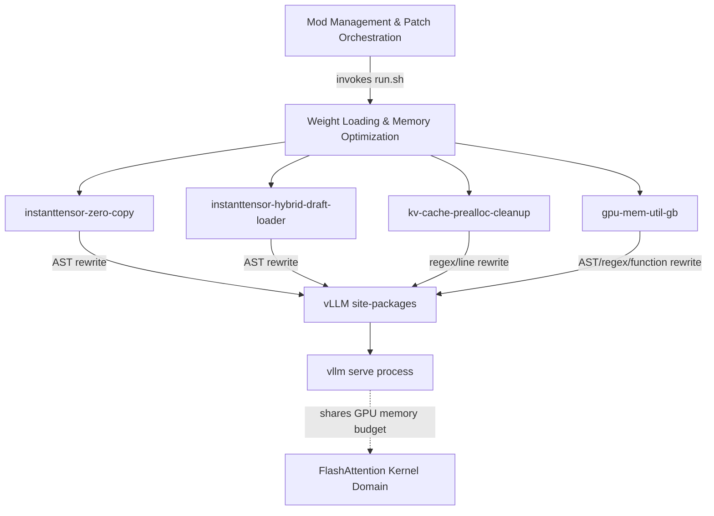
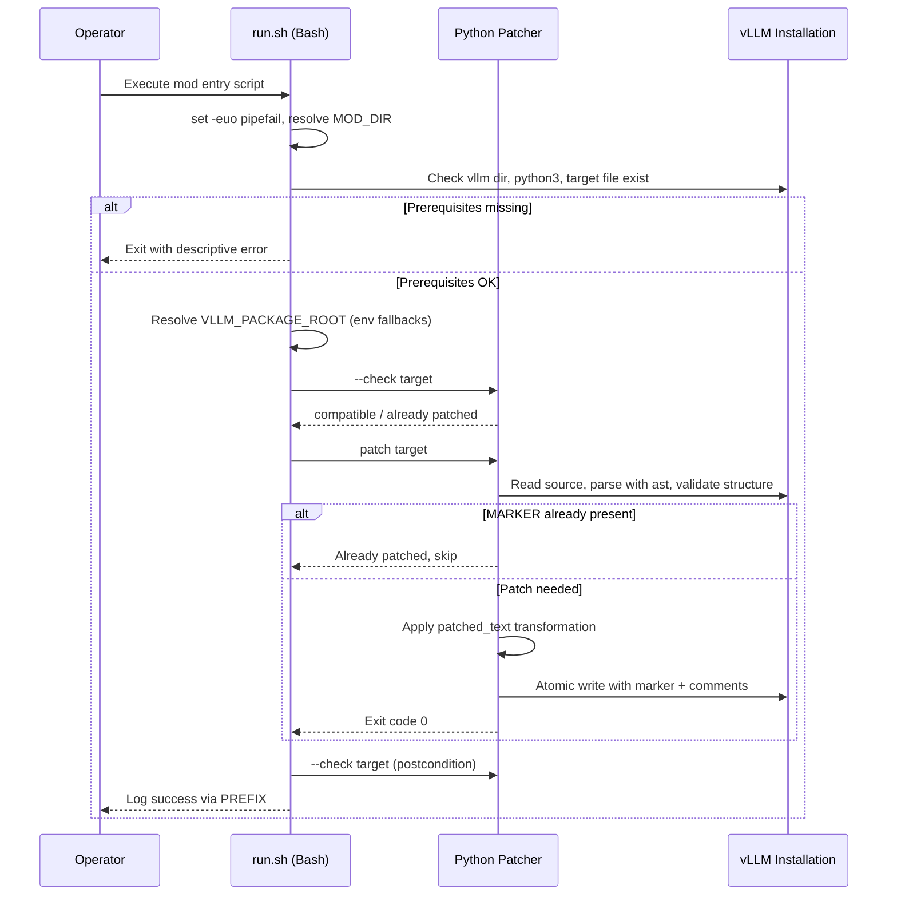

# Weight Loading & Memory Optimization

## 1. Overview

The **Weight Loading & Memory Optimization** domain is a supporting domain within `spark-vllm-docker` that reduces the GPU memory footprint of a vLLM deployment by mutating the *installed* vLLM source tree at deployment time. It follows the repository-wide **"patch the dependency, don't fork it"** philosophy: rather than shipping a modified vLLM, each optimization is expressed as a self-contained, idempotent, marker-guarded source transformation applied by a fail-fast `run.sh` entry script.

The domain addresses two distinct memory pressures that arise when serving large models on constrained hardware (notably the unified-memory DGX Spark platform):

1. **Transient loading overhead** — redundant tensor copies performed while materializing model weights, and the memory cost of loading a speculative-decoding draft model alongside its target.
2. **Static memory budgeting** — the inability to express GPU memory reservations in absolute units, and the inability to combine a fixed reservation with a manually sized KV cache.

The domain comprises four mods, each pairing a Bash entry script with either a Python AST patcher or an inline Python transformation:

| Mod | Technique | Primary Target | Purpose |
|---|---|---|---|
| `instanttensor-zero-copy` | AST patcher (`patch_weight_utils.py`) | `vllm/model_executor/model_loader/weight_utils.py` | Replace `copy=True` tensor construction with zero-copy views |
| `instanttensor-hybrid-draft-loader` | AST patcher (`patch_model_loader.py`) | `vllm/model_executor/model_loader/__init__.py` | Load speculative draft weights lazily while keeping InstantTensor for the target |
| `kv-cache-prealloc-cleanup` | Inline Python (regex/line rewriting) | `vllm/v1/worker/gpu_worker.py`, `vllm/config/cache.py` | Make CUDA-graph profiling skippable and allow fixed-GiB reservation with manual KV cache |
| `gpu-mem-util-gb` | Inline Python (AST/regex/function replacement) | `vllm/config/cache.py`, `vllm/engine/arg_utils.py`, `vllm/entrypoints/llm.py`, `vllm/v1/worker/utils.py`, `vllm/v1/worker/gpu_worker.py`, `vllm/v1/utils.py` | Add a `gpu_memory_utilization_gb` field and `--gpu-memory-utilization-gb` CLI flag |

---

## 2. Domain Architecture

The domain sits between the **Mod Management & Patch Orchestration** domain (which invokes each mod's `run.sh`) and the external **vLLM** package (which is mutated in place). It shares a GPU memory budget with the **FlashAttention Kernel Domain**, whose paged-KV kernels consume KV-cache memory that these mods help size.



Each mod is **self-contained**: it resolves its own target paths, validates prerequisites, and applies its transformation without depending on any other mod. This makes the mods composable and independently applicable.

---

## 3. Submodule: Zero-Copy Weight Loading (`instanttensor-zero-copy`)

### 3.1 Purpose

vLLM's InstantTensor weights iterator constructs tensors with `copy=True`, which yields tensors that **own their memory**. Ownership guarantees the tensor stays valid after the loading context exits or after InstantTensor reuses its internal buffer — but it also forces a per-tensor clone, doubling peak memory during model loading. This mod rewrites the `copy=True` keyword to `copy=False`, opting into zero-copy views that are consumed inline.

### 3.2 Entry Script (`run.sh`)

The script runs under `set -euo pipefail` and performs the following sequence:

1. **Resolve `MOD_DIR`** from `BASH_SOURCE` so the patcher is located relative to the script, not the working directory.
2. **Verify `python3`** is available.
3. **Resolve the vLLM package root** using a layered fallback chain, deliberately avoiding importing vLLM (which could initialize CUDA prematurely during container preparation):
   - `VLLM_PACKAGE_ROOT` if set explicitly (useful for tests and unusual image layouts),
   - else `$VLLM_SITE_PACKAGES/vllm`,
   - else `$PYTHON_ROOT/vllm`,
   - else discovered via `importlib.util.find_spec("vllm")`.
4. **Locate the target** `model_executor/model_loader/weight_utils.py` and fail if absent.
5. **Apply the patch with a check–patch–check cycle**: `--check` (validate compatibility), patch, then `--check` again (confirm the postcondition).

The script emits an explicit **warning** that the mod must only be used with model loaders that consume each weight inline, since zero-copy views are invalidated when the underlying buffer is reused.

### 3.3 AST Patcher (`patch_weight_utils.py`)

The patcher is a defensive, single-occurrence AST rewriter. Its key components:

- **`_is_safe_open_call(node)`** — confirms a call node is exactly `instanttensor.safe_open(...)`, guarding against patching an unrelated `safe_open`.
- **`_copy_keyword(text)`** — parses the source, locates the *unique* `instanttensor_weights_iterator` function, finds the *unique* `instanttensor.safe_open` call within it, and extracts the *unique* explicit `copy` keyword. It raises a descriptive `ValueError` if any of these cardinalities is violated, and requires the keyword value to be a boolean literal.
- **`_source_offset(text, lineno, column)`** — converts an AST `(lineno, col_offset)` pair into a Python string offset. It requires the prefix before the keyword to be ASCII so that AST byte-columns equal string offsets.
- **`patched_text(text)`** — the core transformation:
  1. Rejects a source containing more than one mod marker.
  2. If `copy` is already `False`, compiles the text (syntax check) and returns it unchanged.
  3. If the marker is present but `copy=True` is still enabled, raises an error (inconsistent state).
  4. Verifies the source range of the `copy` value contains the literal token `True`.
  5. Confirms the keyword sits on its own indented argument line.
  6. Replaces `True` with `False`, inserts the mod marker line above the keyword, and swaps the ownership-explanation comment for a zero-copy comment.
  7. Re-validates the postcondition (`copy` is now `False`, exactly one marker) and `compile()`s the result.

The patcher writes atomically: it writes to a temporary file (`.zero-copy-mod.tmp`), preserves the original file mode, then `replace()`s the target.

### 3.4 Traceability Constants

```python
PREFIX = "[instanttensor-zero-copy]"
MARKER = "# spark-vllm mod: instanttensor-zero-copy v1"
```

The `MARKER` provides both **idempotency** (re-running the mod is a no-op) and **auditability** (the applied change is greppable in the installed source).

---

## 4. Submodule: Hybrid Draft Loader (`instanttensor-hybrid-draft-loader`)

### 4.1 Purpose

In speculative decoding, a small **draft model** is loaded alongside the **target model**. When the target uses InstantTensor, the draft model may not benefit from the same loader — or may not be compatible with it. This mod injects an opt-in policy that keeps the target model on InstantTensor while loading the draft model with **lazy safetensors**, avoiding the memory cost of eagerly materializing draft weights.

### 4.2 Entry Script (`run.sh`)

The script:

1. Resolves `PYTHON_ROOT` via `VLLM_SITE_PACKAGES` → `PYTHON_ROOT` → default `/usr/local/lib/python3.12/dist-packages`.
2. Reads the mode from `INSTANTTENSOR_DRAFT_LOADER` (default `auto`) and **validates it** against the allowed set `{auto, safetensors, instanttensor}`, exiting with a descriptive error otherwise.
3. Verifies the vLLM root, the patcher, and the target `model_executor/model_loader/__init__.py` all exist.
4. Applies the patch with the same check–patch–check cycle.
5. **Purges `__pycache__`** under the target directory so the patched module is recompiled on next import.

### 4.3 AST Patcher (`patch_model_loader.py`)

The patcher replaces the exact `get_model` function body (matched via the `GET_MODEL_ANCHOR` template) with a version that resolves a per-model load configuration through a new helper, `_instanttensor_draft_load_config`. The helper implements the policy:

- Reads `INSTANTTENSOR_DRAFT_LOADER` (`auto` / `safetensors` / `instanttensor`).
- Returns the effective load config unchanged unless the load format is `instanttensor` **and** the model being loaded is the speculative draft model.
- In `auto` mode, only switches the draft to lazy safetensors when the draft and target share the same model source (model name and revision); otherwise it leaves the config untouched.
- When switching, returns `replace(effective, load_format="safetensors", safetensors_load_strategy="lazy")` and logs a one-time informational message.

The patcher's **`validate_shape(text, patched=...)`** function parses the module and asserts the presence of the required top-level functions (`get_model`, `get_model_loader`, and — when patched — `_instanttensor_draft_load_config`), rejecting unexpected module layouts. Idempotency is enforced by the `MARKER` constant and a check that the patched `get_model` actually calls the helper.

---

## 5. Submodule: KV Cache Preallocation Cleanup (`kv-cache-prealloc-cleanup`)

### 5.1 Purpose

This mod makes two related memory-budgeting behaviors configurable:

1. **CUDA-graph memory profiling can be skipped** when `VLLM_MEMORY_PROFILER_ESTIMATE_CUDAGRAPHS=0`, so the profiler's estimate is not forced into the KV-cache budget.
2. **A fixed-GiB reservation can be combined with a manually sized KV cache** (`--gpu-memory-utilization-gb` together with `--kv-cache-memory-bytes`), which the stock validator rejects.

### 5.2 Implementation

Unlike the AST patchers, this mod embeds an **inline Python heredoc** in `run.sh` that performs line-oriented regex rewriting. It targets two files:

- **`vllm/v1/worker/gpu_worker.py`** — locates the `cudagraph_memory_estimate = self.model_runner.profile_cudagraph_memory()` call and wraps it in an `if envs.VLLM_MEMORY_PROFILER_ESTIMATE_CUDAGRAPHS:` guard with an `else` branch that logs a skip message. It detects prior application by searching for the skip message or the guard line.
- **`vllm/config/cache.py`** — when the conflict validator (`Cannot specify both gpu_memory_utilization_gb ...`) is present, it inserts an early `return self` at the top of `_validate_memory_params`, effectively allowing the two settings to coexist.

The script fails fast with descriptive errors if expected patterns are not found, and reports whether each change was applied or already present.

---

## 6. Submodule: GPU Memory Utilization in GiB (`gpu-mem-util-gb`)

### 6.1 Purpose

vLLM's `gpu_memory_utilization` is a **fraction** of total GPU memory. On unified-memory systems (such as DGX Spark) where available memory changes dynamically, a fraction is imprecise. This mod introduces a new `gpu_memory_utilization_gb` field and a corresponding `--gpu-memory-utilization-gb` CLI flag that reserve an **absolute amount of memory in GiB**, overriding the fractional setting when specified.

### 6.2 Implementation

The mod's `run.sh` embeds a substantial inline Python program that applies a series of **idempotent, anchor-based rewrites** across seven vLLM source files. It provides reusable helpers:

- **`replace_once(text, old, new, description, already=...)`** — replaces a single literal anchor, skipping if the `already` sentinel is present.
- **`replace_regex_once(...)`** — regex-based single replacement.
- **`replace_function(text, name, replacement, ...)`** — replaces an entire top-level function body by locating `def <name>(` and the next `def`.
- **`replace_between(text, start_marker, end_marker, replacement, ...)`** — replaces a region delimited by two anchors.

The patch functions and their effects:

| Function | Target | Change |
|---|---|---|
| `patch_cache_config` | `vllm/config/cache.py` | Adds the `gpu_memory_utilization_gb: float \| None = Field(default=None, gt=0)` field, adds it to the hash-ignored factors, and inserts a `_validate_memory_params` model validator rejecting simultaneous use with `kv_cache_memory_bytes` |
| `patch_engine_args` | `vllm/engine/arg_utils.py` | Adds the `EngineArgs` field, the `--gpu-memory-utilization-gb` CLI argument, and wires it into `CacheConfig` construction |
| `patch_llm_entrypoint` | `vllm/entrypoints/llm.py` | Adds the parameter, docstring, and `EngineArgs` wiring for the offline `LLM` entrypoint |
| `patch_request_memory` | `vllm/v1/worker/utils.py` | Rewrites `request_memory` to compute the reservation from GiB when set, with explicit errors when the request exceeds total or free memory |
| `patch_gpu_worker` | `vllm/v1/worker/gpu_worker.py` | Updates debug logging, CUDA-graph memory suggestions, and warmup error messages to be GiB-aware |
| `patch_messages` | `compilation.py`, `kv_cache_utils.py`, `gpu_model_runner.py` | Updates user-facing error/guidance strings to mention the new option |
| `patch_usage_stats` | `vllm/v1/utils.py` | Reports `gpu_memory_utilization_gb` in usage statistics |

After all rewrites, the program **`ast.parse()`s every changed file** and aborts if any syntax check fails, guaranteeing that a partially applied patch cannot leave vLLM in an unimportable state.

### 6.3 Unified Diff Companion

The mod also ships **`gpu_mem.patch`**, a unified diff capturing the equivalent `CacheConfig` change (the new field, the hash-ignored-factor entry, and the `_validate_memory_params` validator). This serves as human-readable documentation of the intended change and as an alternative application path.

---

## 7. Common Implementation Patterns

All four mods share a consistent, defensive design:

- **Fail-fast entry scripts** — every `run.sh` uses `set -euo pipefail` and exits with a descriptive, prefixed error when a prerequisite (python3, target file, patcher) is missing.
- **Idempotency via markers** — AST patchers inject a `# spark-vllm mod: <name> v<n>` marker; inline patchers use `already=` sentinels. Re-running any mod is a safe no-op.
- **Structural validation before writing** — AST patchers validate the parsed tree (`validate_shape`, `_copy_keyword`) and `compile()` the result; the inline patcher `ast.parse()`s every changed file.
- **Atomic writes** — the AST patchers write to a temporary file and `replace()` the target, preserving file mode.
- **Layered path resolution** — `VLLM_PACKAGE_ROOT` / `VLLM_SITE_PACKAGES` / `PYTHON_ROOT` fallbacks, with `importlib` discovery as a last resort, avoiding premature CUDA initialization.
- **Traceability** — every change is annotated with ownership-explanation comments and mod markers so it can be audited or reverted.

---

## 8. Execution Flow

The following sequence illustrates the shared lifecycle of an AST-based mod (e.g., `instanttensor-zero-copy`):



---

## 9. Integration and Dependencies

- **Upstream (invocation):** The **Mod Management & Patch Orchestration** domain invokes each mod's `run.sh`, either directly or via the recipe runner and `launch-cluster.sh --apply-mod`. Mods execute **inside the target container**, against the installed vLLM `site-packages`.
- **Downstream (target):** All mods mutate the external **vLLM** package in place. They do not own vLLM; they transform it at deployment time.
- **Shared resource:** The **FlashAttention Kernel Domain**'s paged-KV kernels and these mods compete for the same GPU memory budget. The `gpu-mem-util-gb` and `kv-cache-prealloc-cleanup` mods directly influence how much memory remains available for KV-cache blocks and kernel workspace.
- **Build-time preconditioning:** The **Container & Build Infrastructure** domain applies build-time vLLM patches (e.g., `patch_instanttensor_vllm_memory.py`) to the same source tree these mods later mutate, so the two layers must remain compatible.

---

## 10. Operational Notes and Caveats

- **Zero-copy safety:** `instanttensor-zero-copy` is only valid with model loaders that consume each weight inline. The `run.sh` prints an explicit warning; using it with a loader that retains views beyond the loading context can produce invalid tensors.
- **Draft-loader mode selection:** `INSTANTTENSOR_DRAFT_LOADER=auto` only switches the draft to lazy safetensors when the draft and target share the same model source. Setting it to `safetensors` forces the switch; `instanttensor` disables it.
- **Mutually exclusive settings:** `gpu_memory_utilization_gb` cannot be combined with `kv_cache_memory_bytes` unless `kv-cache-prealloc-cleanup` is also applied to relax the validator.
- **CUDA-graph profiling:** Disabling profiling via `VLLM_MEMORY_PROFILER_ESTIMATE_CUDAGRAPHS=0` means CUDA-graph memory is not accounted for during KV-cache allocation, which may require lowering the reservation to avoid OOM. The `gpu-mem-util-gb` mod emits guidance messages suggesting adjusted values.
- **Patching technique divergence:** `gpu-mem-util-gb` and `kv-cache-prealloc-cleanup` use inline regex/line rewriting rather than the AST patcher framework used by the InstantTensor mods. This is a known taxonomy inconsistency; the inline approach is more sensitive to upstream source drift and relies on anchor strings remaining stable.