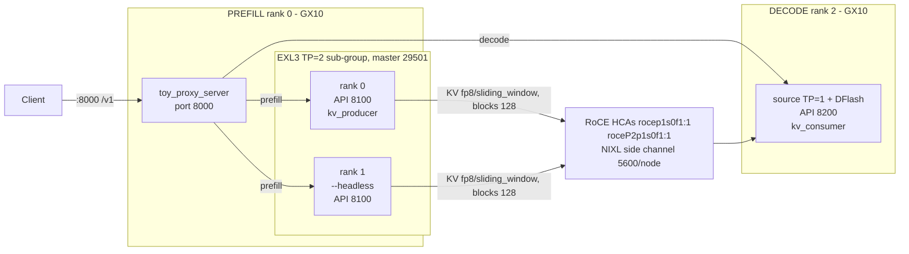

# PD-disaggregated MiMo-V2.6-Flash-RL-UNCENSORED EXL3 (3-node GB10)

Role-aware prefill/decode split with NIXL KV transfer over RoCE HCAs.

- **Prefill** (ranks 0–1): EXL3 pack, TP=2 2-rank sub-group, API 8100,
  kv_producer. Rank 0 additionally runs the `toy_proxy_server` router (8000).
- **Decode** (rank N-1 = 2): source-precision weights TP=1 + DFlash
  speculative decoding, API 8200, kv_consumer. No sub-group master (TP=1).
- KV cache moves producer→consumer via vLLM's `NixlConnector` (NIXL/UCX, RoCE
  HCAs `rocep1s0f1:1,roceP2p1s0f1:1`), side channel on port 5600, each node
  advertising its own IP (`VLLM_NIXL_SIDE_CHANNEL_HOST`).

Opt-in: nothing happens unless `PD_DISAGG_ENABLED=1` (see `run.sh`).

## Parity by construction

Every flag that must match across roles — DFlash spec config (method, draft
model, `PD_NUM_SPECULATIVE_TOKENS`), `PD_BLOCK_SIZE`, KV dtype `fp8` +
skip-layers `sliding_window`, `PD_MAX_MODEL_LEN`, `PD_MAX_NUM_SEQS`,
`PD_MAX_NUM_BATCHED_TOKENS` — is derived ONLY from shared `PD_*` env vars
(published by `run.sh` into `/tmp/pd-disagg.env`). `dispatch.sh` computes
`PD_PARITY_SHA256` (sha256 of the canonical shared config) at boot on every
role and logs it. **Verify the same hash appears in all three roles' boot
logs before trusting a PD session** — mismatched KV layout across roles is a
known NIXL mis-transfer failure mode (vLLM #58470).

## Topology



Port map: router 8000, prefill 8100, decode 8200, NIXL side channel 5600,
prefill sub-group master 29501.

## Environment

| Variable | Meaning | Default | Where | Notes |
|---|---|---|---|---|
| `PD_DISAGG_ENABLED` | Enable/disable mod | `0` | Both | `1` required on all roles |
| `PD_DISAGG_INSTALL_NIXL` | Pip-install nixl if missing | `0` | run.sh | Prefer baked `nixl-runtime:24.04-cu13.3-sm121` |
| `PD_DISAGG_NIXL_SPEC` | pip spec for nixl | `nixl` | run.sh | |
| `PD_UCX_NET_DEVICES` | RoCE HCA list | `rocep1s0f1:1,roceP2p1s0f1:1` | run.sh | Overrides launch-cluster.sh's ETH_IF pinning |
| `PD_UCX_TLS` | UCX TLS | `rc,ud,sm,self,^cuda_ipc` | run.sh | TCP appended only when HCAs missing && `PD_DISAGG_ALLOW_TCP_FALLBACK=1` |
| `PD_DISAGG_ALLOW_TCP_FALLBACK` | Downgrade missing-HCA to warning | `0` | run.sh | Fail-closed default; UCX/NIXL must not silently run TCP-only |
| `PD_DISAGG_ENV_FILE` | Env file sourced by dispatch.sh | `/tmp/pd-disagg.env` | Both | Must exist; **auto-published**: if missing, dispatch.sh sources the sibling `run.sh` in-process to publish it (then re-sources the env file) |
| `PD_NIXL_PORT` | NIXL side-channel port | `5600` | Both | Per-node, own IP |
| `NIXL_LOG_LEVEL` | NIXL python log level | `WARN` | Both | |
| `PD_ROUTER_ENABLED` | Start toy_proxy_server on rank 0 | `0` | dispatch.sh | Can be disabled for testing |
| `PD_ROUTER_SCRIPT` | Router script path | mod-local `toy_proxy_server.py` | dispatch.sh (rank 0) | Default is the vendored mod-local copy (`mods/pd-disagg/toy_proxy_server.py`); `/workspace/toy_proxy_server.py` works as an override |
| `PD_ROUTER_START_DELAY` | Delay before router start | `30` | dispatch.sh (rank 0) | Sleep-gated start: the router waits this long before dialing prefill API 8100; prefill must be listening first |
| `PD_ROUTER_PORT` | Router API port | `8000` | dispatch.sh (rank 0) | External clients point here |
| `PD_ROUTER_HOST` | Router bind host | `0.0.0.0` | dispatch.sh (rank 0) | The vendored router defaults `--host` to `127.0.0.1` (loopback only); this override makes `http://<head>:8000/v1/models` reachable from clients |
| `PD_VLLM_SERVE` | vLLM serve wrapper | `vllm serve` | Both | Set to `b12x-kcache exec vllm serve` |
| `PD_TP_PREFILL` | Prefill TP size | `2` | dispatch.sh | MUST be 2 (EXL3 pack is a 2-rank sub-group) |
| `PD_TP_DECODE` | Decode TP size | `1` | dispatch.sh | MUST be 1 on the 3-node topology; TP=2 decode would need a decode-master (see fallback note in dispatch.sh) |
| `PD_EXL3_MODEL` | Prefill EXL3 model id | `XiaomiMiMo/MiMo-V2.6-Flash-RL-EXL3` | dispatch.sh | The assembled uncensored pack staged via mods/fes-weights |
| `PD_DECODE_MODEL` | Decode source model id | `XiaomiMiMo/MiMo-V2.6-Flash-RL` | dispatch.sh | |
| `PD_DECODE_NODE_IPS` | Decode node IPs for router dialing | (required if router enabled) | dispatch.sh (rank 0) | CSV; router `--decoder-hosts` |
| `PD_DFLASH_MODEL` | DFlash drafter path | `/workspace/MiMo-V2.6-Flash-RL-dflash` | dispatch.sh (decode) | Staged by mods/mimo-v2.6-flash |
| `PD_NUM_SPECULATIVE_TOKENS` | DFlash draft depth | `7` | Both | Parity hash input; must match across roles |
| `PD_PREFILL_PORT` | Prefill API port | `8100` | dispatch.sh (ranks 0-1) | |
| `PD_PREFILL_GMU` | Prefill GMU | `0.7` | dispatch.sh (ranks 0-1) | EXL3 ~55 GB experts/rank of 121.6 GB |
| `PD_PREFILL_MASTER_ADDR` | Prefill sub-group master | outer `--master-addr` | dispatch.sh (ranks 0-1) | Rank 0's IP |
| `PD_PREFILL_MASTER_PORT` | Prefill sub-group master port | `29501` | dispatch.sh (ranks 0-1) | Distinct from outer engine's and decode's |
| `PD_DECODE_PORT` | Decode API port | `8200` | dispatch.sh (rank 2) | |
| `PD_DECODE_GMU` | Decode GMU | `0.80` | dispatch.sh (rank 2) | Source weights ~86.5 GB TP=1 |
| `PD_BLOCK_SIZE` | KV block size | `128` | Both | Parity hash input |
| `PD_MAX_MODEL_LEN` | Max context | `1048576` | Both | Parity hash input |
| `PD_MAX_NUM_SEQS` | Max concurrent seqs | `32` | Both | Parity hash input |
| `PD_MAX_NUM_BATCHED_TOKENS` | Max batched tokens | `16384` | Both | Parity hash input |
| `PD_PARITY_SHA256` | Shared-config hash (read-only, logged) | computed at boot | dispatch.sh/run.sh | MUST be identical across roles |

## Prerequisites

1. Compose mod stack (recipes/pd-disagg-mimo-uncensored-exl3-3x.yaml —
   uncensored EXL3 pack + uncensored source decode; the same inverted
   topology also serves recipes/pd-disagg-mimo-exl3.yaml with the censored
   pack/source ids):
   `mods/pd-disagg`, `mods/exl3-mimo`, `mods/fes-weights`,
   `mods/mimo-v2.6-flash`, `mods/mimo-diffkv-fp8-kv`,
   `mods/kv-cache-guard-override`, `mods/b12x-kernel-cache`.
2. Staging (per node):
   - ranks 0–1: uncensored EXL3 pack assembled by `scripts/exl3-pack-drive.sh`
     (TP=2 split), staged under `XiaomiMiMo/MiMo-V2.6-Flash-RL-EXL3` via
     mods/fes-weights; `MIMO_V26_MODEL_ID` must point at the same assembled
     checkpoint so the DFlash drafter resolves from its `dflash/` sibling.
   - rank 2: uncensored source weights + DFlash drafter
     (`/workspace/MiMo-V2.6-Flash-RL-dflash`).
3. Launch:
   ```
   cluster-config/scripts/spark-vllm-docker-serve.sh --recipe pd-disagg-mimo-uncensored-exl3-3x
     --apply-mod mods/pd-disagg --apply-mod mods/exl3-mimo --apply-mod mods/fes-weights
     --apply-mod mods/mimo-v2.6-flash --apply-mod mods/mimo-diffkv-fp8-kv
     --apply-mod mods/kv-cache-guard-override --apply-mod mods/b12x-kernel-cache
     -n gx10-node1,gx10-node2,gx10-node3
     -e PD_DECODE_NODE_IPS=10.100.171.12
   ```
4. Verify:
   - `PD_PARITY_SHA256` identical across all three roles' boot logs.
   - Router `http://<head>:8000/v1/models` responds; prefill 8100 / decode
     8200 listening (probe with `ss -tln 'sport = :PORT'` — NEVER `nc -z` or
     any connect(): it steals one-shot NCCL rendezvous accepts).
   - NIXL metrics on decode: `nixl_bytes_transferred > 0` and no failed
     transfers (KV actually moved producer→consumer).

## Known limitations

- **3-node only.** `NNODES != 3` fails closed. TP=2 decode (4-node shapes)
  needs decode-master machinery intentionally omitted here (fallback note in
  dispatch.sh).
- **Host-mirror KV profiling**: on GB10, NIXL KV pages are host-staged;
  1M-context single-request guard must stay overridden
  (mods/kv-cache-guard-override) and capacity pre-checked.
- **DFlash on decode only.** PD + speculative decode on MiMo is exercised
  only in the decode role; prefill runs plain EXL3.
- Router dialing decode needs `PD_DECODE_NODE_IPS` (rank-0 env); it is not
  auto-discovered.

## Vendored router

`mods/pd-disagg/toy_proxy_server.py` is copied verbatim (byte-identical body,
provenance header prepended) from the pinned FES vLLM fork
`gpu-cluster-forks/vllm` at commit
`311b3513af33bc29b4acb2fde2e9313e5e9966a0`, path
`tests/v1/kv_connector/nixl_integration/toy_proxy_server.py`
(upstream vllm-project/vllm; Apache-2.0, SPDX headers preserved; the upstream
`examples/online_serving/pd_disaggregation/toy_proxy_server.py` path does not
exist in the pinned ref). `dispatch.sh` defaults `PD_ROUTER_SCRIPT` to this
mod-local copy; `/workspace/toy_proxy_server.py` remains as override.

## See also

- `tmp/spark-vllm-docker/3node-serving-config-proposals.md` (topology)
- `tmp/spark-vllm-docker/perf-concepts/pd-disaggregation-upstream-vllm.md` (NIXL)
- `tmp/spark-vllm-docker/perf-concepts/repo-orchestration-analysis.md` (TP-trimming footgun)
- `recipes/mimo-v2.6-flash-rl-uncensored-exl3-2x.yaml` (prefill flag source of truth)
- `mods/exl3-mimo/EXL3_MIMO_PACK.md`, `docs/NETWORKING.md`
- vLLM PRs: #35760 (PD+SD), #43733 (DFlash UX), #58470 (KV mis-transfer TP)
