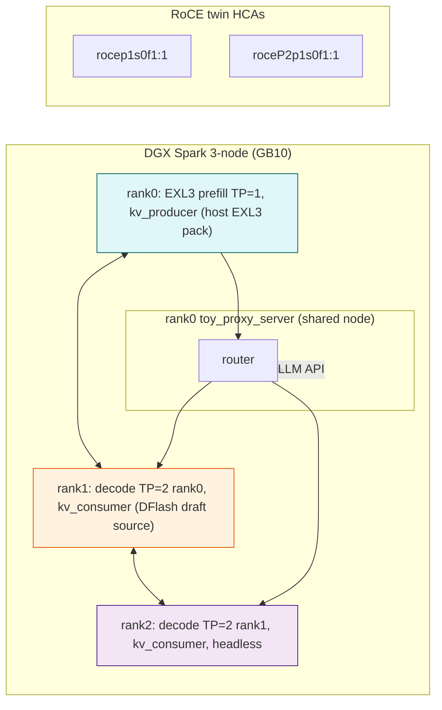

# PD-disaggregation Infrastructure for MiMo-V2.6 EXL3+source (3-node GB10)

## Overview

- **Topology:** Prefill instance (EXL3 pack, TP=1, kv_producer) on node 0; source decode instance (MiMo-V2.6-Flash-RL, TP=2 sub-group) on nodes 1+2; NIXL KV handoff; toy_proxy_server router on rank 0 (the EXL3 node).
- **Role assignments:** Run by `mods/pd-disagg/dispatch.sh` in each container, triggered by `recipes/pd-disagg-mimo-exl3.yaml`.
- **Requirements:**
  - `nixl` python package with UCX backend (RoCE HCAs). Inert unless `PD_DISAGG_ENABLED=1`.
  - EXL3 pack on prefill node (mods/exl3-mimo patches installed via `mods/exl3-mimo/run.sh`).
  - DFlash drafter staged under `/workspace/MiMo-V2.6-Flash-RL-dflash`.
  - All mods loaded before serve (mods order: fes-weights, kv-cache-guard-override, mimo-v2.6-flash, exl3-mimo, pd-disagg, b12x-kernel-cache).

## Topology diagram



- **KV flow:** Prefill pushes (via NixlConnector) KV to decode side. Decode pulls from producer.
- **NIXL transport:** UCX, pinned to RoCE HCAs (`UCX_NET_DEVICES`), side-channel bind on each node’s own IP (`VLLM_NIXL_SIDE_CHANNEL_HOST`).
- **Router:** Intermediates between external API (port 8000) and both pref and decode backends (8100/8200). Runs in background on rank0.

## Environment matrix

| Variable (env/defaults)                     | Meaning                                        | Default                     | Role                     | Comment                                   |
|---------------------------------------------|------------------------------------------------|-----------------------------|--------------------------|-------------------------------------------|
| `PD_DISAGG_ENABLED`                         | Enable/disable this mod                        | 0                           | Both                     | 1 required                                 |
| `PD_DISAGG_INSTALL_NIXL`                    | Pip-install nixl when missing                  | 0                           | Both                     | Recommended bake in image instead          |
| `PD_DISAGG_NIXL_SPEC`                       | pip spec for nixl                              | `nixl`                      | Both                     | nixl-runtime:24.04-cu13.3-sm121 preferred |
| `PD_UCX_NET_DEVICES`                        | RoCE HCA list                                  | `rocep1s0f1:1,roceP2p1s0f1:1` | run.sh                    | Overwrites launch-cluster.sh ETH_IF  |
| `PD_UCX_TLS`                                | UCX TLS overrides                              | `rc,ud,sm,self,^cuda_ipc`   | run.sh                    | Add `tcp` if missing HCAs && `PD_DISAGG_ALLOW_TCP_FALLBACK=1` |
| `PD_DISAGG_ALLOW_TCP_FALLBACK`              | Downgrade missing HCAs to warning               | 0                           | run.sh                    | Accept TCP fallback                        |
| `PD_DISAGG_ENV_FILE`                        | Env file path sourced by dispatch.sh            | `/tmp/pd-disagg.env`         | Both                     | Must exist, populated by run.sh            |
| `PD_NIXL_PORT`                              | NIXL side-channel port                         | 5600                        | Both                     | Per-node own port                          |
| `NIXL_LOG_LEVEL`                            | NIXL python log level                          | `WARN`                      | Both                     | Useful for debugging                       |
| `PD_ROUTER_ENABLED`                         | Start toy_proxy_server on rank0                | 0                           | dispatch.sh (rank0)      | Router can be disabled for testing         |
| `PD_ROUTER_SCRIPT`                          | Path to toy_proxy_server.py                     | `/workspace/toy_proxy_server.py` | dispatch.sh (rank0)    | Falls back if missing (warns)             |
| `PD_ROUTER_START_DELAY`                     | Wait before starting router                    | 30s                         | dispatch.sh (rank0)      | Prefill needs to boot before router dials  |
| `PD_ROUTER_PORT`                            | Router API listening port                       | 8000                        | dispatch.sh (rank0)      | External clients point here               |
| `PD_VLLM_SERVE`                             | vLLM serve wrapper command                     | `vllm serve`                | Both                     | Override to `b12x-kcache exec vllm serve`  |
| `PD_TP_PREFILL`                             | Prefill tensor-parallel size                   | 1                           | dispatch.sh (rank0)      | MUST be 1 for EXL3 pack (TP=1 only)       |
| `PD_TP_DECODE`                              | Decode tensor-parallel size                    | 2                           | dispatch.sh (decode)     | MUST equal #decode nodes (3‑1=2)          |
| `PD_EXL3_MODEL`                             | Prefill EXL3 pack model ID                     | `XiaomiMiMo/MiMo-V2.6-Flash-RL-EXL3` | dispatch.sh (rank0) | See mods/exl3-mimo/EXL3_MIMO_PACK.md        |
| `PD_DECODE_MODEL`                           | Source model ID for decode instance            | `XiaomiMiMo/MiMo-V2.6-Flash-RL` | dispatch.sh (decode)  | Same as recipe's `model:`                  |
| `PD_DECODE_MASTER_ADDR`                     | IP of the decode rank0 (first worker)         | (required at runtime)       | dispatch.sh (decode)    | REQUIRED for decode workers (>1 node)     |
| `PD_DECODE_MASTER_PORT`                     | Decode sub-group vLLM master port               | 29502                       | dispatch.sh (decode)    | Distinct from outer-engine master port     |
| `PD_DECODE_PORT`                            | Decode vLLM API port                           | 8200                        | dispatch.sh (decode)    |                                               |
| `PD_DFLASH_MODEL`                           | DFlash drafter checkpoint path                  | `/workspace/MiMo-V2.6-Flash-RL-dflash` | dispatch.sh (decode) | File must exist (staged by mods/mimo-v2.6-flash) |
| `PD_NUM_SPECULATIVE_TOKENS`                 | DFlash draft depth                             | 7                           | dispatch.sh (decode)    | Hash-enforced with prefill (must match)    |
| `PD_PREFILL_PORT`                           | Prefill vLLM API port                          | 8100                        | dispatch.sh (rank0)     |                                               |
| `PD_MAX_MODEL_LEN`                          | Max context length                             | 1048576                     | Both                     | Same as 4x recipe                           |
| `PD_BLOCK_SIZE`                             | KV block size                                  | 128                         | Both                     | Same as 4x recipe                           |
| `PD_MAX_NUM_SEQS`                           | Max concurrent sequences                        | 32                          | Both                     | Tune for your workload                      |
| `PD_MAX_NUM_BATCHED_TOKENS`                 | Max batch size                                 | 16384                       | Both                     | Tune for your workload                      |
| `PD_PREFILL_GMU`                            | Prefill GPU memory utilization (rounded)      | 0.72                        | dispatch.sh (rank0)     | EXL3 pack 83.5 GiB / 121.6 GiB ≈ 0.686    |
| `PD_DECODE_GMU`                             | Decode GPU memory utilization (rounded)        | 0.80                        | dispatch.sh (decode)    | Based on 2x recipe observed 0.80           |

## Acceptance gate

Before trusting the PD deployment, verify:

1. **NIXL KV transfer:** Run a prompt that exceeds context; after steady state, inspect the vLLM logs on the decode side for the metric `nixl_bytes_transferred` (from NixlBaseConnector). It must be >0 and all transfers must be successful (no `nixl_num_failed_transfers`).
2. **Router bridging:** Verify the toy_proxy_server is listening on `PD_ROUTER_PORT` and forwards requests to both prefill (8100) and decode (8200) endpoints. A simple curl to `http://<head>:8000/v1/models` should succeed.
3. **Hash-enforced spec-decode compatibility:** Both prefill and decode must agree on the speculative method configuration. Since prefill has no DFlash, only decode's `--speculative-config` matters and must be present. `num_speculative_tokens` (default 7) matches the decoder's DFlash compile (e.g., builds that require a different depth must be paired with matching `PD_NUM_SPECULATIVE_TOKENS`).

If either gate fails (e.g., `nixl_bytes_transferred` stays 0), the PD disaggregation is not operational and redirect traffic to a colocated serving recipe (e.g., `mimo-v2.6-flash-2x`).

## Usage

1. Ensure the required mods are installed:
   - `mods/exl3-mimo` (EXL3-to-MiMo patch)
   - `mods/fes-weights`
   - `mods/mimo-v2.6-flash`
   - `mods/mimo-diffkv-fp8-kv`
   - `mods/kv-cache-guard-override`
   - `mods/b12x-kernel-cache`
   - (PENDING) `mods/exl3-tp1` for full EXL3 TP=1 support (see parity track; for now use `PD_TP_PREFILL=1` with patched vllm-node-b12x image).

2. Deploy staged EXL3 pack and DFlash drafter:
   ```bash
   scripts/exl3-pack-drive.sh --host <node> --model <slug> <src> <out>
   scripts/exl3-pack-drive.sh assemble --host <node> --model <slug> <src> <assemble-out>
   ```

3. Run the recipe with cluster mode:
   ```bash
   run-recipe.sh pd-disagg-mimo-exl3 \
     --apply-mod mods/pd-disagg \
     --apply-mod mods/exl3-mimo \
     --apply-mod mods/fes-weights \
     --apply-mod mods/mimo-v2.6-flash \
     --apply-mod mods/mimo-diffkv-fp8-kv \
     --apply-mod mods/kv-cache-guard-override \
     --apply-mod mods/b12x-kernel-cache \
     -n gx10-node1,gx10-node2,gx10-node3 \
     -e PD_DECODE_MASTER_ADDR=10.100.171.X
   ```

4. Verify:
   - Run `kubectl logs -l app=vllm` (or inspect container logs) and look for `nixl_bytes_transferred > 0` and no `nixl_num_failed_transfers`.
   - Run a curl to `http://<head>:8000/v1/models` and confirm both prefill and decode model names appear in the list.

## Limitations

- **EXL3 TP=1 patch pending:** As of this implementation, EXL3 support in MiMo is incomplete without the parity track patch (`mods/exl3-tp1`). The recipe documents this requirement and the mod path placeholder; add it when available.
- **3-node cap only:** The topology is optimized for 3 nodes; larger clusters will need a more general dispatcher (future work).
- **Host-mirror KV budget:** On GB10, NIXL host staging doubles KV memory. This implementation assumes the 1M-context tail is reachable; monitor `register_memory` OOMs at >30 GiB.
- **Speculative decoding not yet benchmarked:** DFlash on decode side is compatible per upstream, but no measured performance data exists for PD+spec on MiMo. Treat as research.

## References

- `tmp/spark-vllm-docker/3node-serving-config-proposals.md` S5 Config C (the conceptual reference).
- `tmp/spark-vllm-docker/perf-concepts/pd-disaggregation-upstream-vllm.md` (NIXL env, kv_role, `kv_load_failure_policy: fail`).
- `tmp/spark-vllm-docker/perf-concepts/repo-orchestration-analysis.md` (TP-trimming footgun, mods conventions).
- `mods/exl3-mimo/EXL3_MIMO_PACK.md` (EXL3 pack build, b12x integration).
- `docs/NETWORKING.md` (RoCE twin HCAs, `UCX_NET_DEVICES` correct values).
- `recipes/mimo-v2.6-flash-4x.yaml` (DFlash block, default `num_speculative_tokens: 7`, fp8 KV, B12X backend).
- Upstream vLLM PRs: #35760 (PD+SD), #43733 (DFlash UX), issue #58470 (draft KV mis-transfer hetero TP).
