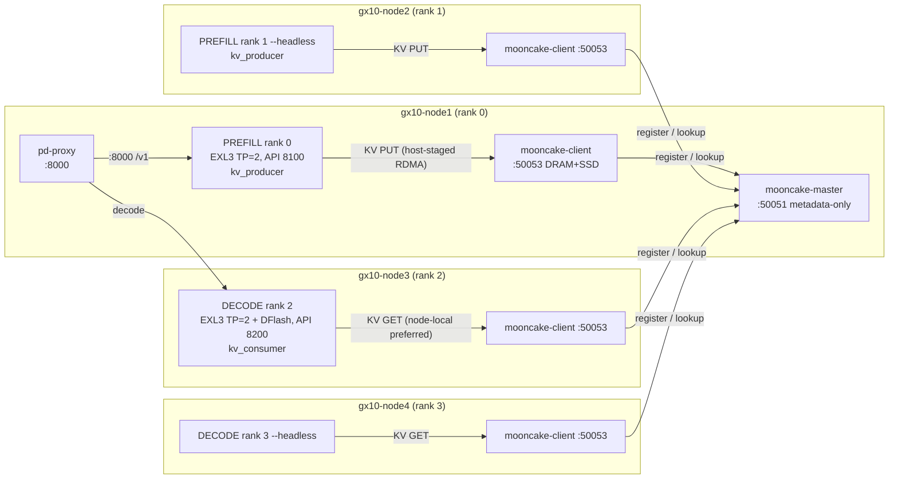

# PD-disaggregated MiMo-V2.6-Flash-RL-UNCENSORED EXL3 (4-node GB10, Mooncake store-only)

Role-aware prefill/decode PD disaggregation with **MooncakeStoreConnector**
KV transfer (hash-dedup'd distributed KV pool, NVMe-durable across restarts).
**No Ray.** Replaces the retired NIXL path.

Topology (4 nodes, `NNODES=4` fail-closed):

- Ranks 0–1 (gx10-node1, gx10-node2): **PREFILL** — EXL3 TP=2 sub-group
  (NCCL init port 29501), API 8100, `kv_role=kv_producer`. Rank 0 also runs
  the pd-proxy (port 8000).
- Ranks 2–3 (gx10-node3, gx10-node4): **DECODE** — EXL3 TP=2 sub-group with
  DFlash (init port 29502), API 8200, `kv_role=kv_consumer`.
- **mooncake-master** (rank-0 node only): sibling container from the dedicated
  `mooncake-store` image, metadata-only TCP on 50051 (`--network host`; no
  GPUs, no uverbs).
- **mooncake-client** (every node): sibling container from the dedicated
  image; owns the node's 16 GiB DRAM segment + 100 GiB NVMe SSD offload tier;
  RoCE RDMA via `roceP2p1s0f1` (uverbs1/uverbs3 + rdma_cm, memlock=-1);
  `--network host`, port 50053.
- **KV data path**: vLLM ranks host-stage GPU KV → pinned DRAM → RDMA-write
  into the client's registered segment (hash-based dedup; GPU-VA registration
  is the GB10 dead end — same class as the NIXL-GPU failure).

## Architecture

Port map: 8000 (pd-proxy), 8100 (prefill API), 8200 (decode API),
50051 (mooncake-master), 50053 (mooncake-client). No NIXL 5600.

## Environment variables

| Variable | Purpose | Default | Set by |
|---|---|---|---|
| `PD_DISAGG_ENABLED` | Opt-in gate | `0` | recipe env |
| `PD_KV_BACKEND` | KV backend selector (`mooncake`) | `mooncake` | recipe env |
| `MOONCAKE_MASTER_SERVER_ADDRESS` | Rank-0 Rail B IP (REQUIRED) | — | serve.sh `-e` |
| `MOONCAKE_MASTER_PORT` | Master RPC port | `50051` | serve.sh |
| `MOONCAKE_CLIENT_PORT` | Client TransferEngine port | `50053` | serve.sh |
| `MOONCAKE_SEGMENT_SIZE_GIB` | Per-node DRAM segment | `16` | serve.sh |
| `MOONCAKE_LOCAL_BUFFER_GIB` | vLLM rank local buffer | `4` | mooncake-env.sh |
| `MOONCAKE_OFFLOAD_MAX_GIB` | SSD offload cap per node | `100` | serve.sh |
| `MOONCAKE_CONFIG_PATH` | Store JSON path | `/tmp/pd-disagg/mooncake-store.json` | mooncake-env.sh |
| `MOONCAKE_PREFERRED_SEGMENT` | Node-local client steering | `<railb-ip>:50053` | mooncake-env.sh |
| `MOONCAKE_REQUESTER_LOCAL_HOSTNAME` | vLLM rank Rail B IP | `<railb-ip>` | mooncake-env.sh |
| `PYTHONHASHSEED` | **MUST be `0`** — hash-based dedup silently breaks otherwise | `0` | mooncake-env.sh |
| `PD_DECODE_MASTER_ADDR` | Decode sub-group master IP (REQUIRED, NNODES=4) | — | serve.sh `-e` |
| `PD_DECODE_NODE_IPS` | Decode ranks' IPs CSV (rank-2 first) | — | serve.sh `-e` |
| `PD_ROUTER_ENABLED` / `PD_ROUTER_PORT` / `PD_ROUTER_START_DELAY` | Proxy control | `1` / `8000` / `30` | recipe env |
| `PD_ROUTER_SCRIPT` | Proxy override path | mod-local `pd_proxy.py` | dispatch.sh |
| `PD_TP_PREFILL` / `PD_TP_DECODE` | Sub-group TP (MUST be 2) | `2` | dispatch.sh |

Shared parity vars (`PD_NUM_SPECULATIVE_TOKENS=7`, `PD_BLOCK_SIZE=128`,
`PD_MAX_MODEL_LEN=1048576`, `PD_MAX_NUM_SEQS=32`,
`PD_MAX_NUM_BATCHED_TOKENS=16384`, KV `fp8` with sliding_window skip-layers)
are hashed into `PD_PARITY_SHA256` by run.sh and re-verified by every
dispatch.sh invocation — cross-role config drift fail-closes the launch.

## Deployment

1. Recipe `recipes/pd-disagg-mimo-uncensored-exl3-4x.yaml` (mods: fes-weights,
   mimo-v2.6-flash, mimo-diffkv-fp8-kv, kv-cache-guard-override, exl3-mimo,
   pd-disagg, b12x-kernel-cache, b12x-reclaim-gate).
2. `cluster-config/scripts/spark-vllm-docker-serve.sh --recipe
   pd-disagg-mimo-uncensored-exl3-4x --rank-order <4 hosts> --recreate
   --daemon` — serve.sh starts mooncake-master (rank-0 host) and
   mooncake-client (every host) as sibling containers from the
   `mooncake-store:v0.3.12.post1-1` image BEFORE launching the engines,
   then derives `MOONCAKE_MASTER_SERVER_ADDRESS` and the decode-subgroup
   `-e` vars from `--rank-order` + `NODE_RAILB_IPS` (same pattern as
   `PD_DECODE_MASTER_ADDR`).
3. Health: `docker ps` shows `mooncake-master` (rank-0 only) +
   `mooncake-client` (4x); `/v1/models` on 8100 and 8200 → 200;
   `:8000/v1/chat/completions` round-trips.

## Constraints

- **4-node only** (NNODES=4; TP=2 sub-groups).
- **DFlash on decode only** (depth 7); store connector's hash dedup is
  orthogonal — no NIXL-style whole-config handshake to break.
- **SSD tier is write-once/immutable** (bucket backend); corruption requires
  a wipe + re-put (`docker exec mooncake-client` / wipe `/nvme/mooncake_offload`
  while stopped). `--offload_on_evict` stays false (spill-only semantics).
- **`PYTHONHASHSEED=0` everywhere** — vLLM connectors + client must agree.
- `MOONCAKE_OFFLOAD_USE_URING=false` (GB10 io_uring + DirectIO alignment);
  only set if SSD restore surfaces alignment faults.
- `VLLM_MOONCAKE_BOOTSTRAP_PORT` (8998) is MooncakeConnector-only — NOT set
  in store-only mode.

## Provenance

- Proxy: `infra/cluster-config/docker/pd-proxy/pd_proxy.py` (byte-identical
  copy shipped as `mods/pd-disagg/pd_proxy.py`, sha256
  `fd2a5cb23c3bafcd6f009d369ed0114c5ab50eb441f09fa15e73ac9e8d79154d`).
- Daemon units mirrored from `infra/cluster-config/templates/mooncake-{master,client}.service.tmpl`
  and `scripts/setup-mooncake-pd.sh` (qwen38 store-only deployment).
- Prior art: `nixl-gb10-optimization/.kilo/plans/1787311123732-mooncake-store-only-migration.md`,
  `1787348070015-mooncake-pd-1p2d-support.md`,
  `1787331814960-mooncake-store-staging-ring-buffer.md`.
- vLLM connector contract: `gpu-cluster-forks/vllm/vllm/distributed/kv_transfer/kv_connector/v1/mooncake/store/worker.py`
  (MooncakeStoreConfig.from_file), `docs/features/mooncake_store_connector_usage.md`.
